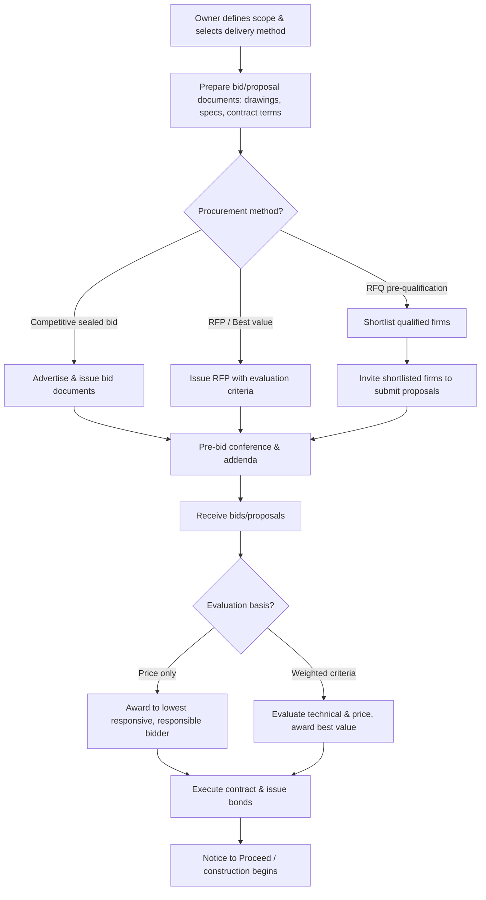

## Contracts, Specifications, and Procurement

### Overview and Scope

Contracts, specifications, and procurement together form the legal and administrative framework governing how construction work is defined, priced, awarded, and executed. Contracts establish the binding legal relationship and risk allocation between parties; specifications define the required quality, materials, and workmanship standards; and procurement encompasses the process by which an owner solicits, evaluates, and awards work to a contractor or supplier.

### Contract Types

**Key Points**

- **Lump Sum (Fixed Price)**: Contractor agrees to complete defined scope for a single fixed price; contractor bears the risk of cost overruns (absent owner-directed changes), while the owner benefits from cost certainty. Best suited to well-defined, complete design scope.
- **Unit Price**: Contractor is paid a fixed rate per unit of measured work (e.g., per cubic meter of excavation, per linear meter of pipe), with final payment based on actual measured quantities — commonly used where quantities cannot be precisely determined before construction (e.g., earthwork, utility work).
- **Cost-Plus (Cost-Reimbursable)**: Owner reimburses the contractor's actual allowable costs plus an agreed fee (fixed fee or percentage) — shifts cost risk toward the owner, typically used when scope cannot be well-defined in advance (e.g., emergency repair, highly uncertain conditions).
- **Guaranteed Maximum Price (GMP)**: A cost-plus arrangement with an upper cost ceiling; the contractor bears responsibility for costs exceeding the GMP (absent owner-directed scope changes), often paired with a shared-savings incentive if actual cost comes in below the GMP.
- **Cost-Plus with Incentive/Award Fee**: Adds performance-based fee adjustments (e.g., for schedule performance, safety record, or quality) on top of a cost-reimbursable base.

### Contract Documents Hierarchy

**Key Points**

- **Agreement**: The core contract document establishing the parties, contract sum, and general terms.
- **General Conditions**: Standardized terms governing the overall administration of the contract (e.g., AIA A201 or FIDIC Conditions of Contract), covering topics such as changes, claims, insurance, and dispute resolution.
- **Supplementary/Special Conditions**: Project-specific modifications or additions to the general conditions.
- **Specifications**: Detailed written requirements for materials, products, and workmanship (discussed further below).
- **Drawings**: Graphic representation of the design.
- **Addenda**: Formal changes issued during the bidding period, before contract award.
- **Precedence clause**: Contract documents typically include an explicit order of precedence in case of conflict between documents (though the specific hierarchy and conflict-resolution approach varies by standard contract form and jurisdiction).

[Inference] Exact precedence rules differ significantly between standard contract forms (e.g., AIA, ConsensusDocs, FIDIC, EJCDC) and jurisdictions — the general principle that a stated hierarchy exists to resolve document conflicts is reliable, but the specific ranking must be confirmed against the governing contract form in use.

### Specifications: Format and Types

**MasterFormat / Specification Divisions**

Most specifications (in North American practice) follow a standardized numbering system (MasterFormat) organizing work into divisions (e.g., Division 03 – Concrete, Division 09 – Finishes) — providing a consistent framework for organizing, referencing, and cross-checking specification sections against drawings and cost estimates.

**Specification Writing Approaches**

- **Prescriptive (method) specifications**: Specify exact materials, methods, and workmanship to be used — the owner assumes greater responsibility for the adequacy of the specified approach, since the contractor is simply directed to follow it.
- **Performance specifications**: Specify the required end result or performance criteria (e.g., minimum compressive strength, required durability rating) without dictating the specific means of achieving it — shifts responsibility for the adequacy of the chosen method to the contractor/supplier.
- **Proprietary specifications**: Specify a particular manufacturer's product by name, sometimes allowing "or approved equal" substitutions — simplifies specification writing but can limit competition if not carefully structured.
- **Reference standard specifications**: Specify compliance with an established industry standard (e.g., ASTM, AASHTO, ACI standards) rather than writing out full technical requirements directly.

### Procurement Methods

**Key Points**

- **Competitive sealed bidding (low-bid)**: Contractors submit sealed price proposals based on complete design documents; award typically goes to the lowest responsive, responsible bidder — standard for traditional public Design-Bid-Build procurement.
- **Request for Proposals (RFP) / Best Value**: Contractors submit both technical and price proposals, evaluated against weighted criteria (price, qualifications, approach, schedule) rather than price alone — common for Design-Build and CMAR procurement.
- **Request for Qualifications (RFQ)**: Used to pre-qualify or shortlist contractors/design-builders based on experience, capacity, and past performance before a more detailed proposal stage.
- **Sole source / negotiated procurement**: Award without competitive solicitation, typically justified only under specific circumstances (emergency conditions, unique/proprietary capability) and subject to greater public accountability scrutiny in public-sector work.

### Bidding Process Elements

**Key Points**

- **Bid documents**: The complete package issued to prospective bidders (drawings, specifications, contract terms, instructions to bidders).
- **Pre-bid conference**: A meeting (often including a site visit) allowing bidders to ask clarifying questions before submitting bids.
- **Addenda**: Formal written clarifications or changes issued during bidding, becoming part of the contract documents upon award.
- **Bid bond**: A financial guarantee (typically 5–10% of bid amount) ensuring the bidder will enter into the contract if awarded, protecting the owner against bid withdrawal or refusal to sign.
- **Performance bond and payment bond**: Required from the awarded contractor to guarantee contract performance and payment to subcontractors/suppliers, respectively — payment bonds are especially significant on public projects where mechanic's liens against public property are generally unavailable.

### Procurement and Contracting Process Flow

### Contract Document Hierarchy (svg_diagram)

<svg xmlns="http://www.w3.org/2000/svg" viewBox="0 0 700 340">
<text x="350" y="25" font-size="16" text-anchor="middle" font-weight="bold">Typical Contract Document Structure (svg_diagram)</text>
<rect x="250" y="50" width="200" height="35" fill="#2d3748" />
<text x="350" y="72" font-size="12" fill="white" text-anchor="middle">Agreement</text>
<rect x="220" y="100" width="260" height="35" fill="#3182ce" />
<text x="350" y="122" font-size="12" fill="white" text-anchor="middle">General Conditions</text>
<rect x="190" y="150" width="320" height="35" fill="#4299e1" />
<text x="350" y="172" font-size="12" fill="white" text-anchor="middle">Supplementary/Special Conditions</text>
<rect x="160" y="200" width="380" height="35" fill="#63b3ed" />
<text x="350" y="222" font-size="12" fill="white" text-anchor="middle">Specifications (by MasterFormat division)</text>
<rect x="130" y="250" width="440" height="35" fill="#90cdf4" />
<text x="350" y="272" font-size="12" fill="#1a202c" text-anchor="middle">Drawings</text>
<rect x="100" y="300" width="500" height="30" fill="#bee3f8" />
<text x="350" y="320" font-size="11" fill="#1a202c" text-anchor="middle">Addenda (issued during bidding, become part of contract)</text>
</svg>

### Worked Example

**Example**

A public agency is procuring a water treatment plant expansion with a well-defined design and a legal requirement for competitive procurement, but wants to evaluate contractor qualifications and technical approach alongside price rather than price alone. Which procurement method fits, and what contract type would typically accompany it?

Since the agency wants to weigh qualifications and technical approach together with price — rather than award strictly to the lowest bidder — a **Request for Proposals (RFP) / Best Value** procurement method is appropriate, as it explicitly allows weighted evaluation criteria beyond price. This procurement approach is commonly paired with a **lump sum** or **GMP** contract type once the design is well-defined, since a defined scope supports a fixed or capped price arrangement; a purely cost-reimbursable contract would be less consistent with the described project conditions (well-defined design, presumably fixed budget expectations), though [Inference] the final contract type selection would also depend on additional factors (agency policy, risk tolerance, funding source requirements) not stated in the example.

### Common Pitfalls and Practical Considerations

- **Conflicting specification requirements**: When prescriptive and performance specification language are mixed inconsistently within the same section (e.g., specifying both an exact method and requiring the contractor to guarantee an end-result performance criterion), disputes commonly arise over which party bears responsibility if the prescribed method fails to achieve the stated performance.
- **Ambiguous "or equal" substitution language**: Proprietary specifications with vaguely defined "or approved equal" criteria can lead to disputes over what constitutes an acceptable substitute, and — in public procurement — potential challenges regarding fair competition.
- **Selecting a contract type mismatched to scope certainty**: Using a lump sum contract for poorly defined or highly uncertain scope (e.g., unknown subsurface conditions) shifts risk to the contractor in a way that often results in inflated bids (to cover unpriced risk) or costly change order disputes once actual conditions are discovered.
- **Inadequate document precedence clarity**: [Inference] Relying on an assumed or poorly drafted precedence order between drawings and specifications, rather than a clearly stated contractual hierarchy, increases the likelihood and cost of disputes when the two documents conflict — as they inevitably do to some degree on any real project.
- **Bond and insurance requirement gaps**: Failing to require adequate performance and payment bonds (or verifying their validity) exposes the owner to significant risk if the contractor defaults or subcontractors/suppliers go unpaid, particularly on public projects lacking lien remedies against public property.

**Related Topics**

- Construction Project Planning and Delivery Methods
- Cost Estimation and Budgeting
- Construction Claims and Delay Analysis
- Risk Management in Construction Projects
- Construction Law and Dispute Resolution
- Quality Assurance and Construction Inspection
- Public-Private Partnerships (P3) in Infrastructure