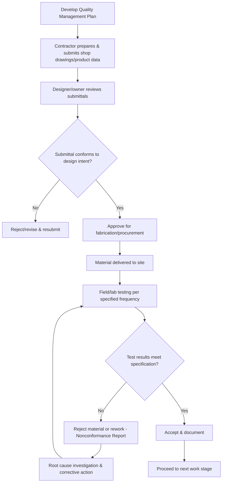

## Construction Quality Control and Assurance

### Overview and Scope

Quality control (QC) and quality assurance (QA) together form the system by which a construction project verifies that materials, workmanship, and completed work conform to the standards specified in the contract documents. **Quality control** refers to the operational, hands-on activities (testing, inspection) performed to verify conformance; **quality assurance** refers to the broader management system — planning, procedures, and oversight — designed to ensure that quality control activities are effective and that the overall process reliably produces conforming work.

### QA vs. QC: A Fundamental Distinction

**Key Points**

- **Quality Assurance (QA)**: Proactive, process-oriented — establishes the systems, procedures, and planning intended to prevent defects before they occur (e.g., a quality management plan, contractor qualification requirements, submittal review procedures).
- **Quality Control (QC)**: Reactive/verification-oriented — the specific inspection and testing activities that check whether the work actually conforms to requirements (e.g., concrete cylinder breaks, compaction density tests, weld inspections).
- **Relationship**: QA creates the framework and confidence that QC will be performed correctly and consistently; QC provides the concrete verification data that QA processes rely upon to demonstrate conformance.

### Quality Management Roles

**Key Points**

- **Owner's representative / construction manager**: Oversees overall project quality expectations and often administers third-party testing/inspection contracts.
- **Contractor's QC manager**: Responsible for the contractor's internal quality control program, often required as a distinct role from production/superintendent staff to preserve independence of quality oversight from schedule/production pressure.
- **Special/third-party inspector**: An independent inspector (often required by building code for specific critical elements such as structural welding, high-strength bolting, or concrete placement) who verifies work independent of the contractor's own QC staff.
- **Testing laboratory**: Performs materials testing (soils, concrete, asphalt, steel) per specified standard test methods, providing objective data supporting acceptance or rejection decisions.

### The Submittal Review Process

**Key Points**

- **Shop drawings**: Contractor/subcontractor/supplier-prepared drawings detailing how a specific building element will be fabricated and installed, submitted for the designer's review before fabrication.
- **Product data**: Manufacturer's published data verifying that a proposed product meets the specified performance and material requirements.
- **Samples**: Physical samples of a proposed material or finish, submitted for approval of appearance, texture, or other qualities not fully conveyed by written specifications.
- **Submittal review purpose**: Confirms the contractor's understanding of design intent and verifies proposed materials/methods conform to specifications *before* procurement and installation — catching potential nonconformance issues while they remain inexpensive to correct.

[Inference] Standard contract language typically limits the designer's submittal review to general conformance with the design concept, explicitly not relieving the contractor of responsibility for accurate dimensions, coordination, and means/methods — but the precise scope and legal effect of submittal review varies by contract form and should be confirmed against the specific general conditions governing a project.

### Common Materials Testing Methods

**Concrete**

- **Slump test**: Measures workability/consistency of fresh concrete (ASTM C143 or equivalent).
- **Compressive strength testing**: Cylinders cast from fresh concrete are cured and tested in compression (typically at 7 and 28 days) to verify the mix meets specified strength (ASTM C39 or equivalent).
- **Air content testing**: Verifies entrained air content, particularly important for freeze-thaw durability.

**Soils and Earthwork**

- **In-place density (compaction) testing**: Verifies compacted fill achieves specified percentage of maximum dry density (commonly via nuclear density gauge or sand-cone method), referenced against a laboratory-determined Proctor curve.
- **California Bearing Ratio (CBR) / plate load testing**: Verifies subgrade or base course support strength meets design assumptions.

**Structural Steel**

- **Nondestructive testing (NDT) of welds**: Ultrasonic testing (UT), magnetic particle testing (MPT), or radiographic testing (RT) to detect internal or surface weld defects without damaging the completed weld.
- **Bolt torque/tension verification**: Confirms high-strength bolted connections achieve specified pretension.

### Quality Control Process Flow

### Statistical Quality Control Concepts

**Key Points**

- **Sampling frequency**: Test frequency (e.g., one concrete cylinder set per specified volume placed) is specified in the contract documents, balancing statistical confidence against practical testing cost and time.
- **Acceptance criteria**: Specifications typically define both an average strength requirement and a minimum individual test result requirement, since a single low result could indicate a localized defect even if the overall average meets specification (as is standard, e.g., in ACI concrete acceptance criteria logic).
- **Statistical process control**: On projects with sufficiently large, repetitive datasets, control charts can track whether a process (e.g., compaction results across many test locations) remains within statistically expected variation or shows a trend suggesting a systematic problem developing.

### Nonconformance and Corrective Action

**Key Points**

- **Nonconformance Report (NCR)**: A formal document recording an identified deviation from specified requirements, initiating a documented resolution process (rework, repair, or engineering disposition/acceptance with justification).
- **Root cause analysis**: Investigates the underlying cause of a nonconformance (rather than only correcting the immediate instance) to prevent recurrence — a hallmark of a mature QA system versus one that only reacts to individual failures.
- **Disposition options**: Rework to conform, repair to an engineering-approved alternative, "use-as-is" acceptance (with documented engineering justification if the deviation is judged not to affect performance), or rejection/removal.

### Materials Testing Summary Chart (svg_diagram)

<svg xmlns="http://www.w3.org/2000/svg" viewBox="0 0 700 340">
<text x="350" y="25" font-size="16" text-anchor="middle" font-weight="bold">QC Testing by Material Type (svg_diagram)</text>
<rect x="60" y="60" width="180" height="220" fill="#ebf8ff" stroke="#3182ce" stroke-width="2" />
<text x="150" y="85" font-size="13" text-anchor="middle" font-weight="bold">Concrete</text>
<text x="75" y="115" font-size="11">• Slump test</text>
<text x="75" y="140" font-size="11">• Compressive strength</text>
<text x="75" y="165" font-size="11"> (7-day, 28-day)</text>
<text x="75" y="190" font-size="11">• Air content</text>
<text x="75" y="215" font-size="11">• Temperature</text>
<rect x="260" y="60" width="180" height="220" fill="#f0fff4" stroke="#38a169" stroke-width="2" />
<text x="350" y="85" font-size="13" text-anchor="middle" font-weight="bold">Soils/Earthwork</text>
<text x="275" y="115" font-size="11">• In-place density</text>
<text x="275" y="140" font-size="11"> (nuclear gauge/sand cone)</text>
<text x="275" y="165" font-size="11">• Proctor comparison</text>
<text x="275" y="190" font-size="11">• CBR / plate load</text>
<text x="275" y="215" font-size="11">• Moisture content</text>
<rect x="460" y="60" width="180" height="220" fill="#fffaf0" stroke="#dd6b20" stroke-width="2" />
<text x="550" y="85" font-size="13" text-anchor="middle" font-weight="bold">Structural Steel</text>
<text x="475" y="115" font-size="11">• Ultrasonic testing (UT)</text>
<text x="475" y="140" font-size="11">• Magnetic particle (MPT)</text>
<text x="475" y="165" font-size="11">• Radiographic (RT)</text>
<text x="475" y="190" font-size="11">• Bolt torque/tension</text>
<text x="475" y="215" font-size="11"> verification</text>
</svg>

### Worked Example

**Example**

A concrete pour requires a specified 28-day compressive strength of 28 MPa, with acceptance criteria requiring the average of any three consecutive tests to equal or exceed 28 MPa, and no single test more than 3.5 MPa below 28 MPa. Three consecutive 28-day test results come back as 30 MPa, 26 MPa, and 29 MPa. Evaluate acceptance.

**Average check:**

$$\frac{30+26+29}{3} = \frac{85}{3} \approx 28.3 \text{ MPa} \geq 28 \text{ MPa} \checkmark$$

**Individual minimum check:**

$$28 - 3.5 = 24.5 \text{ MPa (minimum allowable individual result)}$$

The lowest individual result (26 MPa) exceeds 24.5 MPa, so it also passes. **Both acceptance criteria are satisfied**, and the concrete represented by this test set would be accepted — illustrating why specifications typically require both an average and an individual minimum criterion: a single moderately low result (like the 26 MPa test) does not automatically trigger rejection if the overall average and the individual floor are both satisfied. [Inference: exact numerical acceptance criteria and averaging window vary by specification and governing code — this example illustrates the general logic of ACI-style dual acceptance criteria, not a universal fixed rule.]

### Common Pitfalls and Practical Considerations

- **Confusing QA and QC roles**: Treating quality assurance planning as complete once quality control testing is happening (or vice versa — assuming a good quality plan alone ensures conforming work without actual testing/verification) misunderstands that both the system (QA) and its verification activities (QC) are necessary and mutually reinforcing.
- **Lack of QC manager independence**: When the same individual responsible for meeting production schedule targets also controls quality acceptance decisions, schedule pressure can compromise the objectivity of quality decisions — a key reason many quality management plans require organizational separation between production and QC roles.
- **Treating submittal approval as a substitute for field verification**: [Inference] An approved shop drawing or product submittal confirms the *proposed* material/method meets design intent, not that the *as-installed* work actually conforms — ongoing field inspection and testing remain necessary even after submittals are approved.
- **Reacting to nonconformance without root cause investigation**: Repeatedly correcting individual instances of the same nonconformance without investigating why it keeps occurring (e.g., a specific crew's technique, a supplier's inconsistent material quality) allows the underlying problem to persist and recur.
- **Inadequate sampling frequency for the scale of work**: Testing too infrequently for the volume/criticality of the work being placed risks missing localized defects that fall between test locations, particularly for work (e.g., compaction of large fill areas) where conditions can vary significantly across a site.

**Related Topics**

- Construction Project Planning and Delivery Methods
- Contracts, Specifications, and Procurement
- Pavement Design Principles (Materials Testing Context)
- Construction Safety Management
- Construction Claims and Delay Analysis
- Concrete Materials and Mix Design
- Total Station and GNSS Surveying (As-Built Verification)