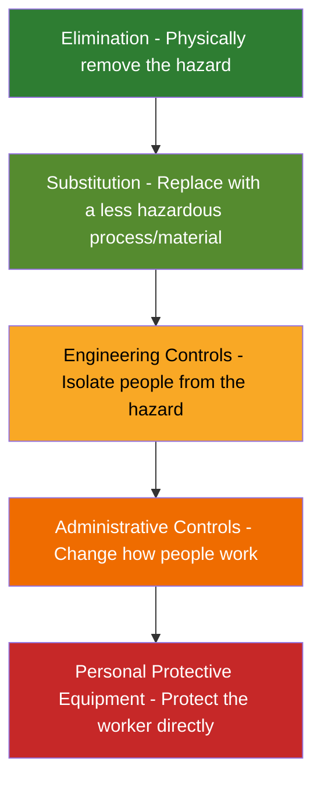
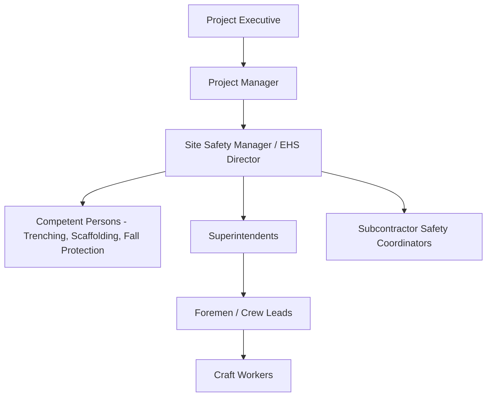

## Construction Safety Management

### Overview

Construction Safety Management (CSM) is the systematic application of policies, procedures, engineering controls, and administrative practices to identify, evaluate, and control hazards on construction sites. It integrates regulatory compliance, risk engineering, and organizational behavior to reduce injuries, fatalities, property damage, and project delays. CSM spans the full project lifecycle — from design-phase hazard elimination (Prevention through Design) through construction execution, to post-completion facility maintenance.

### Regulatory Framework

**Key Points**

- **OSHA (US)**: The Occupational Safety and Health Administration enforces 29 CFR 1926 (Construction Industry Standards). Key subparts include Subpart M (Fall Protection), Subpart P (Excavations), Subpart L (Scaffolds), Subpart K (Electrical), and Subpart CC (Cranes and Derricks).
- **General Duty Clause**: Requires employers to furnish a workplace free from recognized hazards, even where no specific standard exists.
- **International equivalents**: UK's Construction (Design and Management) Regulations (CDM 2015), ISO 45001 (Occupational Health and Safety Management Systems), and Philippines' DOLE Department Order No. 198-18 (OSH Law IRR).
- **Permit systems**: Building permits, excavation permits, hot work permits, and confined space entry permits are jurisdiction-specific prerequisites for high-risk activities.

[Unverified] Specific numeric penalty thresholds and citation classifications change periodically via regulatory updates; verify current figures against the enforcing agency's published schedule before use in compliance documentation.

### The Hierarchy of Controls

The hierarchy of controls prioritizes hazard mitigation strategies from most to least effective:

**Key Points**

- **Elimination**: Redesigning a structural connection to remove work-at-height requirements entirely.
- **Substitution**: Using prefabricated, ground-assembled components instead of on-site fabrication at elevation.
- **Engineering Controls**: Guardrails, safety nets, machine guarding, ventilation systems.
- **Administrative Controls**: Job Hazard Analyses (JHA), work rotation, signage, training, permit-to-work systems.
- **PPE**: Hard hats, harnesses, respirators — the last line of defense, not a substitute for higher-order controls.

### Fatal Four Hazard Categories

OSHA identifies four hazard categories responsible for the majority of construction fatalities in the US, colloquially the "Fatal Four."

| Hazard | Description | Typical Controls |
| --- | --- | --- |
| Falls | Leading cause of construction deaths; falls from roofs, scaffolds, ladders, openings | Guardrails, personal fall arrest systems (PFAS), floor hole covers, toe boards |
| Struck-By | Being hit by vehicles, falling objects, swinging loads | Exclusion zones, spotters, hard hats, load path planning |
| Caught-In/Between | Trench collapses, equipment pinch points, collapsing structures | Trench boxes, shoring, sloping, lockout/tagout (LOTO) |
| Electrocution | Contact with power lines or energized equipment | Assured grounding, GFCI protection, minimum approach distances, LOTO |

[Inference] Relative ranking among these four (fall fatalities typically leading) can shift year to year depending on the reporting dataset and jurisdiction; treat exact percentages as dataset-specific rather than fixed constants.

### Fall Protection Engineering

For work at heights greater than the regulatory threshold (commonly 6 ft / 1.8 m in US general construction), a fall protection system is mandatory. Systems fall into three functional categories:

**Key Points**

- **Fall Prevention**: Guardrail systems, covers, safety monitoring systems — prevent the fall from occurring.
- **Fall Restraint**: Limits worker travel so the leading edge or opening cannot physically be reached.
- **Fall Arrest**: Personal Fall Arrest System (PFAS) consisting of anchor point, body harness, and connecting device (lanyard/SRL) — stops a fall in progress.

**Example**

Free fall distance and arrest force calculation for a shock-absorbing lanyard:

$$FF = \frac{L_{lanyard} + D_{stretch} + H_{harness}}{1}$$

Where $FF$ is total fall clearance required, $L_{lanyard}$ is lanyard length, $D_{stretch}$ is deceleration device deployment distance, and $H_{harness}$ is harness stretch plus worker height safety factor. A typical 6 ft (1.8 m) shock-absorbing lanyard requires approximately 18.5 ft (5.6 m) of total clearance below the anchor point when arrest and swing factors are included.

Maximum arresting force (MAF) permitted by OSHA is $8\,kN$ (1,800 lbf) for a full-body harness system.

### Excavation and Trenching Safety

Trenching is disproportionately hazardous due to soil collapse dynamics. Soil is classified per OSHA into types based on cohesion and stability:

| Soil Type | Description | Max Allowable Slope |
| --- | --- | --- |
| Stable Rock | Solid mineral matter, excavatable with vertical sides | Vertical (90°) |
| Type A | Cohesive soils with high unconfined compressive strength (≥1.5 tsf) | 3/4:1 (53°) |
| Type B | Cohesive soils of medium strength (0.5–1.5 tsf) | 1:1 (45°) |
| Type C | Granular, low-cohesion, or submerged soils (<0.5 tsf) | 1.5:1 (34°) |

Protective systems required for excavations $\geq 5\,ft$ (1.5 m) deep (except stable rock) include:

- **Sloping**: Cutting back the trench wall at a safe angle.
- **Shoring**: Hydraulic or timber supports (e.g., aluminum hydraulic shores) installed against trench walls.
- **Shielding**: Trench boxes providing a protective zone independent of soil support.

A Competent Person, as defined by OSHA, must inspect excavations daily and after any event that could increase hazard (rainfall, vibration, groundwater changes).

### Job Hazard Analysis (JHA) / Job Safety Analysis (JSA)

A structured, task-based process breaking work into sequential steps, identifying hazards per step, and prescribing controls.

**Example**

| Task Step | Potential Hazard | Control Measure |
| --- | --- | --- |
| Position crane for lift | Overhead power line contact | Maintain 20 ft minimum approach distance; spotter assigned |
| Rig the load | Sling failure, pinch points | Inspect rigging pre-use; rated capacity verified against load chart |
| Hoist and swing load | Struck-by from swinging load | Establish exclusion zone; tag lines used; no personnel under suspended load |
| Land and unrig load | Crush injury during unrigging | Load fully seated and stable before rigger approaches |

### Safety Management Systems and Culture

**Key Points**

- **Behavior-Based Safety (BBS)**: Programs focused on observing and reinforcing safe worker behaviors rather than solely punitive incident response.
- **Safety Culture Maturity**: Organizations progress through stages — reactive, dependent, independent, interdependent — with interdependent culture characterized by peer-to-peer intervention and shared ownership.
- **Leading vs. Lagging Indicators**: Lagging indicators (TRIR, LTIR, fatalities) measure past outcomes; leading indicators (near-miss reports, safety observation counts, training completion rates) predict and prevent future incidents.
- **Incident Investigation**: Root cause analysis methods (5 Whys, Fault Tree Analysis, Fishbone/Ishikawa diagrams) distinguish immediate causes from systemic/organizational root causes.

### Key Safety Metrics

$$TRIR = \frac{(N_{recordable} \times 200{,}000)}{EH}$$

Where $N_{recordable}$ is the number of OSHA-recordable incidents, $EH$ is total employee hours worked in the period, and $200{,}000$ represents the base rate equivalent to 100 full-time workers over one year (assuming 2,000 hours/worker/year).

$$LTIR = \frac{(N_{lost\_time} \times 200{,}000)}{EH}$$

LTIR isolates incidents resulting in days away from work, restricted duty, or job transfer (DART).

**Example**

A contractor logs 3 recordable incidents over 450,000 labor hours in a year:

$$TRIR = \frac{3 \times 200{,}000}{450{,}000} = 1.33$$

An industry benchmark TRIR below 1.0–2.0 is generally regarded as strong performance for heavy civil construction, though [Inference] acceptable benchmark ranges vary meaningfully by construction subsector (residential vs. heavy civil vs. industrial) and should be compared against subsector-specific published averages rather than a single universal threshold.

### Prevention through Design (PtD)

PtD shifts hazard elimination upstream into the design phase, where designers anticipate constructability and maintenance hazards before construction begins. Examples include designing permanent anchor points into roof structures for future maintenance fall protection, specifying prefabricated modular units to reduce elevated work, and sequencing structural design to allow safe erection order.

### Site Safety Organization

**Key Points**

- **Competent Person**: Per OSHA, someone capable of identifying existing and predictable hazards and who has authority to take prompt corrective action.
- **Qualified Person**: Someone possessing recognized degree, certificate, or professional standing demonstrating capability to solve problems related to a specific subject (e.g., a Qualified Rigger).
- **Safety Committees**: Joint labor-management committees reviewing incident trends and site conditions on a recurring cadence.

### Toolbox Talks and Training

Short, frequent (often daily or weekly) informal safety briefings addressing task-specific hazards relevant to the day's work. Complementary to formal training programs such as OSHA 10/30-Hour Construction Outreach courses, which provide broader regulatory and hazard-recognition education but are not certifications of competency for specific tasks.

### Emergency Preparedness

**Key Points**

- **Emergency Action Plans (EAP)**: Documented procedures for evacuation, medical emergencies, fire, and severe weather.
- **First aid/CPR-certified personnel**: Required on-site where infirmary or clinic access is not reasonably close.
- **Rescue planning**: Confined space entry requires a pre-planned, practiced rescue procedure before entry is authorized — reliance on external emergency services alone is generally considered insufficient under most regulatory interpretations.

### Illustrative Diagram: Fall Arrest Clearance Zone

<svg xmlns="http://www.w3.org/2000/svg" viewBox="0 0 500 400">
<text x="250" y="25" text-anchor="middle" font-size="16" font-weight="bold" fill="#1a1a1a">Fall Arrest Clearance Zone (svg_diagram)</text>
<line x1="100" y1="50" x2="100" y2="370" stroke="#333" stroke-width="3" />
<circle cx="100" cy="50" r="6" fill="#c62828" />
<text x="115" y="55" font-size="12" fill="#333">Anchor Point</text>
<line x1="100" y1="50" x2="100" y2="150" stroke="#1565c0" stroke-width="4" />
<text x="115" y="105" font-size="12" fill="#1565c0">Lanyard (6 ft)</text>
<line x1="100" y1="150" x2="100" y2="230" stroke="#ef6c00" stroke-width="4" stroke-dasharray="4,3" />
<text x="115" y="195" font-size="12" fill="#ef6c00">Deceleration Distance (~3.5 ft)</text>
<line x1="100" y1="230" x2="100" y2="280" stroke="#6a1b9a" stroke-width="4" />
<text x="115" y="260" font-size="12" fill="#6a1b9a">Harness Stretch + Worker Height</text>
<line x1="60" y1="300" x2="440" y2="300" stroke="#2e7d32" stroke-width="3" />
<text x="150" y="295" font-size="12" fill="#2e7d32">Working/Walking Surface</text>
<line x1="60" y1="360" x2="440" y2="360" stroke="#c62828" stroke-width="3" stroke-dasharray="6,4" />
<text x="150" y="380" font-size="12" fill="#c62828">Lower Level / Ground</text>
<line x1="300" y1="150" x2="300" y2="300" stroke="#000" stroke-width="1" />
<line x1="290" y1="150" x2="310" y2="150" stroke="#000" stroke-width="1" />
<line x1="290" y1="300" x2="310" y2="300" stroke="#000" stroke-width="1" />
<text x="320" y="230" font-size="12" fill="#000">Total Required Clearance ≈ 18.5 ft</text>
</svg>

### Common Pitfalls

- Treating PPE as the primary control rather than the last resort in the hierarchy of controls.
- Failing to reclassify soil type after rainfall or excavation dewatering, leading to inadequate protective systems.
- Conducting JHAs generically rather than per-task, missing hazards specific to sequencing or site conditions.
- Relying on lagging indicators alone, which measure failure after the fact rather than predicting risk.
- Inadequate coordination of multi-employer worksite hazards (controlling employer vs. subcontractor responsibilities under OSHA's Multi-Employer Citation Policy).

**Next Steps**

- Scaffolding Systems and Access Engineering
- Crane Safety and Rigging Fundamentals
- Confined Space Entry Procedures
- Construction Quality Management Systems
- Lockout/Tagout (LOTO) Procedures
- ISO 45001 Occupational Health and Safety Management Systems
- Ergonomics and ergonomic hazard control in construction
- Environmental Health and Safety (EHS) Program Development