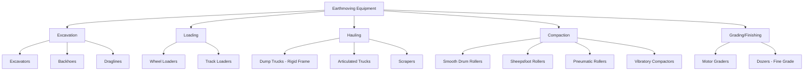

## Equipment Selection and Construction Methods

### Overview

Equipment selection and construction methods engineering is the discipline of matching plant, machinery, and construction techniques to project scope, site conditions, production requirements, and cost constraints. Decisions made here drive schedule duration, unit production costs, safety exposure, and constructability, making this one of the highest-leverage planning activities in construction management.

### Fundamental Selection Criteria

**Key Points**

- **Material characteristics**: Soil/rock type, moisture content, swell/shrinkage factors, gradation.
- **Project quantities**: Total volume of work governs whether owning vs. renting equipment is economical.
- **Site conditions**: Access constraints, haul road geometry, working space, groundwater, adjacent structures.
- **Schedule constraints**: Production rate required to meet milestone dates.
- **Owning and operating costs**: Depreciation, financing, insurance, taxes (owning) vs. fuel, maintenance, labor, consumables (operating).
- **Availability and support**: Local dealer support, parts availability, operator familiarity.

### Earthmoving Equipment Classification

### Production Rate Estimation

Equipment production estimating follows a common structure across machine types: theoretical output adjusted by efficiency factors.

$$Q = \frac{V \times E \times 60}{C_t}$$

Where $Q$ is production rate (volume/hour), $V$ is volume per cycle (bucket/bed capacity), $E$ is efficiency factor (accounting for job/management conditions), and $C_t$ is cycle time in minutes.

**Example**

An excavator with a $1.5\,m^3$ bucket, a fill factor of $0.9$, cycle time of $22$ seconds, and job efficiency of $0.83$ (50 min/hr):

$$Q = \frac{1.5 \times 0.9 \times 0.83 \times 3600}{22} = 183.4\ m^3/hr$$

**Key Points**

- **Job efficiency factor**: Commonly expressed as minutes worked per 60-minute hour (e.g., 50/60 = 0.83) accounting for operator breaks, minor delays, management conditions.
- **Bucket fill factor**: Ranges roughly 0.80–1.10 depending on material (loose sand vs. well-blasted rock vs. wet clay).
- **Swell factor**: Bank volume converts to loose volume via $V_{loose} = V_{bank} \times (1 + \%swell)$; compacted volume is typically less than bank volume.

### Earthwork Volume and Haul Analysis

**Key Points**

- **Mass Haul Diagram**: A cumulative plot of cut/fill volumes along a horizontal alignment used to determine optimal haul distances, balance points, and borrow/waste requirements.
- **Free-haul distance**: Distance within which haul cost is included in the excavation unit price; hauling beyond this incurs overhaul costs.
- **Overhaul**: Calculated as (haul distance − free-haul distance) × volume, often expressed in station-yards or station-meters.

$$Overhaul = V \times (D_{haul} - D_{free})$$

### Compaction Method Selection

| Soil Type | Recommended Compactor | Mechanism |
| --- | --- | --- |
| Cohesive (clay, silt) | Sheepsfoot / Padfoot Roller | Kneading action |
| Granular (sand, gravel) | Vibratory Smooth Drum | Vibration densification |
| Mixed/Well-graded | Pneumatic-tired Roller | Kneading + pressure |
| Asphalt surfaces | Smooth Steel Drum (static/vibratory) | Pressure/vibration |

Compaction adequacy is verified against a target relative to the Standard or Modified Proctor maximum dry density:

$$RC = \frac{\gamma_{d,field}}{\gamma_{d,max}} \times 100\%$$

Where $RC$ is relative compaction, $\gamma_{d,field}$ is field dry unit weight (via nuclear density gauge or sand cone method), and $\gamma_{d,max}$ is the laboratory maximum dry density from a Proctor test. Typical specification thresholds require $RC \geq 90{-}95\%$ depending on application (subgrade vs. structural fill).

### Concrete Construction Methods

**Key Points**

- **Cast-in-place (CIP)**: Formed and poured on-site; allows monolithic construction and field adaptability but slower cycle times.
- **Precast/Prestressed**: Fabricated off-site under controlled conditions; faster erection, higher quality control, requires crane capacity and transportation logistics.
- **Tilt-up construction**: Wall panels cast horizontally on-site (often on the building's own floor slab), then tilted into vertical position by crane — economical for large, low-rise industrial/commercial structures.
- **Slipforming**: Continuous vertical formwork movement (via jacks on climbing rods) used for silos, cores, towers, achieving continuous monolithic pours without cold joints.
- **Formwork systems**: Selection among traditional timber, engineered panel systems (e.g., modular steel-frame ply), and climbing/self-climbing systems depends on repetition, wall height, and cycle time targets.

### Formwork Design Consideration

Lateral pressure on formwork from fresh concrete governs form design and tie spacing:

$$P = w \times h$$

For rapid pour rates (ACI 347 simplified method, columns):

$$P_{max} = C_w \left(150 + \frac{9000R}{T}\right)$$

Where $P_{max}$ is maximum lateral pressure (psf), $C_w$ is unit weight coefficient, $R$ is rate of placement (ft/hr), and $T$ is concrete temperature (°F). [Unverified] Exact coefficients and applicability limits vary between ACI 347 edition years; verify against the current adopted edition before use in formwork design calculations.

### Cranes and Lifting Equipment Selection

| Crane Type | Typical Application | Key Constraint |
| --- | --- | --- |
| Mobile/Truck Crane | Short-duration lifts, multiple locations | Ground bearing capacity, outrigger setup |
| Crawler Crane | Heavy lifts, poor ground conditions | Transport/mobilization cost, ground pressure |
| Tower Crane | High-rise vertical construction | Fixed location, erection/dismantling logistics |
| Rough Terrain Crane | Off-road site conditions | Limited travel speed on public roads |

**Key Points**

- **Load chart analysis**: Capacity depends on boom length, radius, and configuration (outriggers extended, counterweights, boom angle).
- **Critical lift planning**: Required when load exceeds 75–90% of rated capacity at the working radius, or for complex/high-consequence lifts, involving detailed rigging plans and engineering review.
- **Ground bearing pressure**: Must be verified against soil bearing capacity, particularly over utilities, basements, or soft soils.

### Method Selection: Cut-and-Cover vs. Trenchless

For underground utility/tunnel construction:

**Key Points**

- **Cut-and-cover / Open-cut**: Traditional excavate-install-backfill; economical for shallow depths, disruptive to surface traffic and utilities.
- **Trenchless methods**:
  - **Horizontal Directional Drilling (HDD)**: Steerable drill head creates a bore path, pipe pulled back through; minimizes surface disruption.
  - **Microtunneling**: Remote-controlled tunnel boring machine (TBM) with pipe jacking, used for larger diameter gravity or pressure pipelines.
  - **Pipe bursting**: Existing pipe fractured outward while new pipe is pulled in simultaneously — used for replacement in the same alignment.
- Selection driven by depth, soil conditions, surface disruption tolerance, existing utility conflicts, and cost comparison per linear foot.

### Method Selection: Structural Erection Sequencing

**Key Points**

- **Structural steel**: Erection sequence typically follows a stability-driven order — establishing braced bays first before extending erection outward, maintaining temporary stability per AISC Code of Standard Practice guidance.
- **Precast concrete**: Erection sequence considers crane reach/positioning, connection curing/grouting time, and temporary bracing until permanent connections achieve design strength.

### Equipment Economics: Own vs. Rent vs. Lease

**Key Points**

- **Ownership**: Economical for high utilization (commonly cited threshold around 60–70%+ annual utilization), provides asset control and tax depreciation benefits, but carries capital risk and maintenance responsibility.
- **Renting**: Preferred for short-duration or specialized equipment needs, avoids capital outlay, transfers maintenance risk to owner/rental company.
- **Leasing**: Middle ground — often used for equipment needed for a defined multi-year project duration without full ownership commitment.

Break-even analysis compares total ownership cost (fixed + variable, amortized) against cumulative rental cost over an assumed usage duration:

$$TC_{own}(t) = F + V \times t$$

$$TC_{rent}(t) = R \times t$$

Where $F$ is fixed ownership cost, $V$ is variable operating cost/hour, $R$ is rental rate/hour, and $t$ is hours of use. The break-even point occurs where $TC_{own}(t) = TC_{rent}(t)$.

### Site Logistics and Equipment Layout Planning

**Key Points**

- **Site logistics plan**: Maps equipment laydown, crane locations/swing radii, material staging, site access/egress, and temporary facilities.
- **Congestion management**: Sequencing equipment mobilization to avoid conflicts in constrained urban sites.
- **Crane radius and swing zone coordination**: Especially critical on multi-crane sites to prevent interference ("crane creep" zones).

### Selection Decision Matrix Example

**Example**

| Criterion | Weight | Crawler Excavator | Wheel Excavator |
| --- | --- | --- | --- |
| Site mobility (paved) | 20% | 6 | 9 |
| Soft ground performance | 25% | 9 | 5 |
| Production rate | 30% | 8 | 7 |
| Mobilization cost | 15% | 5 | 8 |
| Operator availability | 10% | 7 | 7 |
| **Weighted Score** |  | **7.35** | **6.85** |

This weighted-criteria matrix format is commonly used to formalize equipment selection decisions where multiple qualitative and quantitative factors must be balanced against project-specific priorities.

### Common Pitfalls

- Selecting equipment based on lowest hourly rental rate without accounting for production rate differences (cost per unit of output, not cost per hour, governs true economy).
- Ignoring soil bearing capacity when siting cranes or heavy equipment, leading to instability or overturning risk.
- Underestimating job efficiency factors, leading to optimistic schedule and cost projections.
- Failing to verify formwork pressure design against actual planned pour rate and concrete temperature, especially in cold weather.
- Overlooking trenchless method feasibility (soil/rock conditions, utility crossings) leading to unnecessary open-cut disruption costs.

**Next Steps**

- Construction Scheduling and Critical Path Method (CPM)
- Earthwork Estimating and Mass Haul Diagrams
- Formwork and Shoring Design
- Crane Selection and Rigging Fundamentals
- Constructability Review and Value Engineering
- Construction Cost Estimating Methods
- Trenchless Technology and Underground Utility Construction
- Site Layout and Temporary Facilities Planning