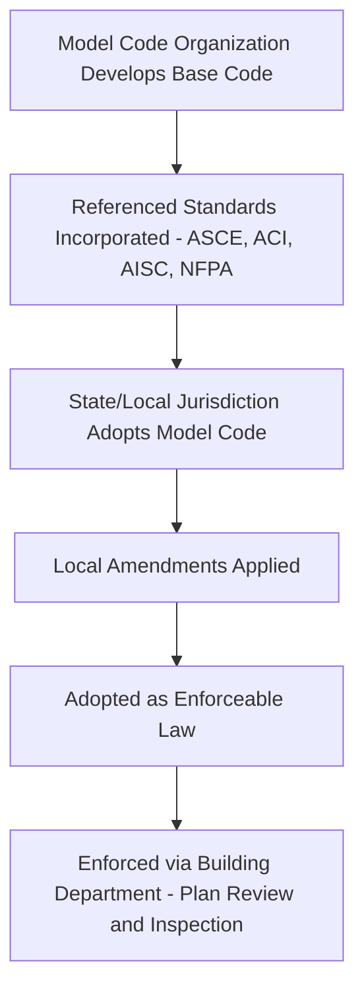
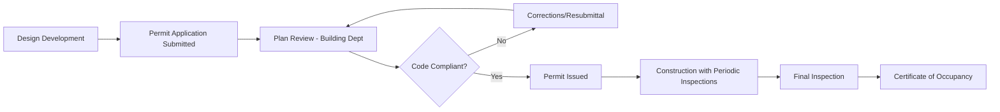

## Overview of Building Codes

### Definition and Purpose

Building codes are legally adopted sets of regulations governing the design, construction, alteration, and occupancy of buildings and structures. Their primary purpose is to establish minimum standards protecting public health, safety, and welfare — addressing structural integrity, fire safety, egress, accessibility, sanitation, and energy performance. Codes are distinct from standards: a **code** is a legally enforceable regulatory document, while a **standard** (e.g., an ASTM or ASCE document) is a technical specification that a code may reference and thereby incorporate by reference into law.

### Code Development and Adoption Process

**Key Points**

- **Model codes**: Developed by standards-writing organizations, then adopted (often with amendments) by state or local governments as legally binding regulation.
- **Referenced standards**: Model codes incorporate by reference detailed technical standards from organizations such as ASCE (loads), ACI (concrete), AISC (steel), NFPA (fire/life safety), and ASHRAE (mechanical/energy).
- **Local amendments**: Jurisdictions frequently modify model code provisions to address regional hazards (seismic zones, wind/hurricane regions, snow loads, flood zones) or local policy priorities.
- **Code editions**: Model codes are typically updated on a multi-year cycle (commonly 3 years for the International Code Council family), and jurisdictions may lag in adopting the most current edition.

[Unverified] Exact edition-adoption status varies by jurisdiction and changes over time; the currently enforced code edition in any specific location should be verified directly with the local Authority Having Jurisdiction (AHJ) rather than assumed from the latest published model code edition.

### The International Code Council (ICC) Family of Codes

The ICC publishes the I-Codes, a coordinated suite of model codes widely adopted (with amendments) across most US states.

| Code | Scope |
| --- | --- |
| International Building Code (IBC) | General building design, structural, fire/life safety, occupancy classification |
| International Residential Code (IRC) | One- and two-family dwellings, townhouses |
| International Fire Code (IFC) | Fire prevention, fire department access, hazardous materials |
| International Plumbing Code (IPC) | Plumbing systems |
| International Mechanical Code (IMC) | HVAC systems |
| International Energy Conservation Code (IECC) | Building energy efficiency |
| International Existing Building Code (IEBC) | Alterations, repairs, additions to existing buildings |
| International Fuel Gas Code (IFGC) | Fuel gas piping and appliances |

[Inference] Some US jurisdictions (notably a small number of states) maintain their own independently developed code rather than adopting the ICC family directly; the presence and specifics of any such state-specific code should be confirmed against that state's current regulatory framework rather than assumed.

### Key Structural and Life-Safety Referenced Standards

**Key Points**

- **ASCE 7 (Minimum Design Loads and Associated Criteria)**: Governs dead, live, wind, seismic, snow, and flood load determination — the primary loading standard referenced by the IBC.
- **ACI 318 (Building Code Requirements for Structural Concrete)**: Governing standard for reinforced concrete design, referenced by the IBC for concrete structures.
- **AISC 360 (Specification for Structural Steel Buildings)**: Governing standard for structural steel design.
- **NFPA 101 (Life Safety Code)**: Addresses means of egress, fire protection features, occupant safety — often referenced alongside or in coordination with the IFC.
- **ASCE 24**: Flood-resistant design and construction requirements referenced in flood hazard areas.

### Occupancy Classification

Buildings are classified by occupancy type, which drives fire-resistance ratings, egress requirements, and allowable construction types.

| Occupancy Group | Examples |
| --- | --- |
| A — Assembly | Theaters, restaurants, gymnasiums |
| B — Business | Offices, banks, professional services |
| E — Educational | Schools (through 12th grade) |
| F — Factory/Industrial | Manufacturing facilities |
| H — High Hazard | Facilities with hazardous materials |
| I — Institutional | Hospitals, jails, nursing homes |
| M — Mercantile | Retail stores |
| R — Residential | Apartments, hotels, dwellings |
| S — Storage | Warehouses |
| U — Utility/Miscellaneous | Sheds, towers, fences |

### Construction Type Classification

The IBC classifies buildings into five construction types (I–V) based on the combustibility and fire-resistance rating of structural elements:

**Key Points**

- **Type I & II**: Noncombustible construction (steel, concrete) — Type I generally requires higher fire-resistance ratings than Type II.
- **Type III**: Exterior walls noncombustible, interior elements may be combustible.
- **Type IV**: Heavy timber construction, including newer mass timber subtypes (IV-A, IV-B, IV-C) recognized in more recent code editions for tall mass timber buildings.
- **Type V**: Combustible construction throughout (typical light-frame wood construction).

Allowable building height and area are determined by the interaction of occupancy classification, construction type, and the presence of automatic fire sprinkler systems — generally, higher fire-resistance construction types and sprinkler protection permit greater allowable height/area.

### Structural Design Load Categories (per ASCE 7)

$$U = 1.2D + 1.6L + 0.5(L_r \text{ or } S \text{ or } R)$$

A representative LRFD (Load and Resistance Factor Design) basic load combination, where $D$ is dead load, $L$ is live load, $L_r$ is roof live load, $S$ is snow load, and $R$ is rain load. Additional combinations incorporate wind ($W$) and seismic ($E$) loads with their own load factors. [Unverified] Exact load factors and combination sets are edition-specific to the referenced ASCE 7 version incorporated by the locally adopted code; verify against the specific edition in force.

### Fire-Resistance Rated Construction

**Key Points**

- **Fire-resistance rating**: Time (in hours) an assembly can withstand standardized fire exposure (per ASTM E119 or UL 263 testing) while maintaining structural and/or barrier function.
- **Fire separation distance**: Distance from a building's exterior wall to a lot line, influencing required exterior wall fire-resistance rating and allowable openings.
- **Compartmentation**: Fire walls, fire barriers, and fire partitions subdivide buildings to limit fire and smoke spread, sized by rating requirements tied to occupancy and construction type.

### Means of Egress Requirements

**Key Points**

- **Occupant load**: Calculated using code-prescribed occupant load factors (area per person) specific to occupancy type, determining required egress capacity.
- **Egress width**: Minimum width of exit components (doors, corridors, stairs) calculated from occupant load using capacity factors.
- **Travel distance**: Maximum distance permitted from any point in a building to the nearest exit, varying by occupancy and sprinkler protection.
- **Number of exits**: Minimum number of independent exits required, generally increasing with occupant load and building height.

$$OL = \frac{A_{floor}}{OLF}$$

Where $OL$ is occupant load, $A_{floor}$ is gross or net floor area (depending on occupancy), and $OLF$ is the code-prescribed occupant load factor (e.g., 100 sq ft per occupant for typical business use, 15 sq ft per occupant for assembly with fixed seating — [Unverified] exact factors are code-edition and occupancy-subtype specific).

### Accessibility Requirements

**Key Points**

- **ADA (Americans with Disabilities Act)**: Federal civil rights law requiring accessible design in public accommodations and commercial facilities; the ADA Standards for Accessible Design set enforceable technical requirements.
- **ICC A117.1**: Referenced accessibility standard incorporated into the IBC, coordinating closely with (but not identical to) ADA standards.
- Requirements address accessible routes, entrances, parking, restrooms, and reasonable accommodation provisions across occupancy types.

### Energy Codes

The IECC (or a jurisdiction's adopted equivalent, such as a state energy code aligned with ASHRAE 90.1) establishes minimum requirements for building envelope thermal performance, HVAC efficiency, lighting power density, and building commissioning, addressing both residential and commercial construction paths.

### Plan Review and Permitting Process

**Key Points**

- **Authority Having Jurisdiction (AHJ)**: The local building department (or other empowered entity) responsible for code interpretation, plan review, and enforcement.
- **Plan review**: Verification that construction documents comply with applicable codes prior to permit issuance.
- **Inspections**: Staged field verification (foundation, framing, MEP rough-in, final) confirming as-built compliance.
- **Certificate of Occupancy (CO)**: Official document permitting legal occupancy, issued after successful final inspection.
- **Alternative compliance / performance-based design**: Many codes permit alternative methods (e.g., performance-based fire engineering) where prescriptive provisions are not met, subject to AHJ approval.

### Existing Buildings and Code Compliance

**Key Points**

- **Grandfathering**: Existing buildings generally are not required to retroactively comply with every new code edition unless triggered by alteration, addition, change of occupancy, or a specific retroactive safety mandate.
- **IEBC (International Existing Building Code)**: Provides compliance pathways (prescriptive, work area, performance) for alterations to existing structures, often less onerous than full new-construction compliance.
- **Change of occupancy/use**: Typically triggers a higher level of code compliance review, since life-safety risk profiles change with occupancy type.

### Common Pitfalls

- Assuming the latest published model code edition is what's currently enforced locally, without confirming with the AHJ.
- Conflating "standard" (e.g., ASCE 7) with "code" (e.g., IBC) — standards only become legally binding once incorporated by reference into an adopted code.
- Overlooking local amendments that modify or override model code base provisions for regional hazards.
- Designing to national ADA standards alone while neglecting a stricter concurrently applicable state/local accessibility code provision, or vice versa.
- Failing to trigger appropriate IEBC compliance pathway review when planning alterations to existing buildings.

**Next Steps**

- Structural Load Types and ASCE 7 Fundamentals
- Fire-Resistance Rated Construction and Compartmentation
- Occupancy Classification and Allowable Height/Area
- Means of Egress Design
- Seismic Design Provisions and Zonation
- Accessibility Design (ADA/ICC A117.1)
- Professional Licensure and Engineering Ethics
- Plan Review and Permitting Procedures