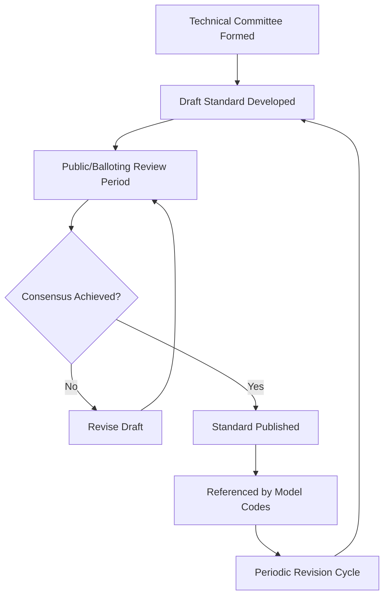
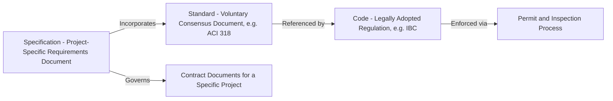

## Material and Design Standards Organizations

### Overview

Standards organizations develop the consensus technical documents that building codes incorporate by reference, transforming voluntary engineering best practice into legally enforceable design and material requirements. Unlike codes (adopted by governmental jurisdictions), standards are typically developed through a consensus process involving industry, academia, and government stakeholders, then published by non-governmental standards-developing organizations (SDOs).

### Standards Development Process

**Key Points**

- **Consensus process**: Most major US SDOs operate under ANSI (American National Standards Institute) accreditation, requiring balanced committee representation and public comment periods.
- **Revision cycles**: Standards are updated periodically (commonly 3–6 years) to reflect research advances, failure investigations, and material/technology developments.
- **Incorporation by reference**: A standard gains legal force only when a code body cites it and a jurisdiction adopts that code — the standard itself is not law until referenced.

### Key Structural Materials Organizations

| Organization | Key Standards | Domain |
| --- | --- | --- |
| ACI (American Concrete Institute) | ACI 318, ACI 301, ACI 350 | Concrete design, construction, specifications |
| AISC (American Institute of Steel Construction) | AISC 360, AISC 341, AISC 358 | Structural steel design, seismic provisions, connections |
| AWS (American Welding Society) | AWS D1.1, D1.4 | Welding codes for structural steel, reinforcing |
| ASTM International | A36, A992, C33, C150, etc. | Material property/testing specifications across nearly all construction materials |
| AWC (American Wood Council) | NDS (National Design Specification) | Wood/timber design |
| PCI (Precast/Prestressed Concrete Institute) | PCI Design Handbook | Precast and prestressed concrete design/manufacturing |
| MBMA (Metal Building Manufacturers Association) | Metal Building Systems Manual | Pre-engineered metal building design |

### ASTM International

**Key Points**

- **Scope**: Publishes over 12,000 standards spanning material specifications (composition, mechanical properties), test methods, and practices across virtually every construction material.
- **Designation system**: Standards are identified by a letter-number code indicating category (A = ferrous metals, C = cementitious/concrete/ceramic, D = miscellaneous materials including soils/aggregates/asphalt, E = general test methods) followed by a sequential number and year of last revision (e.g., ASTM A992/A992M for structural steel wide-flange shapes).
- **Referenced by design standards**: AISC 360 references ASTM A992 for wide-flange steel; ACI 318 references ASTM C150 for portland cement, C33 for concrete aggregates.

### Loading and General Design Standards

**Key Points**

- **ASCE (American Society of Civil Engineers)**: Publishes ASCE 7 (Minimum Design Loads and Associated Criteria for Buildings and Other Structures) — the foundational load standard referenced by virtually all US structural design codes, covering dead, live, wind, seismic, snow, rain, flood, and ice loads.
- **ASCE 24**: Flood-resistant design and construction, referenced in flood hazard areas per NFIP (National Flood Insurance Program) coordination.
- **SEI (Structural Engineering Institute)**: A division of ASCE focused specifically on structural engineering standards development and technical publications.

### Concrete Standards — ACI

**Key Points**

- **ACI 318 (Building Code Requirements for Structural Concrete and Commentary)**: The primary US design standard for reinforced and prestressed concrete, referenced directly by the IBC; covers flexure, shear, development length, seismic detailing, and serviceability.
- **ACI 301 (Specifications for Structural Concrete)**: Reference specification for concrete construction quality, often incorporated into project specifications.
- **ACI 350**: Environmental engineering concrete structures (water/wastewater containment), addressing liquid-tightness requirements beyond ACI 318's general scope.
- **ACI 306/305**: Cold weather and hot weather concreting practice standards.

### Steel Standards — AISC

**Key Points**

- **AISC 360 (Specification for Structural Steel Buildings)**: Core design specification, available in both LRFD (Load and Resistance Factor Design) and ASD (Allowable Strength Design) formats within a unified specification.
- **AISC 341 (Seismic Provisions for Structural Steel Buildings)**: Governs ductile detailing for steel structures in high seismic design categories.
- **AISC 358 (Prequalified Connections for Special and Intermediate Steel Moment Frames)**: Specifies connection geometries pre-approved for seismic moment frame applications without project-specific testing.
- **Code of Standard Practice**: Establishes standard industry practice for contractual and erection responsibilities between fabricators, erectors, and engineers of record.

### Fire and Life Safety Standards — NFPA

**Key Points**

- **NFPA (National Fire Protection Association)**: Publishes over 300 codes and standards addressing fire, electrical, and life safety.
- **NFPA 101 (Life Safety Code)**: Means of egress, occupant protection, fire safety features — often used in coordination with or as alternative to IBC/IFC provisions depending on jurisdiction.
- **NFPA 70 (National Electrical Code, NEC)**: The near-universally adopted US electrical installation standard.
- **NFPA 13**: Automatic fire sprinkler system design and installation.

### Testing and Certification Bodies

**Key Points**

- **UL (Underwriters Laboratories)**: Develops fire-resistance rating test standards (UL 263) and product safety certification/listing programs for building materials and assemblies.
- **ICC-ES (ICC Evaluation Service)**: Issues Evaluation Reports (ESRs) documenting code compliance for proprietary/innovative products not explicitly covered by prescriptive code provisions.

### Geotechnical and Materials Testing Standards

**Key Points**

- **ASTM geotechnical standards**: Standardized test methods for soil classification (D2487, Unified Soil Classification System), compaction (D698 Standard Proctor, D1557 Modified Proctor), and in-situ density testing (D1556 sand cone, D6938 nuclear gauge).
- **AASHTO (American Association of State Highway and Transportation Officials)**: Publishes standards for transportation infrastructure materials, pavement design, and bridge design (AASHTO LRFD Bridge Design Specifications) — the primary standard for highway bridge structural design in the US, distinct from AISC/ACI which govern buildings.

### International and Regional Standards Bodies

| Organization | Region/Scope |
| --- | --- |
| ISO (International Organization for Standardization) | Global — ISO 9001 (QMS), ISO 45001 (OHSMS), ISO 14001 (EMS) |
| Eurocodes (EN 1990 series) | European Union — unified structural design standards |
| BSI (British Standards Institution) | United Kingdom |
| CSA (Canadian Standards Association) | Canada |
| JIS (Japanese Industrial Standards) | Japan |

[Inference] Specific adoption and harmonization status between national standards (e.g., Eurocode adoption completeness across individual EU member states, or CSA vs. US standard alignment for cross-border projects) varies and should be verified against the specific jurisdiction's current regulatory framework rather than assumed to be fully harmonized.

### Standard vs. Code vs. Specification — Terminology Distinction

**Key Points**

- **Standard**: A technical document developed by consensus (e.g., ACI 318) — not legally binding on its own.
- **Code**: A legally adopted regulatory document (e.g., IBC) that may incorporate standards by reference, making them enforceable.
- **Specification**: A project-specific document (e.g., CSI MasterFormat-organized specifications) prepared by the design team, which typically references applicable standards but adds project-specific requirements beyond the code minimum.

### Coordination Between Standards Organizations

Model code bodies (like the ICC) maintain formal relationships with material standards organizations, updating referenced standard editions with each code cycle. This creates a layered compliance hierarchy: a project may need to satisfy the locally adopted IBC edition, which references a specific ACI 318 edition, which in turn references specific ASTM material standard editions — each potentially a different vintage depending on when each document was last incorporated.

**Example**

A project permitted under the 2021 IBC would typically reference ACI 318-19 (not the newest ACI 318 edition available at time of design), which in turn references ASTM standards current as of ACI 318-19's publication — illustrating why the "current" edition of any given standard is not necessarily what governs a specific project; the code-adoption chain determines the applicable edition.

### Common Pitfalls

- Assuming the newest published edition of a referenced standard (e.g., latest ACI 318) automatically governs a project, when the locally adopted code may reference an earlier edition.
- Treating ASTM material specifications as design standards — ASTM typically specifies material properties/testing, while design standards (ACI, AISC) specify how to use those materials structurally.
- Overlooking that specifications (project-specific) may impose requirements more stringent than the referenced standard's minimum, which govern contractually even where code compliance would be satisfied by the lesser requirement.
- Confusing UL fire-test listings (product/assembly-specific) with general code fire-resistance rating tables — a specific tested assembly configuration must match the UL listing exactly to claim its rating.

**Next Steps**

- ASCE 7 Load Determination Fundamentals
- ACI 318 Reinforced Concrete Design Principles
- AISC 360 Structural Steel Design Principles
- ASTM Material Specification Fundamentals
- Professional Licensure and Engineering Ethics
- Quality Assurance and Quality Control (QA/QC) in Construction
- Building Code Adoption and Local Amendments