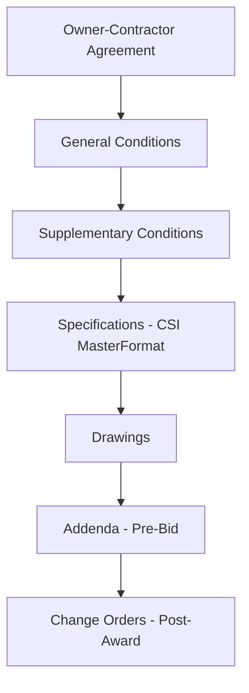
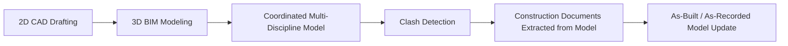
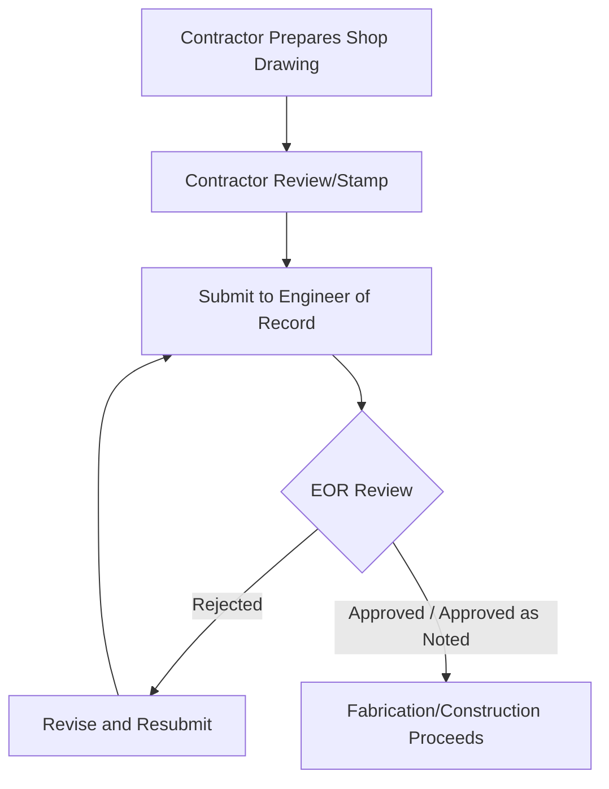

## Engineering Drawings and Documentation

### Overview

Engineering drawings and documentation form the legal and technical language through which design intent is communicated from designer to builder. In civil/structural practice, drawings and their accompanying written specifications together constitute the contract documents that define scope, quality, and performance requirements. Precision, standardization, and completeness in this documentation directly determine constructability, cost accuracy, and liability allocation on a project.

### The Contract Document Hierarchy

**Key Points**

- **Drawings**: Graphic representation of the work — geometry, dimensions, materials, and configuration.
- **Specifications**: Written requirements describing material quality, installation methods, workmanship standards, and testing/submittal procedures — typically organized per CSI MasterFormat divisions.
- **Precedence order**: Contract documents typically establish precedence among conflicting requirements (e.g., specifications often govern over drawings for quality/material requirements, while drawings govern for quantity/dimension), though [Unverified] the specific precedence clause is contract-specific and must be confirmed in the actual General Conditions governing a given project rather than assumed universal.
- **Addenda and Change Orders**: Addenda modify contract documents before contract execution (during bidding); Change Orders modify them after award.

### Drawing Set Organization

Civil/structural drawing sets follow a standardized discipline-based sheet numbering convention, commonly aligned with the National CAD Standard (NCS) / US National CAD Standard sheet identification system.

| Prefix | Discipline |
| --- | --- |
| G | General (cover sheet, index, abbreviations) |
| C | Civil (site, grading, utilities) |
| S | Structural |
| A | Architectural |
| M | Mechanical |
| E | Electrical |
| P | Plumbing |
| FP | Fire Protection |

**Key Points**

- **Sheet numbering**: Typically formatted as discipline prefix + sheet type digit + sequence (e.g., S-201 = Structural, Plans, sheet 01).
- **Title block**: Standardized border containing project name, sheet title, scale, date, revision history, professional seal/stamp, and firm information.
- **Drawing index**: A master list (usually on the cover or G-sheet) cataloging every sheet in the set, used to verify completeness of a bid or permit submission.

### Structural Drawing Content

**Key Points**

- **General Notes**: Design codes and editions used, material specifications, design loads, special inspection requirements — foundational information governing interpretation of the entire structural set.
- **Foundation Plan**: Footing/pile locations, sizes, reinforcing, top-of-footing elevations.
- **Framing Plans**: Beam/column/slab layout per floor level, member sizes, connection references.
- **Sections and Details**: Cut-away views showing vertical relationships, reinforcing placement, connection geometry at a larger scale than plan views.
- **Schedules**: Tabulated data (column schedule, footing schedule, beam schedule) cross-referenced to plan/detail callouts, reducing repetitive information on plan views.

### Drafting Conventions and Standards

**Key Points**

- **Line types**: Object lines (visible edges, heaviest weight), hidden lines (dashed, obscured features), centerlines (dash-dot), dimension/extension lines (lightest weight) — a hierarchy of line weights improves drawing legibility.
- **Scale**: Ratio between drawing size and actual size (e.g., 1/4" = 1'-0" or 1:50 metric); civil site plans commonly use engineering scales (1"=20', 1"=50') while structural details use architectural scales.
- **Orthographic projection**: Standard method of representing 3D objects via plan (top), elevation (side/front), and section (cut-through) views, maintaining consistent alignment between views.
- **Symbols and abbreviations**: Standardized graphic symbols (e.g., section cut markers, north arrows, material hatching patterns) defined in a legend or general notes sheet, reducing ambiguity.

### Dimensioning Standards

$$\text{Total Dimension} = \sum_{i=1}^{n} d_i$$

**Key Points**

- **Chain (point-to-point) dimensioning**: Sequential dimensions between adjacent features — cumulative error can compound over a chain.
- **Baseline (datum) dimensioning**: All dimensions referenced from a common datum point/line, avoiding cumulative tolerance stacking.
- **Tolerances**: Permissible variation from nominal dimension, specified either as a general note (e.g., ±1/4" unless noted) or explicitly on critical dimensions — governs acceptance criteria for as-built conditions.

### Reinforced Concrete Detailing Conventions

**Example**

A typical rebar callout: `#5 @ 12" O.C. E.W. T&B`

Decoded: **#5** bar (5/8 in / 15.9 mm diameter, per US customary rebar sizing where the number denotes eighths of an inch), spaced **@ 12 inches On Center**, placed **Each Way** (both orthogonal directions), **Top and Bottom** of the slab/element.

**Key Points**

- **Bar marks**: Unique identifiers cross-referencing a bar bending schedule listing shape, dimensions, and quantity for each mark.
- **Cover requirements**: Minimum concrete cover to reinforcing steel, specified per exposure condition per ACI 318, critical for corrosion protection and fire resistance — typically noted in general notes or section details.
- **Development and lap splice lengths**: Often provided in a general notes table rather than dimensioned individually at every occurrence, reducing drawing clutter.

### Structural Steel Detailing

**Key Points**

- **Design drawings vs. shop/erection drawings**: The Engineer of Record produces design drawings conveying design intent (member sizes, connection design forces); the steel fabricator produces shop drawings and erection drawings detailing exact fabrication geometry, bolt patterns, and erection sequence — a distinct scope requiring EOR review/approval, not authorship.
- **Connection design responsibility**: Per AISC practice, connection design may be delegated to the fabricator's engineer for "simple" shear connections against forces provided by the EOR, or fully designed by the EOR for moment/braced connections — this division of responsibility should be explicitly stated in the contract documents.
- **Piece marks**: Unique identifiers for each fabricated steel member, used for shop tracking, shipping, and field erection sequencing.

### CAD and BIM Documentation Standards

**Key Points**

- **CAD (Computer-Aided Design)**: Traditional 2D vector drafting; drawings are independently created representations of the design.
- **BIM (Building Information Modeling)**: A coordinated 3D model containing geometric and non-geometric data (material properties, quantities, schedules); 2D drawings are extracted/derived views of a single underlying model, improving cross-discipline consistency.
- **LOD (Level of Development)**: A standardized scale (commonly LOD 100–500) describing the degree of geometric and informational detail/reliability embedded in BIM model elements at a given project phase.
- **Clash detection**: Automated identification of spatial conflicts between disciplines (e.g., a structural beam intersecting a duct run) performed on the coordinated model prior to construction.
- **IFC (Industry Foundation Classes)**: An open, vendor-neutral data schema (ISO 16739) enabling interoperability of BIM data across different software platforms.

[Unverified] Specific LOD definitions and BIM execution plan requirements vary by the standard/guideline adopted for a given project (e.g., AIA E203, BIMForum LOD Specification); exact tier definitions should be confirmed against the governing project BIM execution plan.

### Professional Seals and Certification

**Key Points**

- **Professional Engineer (PE) seal**: Legal certification by a licensed engineer that drawings/calculations were prepared by or under the responsible charge of that engineer, required for most structural submissions to a building department.
- **Wet stamp vs. digital seal**: Jurisdictions increasingly accept digital/electronic seals with defined security requirements, though [Inference] specific acceptance criteria (digital signature standards, submission format) vary by state/jurisdiction licensing board and should be confirmed against the governing board's current regulations rather than assumed uniform.
- **Delegated design submittals**: Where a specialty engineer (e.g., a precast or steel connection engineer) seals a portion of the design, coordination requirements between the EOR and delegated engineer must be explicitly documented.

### Submittals and Shop Drawing Review Process

**Key Points**

- **Submittal**: Contractor-generated documentation (shop drawings, product data, samples) demonstrating conformance with contract documents, reviewed by the design team before fabrication/installation.
- **RFI (Request for Information)**: Formal mechanism for resolving ambiguities, conflicts, or omissions discovered in contract documents during construction.
- **Review is for conformance, not redesign**: EOR shop drawing review generally verifies general conformance with design intent, not an independent check of the contractor's means/methods or detailed calculations (where delegated).

### Record (As-Built) Drawings

**Key Points**

- **As-built drawings**: Final documentation reflecting actual constructed conditions, incorporating field changes, RFI resolutions, and change orders — typically the contractor's responsibility to maintain and deliver at project closeout.
- **Record drawings**: Sometimes distinguished from as-builts as the design team's formal incorporation of as-built information into the official project record set.
- Serve as the primary reference for future renovation, maintenance, and forensic investigation.

### Common Pitfalls

- Relying solely on a printed scale from a drawing rather than dimensioned values — reproduction/plotting can distort true scale.
- Confusing EOR design drawings with fabricator shop drawings, leading to disputes over responsibility for detailing errors.
- Omitting or under-specifying tolerance requirements, leading to disputes over acceptable as-built deviation.
- Failing to update record documents promptly, resulting in loss of critical as-built information at project closeout.
- Treating BIM model geometry as automatically contractually binding without confirming which document (model vs. extracted 2D drawing) governs per the contract's precedence clause.

**Next Steps**

- CSI MasterFormat and Specification Writing
- Building Information Modeling (BIM) Coordination Workflows
- Shop Drawing and Submittal Review Procedures
- Professional Licensure and Engineering Ethics
- Structural Steel Detailing and Connection Design
- Reinforced Concrete Detailing Standards
- Construction Contract Types and Delivery Methods