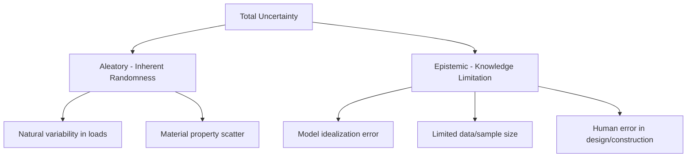
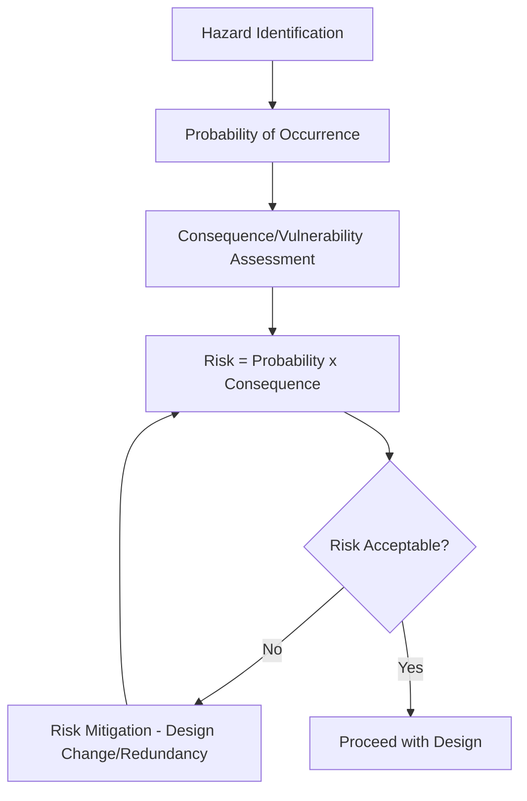

## Risk and Reliability in Design

### Overview

Reliability-based design provides the probabilistic foundation underlying modern structural and geotechnical codes. Rather than guaranteeing absolute safety (an impossibility given inherent variability in loads and material properties), engineering design targets an acceptably low, quantified probability of failure over the structure's service life. This shift from deterministic factor-of-safety approaches to probability-based limit state design underlies the LRFD (Load and Resistance Factor Design) format used in contemporary US structural codes.

### From Allowable Stress Design to Limit State Design

**Key Points**

- **ASD (Allowable Stress Design)**: Applies a single factor of safety to nominal strength, comparing it against service-level (unfactored) loads — does not explicitly account for differing uncertainty levels between load types.
- **LRFD (Load and Resistance Factor Design)**: Applies distinct load factors to each load type (reflecting each load's individual variability) and a resistance/strength reduction factor to nominal capacity — calibrated so that the resulting design achieves a consistent target reliability across different member types and load combinations.
- **Rationale for LRFD**: Live load, wind load, and dead load each have different statistical variability; a uniform safety factor under ASD does not achieve uniform reliability across designs dominated by different load types, whereas LRFD's differentiated factors do.

### The Limit State Function and Reliability Index

Structural reliability is formulated around a limit state function comparing resistance to load effect:

$$g = R - Q$$

Where $R$ is resistance (capacity) and $Q$ is load effect (demand). Failure occurs when $g < 0$. Since both $R$ and $Q$ are random variables (following assumed probability distributions, often lognormal for resistance), the probability of failure is:

$$P_f = P(R < Q) = P(g < 0)$$

The **reliability index**, $\beta$, quantifies safety margin in standard deviation units:

$$\beta = \frac{\mu_g}{\sigma_g} = \frac{\mu_R - \mu_Q}{\sqrt{\sigma_R^2 + \sigma_Q^2}}$$

Where $\mu_R, \mu_Q$ are mean resistance and load effect, and $\sigma_R, \sigma_Q$ are their standard deviations (assuming independence).

**Example**

A steel beam has mean resistance $\mu_R = 500\ kN\cdot m$ with $\sigma_R = 50\ kN\cdot m$, and mean load effect $\mu_Q = 300\ kN\cdot m$ with $\sigma_Q = 60\ kN\cdot m$:

$$\beta = \frac{500 - 300}{\sqrt{50^2 + 60^2}} = \frac{200}{78.1} \approx 2.56$$

A higher $\beta$ corresponds to lower probability of failure; US structural codes (AISC, ACI, per ASCE 7 calibration) are generally calibrated toward target reliability indices in the range of approximately $\beta \approx 2.5{-}3.5$ for typical structural members under gravity loads, though [Unverified] exact target values differ by limit state (strength vs. serviceability), consequence class, and load combination, and should be verified against the specific calibration basis documented in the governing code's commentary rather than treated as a single universal constant.

### Relationship Between Reliability Index and Probability of Failure

Assuming a normal (or lognormal, log-transformed) distribution for $g$:

$$P_f = \Phi(-\beta)$$

Where $\Phi$ is the standard normal cumulative distribution function.

| $\beta$ | Approximate $P_f$ |
| --- | --- |
| 2.0 | $2.3 \times 10^{-2}$ |
| 2.5 | $6.2 \times 10^{-3}$ |
| 3.0 | $1.35 \times 10^{-3}$ |
| 3.5 | $2.3 \times 10^{-4}$ |
| 4.0 | $3.2 \times 10^{-5}$ |

### Sources of Uncertainty

**Key Points**

- **Aleatory uncertainty**: Irreducible, inherent randomness (e.g., natural variability in wind speed, material strength scatter within a production batch) — cannot be eliminated through better knowledge, only characterized statistically.
- **Epistemic uncertainty**: Reducible uncertainty arising from incomplete knowledge (limited test data, simplified analytical models, human error) — can in principle be reduced through more testing, refined models, or improved quality control.
- **Model uncertainty**: The discrepancy between an idealized engineering model's predicted behavior and actual physical behavior, often incorporated as a separate random variable (professional/model factor) in reliability calibration.
- **Human error**: Frequently cited as a dominant contributor to actual structural failures (as opposed to inherent load/resistance variability alone), though [Inference] its relative contribution across failure case studies is difficult to quantify precisely and estimates vary by study methodology and dataset.

### Load and Resistance Factor Calibration

Load factors and resistance (strength reduction) factors in codes like ASCE 7 and ACI 318/AISC 360 are calibrated using reliability analysis so that a spectrum of designs achieves an approximately consistent target $\beta$, rather than being chosen arbitrarily.

**Example**

A typical LRFD basic combination:

$$\phi R_n \geq 1.2D + 1.6L$$

Where $\phi$ (resistance/strength reduction factor, $\phi < 1$) accounts for uncertainty in material strength, fabrication tolerances, and failure mode ductility (e.g., $\phi = 0.90$ for tension yielding in steel, $\phi = 0.75$ for concrete shear per ACI 318 — [Unverified] exact values are provision- and edition-specific). Load factors 1.2 and 1.6 reflect the differing variability of dead load (well-characterized, lower factor) versus live load (higher variability, higher factor).

### Consequence-Based Risk Categorization

Structures are assigned Risk Categories (per ASCE 7) reflecting the consequence of failure, which in turn scales design load requirements (particularly for low-probability events like seismic and wind).

| Risk Category | Description | Example |
| --- | --- | --- |
| I | Low hazard to human life if failure occurs | Agricultural/storage facilities |
| II | Standard occupancy | Typical office/residential buildings |
| III | Substantial hazard / large occupant load | Schools, assembly buildings |
| IV | Essential facilities | Hospitals, emergency response, critical infrastructure |

Higher risk categories are assigned higher **Importance Factors** applied to seismic and wind design forces, effectively targeting a lower probability of failure (higher $\beta$) for facilities whose failure carries greater life-safety or societal consequence.

### Robustness and Progressive Collapse

**Key Points**

- **Robustness**: A structure's capacity to sustain localized damage without disproportionate, cascading collapse — a system-level property distinct from individual member reliability.
- **Progressive collapse**: Failure that spreads from an initiating local failure to a disproportionately large portion of the structure, historically prompting design provisions following notable failure case studies.
- **Design strategies**: Alternate load path design (verifying the structure can redistribute load around a notionally removed critical element), tie force methods (ensuring minimum structural continuity/ductility), and specific local resistance (hardening key elements against credible threats).
- **Redundancy**: Multiple independent load paths reduce system-level failure probability even where individual member reliability is unchanged — a key distinction between component reliability and system reliability.

### System Reliability vs. Component Reliability

**Key Points**

- **Series system**: Failure of any one component causes system failure (weakest-link behavior) — system reliability is generally lower than that of its most reliable component.
- **Parallel system**: System failure requires failure of multiple components (redundant load paths) — system reliability can exceed individual component reliability.
- Real structures typically exhibit a combination of series and parallel behavior depending on structural configuration, making system-level reliability assessment more complex than simple component-level calibration alone.

### Risk Assessment Framework

**Key Points**

- **Risk**: Commonly expressed as the product of probability of a hazard event and the consequence (magnitude of loss) given that event occurs.
- **ALARP (As Low As Reasonably Practicable)**: A risk management principle used in some regulatory frameworks, accepting that risk cannot be reduced to zero but should be reduced until further reduction cost is grossly disproportionate to the benefit gained.
- **Risk-informed decision making**: Increasingly applied in infrastructure asset management, seismic retrofit prioritization, and flood risk management, weighing mitigation cost against expected loss reduction.

### Sensitivity and Uncertainty Propagation Methods

**Key Points**

- **First-Order Second-Moment (FOSM) method**: Approximates the reliability index using mean and variance of $R$ and $Q$ via linearization — computationally efficient but less accurate for highly nonlinear limit state functions or non-normal distributions.
- **Monte Carlo simulation**: Repeatedly samples random variables per their probability distributions and evaluates the limit state function, estimating $P_f$ directly from the fraction of simulated failures — more computationally intensive but handles nonlinearity and complex distributions robustly.
- **First-Order Reliability Method (FORM)**: Iteratively locates the "design point" (most probable failure point) on the limit state surface in standardized variable space, improving accuracy over simple FOSM for non-normal distributions.

### Common Pitfalls

- Treating a computed factor of safety (deterministic) as equivalent to a reliability index (probabilistic) — the two are related but not interchangeable without knowing the underlying variability.
- Assuming code-prescribed load/resistance factors guarantee "zero risk" rather than a calibrated, non-zero target probability of failure.
- Neglecting system-level reliability and redundancy when only component-level checks have been performed, missing progressive collapse vulnerability.
- Underweighting human error and model uncertainty (epistemic sources) relative to material/load variability (aleatory sources) when assessing real-world failure risk.
- Applying reliability targets calibrated for one limit state (e.g., strength) to a different limit state (e.g., serviceability/deflection) without adjustment — target reliability differs meaningfully between the two.

**Next Steps**

- ASCE 7 Load Combinations and Risk Categories
- Progressive Collapse and Structural Robustness Design
- Probabilistic Seismic Hazard Analysis
- Structural Health Monitoring and Condition Assessment
- Quality Assurance and Quality Control (QA/QC) in Construction
- Professional Licensure and Engineering Ethics
- Forensic Engineering and Failure Investigation