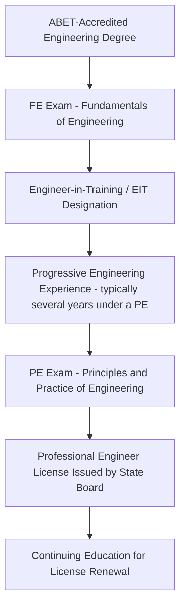
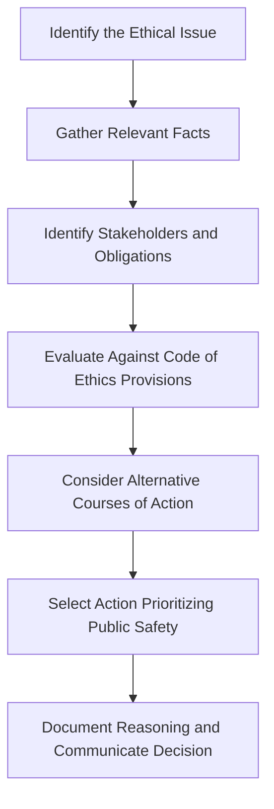

## Professional Licensure and Ethics

### Overview

Professional licensure and ethics govern the legal authority and moral obligations of engineers practicing civil and structural engineering. Licensure establishes the legal threshold of competence required to practice engineering affecting public health and safety, while codes of ethics establish the professional conduct standards governing how that authority is exercised — together forming the accountability framework underlying the profession's self-regulation.

### The Engineering Licensure Process (US Model)

**Key Points**

- **ABET accreditation**: Engineering degree programs accredited by ABET (Accreditation Board for Engineering and Technology) are generally the baseline academic credential recognized by state licensing boards.
- **FE Exam (Fundamentals of Engineering)**: A broad, standardized exam typically taken near graduation, covering fundamental engineering sciences and discipline-specific topics; passing confers Engineer-in-Training (EIT) or Engineer Intern (EI) status.
- **Qualifying experience**: A period of progressive, verifiable engineering experience working under the supervision of a licensed PE, required before sitting for the PE exam — [Unverified] the specific required duration varies by state board and should be confirmed against the specific jurisdiction's current requirements.
- **PE Exam (Principles and Practice of Engineering)**: A discipline-specific exam (e.g., Civil, Structural) demonstrating competency to practice independently; passing, combined with satisfying experience and reference requirements, results in PE licensure from the state board.
- **State-based licensure**: In the US, licensure is granted and regulated at the state level by individual state boards of professional engineering, not federally — a PE license is generally jurisdiction-specific, though reciprocity/comity provisions often allow licensed engineers to obtain licensure in additional states.

### Structural Engineer (SE) Licensure

**Key Points**

- **SE license**: A more specialized, often more rigorous licensure tier (separate SE exam, typically covering advanced structural analysis/design including lateral force-resisting systems) required in certain jurisdictions — particularly high-seismic states and for specific structure types (e.g., essential facilities, high-rise buildings).
- **Jurisdictional variation**: [Unverified] Which jurisdictions require SE licensure (versus accepting general civil PE licensure for structural work) and the specific structure types/thresholds triggering the SE requirement vary by state and should be verified against that state's current board regulations rather than assumed.

### Scope of Practice and Responsible Charge

**Key Points**

- **Responsible charge**: The direct control and personal supervision of engineering work, a legal and ethical requirement that a licensed engineer must exercise over work performed under their seal — delegating design entirely to unlicensed staff without adequate oversight violates this principle.
- **Scope of practice**: Engineers are generally expected to practice only within their demonstrated area of competence; practicing outside one's competence (e.g., a geotechnical engineer sealing structural steel connection design without adequate structural expertise) raises both ethical and liability concerns.
- **Seal/stamp**: The professional seal signifies the engineer has reviewed and takes responsibility for the sealed work — affixing a seal to work not actually performed or reviewed under the engineer's responsible charge is both an ethical violation and, in most jurisdictions, a licensure law violation.

### Codes of Ethics

Multiple professional societies publish codes of ethics; the most widely referenced in US civil/structural practice include the NSPE (National Society of Professional Engineers) Code of Ethics and the ASCE Code of Ethics.

**Key Points**

- **Paramountcy of public safety**: Nearly universal first-principle across engineering codes of ethics — engineers must "hold paramount the safety, health, and welfare of the public" above client, employer, or personal interest.
- **Competence**: Engineers shall perform services only in areas of their competence.
- **Objectivity and truthfulness**: Engineers shall issue public statements only in an objective, truthful manner, and shall avoid deceptive acts.
- **Faithful agency**: Engineers shall act as faithful agents/trustees for their clients or employers, and shall avoid conflicts of interest.
- **Professional reputation**: Engineers shall build reputation on the merit of services and shall not compete unfairly.
- **Honorable and ethical conduct**: A broad obligation to act honorably, responsibly, ethically, and lawfully so as to enhance the honor, reputation, and usefulness of the profession.

[Inference] Exact wording and enumerated canons differ between NSPE, ASCE, and other societies' codes of ethics; the specific applicable code depends on which organization(s) an engineer is bound by (membership-based) or which code a state board has incorporated into licensure regulations (legally binding), and should be consulted directly rather than assumed identical across bodies.

### Conflict of Interest

**Key Points**

- **Disclosure obligation**: Engineers are generally required to disclose to affected parties (clients, employers, public bodies) any known conflicts of interest that could influence professional judgment.
- **Common conflict scenarios**: Financial interest in a contractor/supplier being recommended, moonlighting for a competing client without disclosure, accepting gifts or compensation that could bias professional judgment.
- **Public sector considerations**: Engineers serving in public roles (e.g., providing expert testimony, serving as a building official, or advising a public agency) face heightened conflict-of-interest scrutiny given the public trust dimension of the role.

### Whistleblowing and the Duty to Report

**Key Points**

- **Duty to report safety violations**: Codes of ethics generally obligate engineers to report to appropriate authorities (and, if necessary, withdraw from a project) situations where public safety is knowingly compromised and correction is refused.
- **Chain of internal reporting**: Ethical guidance typically favors first raising concerns internally (through appropriate supervisory or organizational channels) before external reporting, except where immediate public danger warrants more urgent action.
- **Legal protections**: [Unverified] The scope and strength of legal whistleblower protections available to engineers reporting safety concerns vary significantly by jurisdiction and employment context, and should not be assumed uniform.

### Professional Liability and Standard of Care

**Key Points**

- **Standard of care**: The legal benchmark against which an engineer's professional conduct is judged in liability claims — generally defined as the level of care and skill ordinarily exercised by reasonably prudent engineers in the same discipline, under similar circumstances, at the same time and in the same locality.
- **Negligence**: A finding that an engineer failed to meet the applicable standard of care, causing damage — the basis of most professional liability claims against engineers, distinct from a guarantee of a perfect or error-free result.
- **Errors and Omissions (E&O) insurance**: Professional liability insurance carried by engineering firms to cover claims arising from alleged negligent acts, errors, or omissions in professional services.
- **Statute of limitations/repose**: Legal time limits within which a claim must be brought, which [Unverified] vary substantially by jurisdiction and claim type and should be confirmed against the governing jurisdiction's current statutes.

### Continuing Professional Development

**Key Points**

- **Continuing Education Units (CEUs) / Professional Development Hours (PDHs)**: Most state boards require ongoing continuing education as a condition of license renewal, ensuring engineers maintain current knowledge of codes, standards, and practice developments.
- **Specialty certifications**: Additional voluntary certifications (e.g., SECB Structural Engineering Certification, various NCEES specialty credentials) that some engineers pursue beyond base licensure to demonstrate advanced competency in a subdiscipline.

### Ethical Decision-Making Framework

**Example**

An engineer discovers during construction that as-built pile depths do not match design assumptions due to unexpected subsurface conditions, and the contractor requests approval to proceed without further investigation to avoid schedule delay. Ethical practice requires the engineer to prioritize public safety over schedule/cost pressure — withholding approval until sufficient investigation (additional borings, load testing, or design re-verification) confirms adequate capacity, and documenting the basis for any approval given, rather than deferring to commercial pressure.

### Professional Societies and Their Roles

| Organization | Role |
| --- | --- |
| NSPE | Licensure advocacy, ethics code, multi-discipline professional practice issues |
| ASCE | Civil engineering technical standards, professional development, ethics code |
| NCEES | Develops and administers the FE and PE exams nationally; supports licensure portability |
| State Boards of Registration | Legal licensure authority, enforcement, and discipline within each state |

### Common Pitfalls

- Assuming a PE license from one state automatically authorizes practice in another without confirming reciprocity/comity requirements.
- Sealing or approving work not actually performed under the engineer's responsible charge, particularly under production pressure.
- Treating ethical codes as aspirational guidance only, rather than recognizing that some provisions are also incorporated into legally enforceable state licensure regulations.
- Yielding to client/employer/schedule pressure over documented safety concerns, contrary to the paramountcy-of-public-safety principle common across codes of ethics.
- Practicing outside one's demonstrated area of competence based on general licensure alone, without discipline-specific expertise.

**Next Steps**

- Standard of Care and Professional Liability in Engineering Practice
- Forensic Engineering and Failure Investigation
- Risk and Reliability in Design
- Quality Assurance and Quality Control (QA/QC) in Construction
- Contract Documents and Construction Delivery Methods
- Expert Witness Practice and Engineering Testimony