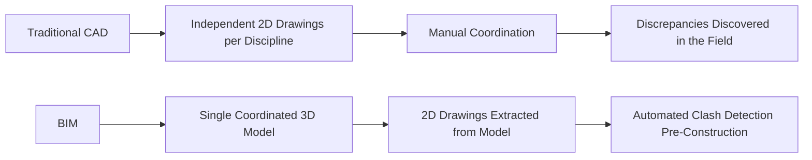
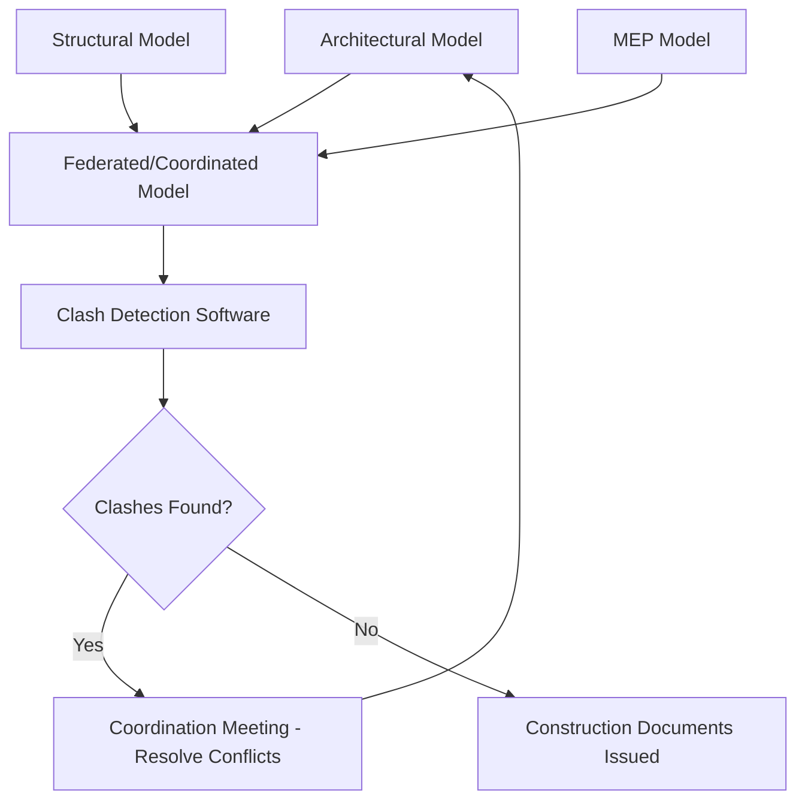

## Introduction to Building Information Modeling

### Overview

Building Information Modeling (BIM) is a process for creating and managing digital representations of the physical and functional characteristics of a facility, centered on a shared, data-rich 3D model rather than a collection of independently drafted 2D drawings. BIM shifts the design and construction workflow from document-centric to model-centric, enabling coordinated multi-discipline collaboration, automated quantity extraction, clash detection, and lifecycle data management from design through facility operation.

### BIM vs. Traditional CAD

**Key Points**

- **CAD (Computer-Aided Design)**: Each drawing is an independent digital representation; changes must be manually propagated across every affected sheet, creating coordination risk between disciplines.
- **BIM**: Geometry and data live in one underlying model; drawings, schedules, and quantities are views/extracts of that single source, so a change to the model propagates automatically to all dependent outputs.
- **Parametric modeling**: BIM elements (walls, beams, columns) are defined by parameters and relationships (not just static geometry), so modifying one parameter (e.g., beam depth) automatically updates connected elements and associated documentation.

### Core BIM Dimensions

| Dimension | Content |
| --- | --- |
| 3D | Geometric model |
| 4D | 3D + schedule/time sequencing (construction phasing simulation) |
| 5D | 4D + cost estimation linked to model quantities |
| 6D | 5D + sustainability/energy performance analysis |
| 7D | 6D + facility management and asset lifecycle data |

[Inference] The 5D–7D dimension labels are used inconsistently across the industry and some sources define them differently; treat these as commonly cited conventions rather than a universally standardized taxonomy.

### Level of Development (LOD)

**Key Points**

- **LOD 100**: Conceptual — symbolic representation, no defined geometry.
- **LOD 200**: Approximate geometry — generalized size/shape/location/orientation.
- **LOD 300**: Precise geometry — accurate size/shape/location suitable for coordination and general construction documents.
- **LOD 350**: Adds interface/connection detail with adjacent building systems, supporting coordination.
- **LOD 400**: Fabrication-level detail — sufficient for construction/fabrication without additional information.
- **LOD 500**: As-built/field-verified — actual, verified representation of the installed element.

[Unverified] LOD definitions and their numeric thresholds are defined by specific published standards (e.g., BIMForum LOD Specification, AIA G202/E203) and can differ in detail between standard versions; the applicable definition for a given project should be confirmed against its BIM Execution Plan.

### Multi-Discipline Model Coordination

**Key Points**

- **Federated model**: Individual discipline models (architectural, structural, MEP) linked together (not merged into one file) for coordination review, preserving each discipline's authorship and workflow.
- **Clash detection**: Automated software comparison (e.g., identifying a structural beam intersecting a ductwork run) flags spatial conflicts before construction, reducing costly field rework.
- **Coordination meetings**: Regular multi-discipline sessions during design development reviewing and resolving flagged clashes collaboratively.

### Common BIM Software Ecosystem

**Key Points**

- **Authoring tools**: Discipline-specific modeling software (e.g., architectural, structural, and MEP-focused platforms) used to create native discipline models.
- **Coordination/review platforms**: Software used to aggregate federated models, run clash detection, and manage the review/markup workflow across disciplines.
- **Structural analysis integration**: Structural BIM models can often exchange data with structural analysis software, avoiding duplicate geometry entry, though [Unverified] the completeness and reliability of this interoperability varies by specific software pairing and should be verified for the specific tools involved on a given project.

### Interoperability and Open Standards

**Key Points**

- **IFC (Industry Foundation Classes)**: An open, vendor-neutral data schema (ISO 16739) developed by buildingSMART International, enabling BIM data exchange between different software platforms without proprietary format lock-in.
- **COBie (Construction Operations Building Information Exchange)**: A structured data format for delivering facility asset and equipment data from design/construction to the owner's facility management systems at project closeout.
- **openBIM**: A collaborative workflow approach based on open standards (IFC, BCF) rather than a single vendor's proprietary ecosystem, intended to support long-term data accessibility and multi-vendor collaboration.
- **BCF (BIM Collaboration Format)**: An open format for exchanging coordination issues (clashes, comments) between different BIM software platforms.

### BIM Execution Planning

**Key Points**

- **BIM Execution Plan (BEP)**: A project-specific document defining BIM goals, model ownership/authorship responsibilities, LOD requirements by project phase, file-naming/coordinate conventions, and software/interoperability protocols — typically developed collaboratively early in a project.
- **Model authorship matrix**: Defines which discipline is responsible for authoring which model elements, preventing duplicate or conflicting modeling of the same building component.
- **Common Data Environment (CDE)**: A centralized, managed information repository (cloud-based platform) where project model and document data is stored, version-controlled, and shared among project stakeholders.

### 4D Scheduling Simulation

**Key Points**

- **4D BIM**: Links the 3D model to the project schedule (e.g., from CPM scheduling software), enabling visual simulation of construction sequencing over time.
- **Applications**: Site logistics planning, constructability review, identifying schedule/space conflicts (e.g., crane swing zones conflicting with material laydown areas during a specific phase), and communicating sequencing to stakeholders unfamiliar with reading traditional schedules.

### 5D Cost Estimation

**Key Points**

- **Model-based quantity takeoff**: BIM models can automatically extract quantities (concrete volume, rebar tonnage, wall area) directly from modeled geometry, reducing manual takeoff time and potential for error compared to manual measurement from 2D drawings.
- **Linking cost data**: Quantities extracted from the model are linked to unit cost databases to generate real-time cost estimates that update as the design evolves — supporting more responsive cost-informed design decisions.
- [Inference] The accuracy of model-based quantity takeoff is directly dependent on model LOD and modeling discipline consistency; an under-detailed or inconsistently modeled element can produce inaccurate extracted quantities, so this benefit is conditional on modeling quality rather than automatic.

### BIM for Facility Management (7D)

**Key Points**

- **Asset data handover**: At project closeout, equipment data (model numbers, warranty information, maintenance schedules) embedded in the BIM model can be transferred to the owner's Computerized Maintenance Management System (CMMS), often via COBie.
- **Digital twin**: An extension of BIM-for-FM concepts where the model is continuously updated with real-time sensor/operational data, supporting ongoing facility performance monitoring — [Inference] "digital twin" terminology and its precise distinction from a static as-built BIM model varies across industry usage and is not fully standardized.

### Legal and Contractual Considerations

**Key Points**

- **Model ownership and liability**: BIM Execution Plans typically clarify which party owns model data and the extent to which model geometry is contractually reliable versus advisory — an important distinction given BIM models can contain far more embedded detail than traditional drawings ever conveyed.
- **Document precedence**: Contracts generally need to explicitly state whether the 3D model or extracted 2D drawings govern in case of conflict; this is not automatically resolved simply by adopting BIM workflows and should be addressed in contract documents (see also Engineering Drawings and Documentation).
- **AIA E203/G202 (US)**: Commonly referenced contract exhibit documents establishing BIM protocol and LOD requirements in US private construction contracts, though [Unverified] specific adoption and edition currency should be confirmed for a given project's actual contract documents.

### Common Pitfalls

- Assuming BIM model geometry is automatically contractually binding without an explicit document-precedence clause addressing model-vs-drawing conflicts.
- Modeling at an LOD inconsistent with project phase needs — over-detailing early (wasted effort) or under-detailing late (insufficient information for fabrication/coordination).
- Treating model-based quantity takeoffs as inherently accurate regardless of modeling discipline, when takeoff accuracy is directly dependent on consistent, complete modeling practice.
- Neglecting to establish a BIM Execution Plan early, leading to inconsistent modeling conventions and authorship conflicts between disciplines mid-project.
- Conflating "digital twin" aspirations with standard static BIM deliverables without clarifying actual project scope and real-time data integration requirements.

**Next Steps**

- BIM Coordination and Clash Detection Workflows
- 4D Construction Sequencing and Scheduling Integration
- Engineering Drawings and Documentation
- Construction Cost Estimating Methods
- Facility Management and Asset Lifecycle Data
- Digital Twins and Structural Health Monitoring