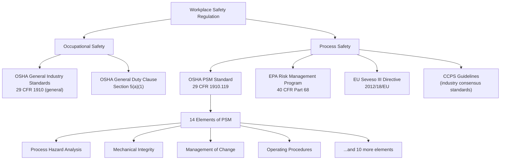

## Process Safety Versus Occupational Safety

### Definitions and Scope

**Process Safety** is the discipline focused on preventing the unplanned release of hazardous materials or energy from a process, particularly releases that can lead to catastrophic events such as fires, explosions, and toxic exposures affecting multiple people, assets, and the surrounding community. Process safety addresses the design, operation, and maintenance of the systems that contain hazardous chemicals and energy — piping, vessels, relief systems, control systems, and the procedures that govern them.

**Occupational Safety** (also called personal safety or worker safety) is the discipline focused on preventing injuries and illnesses to individual workers arising from workplace hazards such as slips, trips, falls, struck-by incidents, electrical shock, and ergonomic strain. Occupational safety metrics track incidents that typically affect one person at a time.

The core distinction:

| Dimension | Process Safety | Occupational Safety |
| --- | --- | --- |
| Primary concern | Loss of containment of hazardous material/energy | Individual worker injury |
| Typical consequence | Catastrophic (multiple fatalities, major property/environmental damage) | Localized (single-person injury) |
| Frequency | Low-frequency, high-consequence | Higher-frequency, lower-consequence |
| Example incidents | Explosion, toxic release, fire from process equipment | Fall from height, hand laceration, chemical splash to skin |
| Key metrics | Process Safety Incident (Tier 1/Tier 2) rates, Loss of Primary Containment (LOPC) events | TRIR (Total Recordable Incident Rate), LTIR (Lost Time Incident Rate) |
| Governing frameworks | OSHA PSM (29 CFR 1910.119), EPA RMP, CCPS guidelines, Seveso Directive | OSHA general industry standards, general duty clause |

### Key Points

- A facility can have an excellent occupational safety record (low TRIR) while simultaneously having significant unaddressed process safety risk. This is one of the most cited failure patterns in major industrial catastrophes.
- Occupational safety incidents are typically visible, immediate, and easy to count. Process safety risk can remain latent for years — a corroding pipe or a bypassed safety interlock may not cause harm until a specific, rare combination of conditions occurs.
- Process safety requires engineering and systems-level thinking (barriers, layers of protection, inherently safer design), whereas occupational safety often relies more heavily on behavior-based programs, PPE, and procedural compliance.
- Both disciplines are necessary and complementary; neither substitutes for the other. CCPS (Center for Chemical Process Safety) explicitly warns against using personal injury rates as a proxy for process safety performance.

### Historical Context: Why the Distinction Emerged

Prior to the 1980s, safety programs in the chemical and process industries were largely modeled on general occupational safety principles — reducing slips, falls, and similar injuries. Two catastrophic incidents reshaped this thinking:

- **Bhopal, India (1984):** A methyl isocyanate (MIC) release from a Union Carbide pesticide plant killed thousands of people in the surrounding community. The facility's occupational safety statistics gave no indication of the catastrophic potential embedded in the process design and management systems.
- **Piper Alpha, North Sea (1988):** An offshore platform explosion and fire killed 167 workers. Investigations (notably the Cullen Report) found that permit-to-work failures and inadequate process hazard management, not routine occupational hazards, were the root causes.

These events, among others, demonstrated that low personal injury rates did not correlate with low catastrophic risk. This recognition led to the formalization of process safety as a distinct discipline:

- CCPS was founded in 1985 by the American Institute of Chemical Engineers (AIChE) specifically in response to Bhopal.
- OSHA promulgated the Process Safety Management (PSM) standard, 29 CFR 1910.119, in 1992.
- The EPA followed with the Risk Management Program (RMP) rule, 40 CFR Part 68, in 1996.
- Internationally, the Seveso Directive (EU) and similar major-hazard regulations emerged from comparable industrial disasters (Seveso, Italy, 1976).

### The "Iceberg" Model

A common way to illustrate the relationship between the two domains is the safety iceberg, where visible occupational injuries sit above the waterline and the much larger, less visible process safety risk sits below.

<svg xmlns="http://www.w3.org/2000/svg" viewBox="0 0 700 460" font-family="Arial, sans-serif">
<title>Occupational Safety vs Process Safety Iceberg (svg_diagram)</title>
<rect x="0" y="0" width="700" height="460" fill="#eaf6ff" />
<rect x="0" y="150" width="700" height="310" fill="#0b3d63" opacity="0.85" />
<line x1="0" y1="150" x2="700" y2="150" stroke="#003a5c" stroke-width="3" stroke-dasharray="6,4" />
<text x="350" y="140" text-anchor="middle" font-size="14" fill="#003a5c" font-weight="bold">Waterline (Visibility Threshold)</text>

<polygon points="300,40 400,40 370,150 330,150" fill="#dbeeff" stroke="#0b3d63" stroke-width="2" />
<text x="350" y="30" text-anchor="middle" font-size="15" font-weight="bold" fill="#0b3d63">Occupational Safety (svg_diagram)</text>
<text x="350" y="105" text-anchor="middle" font-size="11" fill="#0b3d63">Recordable injuries,</text>
<text x="350" y="120" text-anchor="middle" font-size="11" fill="#0b3d63">near misses, first aid</text>

<polygon points="330,150 370,150 560,440 140,440" fill="#cde6f5" stroke="#0b3d63" stroke-width="2" opacity="0.9" />
<text x="350" y="200" text-anchor="middle" font-size="15" font-weight="bold" fill="#062338">Process Safety (svg_diagram)</text>
<text x="350" y="240" text-anchor="middle" font-size="11" fill="#062338">Loss of containment events</text>
<text x="350" y="260" text-anchor="middle" font-size="11" fill="#062338">Equipment integrity degradation</text>
<text x="350" y="280" text-anchor="middle" font-size="11" fill="#062338">Bypassed safeguards</text>
<text x="350" y="300" text-anchor="middle" font-size="11" fill="#062338">Deviations from safe operating limits</text>
<text x="350" y="320" text-anchor="middle" font-size="11" fill="#062338">Latent design/management system gaps</text>
<text x="350" y="340" text-anchor="middle" font-size="11" fill="#062338">Catastrophic potential (rare, high consequence)</text>

<text x="350" y="420" text-anchor="middle" font-size="12" fill="`#dbeeff`" font-style="italic">Much larger, less visible, lower-frequency/higher-consequence</text>

</svg>

### Example

**Scenario:** A refinery unit has gone five years without a lost-time injury (excellent occupational safety performance). However, during this period:

- A pressure relief valve was never re-tested per schedule (a process safety maintenance gap).
- Operators routinely bypass a high-level alarm interlock on a distillation column because it triggers "nuisance" trips (a process safety management-of-change and alarm management failure).
- Corrosion under insulation on a hydrocarbon line was never inspected (a mechanical integrity gap).

None of these conditions produced a personal injury, so they would not appear in TRIR or LTIR statistics. Yet each represents an active process safety risk that could culminate in a major loss-of-containment event — this is precisely the pattern identified in incidents like the 2005 Texas City refinery explosion (BP), where the facility had strong occupational safety metrics (it had even received an OSHA safety award shortly before the explosion) but significant unaddressed process safety deficiencies. [Unverified: specific award details vary by source; the general pattern of strong personal safety metrics coexisting with process safety failure at Texas City is well documented in the CSB investigation report.]

### Overlap and Interaction

The two disciplines are not entirely separate; they intersect in several ways:

- **Shared root causes:** Poor management systems (inadequate training, weak change management, poor supervision) can degrade both occupational and process safety performance.
- **Shared consequence pathways:** A process safety event (e.g., a toxic release) can directly cause occupational injuries or fatalities among workers present at the time.
- **Regulatory overlap:** OSHA's PSM standard (1910.119) itself sits within the broader OSH Act framework, meaning process safety compliance is legally an extension of the employer's general duty to provide a safe workplace.
- **Cultural interdependence:** A workforce with poor near-miss reporting culture (an occupational safety culture issue) will typically also underreport process safety near-misses (e.g., minor leaks, alarm floods), weakening both programs.

### Metrics Comparison

**Occupational Safety Metrics:**

- TRIR (Total Recordable Incident Rate)
- LTIR / LTIFR (Lost Time Injury Frequency Rate)
- DART rate (Days Away, Restricted, or Transferred)
- Near-miss reporting rate (personal hazards)

**Process Safety Metrics (per CCPS and API RP 754 tiered framework):**

- **Tier 1 PSE (Process Safety Event):** Loss of primary containment (LOPC) with significant consequence — meets thresholds for injury, fire, explosion, or quantity released.
- **Tier 2 PSE:** LOPC of lesser consequence than Tier 1 but still indicative of a challenge to process safety systems.
- **Tier 3:** Challenges to the safety system — demands on safety systems, such as relief valve lifts or safety-critical alarm activations, that did not result in a Tier 1 or 2 event.
- **Tier 4:** Operating discipline and management system performance indicators (leading indicators) — e.g., percentage of safety-critical inspections completed on time, percentage of PSM training completed.

$$\text{Tier 1 PSE Rate} = \dfrac{\text{Number of Tier 1 PSEs} \times 200{,}000}{\text{Total hours worked}}$$

This formula mirrors the OSHA recordable-rate convention (per 200,000 hours, representing 100 employees working 2,000 hours/year) but is applied specifically to loss-of-containment events rather than personal injuries.

### Regulatory Framework Comparison

### Why This Distinction Matters for PSM Practitioners

1. **Leading vs. lagging indicators:** Organizations that manage only occupational safety lagging indicators (injury counts) can be blind to accumulating process risk. PSM programs require dedicated leading indicators (Tier 3/Tier 4) to surface risk before it manifests as a major event.
2. **Resource allocation:** Safety budgets and staffing decisions based solely on injury statistics can systematically underfund mechanical integrity, process hazard analysis, and safeguard maintenance — the activities that actually prevent catastrophic events.
3. **Audit and management review scope:** Process safety audits (per PSM element 1910.119(o)) must evaluate engineering and management systems, not just behavioral or PPE compliance, which is a materially different audit skill set than a typical occupational safety walkthrough.
4. **Board- and executive-level reporting:** CCPS and API RP 754 explicitly recommend that companies report process safety metrics separately from and alongside occupational safety metrics to senior leadership, precisely because conflating the two obscures catastrophic risk exposure.

### Common Misconceptions

- **"A good safety record means we're safe."** A low TRIR reflects personal injury control, not the integrity of hazardous process barriers.
- **"Process safety is just occupational safety for chemical plants."** Process safety requires distinct technical competencies — process hazard analysis (PHA/HAZOP), layers of protection analysis (LOPA), relief system design, and mechanical integrity — that fall outside typical occupational safety training.
- **"If no one got hurt, the near miss doesn't matter."** In process safety, a near miss (e.g., a relief valve lift, an unplanned high-pressure excursion) is a critical leading indicator regardless of whether it caused injury.

### Next Steps

- Overview and History of Process Safety Management (PSM)
- The 14 Elements of OSHA's PSM Standard (29 CFR 1910.119)
- Major Industrial Disasters and Their Influence on PSM (Bhopal, Piper Alpha, Texas City, Flixborough)
- CCPS Risk-Based Process Safety (RBPS) Framework
- Process Safety Metrics and Leading/Lagging Indicators (API RP 754)
- Process Hazard Analysis (PHA) Methodologies (HAZOP, What-If, FMEA)
- Layers of Protection Analysis (LOPA)
- Mechanical Integrity Programs
- Management of Change (MOC) Procedures
- Safety Culture and Its Role in Process Safety Performance