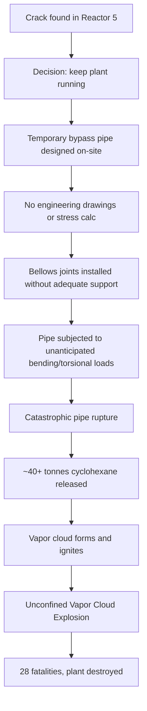
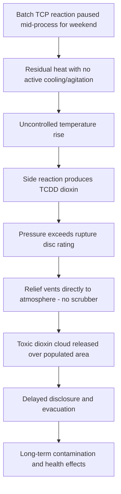
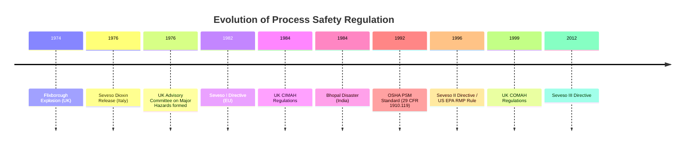

## Flixborough, Seveso, and the Origins of Modern Process Safety Regulation

### Overview

Modern process safety management (PSM) regulation did not emerge from theoretical risk analysis alone — it was forged in direct response to catastrophic industrial accidents in the 1970s. Two events in particular, the Flixborough explosion (UK, 1974) and the Seveso dioxin release (Italy, 1976), fundamentally reshaped how governments and industry conceptualize, regulate, and manage major accident hazards (MAH) involving hazardous chemicals. Together, they catalyzed the shift from reactive, prescriptive safety codes toward systematic, risk-based process safety frameworks that underpin today's regulations, including OSHA PSM (29 CFR 1910.119), EPA RMP, the EU Seveso Directives, and the UK COMAH Regulations.

---

### The Flixborough Disaster (1974)

#### Background and Facility Context

Flixborough was a chemical plant in Lincolnshire, England, operated by Nypro (UK) Ltd, producing caprolactam (a precursor to nylon 6) via oxidation of cyclohexane.

#### Sequence of Events

- A crack was discovered in Reactor 5 of a six-reactor train used for sequential cyclohexane oxidation.
- Rather than shutting down for a proper repair, plant engineers installed a temporary bypass pipe to route process flow around Reactor 5, allowing the plant to keep operating.
- The bypass was designed and installed without formal engineering drawings, stress calculations, or adequate hazard review — reportedly sketched out based on the diameter of an available pipe section.
- The bypass assembly used flexible bellows joints at each end, which were not adequately supported against the bending and torsional forces generated by the offset pipe run and internal pressure.
- On June 1, 1974, the temporary pipework failed catastrophically, releasing an estimated 40+ tonnes of cyclohexane at high temperature and pressure.
- The resulting vapor cloud ignited, causing a massive unconfined vapor cloud explosion (UVCE).

#### Consequences

- 28 workers were killed (the low fatality count was partly attributable to the accident occurring on a weekend with reduced staffing).
- 36 others were injured on-site, along with off-site injuries and extensive property damage in surrounding communities.
- The plant was effectively destroyed.

#### Root Causes (Technical and Organizational)

| Category | Finding |
| --- | --- |
| Engineering | Temporary modification lacked proper design review, stress analysis, and code compliance |
| Management of Change (MOC) | No formal change control process existed for modifications to process equipment |
| Competency | No qualified mechanical engineer signed off on the bypass design |
| Documentation | No engineering drawings were produced before fabrication and installation |
| Inspection | Original crack itself indicated inadequate inspection/maintenance regime |
| Layout | Dense equipment spacing and inadequate separation contributed to escalation potential |

#### Diagram: Flixborough Failure Logic

---

### The Seveso Disaster (1976)

#### Background and Facility Context

The ICMESA chemical plant near Seveso, Italy (part of the Givaudan/Hoffmann-La Roche group), manufactured trichlorophenol (TCP), an intermediate used in herbicide and disinfectant production.

#### Sequence of Events

- On July 10, 1976, a runaway exothermic reaction occurred in a batch reactor producing 2,4,5-trichlorophenol.
- The reaction had been shut down for the weekend while partially complete, leaving the mixture at elevated temperature without active cooling or agitation control.
- Residual heat drove the reaction temperature beyond the threshold at which an uncontrolled side reaction became dominant, producing 2,3,7,8-tetrachlorodibenzo-p-dioxin (TCDD) — one of the most toxic dioxin compounds known.
- Pressure buildup caused a rupture disc to fail, venting the reactor contents (including TCDD) through a relief system that discharged directly to the atmosphere rather than to a containment or scrubbing system.
- A toxic cloud containing TCDD drifted over the surrounding densely populated area.

#### Consequences

- No immediate fatalities were recorded from the acute toxic release.
- Widespread contamination occurred over several square kilometers, with the most heavily contaminated zones (Zone A) requiring long-term evacuation.
- Approximately 447 people suffered chloracne, a hallmark symptom of dioxin exposure; long-term epidemiological studies tracked elevated risks of certain cancers and reproductive effects in exposed populations.
- Extensive livestock deaths and culling occurred due to contamination of soil and vegetation.
- Significant, long-lasting environmental contamination required soil remediation and demolition of structures in the worst-affected zones.

#### Root Causes (Technical and Organizational)

| Category | Finding |
| --- | --- |
| Process Chemistry | Runaway reaction potential and side-reaction pathway to TCDD were not adequately characterized or controlled |
| Relief System Design | Emergency relief vented directly to atmosphere with no scrubbing/containment |
| Operating Procedures | Reaction left in an intermediate, thermally unstable state during a shutdown period |
| Risk Communication | Company was slow to disclose the nature and toxicity of the released substance to local authorities |
| Emergency Planning | No external emergency plan existed for surrounding communities; evacuation was delayed |

#### Diagram: Seveso Failure Logic

---

### Comparative Analysis

| Aspect | Flixborough (1974) | Seveso (1976) |
| --- | --- | --- |
| Primary hazard | Flammable/explosive (cyclohexane) | Toxic release (dioxin) |
| Immediate fatalities | 28 | 0 (acute) |
| Failure type | Mechanical (uncontrolled modification) | Process chemistry (runaway reaction) |
| Key systemic gap | No Management of Change | No relief/containment design for toxic byproducts |
| Off-site impact | Property damage, some off-site injury | Long-term land contamination, chronic health effects |
| Regulatory legacy | UK HSW Act enforcement evolution; Advisory Committee on Major Hazards | EU Seveso Directive (1982) |

**Key Points**

- Flixborough exposed the danger of uncontrolled engineering modifications made without formal review — the conceptual root of Management of Change (MOC).
- Seveso exposed the danger of unrecognized reaction chemistry and inadequate relief system design — the conceptual root of Process Hazard Analysis (PHA) and Process Safety Information (PSI) requirements.
- Both events demonstrated that off-site consequences (not just worker safety) must be part of hazard evaluation — leading to land-use planning and external emergency planning requirements.
- Neither accident resulted from a single failure; both involved layered organizational, technical, and procedural deficiencies — an early real-world illustration of what later became formalized as the "Swiss Cheese Model" of accident causation.

---

### Regulatory and Institutional Response

#### United Kingdom

- Flixborough directly prompted formation of the **Advisory Committee on Major Hazards (ACMH)** in 1976, tasked with developing a systematic framework for identifying and controlling major hazard installations.
- ACMH reports (1976, 1979, 1984) established core concepts later embedded in UK and EU law: hazard identification, notification of hazardous installations to authorities, and safety case-type documentation.
- These efforts fed into the **Control of Industrial Major Accident Hazards (CIMAH) Regulations 1984**, the UK's first implementation of what became the Seveso Directive, later superseded by **COMAH (Control of Major Accident Hazards) Regulations 1999**, amended and updated since (COMAH 2015, aligned with Seveso III).

#### European Union — The Seveso Directives

- **Seveso I Directive (82/501/EEC, 1982):** The EU's first major-accident-hazard directive, directly named after the disaster. Required member states to identify hazardous installations, mandate safety reports, establish emergency plans, and inform the public.
- **Seveso II Directive (96/82/EC, 1996):** Expanded scope to include environmental hazards (not just fire/explosion/toxicity to humans), introduced Safety Management Systems (SMS) requirements, and tiered obligations based on quantities of hazardous substances (lower-tier and upper-tier establishments).
- **Seveso III Directive (2012/18/EU, effective 2015):** Aligned hazard classification with the EU's CLP Regulation (itself harmonized with the UN GHS), strengthened public information and access-to-justice provisions, and tightened inspection regimes.

#### United States

- While Flixborough and Seveso were European events, they strongly influenced U.S. regulatory thinking, compounding pressure that later intensified after the **Bhopal disaster (1984)**.
- This lineage culminated in **OSHA's Process Safety Management standard (29 CFR 1910.119)**, issued in 1992, and **EPA's Risk Management Program (RMP, 40 CFR Part 68)**, issued in 1996.
- Core PSM elements — Process Safety Information, Process Hazard Analysis, Management of Change, Mechanical Integrity, Pre-Startup Safety Review, Emergency Planning and Response — map conceptually back to specific gaps identified at Flixborough and Seveso.

#### Diagram: Regulatory Lineage

*[Note: Mermaid `timeline` syntax rendering support varies by platform; treat as raw text per formatting requirements above.]*

---

### Mapping Historical Failures to Modern PSM Elements

| Modern PSM Element (OSHA 1910.119 / RMP / COMAH) | Historical Gap It Addresses |
| --- | --- |
| Management of Change (MOC) | Flixborough's unreviewed temporary bypass pipe |
| Process Hazard Analysis (PHA) | Seveso's uncharacterized runaway reaction pathway |
| Process Safety Information (PSI) | Absence of engineering data/drawings at Flixborough |
| Mechanical Integrity (MI) | Original undetected crack in Flixborough's Reactor 5 |
| Emergency Planning and Response | Delayed/absent external emergency response at Seveso |
| Pre-Startup Safety Review (PSSR) | Flixborough bypass commissioned without review |
| Employee Participation / Training | Lack of qualified engineering sign-off at Flixborough |
| Hot Work / Relief System Design provisions | Seveso's uncontained atmospheric venting of reactor contents |

**Example**

A modern engineer facing a scenario analogous to Flixborough — a leaking reactor requiring a temporary bypass — would today be required under 29 CFR 1910.119(l) (Management of Change) to:

1. Document the technical basis for the proposed change.
2. Assess impact on safety and health.
3. Verify the change complies with applicable codes (e.g., ASME B31.3 for process piping).
4. Obtain authorization from qualified personnel before the change is implemented.
5. Update process safety information and train affected employees before startup.

This MOC sequence exists specifically because no such structured control existed at Flixborough in 1974.

---

### Illustration: Conceptual Model — From Incident to Regulation (SVG)

<svg xmlns="http://www.w3.org/2000/svg" viewBox="0 0 800 340">
<text x="400" y="25" text-anchor="middle" font-size="16" font-weight="bold" fill="#1a1a1a">Incident-to-Regulation Pathway (svg_diagram)</text>
<rect x="20" y="60" width="160" height="70" rx="8" fill="#fde2e1" stroke="#c0392b" stroke-width="1.5" />
<text x="100" y="88" text-anchor="middle" font-size="12" font-weight="bold" fill="#c0392b">Flixborough</text>
<text x="100" y="105" text-anchor="middle" font-size="11" fill="#333">Unreviewed pipe mod</text>
<text x="100" y="120" text-anchor="middle" font-size="11" fill="#333">28 fatalities</text>
<rect x="20" y="180" width="160" height="70" rx="8" fill="#fdecc8" stroke="#b9770e" stroke-width="1.5" />
<text x="100" y="208" text-anchor="middle" font-size="12" font-weight="bold" fill="#b9770e">Seveso</text>
<text x="100" y="225" text-anchor="middle" font-size="11" fill="#333">Runaway reaction</text>
<text x="100" y="240" text-anchor="middle" font-size="11" fill="#333">Dioxin release</text>
<rect x="290" y="120" width="180" height="90" rx="8" fill="#eaf2f8" stroke="#2874a6" stroke-width="1.5" />
<text x="380" y="150" text-anchor="middle" font-size="12" font-weight="bold" fill="#2874a6">Investigation &amp;</text>
<text x="380" y="167" text-anchor="middle" font-size="12" font-weight="bold" fill="#2874a6">Root Cause Findings</text>
<text x="380" y="188" text-anchor="middle" font-size="11" fill="#333">MOC gap / PHA gap</text>
<rect x="580" y="60" width="190" height="70" rx="8" fill="#eafaf1" stroke="#1e8449" stroke-width="1.5" />
<text x="675" y="88" text-anchor="middle" font-size="12" font-weight="bold" fill="#1e8449">EU Seveso Directives</text>
<text x="675" y="105" text-anchor="middle" font-size="11" fill="#333">I (1982) → III (2012)</text>
<rect x="580" y="180" width="190" height="90" rx="8" fill="#eafaf1" stroke="#1e8449" stroke-width="1.5" />
<text x="675" y="205" text-anchor="middle" font-size="12" font-weight="bold" fill="#1e8449">US OSHA PSM /</text>
<text x="675" y="222" text-anchor="middle" font-size="12" font-weight="bold" fill="#1e8449">EPA RMP</text>
<text x="675" y="240" text-anchor="middle" font-size="11" fill="#333">1992 / 1996</text>
<text x="675" y="256" text-anchor="middle" font-size="11" fill="#333">(also shaped by Bhopal)</text>
<line x1="180" y1="95" x2="290" y2="150" stroke="#555" stroke-width="1.5" marker-end="url(#arrow)" />
<line x1="180" y1="215" x2="290" y2="175" stroke="#555" stroke-width="1.5" marker-end="url(#arrow)" />
<line x1="470" y1="150" x2="580" y2="100" stroke="#555" stroke-width="1.5" marker-end="url(#arrow)" />
<line x1="470" y1="180" x2="580" y2="225" stroke="#555" stroke-width="1.5" marker-end="url(#arrow)" />
</svg>

---

### Enduring Lessons and Modern Relevance

- **Temporary and emergency modifications remain high-risk.** Modern MOC systems specifically exist to prevent "Flixborough-style" shortcuts, but audits repeatedly find undocumented temporary changes in operating facilities. [Inference: the persistence of this failure mode across decades is well documented in incident databases such as CSB reports, though the exact frequency varies by industry and is not something that can be quantified as a universal constant.]
- **Reaction chemistry hazards must be proactively characterized**, not discovered during an upset. This underlies modern requirements for Reactive Chemicals Hazard Analysis and calorimetric testing (e.g., DSC, ARC) for batch/semi-batch processes.
- **Off-site consequence analysis is now a formal regulatory requirement** (e.g., EPA RMP's Offsite Consequence Analysis, COMAH's land-use planning zones) — a direct descendant of Seveso's demonstration that a chemical release's harm is not confined to the plant fence line.
- **Public right-to-know provisions** (community emergency planning, public disclosure of hazardous substance inventories) trace directly to the delayed and inadequate public communication seen at Seveso.

---

**Related Topics**

- Management of Change (MOC) systems and best practices
- Process Hazard Analysis (PHA) methodologies (HAZOP, What-If, FMEA)
- The Bhopal Disaster (1984) and its influence on OSHA PSM and EPA RMP
- OSHA 29 CFR 1910.119 — Detailed element-by-element breakdown
- EU Seveso III Directive — Upper-tier vs. lower-tier establishment requirements
- Reactive Chemicals Hazard Analysis and calorimetry (DSC/ARC testing)
- Safety Case regimes (UK offshore, Australia) vs. prescriptive regulation models
- The "Swiss Cheese Model" and other accident causation frameworks
- Piper Alpha (1988) and its influence on Safety Case regulation
- Layer of Protection Analysis (LOPA) as a modern risk-reduction tool