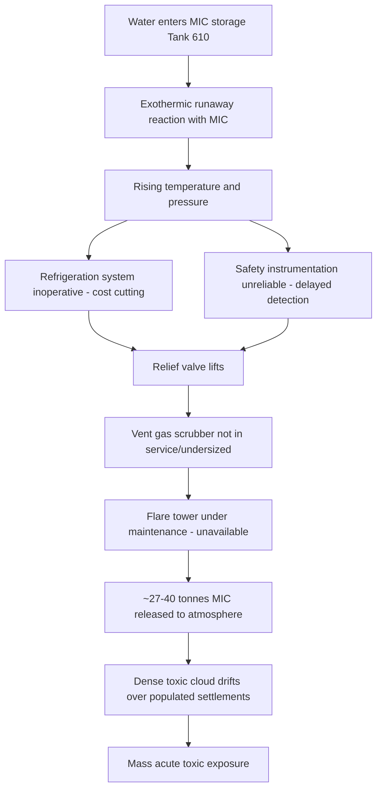
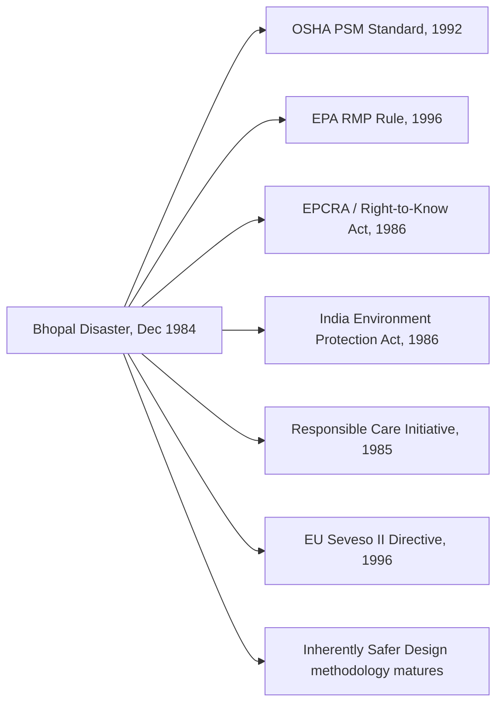

## Bhopal and Its Global Regulatory Legacy

### Overview

The Bhopal disaster of December 1984 remains the single deadliest industrial accident in history and stands as the pivotal event that transformed process safety from an emerging engineering discipline into a codified, enforceable regulatory regime across the globe. Where Flixborough and Seveso exposed specific technical and procedural gaps, Bhopal exposed the catastrophic consequences of compounded failures across design, maintenance, staffing, siting, and emergency preparedness — occurring in a facility handling one of the most acutely toxic industrial chemicals in commercial use. Its legacy directly produced OSHA's Process Safety Management standard, EPA's Risk Management Program, the Responsible Care initiative, and significant strengthening of the EU Seveso framework.

---

### The Facility and Chemical Context

- The Union Carbide India Limited (UCIL) pesticide plant in Bhopal, Madhya Pradesh, India, manufactured carbaryl (marketed as Sevin), a carbamate pesticide.
- The plant used methyl isocyanate (MIC) as a key intermediate — an extremely volatile, reactive, and acutely toxic compound (a potent respiratory and ocular irritant capable of causing pulmonary edema and death at low airborne concentrations).
- MIC was produced in batches and stored in bulk underground tanks (rather than being consumed immediately or produced on demand), a design decision that created a large standing inventory of hazardous material — a significant departure from inherently safer design principles.
- The facility had experienced a decline in maintenance investment, staffing levels, and process safety rigor in the years prior to the disaster, reportedly linked to reduced profitability and cost-cutting pressure. [Inference: the precise causal weighting between economic pressure and specific operational decisions has been debated in subsequent literature and is not reducible to a single documented mechanism.]

---

### Sequence of Events (December 2–3, 1984)

1. Water entered Tank 610, one of the underground MIC storage tanks, through a series of maintenance and procedural lapses (the exact ingress mechanism has been subject to dispute, including a sabotage theory advanced by Union Carbide, though the water-contamination sequence is the most widely accepted account in independent investigations).
2. Water reacted exothermically with the stored MIC, initiating a runaway reaction that rapidly increased temperature and pressure within the tank.
3. Several critical safety systems were non-functional or inadequate at the time of the release:
   - The refrigeration system designed to keep MIC at low temperature (reducing reactivity and vapor pressure) had been shut down for cost savings.
   - The vent gas scrubber, intended to neutralize escaping MIC vapor with caustic soda, was not in service / undersized for this scale of release.
   - The flare tower, intended to burn off vented gas, was under maintenance and not operational.
   - Tank pressure and temperature gauges were reportedly unreliable, delaying operator recognition of the developing runaway.
4. Rising pressure caused the tank's safety relief valve to lift, releasing an estimated 27–40 tonnes of MIC gas and reaction byproducts directly to the atmosphere over roughly two hours.
5. The gas cloud, denser than air, spread low over the densely populated informal settlements surrounding the plant boundary — a siting configuration that placed large residential populations within immediate reach of a major toxic release.

#### Diagram: Bhopal Failure Logic

---

### Consequences

- Official Indian government estimates place immediate deaths at approximately 2,259–3,800, though independent and later estimates range considerably higher, with total deaths (including delayed deaths from exposure-related illness in subsequent years) frequently cited in the range of 15,000–20,000 or more. [Unverified: exact cumulative mortality figures vary significantly across sources and remain a subject of ongoing dispute.]
- An estimated 500,000+ people were exposed to the gas, with hundreds of thousands suffering acute injuries including respiratory damage, blindness, and chemical burns.
- Long-term health effects documented in exposed populations include chronic respiratory disease, ophthalmic damage, neurological effects, and reproductive/developmental effects in subsequent generations, along with continued soil and groundwater contamination at the former plant site.
- The disaster triggered extensive, protracted litigation; Union Carbide Corporation reached a civil settlement with the Indian government in 1989 (approximately $470 million), which claimant groups and advocacy organizations have long argued was inadequate relative to the scale of harm.

---

### Root Cause Analysis (Multi-Layered)

| Category | Finding |
| --- | --- |
| Design | Bulk storage of large MIC inventory rather than minimized/on-demand production (violates inherently safer design principle of intensification/minimization) |
| Safety Systems | Refrigeration, scrubber, and flare systems simultaneously out of service or inadequate |
| Maintenance | Documented decline in maintenance rigor and inspection frequency prior to the incident |
| Staffing/Training | Reports of reduced staffing levels and training on emergency response procedures |
| Instrumentation | Unreliable temperature/pressure indication delayed operator awareness |
| Emergency Response | No effective community alarm or evacuation plan; local hospitals lacked information on MIC's toxicological profile and appropriate treatment protocols |
| Siting/Land-Use Planning | Dense residential settlement permitted to develop immediately adjacent to a major hazard facility |
| Corporate Oversight | Divergence between parent company (Union Carbide Corporation, US) engineering standards and practices at the Indian subsidiary has been a persistent point of investigation and dispute |

**Key Points**

- Bhopal is frequently cited as the canonical case for **inherently safer design (ISD)** — the principle that minimizing hazardous inventory (rather than only adding layers of protection around it) reduces worst-case consequence severity.
- The simultaneous failure/unavailability of three independent safety systems (refrigeration, scrubber, flare) illustrates the danger of **common-cause degradation** of layers of protection when safety systems are not treated as sacrosanct operational priorities.
- The absence of community emergency planning and public right-to-know provisions directly parallels — and dramatically amplifies — the same gap identified at Seveso eight years earlier.
- Bhopal demonstrated that process safety failures are not purely technical; organizational, economic, and regulatory oversight factors were deeply implicated.

---

### Global Regulatory Legacy

#### United States

- **OSHA Process Safety Management (PSM) Standard, 29 CFR 1910.119 (1992):** Directly and explicitly motivated by Bhopal (and reinforced by a subsequent, smaller MIC-related release at a Union Carbide facility in Institute, West Virginia, in 1985). Established 14 core elements: Employee Participation, Process Safety Information, Process Hazard Analysis, Operating Procedures, Training, Contractors, Pre-Startup Safety Review, Mechanical Integrity, Hot Work Permit, Management of Change, Incident Investigation, Emergency Planning and Response, Compliance Audits, and Trade Secrets.
- **EPA Risk Management Program (RMP), 40 CFR Part 68 (1996):** Enacted under the Clean Air Act Amendments of 1990, requiring facilities handling threshold quantities of listed hazardous substances to conduct hazard assessments (including worst-case release scenarios), implement a prevention program, and develop emergency response plans — with explicit off-site consequence analysis requirements tracing to both Bhopal and Seveso.
- **Emergency Planning and Community Right-to-Know Act (EPCRA), 1986:** Enacted as Title III of the Superfund Amendments and Reauthorization Act, directly responding to Bhopal by establishing Local Emergency Planning Committees (LEPCs), mandatory chemical inventory reporting (Tier II reports), and the Toxics Release Inventory (TRI) — codifying the public's "right to know" about hazardous chemicals in their community.

#### India

- Bhopal prompted enactment of the **Environment (Protection) Act, 1986**, India's first comprehensive umbrella environmental legislation, along with the **Public Liability Insurance Act, 1991**, and later the **National Green Tribunal Act, 2010**, establishing specialized environmental adjudication.
- The **Bhopal Gas Leak Disaster (Processing of Claims) Act, 1985** empowered the Indian government to act as the legal representative of victims in claims against Union Carbide.

#### International / Chemical Industry

- The **Responsible Care** initiative was launched by the Canadian Chemical Producers' Association in 1985 and rapidly adopted by chemical industry associations worldwide (including the American Chemistry Council) as a voluntary, industry-driven commitment to continuous improvement in health, safety, and environmental performance — a direct reputational and self-regulatory response to Bhopal.
- Bhopal reinforced and accelerated the development of the **EU Seveso II Directive (1996)**, which broadened scope beyond Seveso I to include environmental damage and introduced formal Safety Management System requirements.
- The disaster catalyzed broader academic and professional development of **inherently safer design (ISD)** methodology, most notably articulated by Trevor Kletz, who argued that eliminating or minimizing hazards at the design stage is preferable to relying solely on added protective layers.

#### Diagram: Regulatory Lineage from Bhopal

---

### Mapping Bhopal's Failures to Modern PSM Elements

| Modern PSM Element | Historical Gap at Bhopal |
| --- | --- |
| Process Hazard Analysis (PHA) | Inadequate hazard assessment of bulk MIC storage and runaway reaction potential |
| Mechanical Integrity (MI) | Refrigeration, scrubber, and flare systems not maintained in operable condition |
| Operating Procedures | Unclear or unenforced procedures for tank water-ingress prevention and detection |
| Training | Reported gaps in operator and emergency responder training on MIC hazards |
| Emergency Planning and Response | No community alarm system, no coordinated evacuation, hospitals uninformed of MIC toxicology |
| Management of Change | Long-term degradation of safety systems without apparent risk reassessment |
| Inherently Safer Design (not an explicit 1910.119 element, but a guiding principle it embeds) | Large bulk MIC inventory rather than minimized on-demand production |
| Compliance Audits | Absence of rigorous, independent safety audits prior to the event |

**Example**

Under modern EPA RMP and OSHA PSM requirements, a facility storing a highly toxic substance like MIC in bulk would today be required to:

1. Conduct a Process Hazard Analysis identifying runaway reaction scenarios (e.g., water contamination) and quantify consequences.
2. Perform Off-Site Consequence Analysis (worst-case and alternative release scenarios) under 40 CFR 68.25.
3. Maintain independent protection layers (refrigeration, scrubbing, flare) as safety-critical equipment under a Mechanical Integrity program, with documented inspection and testing intervals.
4. Develop and coordinate an external emergency response plan with local authorities (LEPCs under EPCRA), including public notification systems.
5. Evaluate inherently safer design alternatives (e.g., reduced inventory, in-situ consumption of MIC) as part of hazard review, a practice increasingly expected in modern PHA methodology even where not strictly mandated by regulatory text.

---

### Comparative Summary: Flixborough, Seveso, Bhopal

| Aspect | Flixborough (1974) | Seveso (1976) | Bhopal (1984) |
| --- | --- | --- | --- |
| Hazard type | Flammable/explosive | Toxic (dioxin) | Toxic (acute, MIC) |
| Immediate fatalities | 28 | 0 | Thousands |
| Core technical gap | Uncontrolled modification | Uncontrolled reaction chemistry | Multiple safety systems simultaneously degraded |
| Primary regulatory descendant | UK CIMAH/COMAH; EU Seveso I | EU Seveso Directive (namesake) | OSHA PSM, EPA RMP, EPCRA |
| Signature PSM concept reinforced | Management of Change | Process Hazard Analysis / relief design | Inherently Safer Design, Emergency Planning, Right-to-Know |

---

### Enduring Lessons and Modern Relevance

- **Bhopal remains the primary historical justification cited in PSM and RMP rulemaking preambles** for requiring rigorous, documented process hazard analysis and off-site consequence assessment.
- **Community right-to-know and emergency planning integration** are now considered non-negotiable elements of major hazard facility regulation worldwide, a direct legacy of the information vacuum that worsened Bhopal's human toll.
- **Inherently safer design** is now a widely taught and increasingly expected — though not universally mandated — principle in PHA methodology, chemical engineering curricula, and facility design review, per the ISD hierarchy (minimize, substitute, moderate, simplify).
- **Corporate accountability across multinational operations** remains a live regulatory and legal question; Bhopal is frequently referenced in discussions of parent-subsidiary liability and the adequacy of safety standard harmonization across a company's global operations. [Inference: the legal and policy debate on this point continues and does not have a single settled resolution across jurisdictions.]

---

**Related Topics**

- Inherently Safer Design (ISD) hierarchy: minimize, substitute, moderate, simplify
- Layers of Protection Analysis (LOPA) and Independent Protection Layers (IPLs)
- EPA Risk Management Program (40 CFR Part 68) — worst-case and alternative release scenarios
- EPCRA, Local Emergency Planning Committees, and the Toxics Release Inventory
- Responsible Care and voluntary industry safety initiatives
- Runaway reaction hazards and reactive chemicals testing (DSC, ARC, adiabatic calorimetry)
- OSHA 29 CFR 1910.119 — full 14-element breakdown
- Piper Alpha (1988) and offshore Safety Case regulation
- Texas City Refinery Explosion (2005) and its influence on process safety culture
- Corporate liability and transnational regulation of multinational hazardous operations