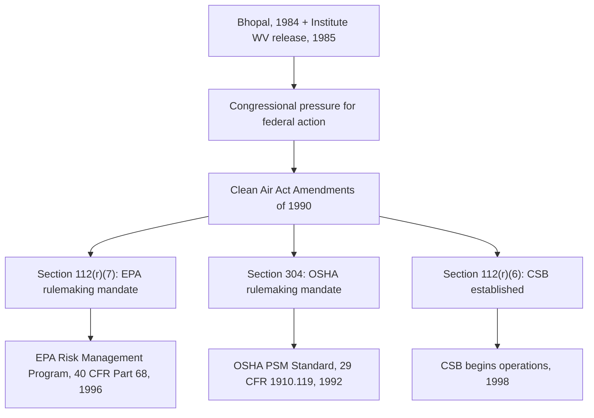
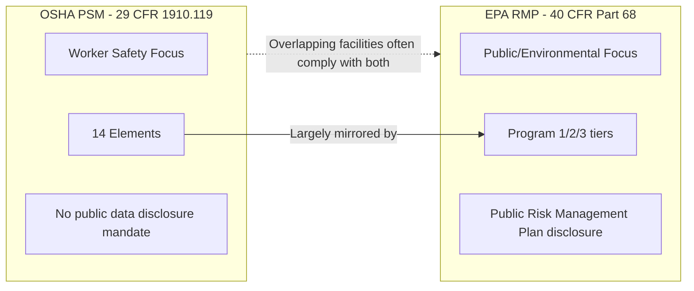

## Clean Air Act Amendments of 1990 and the Birth of OSHA PSM and EPA RMP

### Overview

The Clean Air Act Amendments of 1990 (CAAA) represent the direct legislative bridge between the catastrophic accidents of the 1970s–1980s (Flixborough, Seveso, Bhopal, and the 1985 Institute, West Virginia release) and the two cornerstone regulations that define modern U.S. process safety compliance: OSHA's Process Safety Management standard (29 CFR 1910.119) and EPA's Risk Management Program (40 CFR Part 68). Understanding the CAAA is essential because it did not merely encourage voluntary safety improvement — it created explicit statutory mandates compelling both agencies to issue enforceable rules, with defined statutory deadlines and specific content requirements.

---

### Legislative Background and Drivers

- The original Clean Air Act (1970, amended 1977) focused primarily on ambient air quality and routine emissions, with no substantial framework addressing catastrophic, accidental releases of hazardous substances.
- Bhopal (1984) exposed the absence of any comprehensive U.S. federal framework requiring hazard analysis, safety system integrity, or community emergency planning specifically for accidental chemical releases.
- A subsequent, smaller-scale release of aldicarb oxime (a related toxic compound) from a Union Carbide facility in Institute, West Virginia, in August 1985 — occurring at a U.S. facility operated by the same parent company implicated in Bhopal — intensified Congressional and public pressure, demonstrating the risk was not confined to developing-country operations.
- These events, combined with sustained advocacy following EPCRA's 1986 enactment (Title III of SARA), built the legislative momentum culminating in Section 112(r) of the CAAA.

---

### Section 112(r): The Statutory Foundation

Section 112(r) of the Clean Air Act, added by the 1990 Amendments, is the specific statutory provision from which both OSHA PSM and EPA RMP derive legal authority, though through different mechanisms:

| Provision | Requirement | Resulting Regulation |
| --- | --- | --- |
| Section 112(r)(7) | Directs EPA to promulgate regulations for the prevention and detection of accidental chemical releases, including a list of regulated substances and threshold quantities | EPA Risk Management Program (40 CFR Part 68) |
| Section 304 (amending OSH Act) | Directs OSHA to issue a chemical process safety standard | OSHA PSM Standard (29 CFR 1910.119) |
| Section 112(r)(1) | General Duty Clause — obligates owners/operators of facilities with extremely hazardous substances (whether listed or not) to identify hazards, design/maintain a safe facility, and minimize consequences of releases | Enforced under EPA's general duty authority, independent of specific chemical listing |
| Section 112(r)(6) | Established the U.S. Chemical Safety and Hazard Investigation Board (CSB) as an independent federal agency | CSB (operational from 1998) |

**Key Points**

- The CAAA is unusual in that a single statutory trigger event (Section 112(r)) produced two separate, overlapping-but-distinct regulations from two different agencies with different jurisdictional bases: OSHA under worker safety authority (OSH Act), EPA under environmental/public protection authority (Clean Air Act).
- The General Duty Clause under 112(r)(1) means facilities can face enforcement even for substances not on EPA's specific regulated substances list, if a release causes or has the potential to cause serious harm — a broad catch-all provision.
- Creation of the CSB gave the U.S. an independent, non-regulatory investigative body (modeled conceptually on the National Transportation Safety Board) dedicated to determining root causes of chemical incidents without enforcement power, distinct from OSHA/EPA's regulatory roles.

#### Diagram: Legislative-to-Regulatory Pathway

---

### OSHA Process Safety Management Standard (29 CFR 1910.119)

#### Issuance and Scope

- Promulgated in **February 1992**, PSM applies to processes involving:
  - Threshold quantities of listed "highly hazardous chemicals" (per Appendix A of the standard), or
  - Flammable liquids or gases in quantities of 10,000 lbs or greater (with specific exemptions, e.g., certain atmospheric tank storage and flammable liquids stored below their normal boiling point without the potential for a vapor cloud explosion).
- PSM is a **worker safety standard**, enforced by OSHA under the Occupational Safety and Health Act — its statutory purpose is protecting employees, though its provisions have substantial off-site and public safety spillover effects.

#### The 14 Elements of OSHA PSM

| # | Element | Core Purpose |
| --- | --- | --- |
| 1 | Employee Participation | Involve employees in PHA development and PSM implementation |
| 2 | Process Safety Information (PSI) | Document chemical hazards, technology, and equipment information |
| 3 | Process Hazard Analysis (PHA) | Systematically identify, evaluate, and control process hazards |
| 4 | Operating Procedures | Provide clear, current instructions for safe operation |
| 5 | Training | Ensure employees understand hazards and safe operating procedures |
| 6 | Contractors | Ensure contractor personnel are informed of hazards and follow safety procedures |
| 7 | Pre-Startup Safety Review (PSSR) | Verify new/modified processes are safe to start up |
| 8 | Mechanical Integrity (MI) | Maintain the ongoing integrity of critical process equipment |
| 9 | Hot Work Permit | Control ignition sources during hot work near hazardous processes |
| 10 | Management of Change (MOC) | Formally review and approve changes to process, equipment, or procedures |
| 11 | Incident Investigation | Investigate incidents (including near-misses) to identify root causes |
| 12 | Emergency Planning and Response | Establish procedures for handling emergency releases |
| 13 | Compliance Audits | Periodically verify PSM program implementation (at least every 3 years) |
| 14 | Trade Secrets | Ensure trade secret protections don't impede information sharing needed for PSM compliance |

**Example**

A refinery process handling anhydrous ammonia above the Appendix A threshold quantity would be required to maintain a PHA (typically HAZOP-based) revalidated at least every five years, document PSI including piping and instrumentation diagrams (P&IDs) and safe operating limits, and conduct a compliance audit at least once every three years — each a direct statutory requirement under 1910.119, not merely a best practice.

---

### EPA Risk Management Program (40 CFR Part 68)

#### Issuance and Scope

- Promulgated in **June 1996**, with the List Rule (regulated substances and threshold quantities) issued in 1994.
- RMP applies to stationary sources with more than a threshold quantity of a regulated toxic or flammable substance (separate lists under 40 CFR 68.130), and is an **environmental/public protection standard** enforced by EPA (and delegated state agencies) under Clean Air Act authority — its statutory purpose centers on protecting surrounding communities and the environment, complementing but not replacing OSHA PSM's worker-safety focus.

#### Core RMP Requirements

| Requirement | Description |
| --- | --- |
| Hazard Assessment | Worst-case release scenario and alternative release scenario modeling; 5-year accident history |
| Prevention Program | Tiered by process "Program Level" (1, 2, or 3) based on hazard type, process complexity, and accident history |
| Emergency Response Program | Coordination with local emergency response and community notification |
| Risk Management Plan Submission | Facilities must submit a formal RMP to EPA, portions of which are publicly available |

#### RMP Program Levels

| Program Level | Applicability | Requirements |
| --- | --- | --- |
| Program 1 | Low-risk processes with no offsite impact potential in worst-case scenario and no accident history meeting reporting criteria | Streamlined; hazard assessment and 5-year emergency response coordination only |
| Program 2 | Processes not eligible for Program 1 or 3 (typically retail, non-complex processes) | Streamlined prevention program (safety information, hazard review, operating procedures, training, maintenance, compliance audits, incident investigation) |
| Program 3 | Processes subject to OSHA PSM, or in specific higher-hazard NAICS codes | Full prevention program essentially mirroring OSHA PSM's 14 elements |

**Key Points**

- RMP Program 3 was deliberately designed to align closely with OSHA PSM's prevention program elements, minimizing duplicative compliance burden for facilities subject to both.
- The distinction between PSM (worker protection, no public disclosure of underlying data) and RMP (public/environmental protection, with defined public disclosure obligations for parts of the Risk Management Plan) reflects their differing statutory origins.
- Worst-case release scenario modeling under RMP directly operationalizes the off-site consequence analysis concept whose absence contributed to Bhopal's severity.

#### Diagram: PSM vs. RMP Relationship

---

### Comparative Summary: OSHA PSM vs. EPA RMP

| Aspect | OSHA PSM (1910.119) | EPA RMP (40 CFR Part 68) |
| --- | --- | --- |
| Statutory basis | OSH Act, via CAAA Section 304 | Clean Air Act Section 112(r)(7) |
| Enforcing agency | OSHA | EPA (and delegated states) |
| Protected population | Employees | Surrounding community, environment |
| Issued | 1992 | 1996 (List Rule: 1994) |
| Structure | Single standard, 14 elements | Tiered (Program 1/2/3) |
| Public disclosure | No | Partial (Risk Management Plan) |
| Chemical list basis | Appendix A (OSHA-specific list) + flammables threshold | 40 CFR 68.130 (separate toxic and flammable lists) |

---

### The Chemical Safety and Hazard Investigation Board (CSB)

- Established by Section 112(r)(6) of the CAAA, though not funded and operational until 1998.
- Functions similarly in concept to the National Transportation Safety Board: independent, no regulatory or enforcement authority, sole mission is determining root and contributing causes of chemical incidents and issuing safety recommendations.
- CSB investigations (e.g., Texas City 2005, Deepwater Horizon 2010 process safety aspects, West Fertilizer 2013) have become a major source of case study material and have influenced subsequent regulatory refinement, including OSHA's post-Texas City PSM National Emphasis Program and proposed amendments to RMP following various CSB recommendations.

---

### Enduring Lessons and Modern Relevance

- The CAAA demonstrates how a single piece of enabling legislation can produce parallel, complementary regulatory regimes when Congress delegates specific rulemaking mandates to agencies with distinct statutory missions.
- The PSM/RMP dual-track structure remains the reference model frequently cited internationally when comparing worker-safety-focused regulation (e.g., UK HSE model) against environmental/public-protection-focused regulation (e.g., EU Seveso Directives), since the U.S. is somewhat distinctive in maintaining two largely parallel major-hazard regimes rather than a single integrated one.
- Both standards have been the subject of periodic reform proposals (e.g., EPA's 2017/2019/2024 RMP rule amendments addressing safer technology and alternatives analysis, third-party audits, and public information access) reflecting continued evolution in response to subsequent incidents such as Texas City (2005) and West Fertilizer (2013). [Inference: the regulatory text and requirements referenced here reflect the framework as established and subsequently amended; specific current provisions should be verified against the latest Federal Register publications, as amendment status changes over time.]

---

**Related Topics**

- OSHA 29 CFR 1910.119 — element-by-element deep dive (PSI, PHA, MOC, MI, PSSR)
- EPA RMP Program Levels 1/2/3 — detailed prevention program comparison
- EPCRA and the Toxics Release Inventory (TRI)
- Chemical Safety and Hazard Investigation Board (CSB) — investigation methodology and landmark reports
- General Duty Clause (Section 112(r)(1)) enforcement case studies
- Texas City Refinery Explosion (2005) and its influence on PSM enforcement
- West Fertilizer Explosion (2013) and subsequent RMP rule amendments
- Comparing U.S. PSM/RMP with EU Seveso III and UK COMAH frameworks
- Worst-case and alternative release scenario modeling methodologies
- Safer Technology and Alternatives Analysis (STAA) under proposed RMP amendments