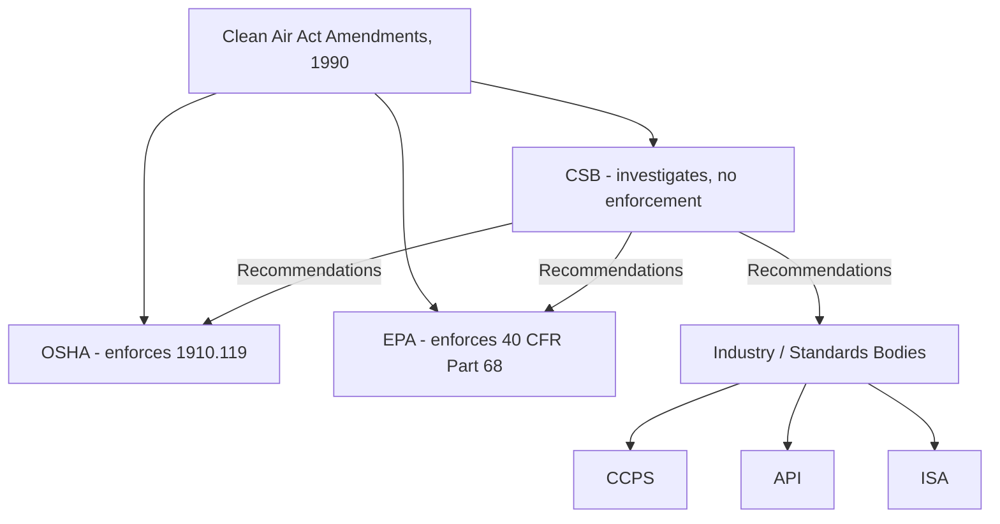

## Key Organizations: OSHA, EPA, CCPS, CSB, API, and ISA

### Overview

Process safety management operates within an ecosystem of federal regulatory agencies, independent investigative bodies, industry associations, and standards-development organizations. Each plays a distinct role — some carry legal enforcement authority, others issue voluntary consensus standards, and others conduct investigations without regulatory power. Understanding the distinct mandate, authority, and output of each organization is essential to correctly interpreting which documents are legally binding requirements versus industry good-practice guidance.

---

### Classification Framework

| Organization | Type | Enforcement Authority | Primary Output |
| --- | --- | --- | --- |
| OSHA | Federal regulatory agency | Yes (civil/criminal penalties) | Regulations (29 CFR), enforcement, National Emphasis Programs |
| EPA | Federal regulatory agency | Yes (civil/criminal penalties) | Regulations (40 CFR), enforcement |
| CSB | Federal investigative agency | No | Incident investigation reports, safety recommendations |
| CCPS | Industry technical institute (AIChE) | No | Technical guidelines, RBPS framework, publications |
| API | Industry trade association / standards body | No (but often incorporated by reference into regulation) | Recommended practices (RP) and standards |
| ISA | Professional standards development organization | No (but often incorporated by reference) | Instrumentation and control standards (e.g., ISA/IEC 61511) |

**Key Points**

- Only OSHA and EPA possess direct statutory enforcement authority; violations of their regulations can result in citations, fines, and in severe cases, criminal referral.
- CCPS, API, and ISA documents are not automatically legally binding — but many become de facto mandatory when explicitly incorporated by reference into OSHA/EPA regulations, court rulings ("recognized and generally accepted good engineering practice," or RAGAGEP), or contractual/insurance requirements.
- The CSB's lack of enforcement power is a deliberate design choice, mirroring the NTSB model, intended to allow independent, blame-neutral root cause investigation without regulatory conflict of interest.

---

### Occupational Safety and Health Administration (OSHA)

- A federal agency within the U.S. Department of Labor, created by the Occupational Safety and Health Act of 1970.
- Directly relevant output: **29 CFR 1910.119 (Process Safety Management of Highly Hazardous Chemicals)**, issued 1992 under CAAA Section 304 mandate.
- Enforcement mechanisms include programmed inspections, complaint-driven inspections, and targeted **National Emphasis Programs (NEPs)** — notably the PSM Covered Chemical Facilities NEP, intensified after the 2005 Texas City refinery explosion.
- Citations under PSM are categorized as de minimis, other-than-serious, serious, willful, or repeat, with willful violations carrying the highest penalties and potential for criminal referral in cases involving fatalities.
- OSHA also enforces the **General Duty Clause (Section 5(a)(1)** of the OSH Act, distinct from EPA's General Duty Clause under CAA 112(r)(1)) as a catch-all for hazards not covered by a specific standard.

---

### Environmental Protection Agency (EPA)

- A federal agency responsible for administering major environmental statutes, including the Clean Air Act.
- Directly relevant output: **40 CFR Part 68 (Risk Management Program)**, issued 1996 under CAAA Section 112(r)(7).
- Enforces the **General Duty Clause under CAA Section 112(r)(1)**, which applies even to facilities with substances not on EPA's specific regulated list, if a release causes or threatens serious harm.
- Periodically amends RMP rule content (e.g., 2017 "Chemical Disaster Rule" amendments following Presidential Executive Order 13650 post-West Fertilizer, subsequent revisions and reinstatements through multiple rulemaking cycles) — provisions addressing safer technology/alternatives analysis, third-party compliance audits, and public information access have been points of ongoing regulatory revision. [Inference: exact current provisions in force should be verified against the current Federal Register text, as this rule has seen multiple amendment and stay cycles.]
- Delegates significant implementation and enforcement authority to state environmental agencies in many jurisdictions.

---

### U.S. Chemical Safety and Hazard Investigation Board (CSB)

- An independent federal agency established by CAAA Section 112(r)(6), operational since 1998.
- Modeled conceptually on the National Transportation Safety Board: investigates chemical incidents to determine root and contributing causes, issues public reports and safety recommendations, but holds **no regulatory or enforcement authority**.
- Notable investigations include the 2005 BP Texas City refinery explosion, the 2010 Deepwater Horizon disaster (process safety management aspects), the 2013 West Fertilizer explosion, and numerous smaller incidents that have shaped subsequent industry and regulatory practice.
- CSB recommendations are directed at OSHA, EPA, state governments, and industry, but implementation is voluntary unless separately adopted into binding regulation or standard.

#### Diagram: Federal Agency Relationships

---

### Center for Chemical Process Safety (CCPS)

- An industry technology alliance operating under the **American Institute of Chemical Engineers (AIChE)**, founded in 1985 — itself a direct institutional response to Bhopal.
- Not a regulatory or enforcement body; produces widely used **technical guidelines and books** that function as authoritative industry good-practice references, frequently cited in PHAs, audits, and even regulatory guidance documents.
- Developed the **Risk Based Process Safety (RBPS)** framework, an influential 20-element management system model that expands on and reorganizes OSHA PSM's 14 elements into four pillars: Commit to Process Safety, Understand Hazards and Risk, Manage Risk, and Learn from Experience.
- Publishes extensively on topics including inherently safer design, layer of protection analysis (LOPA), human factors, process safety metrics, and process safety culture.

**Example**

A facility building a PSM program beyond bare regulatory compliance will often use CCPS's RBPS framework and associated guideline books (e.g., *Guidelines for Hazard Evaluation Procedures*, *Guidelines for Initiating Events and Independent Protection Layers*) as the technical basis for PHA methodology selection, LOPA scenario development, and process safety metrics design — even though CCPS itself has no authority to mandate their use.

---

### American Petroleum Institute (API)

- A national trade association representing the oil and natural gas industry, also a major **standards development organization**.
- Publishes numerous **Recommended Practices (RPs)** and standards directly relevant to process safety in the petroleum and petrochemical sector, including:
  - **API RP 750** — historically influential in early process hazard management guidance for the petroleum industry, predating and informing aspects of OSHA PSM.
  - **API RP 754** — Process Safety Performance Indicators for the refining and petrochemical industries, establishing the widely adopted **Tier 1–4 leading/lagging indicator pyramid**, developed partly in response to CSB recommendations following Texas City.
  - **API 510, 570, 653** — inspection codes for pressure vessels, piping systems, and storage tanks respectively, foundational to Mechanical Integrity program implementation under 1910.119.
  - **API RP 14C, RP 2001**, and numerous others addressing offshore and refining-specific safety systems.
- API standards are voluntary consensus documents but are very frequently incorporated by reference into OSHA enforcement as **RAGAGEP (Recognized and Generally Accepted Good Engineering Practice)**, giving them substantial practical, if not directly statutory, force.

---

### International Society of Automation (ISA)

- A global, nonprofit professional association focused on automation and control system standards, formerly known as the Instrument Society of America.
- Most significant process-safety-relevant output: **ANSI/ISA-84.00.01**, the U.S. national adoption of **IEC 61511**, "Functional Safety: Safety Instrumented Systems for the Process Industry Sector."
- This standard establishes the framework for **Safety Instrumented Systems (SIS)** and **Safety Integrity Levels (SIL)**, governing the design, verification, and lifecycle management of automated safety functions (e.g., emergency shutdown systems, high-integrity pressure protection systems).
- Like API standards, ISA/IEC 61511 is a voluntary consensus standard but functions as RAGAGEP for instrumented protective functions, and SIL verification is now an expected component of PHA/LOPA studies for processes relying on automated safety instrumentation.

---

### How These Organizations Interconnect in Practice

| Regulatory Requirement (OSHA/EPA) | Industry Standard Typically Used to Satisfy It | Source |
| --- | --- | --- |
| Mechanical Integrity — pressure vessel inspection | API 510 | API |
| Mechanical Integrity — piping inspection | API 570 | API |
| Mechanical Integrity — storage tank inspection | API 653 | API |
| Process Hazard Analysis methodology | HAZOP/LOPA guidance | CCPS |
| Safety Instrumented System design/verification | ANSI/ISA-84.00.01 (IEC 61511) | ISA |
| Process safety performance metrics | API RP 754 Tier 1–4 pyramid | API |
| Overall management system structure beyond minimum compliance | Risk Based Process Safety (RBPS) | CCPS |
| Root cause lessons informing regulatory reform | CSB investigation reports | CSB |

**Key Points**

- OSHA's PSM standard does not itself specify detailed inspection intervals, SIL verification methods, or metrics frameworks — it relies on industry-developed RAGAGEP documents (largely from API, ISA, and CCPS) to fill in technical specificity.
- This layered structure (statute → regulation → incorporated-by-reference industry standard) is a common pattern in U.S. safety regulation, distributing technical rule-making to domain-expert organizations while retaining enforcement authority at the federal agency level.
- CSB findings frequently drive subsequent revisions to API and CCPS guidance (e.g., API RP 754 was substantially shaped by CSB's Texas City investigation recommendations regarding leading/lagging indicators).

---

### Enduring Relevance

- Practitioners must distinguish between "must comply" (OSHA/EPA regulatory text) and "should reference as good practice" (CCPS/API/ISA documents), while recognizing that the RAGAGEP doctrine can convert the latter into an enforceable expectation during OSHA inspections or litigation, even absent explicit citation in the regulatory text itself.
- The CSB's continued independence and investigative output remain central to how the process safety field learns from incidents, given its unique position as an agency with no enforcement conflict of interest.
- Global practitioners working across jurisdictions must additionally cross-reference equivalent bodies (e.g., UK HSE, EU competent authorities under Seveso III, IChemE) since the OSHA/EPA/CCPS/API/ISA ecosystem described here is specifically the U.S. regulatory and standards landscape.

---

**Related Topics**

- RAGAGEP (Recognized and Generally Accepted Good Engineering Practice) doctrine and enforcement implications
- CCPS Risk Based Process Safety (RBPS) — 20-element framework in depth
- API RP 754 — Tier 1–4 process safety performance indicators
- ANSI/ISA-84.00.01 / IEC 61511 — Safety Instrumented Systems and SIL determination
- API Mechanical Integrity codes: API 510, 570, 653 in detail
- CSB landmark investigations: Texas City (2005), West Fertilizer (2013), Deepwater Horizon (2010)
- International equivalents: UK HSE, EU competent authorities, IChemE
- Layer of Protection Analysis (LOPA) methodology
- Process safety metrics and leading/lagging indicators
- Incorporation by reference and its legal standing in OSHA enforcement