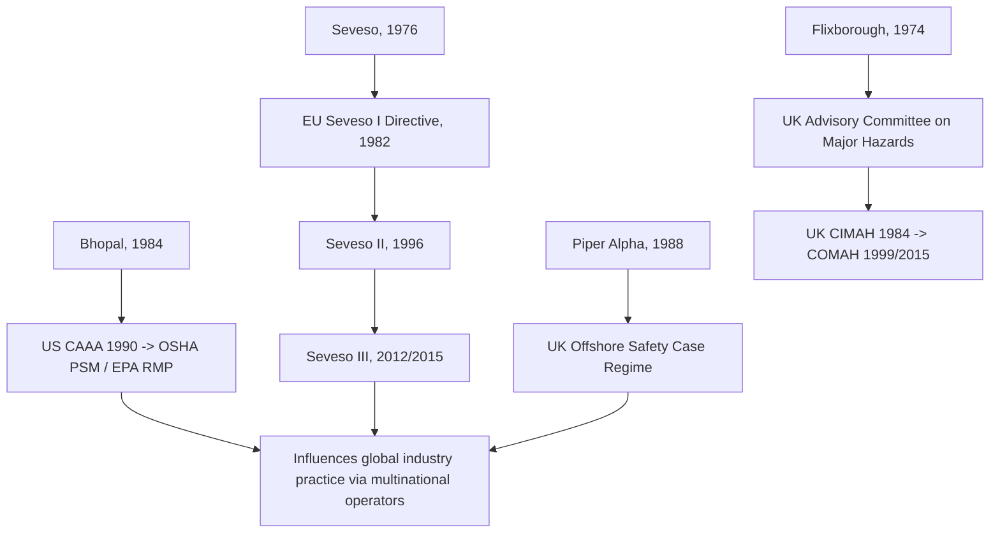

## Overview of the Global Process Safety Regulatory Landscape

### Overview

Process safety regulation varies considerably across jurisdictions in structure, philosophy, and enforcement mechanism, yet nearly all major frameworks trace their conceptual lineage back to the same historical accidents — Flixborough, Seveso, and Bhopal. Broadly, global regimes fall into two philosophical models: **prescriptive/specification-based regulation** (compliance defined by meeting specific rule requirements) and **goal-setting/safety-case regulation** (compliance defined by demonstrating, through a documented safety case, that risks have been reduced to a specified standard, typically As Low As Reasonably Practicable, ALARP). Most modern regimes blend elements of both.

---

### Global Regulatory Models: Two Philosophical Approaches

| Model | Core Principle | Compliance Demonstrated By | Representative Jurisdictions |
| --- | --- | --- | --- |
| Prescriptive / Specification-based | Regulator defines specific required elements and practices | Meeting documented rule requirements (checklist-compatible) | United States (OSHA PSM, EPA RMP) |
| Goal-setting / Safety Case | Regulator defines a risk-reduction goal; operator demonstrates how it is achieved | Submission and regulator acceptance of a facility-specific Safety Case | United Kingdom (COMAH, offshore Safety Case regime), Australia, Norway |

**Key Points**

- Prescriptive regimes offer clearer compliance certainty and easier inspection/enforcement but can create a "checklist mentality" where technical compliance substitutes for genuine risk reduction.
- Safety Case regimes require the operator to actively demonstrate risk understanding and ALARP justification for a specific facility, generally producing more facility-tailored risk management but at higher administrative and technical burden, and with less enforcement predictability.
- Many jurisdictions (including the EU under Seveso III) blend both: general regulatory elements resembling U.S. PSM/RMP combined with safety report/safety management system requirements resembling the Safety Case approach.

#### Diagram: Regulatory Philosophy Spectrum

---

### United States: OSHA PSM and EPA RMP

- **Statutory basis:** Clean Air Act Amendments of 1990, Section 112(r) and Section 304.
- **OSHA 29 CFR 1910.119:** Worker-safety focused, 14 prescriptive elements (PSI, PHA, MOC, MI, PSSR, etc.), enforced via inspection and citation.
- **EPA 40 CFR Part 68 (RMP):** Public/environmental-safety focused, tiered Program 1/2/3 structure, requires hazard assessment including worst-case release scenarios, with public disclosure of portions of the Risk Management Plan.
- **Philosophy:** Predominantly prescriptive/specification-based, though PHA and MOC elements require judgment-based, facility-specific hazard evaluation rather than pure checklist compliance.
- **Independent investigator:** U.S. Chemical Safety and Hazard Investigation Board (CSB), no enforcement power.

---

### European Union: The Seveso Directives

- **Seveso I (1982), Seveso II (1996), Seveso III (2012/18/EU, effective 2015):** Apply across all EU member states, with each state responsible for domestic transposition and enforcement via a designated "competent authority."
- **Tiered thresholds:** Establishments are classified as **lower-tier** or **upper-tier** based on quantities of hazardous substances present, with upper-tier facilities subject to more extensive requirements including a formal **Safety Report**.
- **Core requirements:** Major Accident Prevention Policy (MAPP), Safety Management System (SMS), internal and external emergency plans, land-use planning controls around hazardous establishments, and public information/consultation obligations.
- **Philosophy:** A hybrid model — establishes general regulatory obligations (resembling U.S. prescriptive structure) while requiring operators to produce a Safety Report demonstrating adequate hazard identification and control (resembling goal-setting/Safety Case elements).
- **Post-Seveso III alignment:** Hazard classification criteria were harmonized with the EU's CLP Regulation, itself aligned with the UN Globally Harmonized System (GHS), improving international consistency in substance classification.

---

### United Kingdom: COMAH and the Offshore Safety Case Regime

- **COMAH (Control of Major Accident Hazards) Regulations, 1999, updated 2015:** The UK's implementation of the Seveso Directive framework, enforced by the Health and Safety Executive (HSE) jointly with the Environment Agency (in England) or equivalent bodies in Scotland/Wales/Northern Ireland (forming the "Competent Authority").
- **Offshore Safety Case Regime:** Distinct from COMAH, developed specifically for offshore oil and gas installations following the **Piper Alpha disaster (1988)**, based on recommendations from the Cullen Inquiry. Requires operators to submit a Safety Case to the regulator (currently the Offshore Safety Directive Regulator, jointly HSE and the Oil and Gas Authority/North Sea Transition Authority) demonstrating that major hazard risks have been reduced to ALARP before an installation can operate.
- **Philosophy:** The UK is the archetypal goal-setting/Safety Case jurisdiction, reflecting the influence of the Cullen Inquiry's rejection of purely prescriptive offshore safety regulation following Piper Alpha.
- **ALARP principle:** Central to UK regulatory philosophy — risks must be reduced to a level "as low as reasonably practicable," a cost-benefit-informed standard distinct from strict numerical risk criteria, applied through structured judgment rather than a fixed formula.

---

### Other Notable National and Regional Frameworks

| Jurisdiction | Framework | Notable Characteristics |
| --- | --- | --- |
| Australia | State-based Major Hazard Facility (MHF) regulations, generally modeled on Seveso/UK Safety Case principles | Safety Case submission and regulator assessment; state-level (not fully federal) implementation |
| Norway | Petroleum Safety Authority (PSA) regulations for offshore/onshore petroleum activities | Strong goal-setting/functional requirements model, influenced by North Sea offshore experience |
| Canada | Provincial OHS regulations plus federal environmental requirements; no single unified national PSM regulation equivalent to U.S. OSHA PSM | Fragmented across provinces; some align closely with API/CCPS industry guidance in absence of unified federal PSM rule |
| India | Post-Bhopal reforms: Environment (Protection) Act 1986, Manufacture, Storage and Import of Hazardous Chemicals Rules, 1989 | Directly reactive to Bhopal; ongoing development of enforcement capacity remains a subject of policy discussion |
| China | Work Safety Law, Regulations on the Safety Management of Hazardous Chemicals | Increasingly stringent following major incidents (e.g., Tianjin port explosions, 2015); rapid regulatory evolution in recent years |

[Inference: regulatory frameworks outside the US/EU/UK are subject to more frequent legislative change and varying enforcement capacity; practitioners operating in these jurisdictions should verify current requirements directly with the relevant national competent authority rather than relying solely on general characterizations.]

---

### Comparative Summary Table

| Feature | US (OSHA/EPA) | EU (Seveso III) | UK (COMAH / Offshore Safety Case) |
| --- | --- | --- | --- |
| Core philosophy | Prescriptive | Hybrid | Goal-setting / Safety Case |
| Key document | PSM program elements / Risk Management Plan | Safety Report | Safety Case |
| Risk standard | Compliance with specific PSM/RMP elements | Demonstrated hazard control via SMS | ALARP (As Low As Reasonably Practicable) |
| Public disclosure | Partial (RMP data) | Public information obligations | Limited public disclosure of full Safety Case |
| Independent investigator | CSB (no enforcement power) | Varies by member state | Varies; historically informed by public inquiries (e.g., Cullen Inquiry) |
| Landmark triggering event(s) | Bhopal, Institute WV release | Seveso | Piper Alpha (offshore); Flixborough (early UK major hazard regulation) |

---

### Diagram: Global Regulatory Genealogy

---

### Cross-Cutting Themes Across All Regimes

**Key Points**

- **All major frameworks require systematic hazard identification** (PHA under US regulation, hazard identification within the Safety Report/Safety Case under EU/UK regulation), reflecting the shared lesson from Flixborough and Seveso that ad hoc or absent hazard review is unacceptable.
- **All major frameworks now incorporate off-site/community protection considerations** (EPA RMP off-site consequence analysis, EU/UK land-use planning and external emergency planning), directly tracing to Seveso and Bhopal.
- **Management of Change and Mechanical Integrity concepts appear across virtually all regimes** in some form, even where not labeled identically, reflecting Flixborough's enduring influence.
- **Multinational operators must typically comply with the most stringent applicable framework** in each jurisdiction where they operate, and many voluntarily adopt a harmonized internal PSM standard (often based on CCPS RBPS) that meets or exceeds the most demanding regime globally, simplifying cross-jurisdictional compliance management.

---

### Enduring Lessons and Modern Relevance

- No single "best" regulatory model has achieved universal consensus: prescriptive regimes offer enforcement clarity while safety case regimes offer facility-specific rigor, and the ongoing international discourse in process safety continues to debate the relative merits of each approach following further incidents. [Inference: this remains a live area of professional and academic debate rather than a settled question.]
- Understanding a facility's applicable regulatory model is a prerequisite to correctly structuring its PHA, documentation, and management system — a US-style PSM program built for OSHA compliance does not automatically satisfy a UK COMAH Safety Case submission or vice versa, even though the underlying technical hazard analysis content substantially overlaps.
- Global harmonization efforts (e.g., through the UN GHS, ILO conventions on major hazard control, and increasing use of CCPS RBPS as a de facto international voluntary standard) continue to narrow — but have not eliminated — structural differences between national regimes.

---

**Related Topics**

- Piper Alpha Disaster (1988) and the Cullen Inquiry
- ALARP principle and cost-benefit risk reduction standards
- EU Seveso III Directive — Safety Report content requirements in detail
- UK COMAH Regulations and Competent Authority structure
- Offshore Safety Case regime — content and regulator acceptance process
- CCPS Risk Based Process Safety as a de facto global harmonization standard
- Comparing prescriptive versus goal-setting regulatory philosophies
- Major Hazard Facility regulation in Australia
- Tianjin Port Explosions (2015) and evolving Chinese chemical safety regulation
- UN Globally Harmonized System (GHS) and international hazard classification alignment