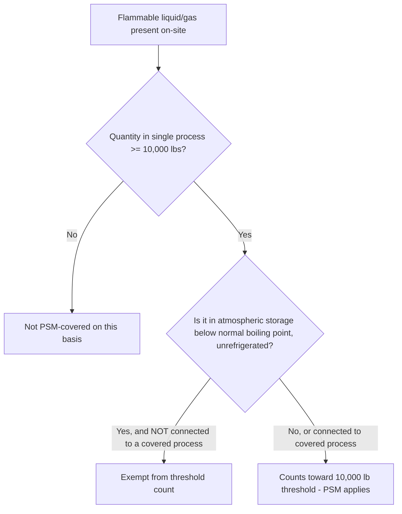

## Scope, Applicability, and Threshold Quantities

### Overview

The applicability provisions of 29 CFR 1910.119 determine which processes are legally subject to the full Process Safety Management standard. Correctly scoping a facility's PSM-covered processes is a foundational and frequently contentious compliance exercise, since the standard's coverage triggers depend on precise definitions of "process," "highly hazardous chemical," and specific threshold quantities — with several important exemptions and edge cases that significantly affect real-world applicability determinations.

---

### The Core Applicability Trigger

Under 1910.119(a)(1), the standard applies to a "process" that involves either:

1. A **highly hazardous chemical** listed in **Appendix A** at or above its specified threshold quantity (TQ), **or**
2. A **flammable liquid or gas** (as defined in 1910.1200, Appendix B) on-site in one location, in a quantity of **10,000 pounds (4,535.9 kg) or more**.

**Key Points**

- Coverage is triggered by the *presence* of a listed chemical or flammable material at or above threshold quantity within a single process — not by the facility's overall inventory of hazardous chemicals in aggregate across unrelated processes.
- The definition of "process" is broad and includes any activity involving a highly hazardous chemical, including use, storage, manufacturing, handling, or on-site movement — meaning a "process" is not limited to a reactive manufacturing unit.
- Threshold quantity determination must be performed on a process-by-process basis; a facility may have multiple processes, some covered and some not, depending on the quantity of the specific chemical present in each discrete process.

---

### Definition of "Process" (1910.119(b))

The standard defines "process" as any activity involving a highly hazardous chemical, including any use, storage, manufacturing, handling, or the on-site movement of such chemicals, or combination of these activities. For purposes of the definition, any group of vessels which are interconnected, and separate vessels which are located such that a highly hazardous chemical could be involved in a potential release, shall be considered a single process.

**Key Points**

- The "interconnected vessels" provision means that TQ calculation is not limited to a single tank or reactor — connected or proximate vessels capable of contributing to a single release event must be aggregated.
- This aggregation principle is a frequent source of compliance disputes: a facility may argue that vessels are functionally separate, while OSHA may interpret physical proximity and potential release interaction as sufficient grounds to treat them as a single process for TQ purposes.
- The broad "any use" language means even chemical storage-only operations (with no chemical reaction or transformation occurring) can constitute a covered "process" if threshold quantities are present.

---

### Appendix A: Listed Highly Hazardous Chemicals

- Appendix A contains a list of approximately 130+ specific chemicals, each with an assigned threshold quantity (typically ranging from 500 lbs to 15,000 lbs depending on the chemical's hazard profile).
- Chemicals are included based on toxicity, reactivity, flammability, or explosive potential — the list includes substances such as ammonia (anhydrous), chlorine, hydrogen sulfide, ethylene oxide, and numerous others.
- Threshold quantities in Appendix A are **substance-specific**, unlike the blanket 10,000-lb threshold that applies to flammable liquids/gases generally.

**Example**

Anhydrous ammonia has an Appendix A threshold quantity of 10,000 lbs. A facility storing 8,000 lbs of anhydrous ammonia in a single interconnected refrigeration system would **not** trigger PSM coverage for that process (below threshold), while a facility storing 12,000 lbs in an interconnected system **would** be fully covered, requiring implementation of all 14 PSM elements for that process.

---

### The Flammable Liquids and Gases Threshold

- The 10,000-lb threshold applies to flammable liquids/gases **on-site in one location**, interpreted consistently with the "process" aggregation principle above.
- This blanket flammables threshold applies regardless of which specific flammable substance is present (unlike Appendix A's substance-specific list).

#### Key Exemptions to the Flammable Liquids/Gases Threshold (1910.119(a)(1)(ii))

| Exemption | Condition |
| --- | --- |
| Atmospheric storage tanks | Flammable liquids stored in atmospheric tanks that are kept below their normal boiling point without benefit of chilling or refrigeration are exempt from counting toward the 10,000-lb threshold, **unless** connected to a process that itself would be covered |
| Hydrocarbon fuels used solely for workplace consumption | Flammable liquids/gases used as a fuel (e.g., for heating) rather than as part of a chemical process are generally exempt if not part of a covered process, though this exemption is narrowly construed |

**Key Points**

- The atmospheric storage tank exemption is one of the most litigated and misunderstood aspects of PSM scope — the exemption applies specifically to flammable liquid storage tanks meeting precise boiling-point and non-refrigeration conditions, and does **not** exempt such tanks if they are part of an interconnected process with covered equipment.
- OSHA has issued numerous interpretation letters clarifying that this exemption is intended to be narrow, covering genuinely passive atmospheric tank farms, not process feed tanks integrated into a covered manufacturing operation.
- Facilities frequently misapply this exemption by assuming all atmospheric tanks are automatically excluded, without correctly evaluating the "connected to a covered process" caveat.

#### Diagram: Flammable Threshold Determination Logic

---

### General Exemptions Under 1910.119(a)(2)

The standard explicitly excludes certain categories of operations even if threshold quantities are technically present:

| Exemption Category | Basis |
| --- | --- |
| Retail facilities | Businesses selling hazardous chemicals in small containers directly to consumers (e.g., retail gas stations, retail propane dealers under specified conditions) |
| Oil or gas well drilling and servicing | Upstream exploration/production activities, separately regulated |
| Normally unoccupied remote facilities | Facilities with highly hazardous chemicals where employees rarely visit and do not routinely work |

**Key Points**

- The retail exemption is narrowly defined and generally does not extend to wholesale distribution, industrial supply, or bulk storage operations, even if the entity has "retail" in its business description.
- The oil/gas well drilling exemption applies specifically to upstream well drilling and servicing activities, not to downstream processing, refining, or gas plant operations, which remain subject to standard PSM scoping analysis.
- The "normally unoccupied remote facility" exemption is highly fact-specific and narrowly interpreted by OSHA; it is not a general exemption for all remote or automated facilities.

---

### Practical Scoping Methodology

A rigorous PSM applicability determination typically follows this sequence:

1. **Inventory all chemicals on-site** and cross-reference against Appendix A.
2. **Identify all flammable liquids and gases** on-site per the 1910.1200 Appendix B definition.
3. **Map process boundaries**, applying the "interconnected vessels" aggregation rule to determine what constitutes a single "process" for TQ purposes.
4. **Calculate maximum intended inventory** for each process (not just current or average inventory — the threshold is based on quantities that could be present).
5. **Apply relevant exemptions** (atmospheric storage, retail, drilling, remote facility) where factually applicable, documenting the basis for exemption.
6. **Document the determination**, since OSHA inspectors will independently evaluate scope during any PSM-related inspection, and an incorrect exemption claim does not shield a facility from citation if the underlying facts don't support it.

**Example**

A chemical distribution facility stores 6,000 lbs of a flammable solvent in one warehouse building and, in a separate building 200 meters away with no piping or vessel interconnection, stores an additional 5,000 lbs of the same solvent. Because these are genuinely separate, non-interconnected processes with no shared potential release pathway, each would likely be evaluated independently against the 10,000-lb threshold — neither individually triggers coverage, and OSHA's aggregation principle (based on interconnection and shared release potential) would not combine them, in contrast to a scenario where the two storage areas were piped together or situated such that a release from one could involve the other.

---

### Consequences of Misapplied Scoping

- Under-scoping (incorrectly excluding a covered process) is a common basis for OSHA "Willful" or "Serious" citations, particularly following an incident, since post-incident investigation frequently re-examines the facility's original applicability determination.
- Over-scoping (applying full PSM elements to processes that don't strictly require it) is not a violation, but consumes compliance resources that might be better allocated to risk-proportionate management of genuinely high-hazard processes — a consideration relevant to CCPS's Risk Based Process Safety framework, which advocates risk-tiered application of process safety rigor even beyond strict regulatory triggers.

---

### Enduring Lessons and Modern Relevance

- Precise scoping determination remains one of the most consequential early steps in PSM program design, since an incorrect exclusion can leave a genuinely hazardous process entirely outside the formal PSM management system until an incident or inspection reveals the gap.
- The "interconnected vessels" aggregation principle reflects a lesson consistent with Flixborough and Bhopal: hazard potential is a function of total inventory that can participate in a single release event, not merely the capacity of an individual vessel.
- Facilities operating close to threshold quantities should conduct periodic re-evaluation of maximum intended inventory, since process changes, throughput increases, or equipment modifications can shift a previously uncovered process into PSM applicability — an important intersection with Management of Change procedures.

---

**Related Topics**

- Appendix A — full listed chemicals and threshold quantities reference
- Definition and interpretation of "highly hazardous chemical"
- OSHA interpretation letters on atmospheric storage tank exemptions
- Management of Change implications when inventory changes affect PSM applicability
- Process Safety Information requirements once a process is determined to be covered
- EPA RMP threshold quantities and how they differ from OSHA Appendix A
- Retail facility exemption case law and enforcement history
- Aggregation of interconnected vessels — OSHA enforcement precedent
- Maximum intended inventory calculation methodology
- Comparing OSHA PSM scope to EU Seveso tiered thresholds