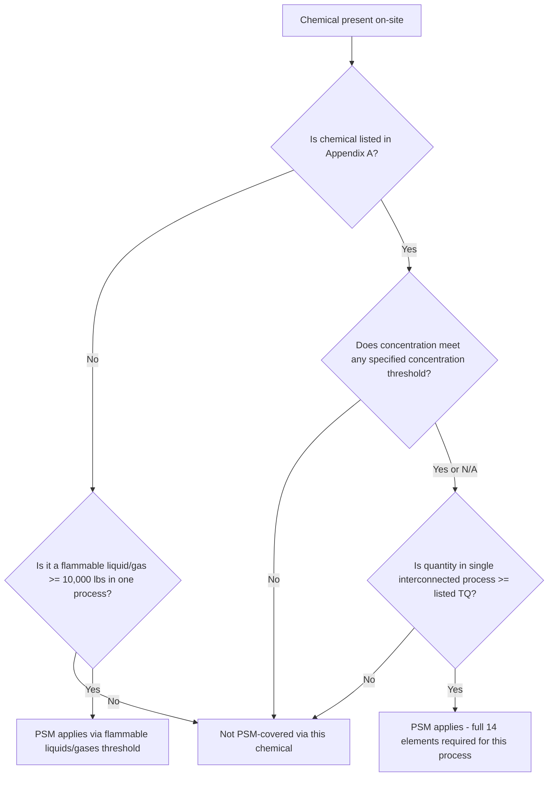

## Appendix A Highly Hazardous Chemicals List

### Overview

Appendix A to 29 CFR 1910.119 is the specific, enumerated list of chemicals that trigger OSHA Process Safety Management coverage when present in a single process at or above their designated threshold quantity (TQ). Unlike the blanket 10,000-lb flammable liquids/gases threshold, Appendix A assigns a **substance-specific TQ** to each listed chemical, reflecting differences in toxicity, reactivity, and hazard severity. Correctly identifying whether a facility's chemicals appear on this list — and at what quantity — is the foundational first step in any PSM applicability determination.

---

### Structure and Organization of Appendix A

- Appendix A lists chemicals by **CAS (Chemical Abstracts Service) registry number**, chemical name, and threshold quantity (in pounds).
- The list contains **approximately 137 chemicals**, spanning a range of hazard categories including acutely toxic gases and liquids, highly reactive substances, and explosives.
- Threshold quantities range from as low as **100 lbs** (for some of the most acutely hazardous substances) up to **15,000 lbs** for certain less acutely hazardous but still significant materials.
- The list is **static and enumerated** — it is not automatically updated to reflect newly recognized hazardous substances; additions or changes require formal OSHA rulemaking, which occurs infrequently.

**Key Points**

- Appendix A is a closed, specifically enumerated list — a chemical not appearing on it does **not** trigger PSM coverage under the Appendix A pathway, even if it is otherwise hazardous, unless it separately qualifies under the flammable liquids/gases 10,000-lb threshold.
- This creates an important compliance nuance: a facility handling a highly toxic or reactive chemical *not* listed in Appendix A is not automatically PSM-covered for that chemical, though it may still be subject to the OSHA General Duty Clause (Section 5(a)(1)) or EPA's separate RMP substance list, which has some but not complete overlap with Appendix A.
- Because the list has not been substantially updated since its original issuance in 1992, some chemicals recognized by more recent hazard science as highly reactive or toxic are not captured, a limitation noted periodically in process safety literature and by the CSB. [Inference: whether and when OSHA might revise Appendix A remains a matter of ongoing regulatory policy discussion, not a settled or scheduled outcome.]

---

### Representative Examples from Appendix A

The following table illustrates the range of chemicals and threshold quantities found in Appendix A (not exhaustive — always consult the current regulatory text for the complete list):

| Chemical | CAS Number | Threshold Quantity (lbs) | Primary Hazard |
| --- | --- | --- | --- |
| Ammonia, anhydrous | 7664-41-7 | 10,000 | Toxic gas |
| Chlorine | 7782-50-5 | 1,500 | Toxic gas |
| Hydrogen sulfide | 7783-06-4 | 1,500 | Toxic gas |
| Ethylene oxide | 75-21-8 | 5,000 | Flammable / toxic / reactive |
| Hydrogen fluoride | 7664-39-3 | 1,000 | Highly toxic / corrosive gas |
| Methyl isocyanate | 624-83-9 | 250 | Acutely toxic (Bhopal-associated substance) |
| Formaldehyde (37% by weight or greater) | 50-00-0 | 1,000 | Toxic / flammable |
| Bromine | 7726-95-6 | 1,500 | Toxic / oxidizer |
| Phosgene | 75-44-5 | 100 | Acutely toxic gas |
| Nitric acid (94.5% by weight or greater) | 7697-37-2 | 500 | Oxidizer / corrosive |
| Sulfur dioxide | 7446-09-5 | 1,000 | Toxic gas |
| Vinyl acetate monomer | 108-05-4 | 15,000 | Flammable |

**Key Points**

- Methyl isocyanate (MIC) — the substance responsible for the Bhopal disaster — appears on Appendix A with one of the **lowest threshold quantities on the list (250 lbs)**, directly reflecting the regulatory response to that specific incident.
- Threshold quantities generally scale inversely with acute hazard severity: highly acutely toxic gases like phosgene (100 lbs) and MIC (250 lbs) have very low thresholds, while less immediately catastrophic (though still significant) substances like vinyl acetate monomer (15,000 lbs) have correspondingly higher thresholds.
- Some entries specify a **concentration threshold** in addition to quantity (e.g., formaldehyde at 37% by weight or greater, nitric acid at 94.5% by weight or greater) — a facility using a more dilute solution of the same chemical may fall outside Appendix A coverage for that specific listing, though it could still trigger coverage via the flammable liquids/gases pathway if applicable.

---

### Threshold Quantity Determination Logic

---

### Hazard Category Breakdown

While Appendix A does not formally group chemicals into hazard categories within the regulatory text itself, chemicals on the list are commonly understood to fall into these functional groupings for hazard analysis purposes:

| Hazard Category | Representative Examples | Typical Threshold Range |
| --- | --- | --- |
| Acutely toxic gases | Chlorine, hydrogen sulfide, phosgene, hydrogen fluoride | 100–1,500 lbs |
| Acutely toxic liquids/solids | Methyl isocyanate, acrolein | 150–250 lbs |
| Highly reactive/unstable substances | Ethylene oxide, propylene oxide, various peroxides | 5,000–7,500 lbs |
| Flammable/explosive gases and liquids (specifically listed) | Vinyl acetate monomer, various listed flammables | 10,000–15,000 lbs |
| Strong oxidizers/corrosives | Nitric acid, bromine | 500–1,500 lbs |

**Example**

A facility operating a fumigation process using methyl bromide would need to check Appendix A for methyl bromide's specific listing and threshold quantity; if the maximum intended inventory in a single interconnected process meets or exceeds that threshold, the full 14-element PSM program becomes mandatory for that process — including PHA, MOC, Mechanical Integrity, and Emergency Planning and Response specifically tailored to methyl bromide's acute toxicity profile, not merely general good practice.

---

### Comparison: OSHA Appendix A vs. EPA RMP Regulated Substances List

| Aspect | OSHA Appendix A (1910.119) | EPA RMP List (40 CFR 68.130) |
| --- | --- | --- |
| Purpose | Trigger worker-safety PSM coverage | Trigger public/environmental-safety RMP coverage |
| List size | ~137 chemicals | ~140+ toxic and flammable substances (separate lists) |
| Overlap | Substantial but not complete overlap with EPA's list | Substantial but not complete overlap with OSHA's list |
| Threshold basis | Substance-specific TQ | Substance-specific TQ, separately determined |
| A facility handling MIC | Covered under Appendix A (TQ: 250 lbs) | Also separately listed and covered under EPA's RMP toxics list |

**Key Points**

- Because the OSHA and EPA chemical lists are not identical, a facility must perform **two separate threshold determinations** — one against Appendix A for OSHA PSM applicability, and one against 40 CFR 68.130 for EPA RMP applicability — since a chemical present above one agency's threshold may be below (or entirely absent from) the other's list.
- This dual-list structure is a direct consequence of the Clean Air Act Amendments' bifurcated rulemaking mandate (Section 304 to OSHA, Section 112(r)(7) to EPA), discussed in the broader CAAA regulatory history.

---

### Common Compliance Pitfalls

| Pitfall | Explanation |
| --- | --- |
| Assuming a chemical not on Appendix A is automatically unregulated | Ignores potential EPA RMP coverage or OSHA General Duty Clause applicability |
| Overlooking concentration-based listings | Treating a dilute solution as fully exempt without verifying the specified concentration threshold |
| Failing to aggregate across interconnected vessels | Undercounting quantity by evaluating only a single vessel rather than the full interconnected process |
| Not tracking maximum intended inventory | Basing TQ determination on average or typical inventory rather than the maximum quantity the process is designed to hold |
| Static list assumption | Assuming Appendix A automatically reflects the latest hazard science; the list requires formal rulemaking to update and may not include more recently recognized reactive hazards |

---

### Enduring Lessons and Modern Relevance

- Appendix A's direct inclusion of methyl isocyanate at one of the list's lowest threshold quantities is a permanent regulatory artifact of Bhopal — a clear, traceable link between a specific historical catastrophe and a specific line item in current federal regulation.
- The enumerated, closed-list nature of Appendix A means process safety practitioners must not treat "not on the list" as synonymous with "not hazardous" — many facilities apply CCPS Risk Based Process Safety principles or internal corporate standards to manage hazardous chemicals below or outside Appendix A's formal triggers, recognizing that regulatory thresholds represent a compliance floor, not a comprehensive hazard management ceiling.
- Given the list's static nature since 1992, practitioners handling newer or less common industrial chemicals should independently evaluate reactive, toxic, or explosive hazard potential using PHA methodology rather than relying solely on Appendix A absence as evidence of low risk.

---

**Related Topics**

- Full Appendix A regulatory text — complete chemical list and threshold quantities
- EPA RMP regulated substances list (40 CFR 68.130) and comparison methodology
- Scope, Applicability, and Threshold Quantities — interconnected vessel aggregation rules
- Methyl isocyanate hazard profile and the Bhopal connection
- OSHA General Duty Clause (Section 5(a)(1)) as a catch-all beyond Appendix A
- Reactive Chemicals Hazard Analysis for substances not listed in Appendix A
- Concentration-based threshold determination methodology
- Process Hazard Analysis scoping for Appendix A-listed chemicals
- Globally Harmonized System (GHS) hazard classification and its relationship to Appendix A
- CCPS Risk Based Process Safety — managing hazards beyond regulatory triggers