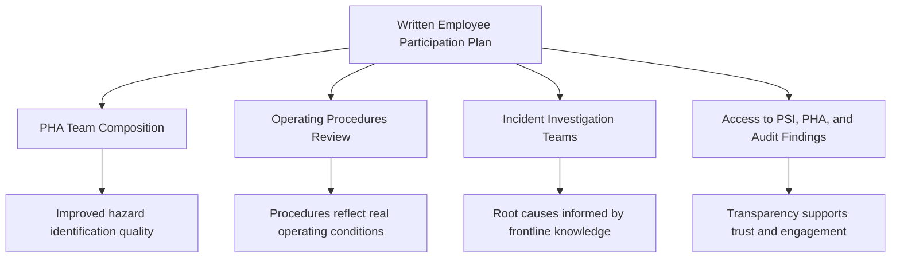

## Employee Participation Provisions

### Overview

Employee Participation is the first of the 14 elements enumerated in 29 CFR 1910.119, appearing at 1910.119(c), and its early placement in the standard is deliberate: OSHA structured PSM so that the individuals with the most direct, hands-on knowledge of process hazards — operators, maintenance technicians, and their representatives — are formally embedded into the hazard identification and management system from the outset, rather than being consulted only after hazard analyses and procedures are already drafted.

---

### Regulatory Text and Core Requirements

1910.119(c) contains two specific mandatory requirements:

1. Employers must **develop a written plan of action** regarding the implementation of employee participation as required by this paragraph.
2. Employers must **consult with employees and their representatives** on the conduct and development of process hazard analyses and on the development of the other elements of process safety management in this standard.
3. Employers must **provide employees and their representatives access** to process hazard analyses and to all other information required to be developed under the standard.

**Key Points**

- The written plan of action is itself a distinct, auditable compliance artifact — OSHA inspectors specifically look for a documented plan, not merely evidence of informal employee involvement.
- "Consultation" is a specific, defined obligation distinct from simple notification; it implies employees have a genuine opportunity to provide input that could influence PHA findings or procedural content, not merely receive information after decisions are finalized.
- The access requirement extends to **all PSM-required information**, including PHAs, Process Safety Information (PSI), incident investigation reports, and audit findings — not a curated subset chosen by management.

---

### Scope of "Employees and Their Representatives"

- The standard's language deliberately includes both individual employees and their **representatives**, which in unionized facilities typically means designated union safety representatives or committee members.
- OSHA's enforcement interpretation treats this provision as applicable regardless of whether a facility is unionized — non-union facilities must still establish a mechanism for meaningful employee consultation, often through safety committees, PHA team participation, or structured feedback channels.
- Contractor employees performing work covered by the process are addressed separately under the **Contractors element (1910.119(h))**, though overlap exists where contractor input is relevant to hazard identification for a shared process.

---

### Practical Implementation Mechanisms

| Mechanism | Description |
| --- | --- |
| PHA team composition | Including operators and maintenance personnel directly, not solely engineers and managers, on PHA (e.g., HAZOP) teams |
| Safety committees | Formal joint labor-management or cross-functional committees reviewing PSM program elements |
| Procedure review cycles | Structured operator review and sign-off on Operating Procedures before finalization or revision |
| Incident investigation participation | Including affected employees in root cause investigation teams |
| Open information access points | Physical or electronic repositories where PSI, PHA findings, and audit results are accessible to employees |
| Suggestion/hazard reporting systems | Formal channels for employees to raise process safety concerns, feeding into MOC or incident investigation processes |

**Example**

A HAZOP study conducted on a distillation unit should include not only the process engineer and a facilitator, but also at least one experienced board operator and a maintenance technician familiar with the unit's mechanical history. Their practical knowledge of recurring minor upsets, workaround procedures, or equipment quirks frequently surfaces deviation scenarios or existing safeguard limitations that a purely engineering-driven team might overlook — this is precisely the intended function of the Employee Participation element, not merely a procedural formality.

---

### Diagram: Employee Participation Integration Across PSM Elements

---

### Common Enforcement and Compliance Issues

| Issue | OSHA Concern |
| --- | --- |
| No written plan exists | Direct citation basis — the written plan itself is a specific, separate requirement, distinct from having informal employee involvement |
| Employees excluded from PHA teams | Undermines the "consultation on conduct and development of PHAs" requirement |
| Restricted access to PSI/PHA documentation | Violates the explicit access requirement; management cannot limit access to only summarized or redacted versions without adequate justification |
| Participation treated as one-time/historical | OSHA expects ongoing consultation across the PSM program lifecycle (PHA revalidation, MOC, procedure updates), not a single initial exercise |
| Consultation without genuine influence opportunity | While harder to cite directly, OSHA's PSM enforcement guidance and CSB investigation findings have repeatedly identified "consultation theater" (soliciting input that is not meaningfully considered) as a root contributor to degraded process safety culture |

**Key Points**

- Citations under this element are less common in isolation than under more technically complex elements (PHA, MI, MOC), but deficiencies here are frequently cited as a **contributing organizational factor** in incident investigations, even when not the direct technical cause of the event.
- CSB investigations (including Texas City) have repeatedly noted that frontline employee concerns about degraded equipment or unsafe conditions had been raised prior to the incident but were not effectively captured or acted upon through formal participation channels — reinforcing that this element's importance extends well beyond simple regulatory compliance.

---

### Relationship to Process Safety Culture

- Employee Participation is widely regarded within the process safety community (including CCPS's Risk Based Process Safety framework) as a foundational element supporting broader **process safety culture**, since a workforce that is genuinely consulted and has visible influence over hazard analysis and procedures is more likely to report near-misses, raise concerns about degraded safeguards, and engage constructively with Management of Change reviews.
- CCPS explicitly identifies "workforce involvement" as one of its RBPS pillars' supporting practices, extending the OSHA regulatory minimum into a broader cultural and organizational commitment.

**Key Points**

- Genuine employee participation functions as an informal but valuable leading indicator system — frontline reporting of degraded conditions, near-misses, or procedural gaps often surfaces process safety concerns well before they would appear in formal Tier 1–4 metrics.
- Facilities with weak employee participation practices are frequently found, in post-incident investigation, to have had internal knowledge of the developing hazard that never reached decision-makers with authority to intervene — a recurring theme across multiple major incident investigations, including aspects of the Texas City investigation.

---

### Enduring Lessons and Modern Relevance

- Employee Participation's placement as the very first PSM element reflects a deliberate regulatory philosophy: process safety management systems built without genuine frontline input are structurally more likely to miss real-world hazard scenarios that only become visible through day-to-day operating and maintenance experience.
- Modern process safety culture assessments (informed by CCPS guidance and post-Texas City industry reform) treat the quality — not merely the existence — of employee participation mechanisms as a meaningful indicator of overall PSM program maturity.
- Facilities should periodically reassess whether participation mechanisms have become perfunctory over time (a documented plan that exists on paper but no longer functions in practice), since this drift is a recognized failure mode distinct from simply never having implemented the element at all.

---

**Related Topics**

- Written Employee Participation Plan — required content and audit expectations
- Process Hazard Analysis (PHA) team composition best practices
- Process safety culture assessment frameworks (CCPS RBPS)
- Contractors element (1910.119(h)) and overlap with employee participation
- Incident Investigation element and root cause analysis team composition
- Near-miss reporting systems and their relationship to leading indicators
- CSB findings on frontline knowledge gaps preceding major incidents
- Management of Change — employee input on proposed changes
- Operating Procedures development and operator review cycles
- Union versus non-union facility approaches to employee representative consultation