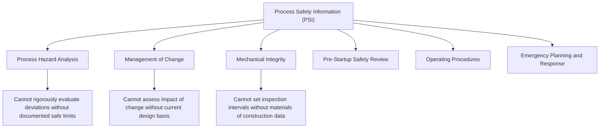

## Process Safety Information Requirements

### Overview

Process Safety Information (PSI), codified at 1910.119(d), is the second element of OSHA's PSM standard and functions as the factual and technical foundation upon which every other PSM element depends. PHAs cannot meaningfully evaluate hazards without accurate chemical hazard data; Management of Change reviews cannot assess the impact of a modification without current design documentation; Mechanical Integrity programs cannot establish appropriate inspection intervals without materials of construction data. PSI is, in effect, the documented technical baseline that makes every subsequent, judgment-based PSM element possible.

---

### The Three Categories of Required PSI

1910.119(d) requires employers to complete a compilation of written process safety information before conducting any required PHA, organized into three categories:

| Category | Regulatory Cite | Core Content |
| --- | --- | --- |
| Hazards of the chemicals used or produced | 1910.119(d)(1) | Toxicity, permissible exposure limits, physical/reactive/chemical stability data, corrosivity, and hazards of inadvertent mixing |
| Technology of the process | 1910.119(d)(2) | Block flow diagram or process flow diagram, process chemistry, maximum intended inventory, safe upper/lower limits (temperature, pressure, flow, etc.), and consequences of deviation |
| Equipment in the process | 1910.119(d)(3) | Materials of construction, P&IDs, electrical classification, relief system design basis, ventilation system design, design codes/standards employed, material and energy balances, and safety systems (e.g., interlocks, detection, suppression) |

**Key Points**

- All three categories must be assembled **prior to** conducting the initial Process Hazard Analysis — PSI is explicitly a prerequisite input to PHA, not a parallel or subsequent activity.
- PSI must reflect the **current design basis** of the process; where the actual, as-built equipment deviates from original design documentation, the employer must document that the equipment complies with recognized and generally accepted good engineering practices (RAGAGEP), effectively creating an obligation to reconcile "as-designed" versus "as-built" discrepancies.
- For processes designed before the applicability of consensus codes and standards, the employer must determine and document that the equipment is designed, maintained, inspected, tested, and operating in a safe manner — an important provision for older/legacy facilities predating modern engineering codes.

---

### Hazards of the Chemicals (1910.119(d)(1))

Required information includes, at minimum:

- Toxicity information
- Permissible exposure limits (PELs)
- Physical data (boiling point, vapor pressure, etc.)
- Reactivity data
- Corrosivity data
- Thermal and chemical stability data
- Hazardous effects of inadvertent mixing of different materials that could foreseeably occur

**Example**

For a process using hydrogen fluoride, PSI must document not only its acute toxicity and PEL, but also its reactivity characteristics (e.g., violent reaction with water generating heat and toxic/corrosive vapors) and any known inadvertent mixing hazards (e.g., incompatibility with certain metals or bases) — this data becomes the direct input for PHA scenario development addressing loss-of-containment and mixing/contamination deviation scenarios.

---

### Technology of the Process (1910.119(d)(2))

Required information includes:

- A block flow diagram or simplified process flow diagram
- Process chemistry
- Maximum intended inventory
- Safe upper and lower limits for temperatures, pressures, flows, and compositions
- An evaluation of the consequences of deviations, including those affecting employee safety and health

**Key Points**

- "Safe upper and lower limits" establish the operating envelope against which PHA deviation analysis (e.g., HAZOP "more than," "less than" guide words) is directly applied — without documented limits, a PHA team cannot rigorously evaluate what constitutes a hazardous deviation.
- The consequence-of-deviation evaluation required here is not identical to a full PHA, but represents the baseline technical understanding that a subsequent PHA builds upon and formalizes into a structured hazard evaluation.

---

### Equipment in the Process (1910.119(d)(3))

Required information includes:

- Materials of construction
- Piping and instrumentation diagrams (P&IDs)
- Electrical classification
- Relief system design and design basis
- Ventilation system design
- Design codes and standards employed
- Material and energy balances (for processes built after May 26, 1992)
- Safety systems (e.g., interlocks, detection, suppression systems)

**Key Points**

- Relief system design basis documentation is particularly critical, since inadequate or unvalidated relief system design has been a contributing factor in numerous major incidents (paralleling the atmospheric venting failure at Seveso) — PSI requires not just that a relief system exists, but that its design basis (the scenario it was sized to protect against) is documented.
- The material and energy balance requirement applies specifically to processes built after the standard's effective date, reflecting OSHA's recognition that this level of documentation may not exist for legacy processes and cannot always be retroactively reconstructed with full precision.

---

### Diagram: PSI as the Foundation for Other PSM Elements

---

### RAGAGEP and Legacy Equipment Compliance

- Where a facility's existing equipment does not conform to currently applicable consensus codes and standards (RAGAGEP), 1910.119(d)(3)(iii) requires the employer to determine and document that the equipment is designed, maintained, inspected, tested, and operated in a safe manner.
- This provision acknowledges that many operating facilities include equipment installed decades before current codes existed, and does not require wholesale retrofit to current standards — but does require an affirmative, documented safety justification rather than silence on the discrepancy.

**Example**

A pressure vessel installed in the 1960s under an earlier edition of the ASME Boiler and Pressure Vessel Code, no longer matching the current code edition in all respects, does not automatically require replacement under PSM. However, the employer must document — typically through a fitness-for-service evaluation, current API 510 inspection history, and engineering assessment — that the vessel remains safe for continued operation under its actual service conditions.

---

### Common Compliance Deficiencies

| Deficiency | OSHA/Industry Concern |
| --- | --- |
| Outdated P&IDs not reflecting field modifications | Directly undermines PHA validity and MOC effectiveness if drawings don't match as-built conditions |
| Missing or undocumented relief system design basis | Prevents verification that relief systems are adequately sized for credible overpressure scenarios |
| Incomplete chemical hazard data (relying solely on SDS) | Safety Data Sheets alone often lack sufficient process-specific reactivity/stability detail required by 1910.119(d)(1) |
| No documented safe operating limits | Leaves PHA teams without a clear basis for identifying hazardous deviations |
| Legacy equipment RAGAGEP gaps undocumented | Creates a citable deficiency even where the equipment may, in fact, be operating safely |

**Key Points**

- PSI accuracy and completeness is frequently scrutinized heavily during OSHA inspections following an incident, since deficient or outdated PSI is often found to have directly compromised the quality of a prior PHA or MOC review.
- Maintaining PSI as a "living" document set — updated concurrently with MOC-driven modifications — is considered essential good practice; treating PSI as a one-time compilation frozen at initial compliance creates escalating divergence between documentation and actual field conditions over time.

---

### Enduring Lessons and Modern Relevance

- PSI's foundational role reflects a direct lesson from Flixborough, where the absence of engineering drawings and stress calculations for the temporary bypass pipe meant no PSI-equivalent technical basis existed to support a hazard review before the modification was implemented.
- Modern digital PSI management (electronic P&ID systems, integrated document management linked to MOC workflows) has become increasingly common as facilities recognize that maintaining PSI currency is an ongoing operational discipline, not a static compliance deliverable.
- The RAGAGEP documentation requirement for legacy equipment remains a persistent compliance challenge industry-wide, particularly for older facilities where original design documentation may be incomplete or lost, requiring engineering judgment and current inspection data to reconstruct an adequate safety basis. [Inference: the practical difficulty of this reconstruction varies significantly by facility age and documentation history, and cannot be generalized to a single standard remediation approach.]

---

**Related Topics**

- Process Hazard Analysis methodology and its dependency on PSI accuracy
- Management of Change — PSI update requirements following approved changes
- RAGAGEP (Recognized and Generally Accepted Good Engineering Practice) doctrine
- Relief system design basis and API RP 520/521 sizing methodology
- P&ID accuracy verification and field walkdown practices
- Mechanical Integrity — materials of construction and inspection interval determination
- Fitness-for-service evaluation for legacy equipment
- Safety Data Sheets versus process-specific reactivity data — key differences
- Maximum intended inventory documentation and threshold quantity determination
- Digital PSI/document management systems and MOC integration