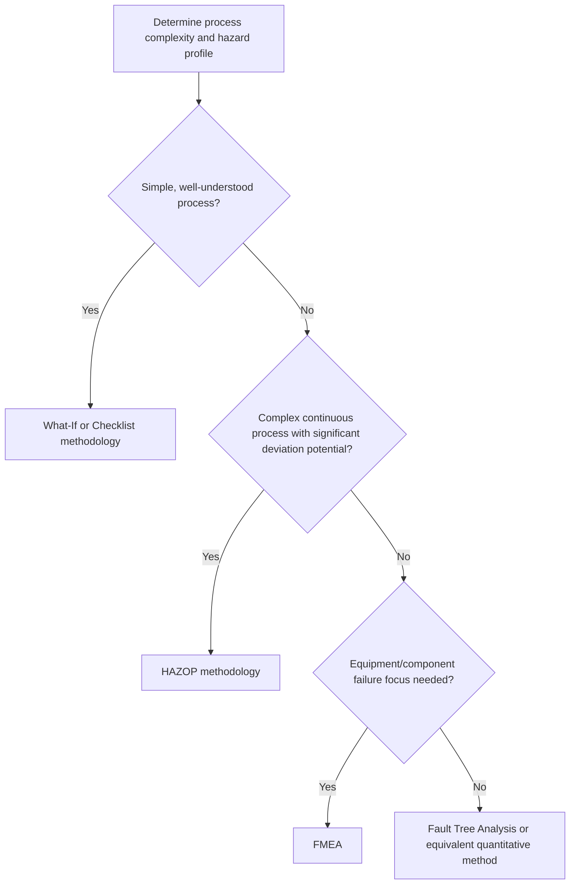
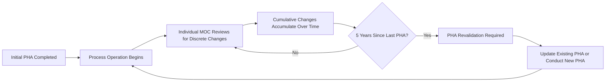

## Process Hazard Analysis Requirement and Revalidation Cycle

### Overview

Process Hazard Analysis (PHA), codified at 1910.119(e), is the third and arguably most technically central element of OSHA's PSM standard. It is the systematic, structured process by which hazards inherent in a covered process are identified, evaluated, and controlled. PHA is the direct regulatory descendant of the core lesson from Seveso — that reaction chemistry and process hazards must be proactively analyzed rather than discovered through operational upset — and its revalidation cycle requirement reflects the parallel recognition that hazard analysis is not a one-time exercise but must remain current as processes, equipment, and understanding evolve over time.

---

### Regulatory Requirements: Initial PHA (1910.119(e)(1)–(e)(3))

Employers must perform an initial PHA on covered processes, appropriate to the complexity of the process, that identifies, evaluates, and controls the hazards involved. The standard specifies:

- PHA must be performed using **one or more of the methodologies** specifically enumerated in the standard (or an appropriate equivalent methodology).
- PHA must address the following at minimum:
  1. The hazards of the process
  2. Any previous incident which had a likely potential for catastrophic consequences in the workplace
  3. Engineering and administrative controls applicable to the hazards and their interrelationships (e.g., appropriate application of detection methodologies to provide early warning of releases)
  4. Consequences of failure of engineering and administrative controls
  5. Facility siting
  6. Human factors
  7. A qualitative evaluation of a range of the possible safety and health effects of failure of controls on employees in the workplace

**Key Points**

- **Facility siting** and **human factors** are explicitly required PHA considerations — both are direct regulatory descendants of lessons from major incidents (facility siting from Texas City-type trailer-placement scenarios and Bhopal-style proximity to populations; human factors from the recognition that procedural and cognitive failures, not just equipment failures, drive incidents).
- PHA must address **previous incidents with catastrophic potential**, meaning near-misses and past events at the facility (or credibly, in industry) must be reviewed as part of the hazard identification process, not merely current design-basis hazards.
- The requirement for "qualitative evaluation... of failure of controls" establishes that PHA must go beyond simply listing safeguards — it must assess what happens when those safeguards fail, directly supporting layer of protection thinking.

---

### Enumerated PHA Methodologies

1910.119(e)(2) specifies that the PHA methodology selected must be appropriate to the complexity of the process, and lists acceptable methodologies:

| Methodology | Description | Typical Application |
| --- | --- | --- |
| What-If | Structured brainstorming using "what if" questions to probe potential deviations | Simpler processes, utility systems, batch operations |
| Checklist | Systematic comparison against a predetermined checklist of hazard categories | Standardized or well-understood processes |
| What-If/Checklist | Combined approach | Moderate complexity processes |
| Hazard and Operability Study (HAZOP) | Systematic examination of process deviations from design intent using guide words (e.g., "more," "less," "no," "reverse") applied to process parameters | Complex, continuous, or highly interconnected processes |
| Failure Mode and Effects Analysis (FMEA) | Systematic identification of component failure modes and their effects on the system | Equipment-centric analysis, safety instrumented systems |
| Fault Tree Analysis (FTA) | Deductive, top-down analysis tracing potential causes of a specific top-event | Quantitative risk analysis of specific catastrophic scenarios |
| An appropriate equivalent methodology | Any other methodology providing equivalent rigor | Facility-specific or hybrid approaches, subject to demonstrating adequacy |

**Key Points**

- **HAZOP is the most widely used methodology for complex, continuous chemical processes** in practice, due to its systematic guide-word structure and strong track record for identifying deviation-based hazards, though the standard does not mandate any single methodology.
- Methodology selection must be justified as **appropriate to process complexity** — using a simple checklist for a highly complex, novel reactive chemistry process could itself be viewed as a compliance and technical adequacy deficiency during inspection or post-incident review.
- PHA teams must include at least one person knowledgeable in the specific process being evaluated and at least one person knowledgeable in the applied methodology — reflecting the Employee Participation element's direct interconnection with PHA quality.

---

### Diagram: PHA Methodology Selection Logic

---

### The PHA Revalidation Cycle (1910.119(e)(6))

- Employers must **update and revalidate** the PHA, at a minimum, **every five (5) years** after the completion of the initial PHA, to ensure it is consistent with the current process.
- Revalidation may be conducted by either **updating and revalidating** the prior PHA (a full team reviewing the existing analysis against current conditions) or **performing a new PHA** from the outset.
- Revalidation is separate from, but closely related to, Management of Change (MOC) reviews — MOC addresses hazard evaluation for a specific proposed change at the time it occurs, while PHA revalidation is a comprehensive, periodic reassessment of the entire process regardless of whether specific individual changes have occurred.

**Key Points**

- The five-year cycle is a **maximum interval**, not a recommended interval — facilities may (and in higher-hazard or rapidly changing processes, often should) revalidate more frequently based on risk-informed judgment, incident history, or accumulated MOC volume.
- Revalidation must specifically confirm that the PHA remains consistent with the **current process** — meaning cumulative changes made via MOC since the last PHA (even if each was individually reviewed) must be collectively reassessed to verify no unanticipated interaction or cumulative risk has emerged.
- OSHA enforcement has cited facilities where individual MOC reviews were properly conducted for each discrete change, but the cumulative effect of multiple changes over time was never holistically reassessed until the five-year revalidation — a recognized gap in program design.

#### Diagram: PHA Lifecycle and Revalidation Timing

---

### Resolution and Documentation Requirements (1910.119(e)(4)–(e)(5))

- The employer must establish a system to **promptly address the PHA team's findings and recommendations**, including:
  - Documenting what actions are to be taken
  - Completing actions as soon as possible
  - Developing a written schedule of when actions will be completed
  - Communicating actions to operating, maintenance, and other employees whose work assignments are affected
- PHA findings, recommendations, resolutions, and the PHA report itself must be **retained for the life of the process** (not merely until the next revalidation cycle).

**Key Points**

- "Promptly address" does not mandate immediate resolution of every finding but does require a documented, tracked action plan with completion timelines — an open-ended or informally tracked action item list is a common and significant PSM audit finding.
- The requirement to retain PHA documentation for the life of the process (rather than a fixed retention period) means historical PHAs remain relevant compliance artifacts throughout a process's entire operating lifetime, supporting incident investigation, revalidation continuity, and regulatory inspection at any point in that lifetime.
- Backlogs of unresolved or overdue PHA action items are frequently tracked as a Tier 4 leading indicator under API RP 754, directly linking PHA program discipline to broader process safety performance measurement.

---

### Example: PHA Revalidation in Practice

**Example**

A facility completes an initial HAZOP-based PHA on its chlorine handling and dilution process in 2020. Over the following five years, the facility implements six separate MOC-reviewed modifications: a relief valve upsizing, a new automated shutdown interlock, a piping reroute, two instrumentation upgrades, and a change in chlorine supplier requiring different rail car unloading connections. Each individual MOC review adequately assessed its specific change in isolation. In 2025, the mandatory PHA revalidation must specifically evaluate whether the **combination** of these six changes has introduced any new interaction hazards, altered the original consequence severity assumptions, or created gaps not visible when each change was assessed independently — a distinct analytical task from any single MOC review, even though all were individually compliant.

---

### Common Compliance Deficiencies

| Deficiency | Concern |
| --- | --- |
| Revalidation exceeding 5-year maximum interval | Direct, clear-cut citation basis — one of the most straightforward PSM violations to identify during inspection |
| Methodology mismatch to process complexity | Using an inadequately rigorous method (e.g., checklist) for a highly complex or novel reactive process |
| PHA team lacking process-specific or methodology expertise | Undermines the technical validity and completeness of hazard identification |
| Untracked or stale action item backlogs | Findings acknowledged but never resolved, tracked, or communicated to affected employees |
| Revalidation as a "rubber stamp" | Treating revalidation as a formality rather than a genuine reassessment incorporating cumulative changes and updated incident history |
| Facility siting or human factors inadequately addressed | Omitting these explicitly required considerations, sometimes due to unfamiliarity with their scope relative to core chemical/equipment hazards |

---

### Enduring Lessons and Modern Relevance

- PHA's explicit requirement to address facility siting directly reflects lessons from Texas City, where occupied trailers were sited too close to a process unit with known overpressure/blowdown hazard potential — a facility siting failure that a rigorous PHA should have flagged.
- PHA's explicit requirement to address human factors reflects growing recognition, reinforced by CSB investigations across multiple incidents, that procedural violations, fatigue, staffing adequacy, and control system usability are legitimate and often decisive contributors to major accidents, not secondary considerations to "hard" engineering hazards.
- The five-year revalidation cycle, combined with rigorous MOC discipline, is intended to prevent the kind of gradual, unassessed risk creep that contributed to Bhopal and Texas City — where degradation and modification accumulated over years without a comprehensive hazard reassessment capturing the cumulative effect.

---

**Related Topics**

- HAZOP methodology — guide words, node selection, and team facilitation practices
- Layer of Protection Analysis (LOPA) as a semi-quantitative supplement to qualitative PHA
- Management of Change — relationship and distinction from PHA revalidation
- Facility siting analysis methodology and consequence modeling
- Human factors engineering in process hazard analysis
- PHA action item tracking and Tier 4 leading indicators (API RP 754)
- Fault Tree Analysis and quantitative risk assessment techniques
- CSB Texas City investigation — facility siting findings in detail
- Incident investigation integration with PHA revalidation
- PHA team composition and Employee Participation requirements