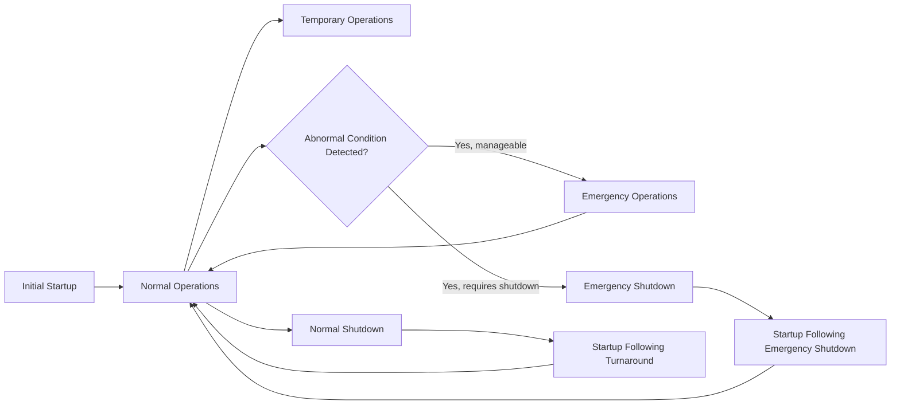

## Operating Procedures Requirements

### Overview

Operating Procedures, codified at 1910.119(f), is the fourth PSM element and translates the technical understanding established through Process Safety Information and Process Hazard Analysis into the specific, written instructions that operators actually follow to run a covered process safely. Where PSI documents *what* the process is and PHA identifies *what could go wrong*, Operating Procedures define *how the process is to be operated correctly* — across every operational phase, not merely normal steady-state running.

---

### Regulatory Requirement: Written Procedures Covering All Operating Phases

1910.119(f)(1) requires employers to develop and implement written operating procedures that provide clear instructions for safely conducting activities involved in each covered process, consistent with the Process Safety Information, and addressing at least the following operating phases:

| Operating Phase | Content Requirements |
| --- | --- |
| Initial startup | Steps for starting the process from a shutdown or non-operating state |
| Normal operations | Steps for routine, steady-state operation |
| Temporary operations | Steps for operating outside normal parameters for a defined, limited period (e.g., certain maintenance-support operations) |
| Emergency shutdown | Conditions requiring emergency shutdown and the steps required, including assignment of shutdown responsibility to qualified operators |
| Emergency operations | Steps to be taken in response to an emergency condition short of full shutdown |
| Normal shutdown | Steps for bringing the process to a safe, non-operating state |
| Startup following a turnaround or emergency shutdown | Steps specific to restart after an extended outage or emergency event, distinct from routine initial startup |

**Key Points**

- The explicit inclusion of **emergency shutdown** and **emergency operations** as distinct, mandatory procedural categories reflects the recognition that operators facing an emerging upset need clear, pre-established guidance — not improvised judgment under time pressure and stress.
- **Startup following a turnaround or emergency shutdown** is specifically called out as distinct from normal initial startup, since restart after extended equipment work or an abnormal shutdown often carries elevated risk (e.g., verifying all maintenance work is complete, all isolations removed, and instrumentation recalibrated) not present in routine startup.
- Procedures must be **consistent with Process Safety Information** — meaning safe operating limits, material hazard data, and equipment design basis documented under PSI must be directly reflected in the operational instructions, not exist as separate, potentially conflicting documentation.

---

### Required Procedural Content (1910.119(f)(1)(i)–(iv))

For each operating phase, procedures must address:

1. **Operating limits**, including:
   - Consequences of deviation
   - Steps required to correct or avoid deviation
2. **Safety and health considerations**, including:
   - Properties of, and hazards presented by, the chemicals used in the process
   - Precautions necessary to prevent exposure, including engineering controls, administrative controls, and personal protective equipment
   - Control measures to be taken if physical contact or airborne exposure occurs
   - Quality control for raw materials and control of hazardous chemical inventory levels
   - Any special or unique hazards
3. **Safety systems and their functions**

**Key Points**

- The "consequences of deviation" and "steps to correct or avoid deviation" content directly operationalizes the safe operating limits and deviation analysis established during PSI and PHA — procedures are where those technical determinations become actionable operator guidance.
- Requiring documentation of "special or unique hazards" within procedures (rather than only in a general PSI hazard summary) ensures process-specific and even step-specific hazard awareness is embedded directly at the point of use, reducing reliance on operator memory of separately maintained hazard documentation.
- Inventory control of hazardous chemicals is explicitly required within procedures, linking Operating Procedures to threshold quantity management and preventing inadvertent excursions above PSM-covered thresholds through uncontrolled inventory buildup.

---

### Diagram: Operating Procedures Across the Process Lifecycle

---

### Procedure Accessibility and Currency (1910.119(f)(2)–(f)(3))

- Operating procedures must be **readily accessible to employees** who work in or maintain a process.
- Procedures must be **reviewed as often as necessary to assure that they reflect current operating practice**, including changes resulting from changes in process chemicals, technology, equipment, or facilities.
- The employer must **certify annually** that operating procedures are current and accurate.

**Key Points**

- The annual certification requirement is a distinct, specific compliance obligation — a facility must produce documented evidence of an annual review and certification, not simply maintain procedures that happen to be accurate.
- "As often as necessary" review, tied explicitly to process, technology, equipment, or facility changes, creates a direct linkage to the Management of Change element — any MOC-approved modification affecting operating parameters or steps should trigger a corresponding operating procedure update, not wait for the next annual certification cycle.
- Accessibility requirements are commonly satisfied through both physical (control room binders) and electronic (document management system) means, but the standard requires genuine, practical accessibility at the point of use, not merely central archival storage.

---

### Safe Work Practices (1910.119(f)(4))

The standard separately requires employers to develop and implement **safe work practices** to provide for the control of hazards during operations such as:

- Lockout/tagout (control of hazardous energy)
- Confined space entry
- Opening process equipment or piping
- Control over entrance into a facility by maintenance, contractor, laboratory, or other support personnel

**Key Points**

- Safe work practices are distinct from operating procedures proper — they address cross-cutting hazard control activities (many shared with general industry OSHA standards like 1910.147 lockout/tagout and 1910.146 confined space) applied within the specific context of a PSM-covered process.
- The "opening process equipment or piping" safe work practice is particularly significant in PSM contexts, since this activity creates direct potential for hazardous material release if not properly controlled (e.g., verified depressurization, draining, and isolation before line-breaking) — a scenario with direct relevance to preventing Flixborough/Bhopal-type uncontrolled release events during routine maintenance access.

---

### Common Compliance Deficiencies

| Deficiency | Concern |
| --- | --- |
| Missing procedures for less-common phases | Facilities often maintain robust normal operation procedures but lack adequate detail for temporary operations, emergency operations, or turnaround startup |
| Annual certification not documented | Procedures may in fact be current, but absence of a documented annual certification is independently citable |
| Procedures not updated following MOC | A change is approved and implemented, but corresponding operating procedure revision lags or is never completed |
| Generic hazard language rather than process-specific detail | Procedures reference general chemical hazards without tailoring guidance to the specific step, equipment configuration, or facility layout |
| Inaccessible procedures in practice | Procedures technically exist but are not genuinely accessible at the point of use (e.g., outdated versions in the field while a current version exists only centrally) |
| Safe work practices not integrated with process-specific hazards | Generic lockout/tagout or confined space procedures not tailored to reflect specific chemical or process hazards present |

**Example**

Following an MOC-approved installation of a new automated interlock on a reactor's high-pressure trip system, the corresponding emergency shutdown procedure must be revised to reflect the new automated response and any resulting change in the operator's manual intervention role. If this update lags behind the physical installation, operators may be working from an outdated procedure describing a manual shutdown sequence the new interlock has partially superseded — a documented gap between MOC completion and procedural currency that OSHA inspectors and incident investigators specifically look for.

---

### Enduring Lessons and Modern Relevance

- The explicit requirement for emergency shutdown and emergency operations procedures reflects the recognized danger of relying on improvised operator judgment during time-critical upsets — a factor examined in numerous incident investigations where the absence of clear, pre-established emergency guidance contributed to delayed or incorrect operator response.
- The tight linkage between Operating Procedures currency and Management of Change discipline is a recurring theme in incident investigations: procedures that fall out of sync with actual, as-modified process conditions represent a latent hazard that may not manifest until the specific abnormal condition the outdated procedure fails to address actually occurs.
- Modern facilities increasingly integrate procedure management software with MOC workflow systems specifically to close this gap, triggering mandatory procedure review whenever an MOC affecting operating parameters, equipment, or safety systems is approved. [Inference: the degree of integration and its effectiveness varies considerably across facilities and industries, and cannot be generalized as a universal current practice.]

---

**Related Topics**

- Management of Change — triggering procedure updates following approved modifications
- Lockout/Tagout (1910.147) and Confined Space Entry (1910.146) as safe work practices
- Emergency Planning and Response — relationship to emergency operations procedures
- Pre-Startup Safety Review — verifying procedures are updated before startup following a change
- Human factors in procedure design and operator usability
- Annual procedure certification — documentation and audit expectations
- Training element — relationship to operating procedure comprehension and competency
- Line-breaking and opening process equipment safe work practices
- Turnaround planning and startup-following-turnaround procedure development
- Procedure management software and MOC workflow integration