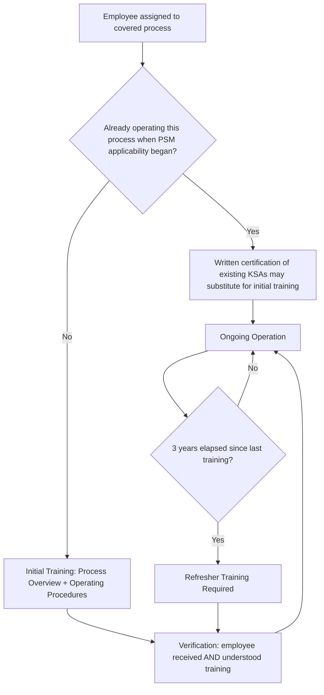

## Training Requirements

### Overview

Training, codified at 1910.119(g), is the fifth PSM element and serves as the mechanism by which the technical content established in Process Safety Information, Process Hazard Analysis, and Operating Procedures is actually transferred to the workforce responsible for safely operating a covered process. Well-documented procedures and thorough hazard analyses provide limited protection if operators are not adequately trained to understand, internalize, and correctly apply them — training is the element that closes the gap between documented knowledge and demonstrated operational competency.

---

### Regulatory Structure: Two Distinct Training Populations

1910.119(g) distinguishes between initial training for current and new employees and refresher training, with distinct requirements for each:

| Training Category | Regulatory Cite | Applicability |
| --- | --- | --- |
| Initial Training | 1910.119(g)(1) | Each employee presently involved in operating a process, and each employee before being involved in operating a newly assigned process |
| Refresher Training | 1910.119(g)(1)(iii) | All employees involved in operating a process, provided at least every three years |

**Key Points**

- Initial training applies both to existing employees (at the time the standard's requirements first apply to their process) and to any employee newly assigned to a covered process — there is no exemption for experienced operators transferring from an uncovered to a covered process without process-specific initial training.
- The three-year refresher training interval is a **maximum** interval, paralleling the PHA five-year revalidation maximum — facilities may and often should provide more frequent refresher training based on process complexity, incident history, or performance observations.
- Unlike PHA revalidation, refresher training is tied to a **fixed calendar interval** applicable to all operating employees, not triggered solely by specific process changes (though MOC-driven changes may separately necessitate targeted supplemental training under 1910.119(g)(1)(i)'s emphasis on operating procedures).

---

### Initial Training Content Requirements (1910.119(g)(1)(i)–(ii))

Initial training must include, at minimum:

1. An overview of the process and its hazards
2. Training in the specific operating procedures developed under 1910.119(f), including safety and health hazards, emergency operations (including shutdown), and safe work practices applicable to the employee's job tasks

**Key Points**

- Training content must be directly and explicitly linked to the facility's own **specific** Operating Procedures — generic industry training on similar processes elsewhere does not satisfy this requirement, since procedures (and therefore training content) must reflect the actual, facility-specific process configuration and hazards.
- Emergency operations and shutdown training is explicitly called out within initial training content, reinforcing the same emphasis found in the Operating Procedures element that emergency response competency cannot be assumed to develop naturally through routine operating experience alone.

---

### Training Methodology and Employee-Determined Approach

- The standard allows employers flexibility in training methodology: employers may use their own employees to provide the training, contract with outside training providers, or use a combination of both.
- For **employees already involved in operating a process at the time the standard's initial applicability requirements take effect**, the employer may certify in writing that the employee has the required knowledge, skills, and abilities to safely carry out the duties and responsibilities as specified in the operating procedures, **in lieu of** initial training — an important provision allowing experienced operators to be grandfathered based on demonstrated competency rather than mandatory retraining on already-familiar processes.

**Key Points**

- The written certification-in-lieu-of-training provision applies specifically to employees already operating the process at the time PSM applicability begins for that process — it is not a general substitute for initial training whenever an employer judges an employee sufficiently experienced.
- This certification must be genuinely substantiated (documented knowledge, skills, and abilities assessment), not a pro forma administrative signature; OSHA enforcement scrutinizes whether such certifications reflect an actual competency basis.

---

### Verification of Understanding (1910.119(g)(2))

The standard requires that the employer **ascertain that each employee involved in operating a process has received and understood the training** required by this paragraph.

**Key Points**

- "Received and understood" establishes a competency verification requirement beyond mere training attendance — employers must have a mechanism (written testing, demonstrated task performance, supervisor evaluation, or similar) confirming comprehension, not merely a training log documenting hours completed.
- This distinguishes PSM training from a purely administrative compliance exercise; the regulatory intent is genuine operator competency, and OSHA enforcement guidance emphasizes that a facility must be able to demonstrate its verification methodology upon inspection.

---

### Diagram: Training Element Structure and Verification Loop

---

### Relationship to Other PSM Elements

| Related Element | Interconnection with Training |
| --- | --- |
| Operating Procedures | Training content is directly derived from and must reflect current, facility-specific procedures |
| Employee Participation | Employees/representatives may provide input on training program design and content adequacy |
| Management of Change | Process or procedure changes affecting operating parameters or hazards should trigger targeted supplemental training, not wait for the next 3-year refresher cycle |
| Contractors | Contractor employees performing covered work are separately addressed under the Contractors element, but training principles (hazard awareness, procedure familiarity) parallel employee training requirements |
| Incident Investigation | Training program adequacy is a common area of scrutiny when investigating incidents involving operator action or inaction |

**Example**

Following an MOC-approved change that alters the emergency shutdown sequence for a reactor (e.g., adding a new automated interlock that changes the operator's manual response role), operators should receive targeted training on the revised emergency shutdown procedure promptly upon implementation — not simply await incorporation into the next scheduled three-year refresher training cycle. A gap between procedural change and corresponding training update creates a period during which trained operator knowledge may not match the actual, current emergency response requirements.

---

### Common Compliance Deficiencies

| Deficiency | Concern |
| --- | --- |
| No documented comprehension verification | Training logs exist, but no test, evaluation, or demonstrated competency check confirms understanding |
| Refresher training exceeding 3-year interval | Direct, straightforward citation basis, analogous to PHA revalidation interval violations |
| Generic/vendor-standard training content | Training materials not tailored to the facility's specific process configuration, hazards, and current operating procedures |
| Certification-in-lieu-of-training misapplied | Written certifications issued without genuine underlying competency assessment, or applied to employees not meeting the "already operating this process" qualifying condition |
| Training not updated following MOC-driven procedure changes | Employees continue operating under prior training assumptions despite a materially changed procedure |
| Contractor/employee training scope confusion | Ambiguity regarding whether contractor personnel performing covered process work have received equivalent hazard and procedure training under the Contractors element |

---

### Enduring Lessons and Modern Relevance

- The explicit requirement to verify that training was "received and understood" — not merely delivered — reflects broader process safety recognition that training completion metrics (hours logged, courses attended) are a weak proxy for actual operator competency, a distinction with parallels to the broader personal-injury-versus-catastrophic-risk metric conflation discussed elsewhere in process safety measurement.
- CSB investigations across multiple incidents have periodically identified gaps between what operators were nominally trained on and what they demonstrably understood or were able to apply correctly under actual operating or emergency conditions, reinforcing the practical importance of genuine comprehension verification rather than administrative training tracking alone.
- The tight required linkage between training content and facility-specific Operating Procedures reinforces that PSM training cannot be fully satisfied through generic industry or vendor training alone — it must be grounded in the actual, current, facility-specific technical and procedural basis established by PSI, PHA, and Operating Procedures.

---

**Related Topics**

- Operating Procedures — direct content basis for Training element requirements
- Competency verification methodologies (written testing, task demonstration, supervisor evaluation)
- Contractors element (1910.119(h)) and contractor training expectations
- Management of Change — triggering supplemental/targeted training outside the refresher cycle
- Human factors and training program design for emergency response competency
- Employee Participation — workforce input on training program adequacy
- Incident Investigation findings related to training and competency gaps
- Certification-in-lieu-of-initial-training — documentation standards and enforcement scrutiny
- Refresher training interval determination — risk-based versus minimum regulatory cycle
- Training program audit expectations under the Compliance Audits element