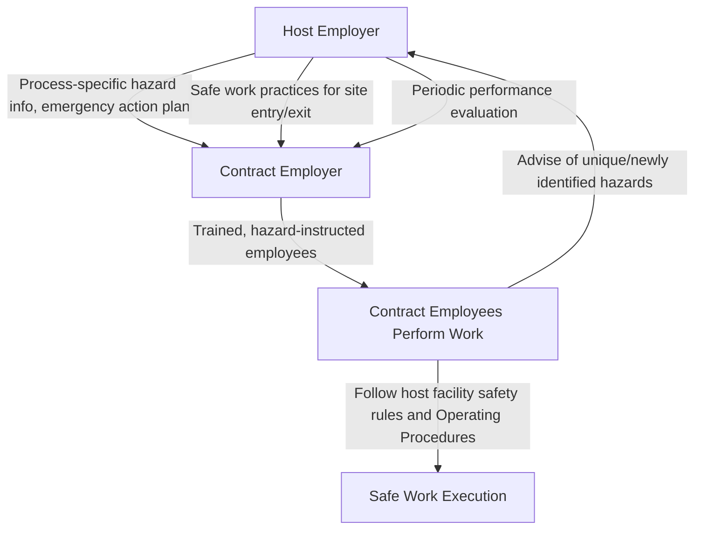

## Contractor Provisions

### Overview

The Contractors element, codified at 1910.119(h), is the sixth PSM element and establishes a bidirectional set of obligations between host employers and contract employers whose personnel perform work in and around covered processes. Contractor personnel — performing maintenance, repair, turnaround, construction, or specialty services — are frequently present at process safety-covered facilities without the same depth of ongoing familiarity with process-specific hazards as permanent site employees, making this element a critical control point for preventing incidents during precisely the activities (maintenance, modification, and repair) that historically triggered major accidents including Flixborough.

---

### Scope and Applicability

1910.119(h)(1) specifies that this element applies to contractors performing maintenance or repair, turnaround, major renovation, or specialty work on or adjacent to a covered process. It explicitly **excludes** contractors providing incidental services that do not influence process safety, such as janitorial work, food and drink services, laundry, and delivery or other supply services.

**Key Points**

- The scope distinction between covered and excluded contractor activities hinges on whether the work could plausibly influence process safety — not simply whether the individual is a contractor rather than a direct employee.
- This exclusion for incidental services reflects a risk-proportionate regulatory design: applying full contractor safety provisions to every third-party service provider on-site (including those with no process safety-relevant interaction) would create compliance burden without corresponding safety benefit.
- Ambiguous cases (e.g., specialty inspection contractors, instrumentation calibration technicians) generally fall within scope, since their work directly relates to safety-critical equipment and systems even if not classified as traditional "maintenance."

---

### Host Employer Responsibilities (1910.119(h)(2))

The host employer (the facility operator) must:

1. Obtain and evaluate information regarding the contract employer's **safety performance and programs** when selecting a contractor
2. **Inform contract employers** of the known potential fire, explosion, or toxic release hazards related to the contractor's work and the process
3. **Explain to contract employers** the applicable provisions of the emergency action plan
4. Develop and implement safe work practices to control the presence, entrance, and exit of contract employers and contract employees in covered process areas
5. **Periodically evaluate** the performance of contract employers in fulfilling their obligations under this section
6. Maintain a **contract employee injury and illness log** related to the contractor's work in process areas

**Key Points**

- The requirement to evaluate contractor safety performance **during selection** (not merely after work begins) establishes a pre-qualification obligation — facilities are expected to have some documented basis for assessing a contractor's safety track record before engaging them for covered process work.
- Hazard communication under this element must be **process-specific**, not generic safety orientation — contractors must be informed of the actual fire, explosion, or toxic release hazards relevant to the specific process area where they will be working.
- The requirement to maintain a contract employee injury/illness log specific to process area work creates a documentation trail that supports both compliance verification and broader incident/near-miss trend analysis across the combined host and contractor workforce operating within covered processes.

---

### Contract Employer Responsibilities (1910.119(h)(3))

The contract employer (the contractor's employing company) must:

1. Ensure that each contract employee is **trained** in the work practices necessary to safely perform their job
2. Ensure that each contract employee is **instructed** in the known potential fire, explosion, or toxic release hazards related to their job and the process, and in applicable emergency action plan provisions
3. **Document** that each contract employee has received and understood the required training
4. Ensure that each contract employee **follows the safety rules** of the facility, including applicable provisions of the Operating Procedures element
5. **Advise the host employer** of any unique hazards presented by the contract employer's work, or of hazards identified by the contract employer's work that were not previously identified by the host employer

**Key Points**

- The training documentation requirement for contract employees mirrors the "received and understood" verification standard applied to host employees under the Training element — administrative attendance records alone are not considered sufficient.
- Item 5 — the contractor's obligation to **advise the host employer** of hazards identified through their own work — establishes a bidirectional information flow, recognizing that contractors performing specialized maintenance or inspection work may identify equipment conditions or hazards the host facility's own personnel had not previously observed.
- This bidirectional hazard communication obligation is a specific regulatory mechanism intended to prevent situations where either party assumes the other has already identified and addressed a given hazard, when in fact neither has done so.

---

### Diagram: Contractor Provision Information Flow

---

### Relationship to Other PSM Elements

| Related Element | Interconnection with Contractor Provisions |
| --- | --- |
| Hot Work Permit | Contractors frequently perform hot work near covered processes; permit requirements apply equally to contract and host employees |
| Mechanical Integrity | Contractors are commonly engaged to perform inspection, testing, and repair activities central to MI program execution |
| Management of Change | Contractor-identified hazards or contractor-recommended modifications may initiate an MOC review |
| Training | Contract employer training obligations parallel host employer training verification standards |
| Emergency Planning and Response | Contractors must be briefed on applicable emergency action plan provisions relevant to their work location |
| Incident Investigation | Incidents involving contract employees require investigation consistent with the same rigor applied to host employee incidents |

**Example**

A specialty contractor engaged to perform ultrasonic thickness testing on process piping under a facility's Mechanical Integrity program identifies unexpected wall thinning in a section not previously flagged for inspection. Under the Contractors element, the contract employer is obligated to advise the host employer of this newly identified condition — triggering, potentially, an engineering evaluation, a Management of Change review if repair or replacement modifies the original design, and possible incorporation of this finding into the facility's broader Mechanical Integrity inspection scope going forward.

---

### Common Compliance Deficiencies

| Deficiency | Concern |
| --- | --- |
| No documented contractor safety pre-qualification | Contractors selected without evidenced evaluation of safety performance/programs |
| Generic rather than process-specific hazard communication | Contractors receive standard site safety orientation without process-specific fire, explosion, or toxic release hazard information |
| Undocumented contractor training verification | Contract employer asserts training occurred without documented "received and understood" verification |
| No periodic contractor performance evaluation | Contractors engaged repeatedly over time without documented ongoing performance review |
| Contract employee injury/illness log not maintained or incomplete | Host employer lacks visibility into contractor safety performance trends within process areas |
| Bidirectional hazard communication gap | Contractor identifies a hazard during their work but no formal mechanism exists to communicate this to the host employer's PSM program |

---

### Enduring Lessons and Modern Relevance

- The Contractors element directly addresses a documented pattern across major process safety incidents: contract and temporary workers often lack the same depth of facility-specific hazard familiarity as permanent employees, yet frequently perform precisely the maintenance, modification, and specialty work most closely associated with historical incident causation (as at Flixborough, where the fatal modification itself was effectively an unreviewed engineering "contract" task performed without adequate process safety oversight).
- The bidirectional hazard communication requirement — contractors informing hosts of newly identified hazards, not merely hosts informing contractors of known hazards — reflects mature recognition that specialized contractor expertise (inspection, testing, particular trade knowledge) can surface conditions the host facility's own routine operations may not have detected.
- Facilities with mature process safety management systems increasingly integrate contractor management directly into broader PSM information systems (shared hazard databases, integrated MOC processes accessible to qualifying contractors, unified incident investigation processes covering both host and contract personnel) to close the historically observed gap between contractor and host employee safety integration. [Inference: the degree of such integration varies substantially across industries and facility sizes and should not be assumed as universal current practice.]

---

**Related Topics**

- Mechanical Integrity — contractor role in inspection, testing, and repair execution
- Hot Work Permit requirements applicable to contractor personnel
- Management of Change — contractor-identified hazards as an MOC trigger
- Training element — parallel comprehension verification standards for contract employees
- Emergency Planning and Response — contractor briefing on emergency action plan provisions
- Contractor safety pre-qualification methodologies and documentation standards
- Incident Investigation scope — parity between host and contract employee incidents
- Contract employee injury/illness log maintenance and trend analysis
- CCPS guidance on contractor safety management within Risk Based Process Safety
- Turnaround and major renovation planning — contractor coordination and oversight