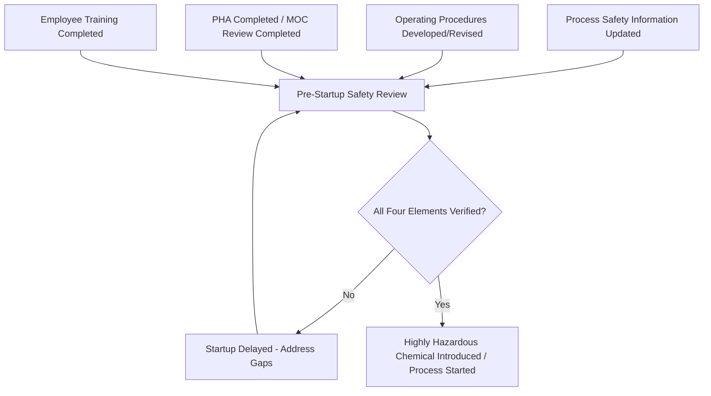

## Pre-Startup Safety Review Requirement

### Overview

Pre-Startup Safety Review (PSSR), codified at 1910.119(i), is the seventh PSM element and functions as the final verification gate before a new or modified process is placed into operation. PSSR is deliberately positioned as the last checkpoint confirming that all preceding PSM elements — Process Safety Information, Process Hazard Analysis, Operating Procedures, Training, and Management of Change — have been properly completed and translated into an actually-safe, ready-to-operate condition, rather than remaining as paperwork disconnected from physical and operational reality.

---

### Regulatory Trigger Conditions (1910.119(i)(1))

PSSR is required for new facilities and for modified facilities when the modification is significant enough to require a change in the Process Safety Information. Specifically, the standard requires PSSR confirmation prior to introducing a highly hazardous chemical into a process for:

1. **New facilities**
2. **Modified facilities when the modification is significant enough to require a change in process safety information**

**Key Points**

- PSSR is not triggered by every minor modification — the threshold is whether the change is significant enough to require an update to Process Safety Information, directly linking PSSR applicability to the Management of Change and PSI elements.
- This creates an important compliance interpretation point: facilities must have a clear, documented basis for determining when a modification crosses the "significant enough to require PSI change" threshold, since under-triggering PSSR for changes that should have qualified is a recognized enforcement concern.
- New facility PSSR applies to the initial commissioning of any newly constructed covered process, ensuring the same verification rigor applies to greenfield construction as to modifications of existing operating processes.

---

### The Four Mandatory PSSR Verification Elements (1910.119(i)(2))

Before startup, the PSSR must confirm the following:

| # | Verification Requirement | Purpose |
| --- | --- | --- |
| 1 | Construction and equipment is in accordance with design specifications | Confirms as-built condition matches the engineered design basis |
| 2 | Safety, operating, maintenance, and emergency procedures are in place and are adequate | Confirms Operating Procedures element outputs are complete and current for the process as it will actually operate |
| 3 | For new facilities, a PHA has been performed and recommendations have been resolved or implemented before startup; for modified facilities, the change has been properly reviewed and evaluated in accordance with management of change requirements | Confirms hazard analysis and change control obligations have been genuinely fulfilled, not merely initiated |
| 4 | Training of each employee involved in operating the process has been completed | Confirms the Training element has been executed for personnel who will operate the modified or new process |

**Key Points**

- Requirement #3 contains an important asymmetry: for **new facilities**, PSSR confirms PHA recommendations have been resolved **or implemented** before startup — a notably strict standard, since "resolved" could include a documented decision not to implement a specific recommendation with adequate justification, while for **modified facilities**, PSSR confirms the modification has been reviewed under Management of Change, linking directly to that element's own resolution and documentation requirements.
- PSSR functions as an integrative checkpoint precisely because it requires simultaneous confirmation across four otherwise-separate PSM elements (equipment/design verification, procedures, hazard analysis/MOC, and training) — a gap in any single element should, in principle, be caught at this final gate before hazardous chemicals are introduced.
- The requirement that training "has been completed" (not merely scheduled or in progress) means PSSR cannot be satisfied while operator training remains outstanding, even if all other verification elements are complete.

---

### Diagram: PSSR as an Integrative Verification Gate

---

### PSSR in Practice: Typical Process Flow

1. **Trigger identification**: A new facility completes construction, or an MOC-approved modification is determined to require a PSI update.
2. **PSSR team formation**: Typically includes operations, engineering, maintenance, and process safety personnel with relevant knowledge of the specific process and change.
3. **Field verification (walkdown)**: The team physically inspects the constructed or modified equipment against design drawings and specifications, checking for construction/installation discrepancies.
4. **Documentation review**: Confirms updated P&IDs, revised operating procedures, completed PHA/MOC documentation, and training records are all in place and consistent with the as-built condition.
5. **Sign-off and authorization**: Formal documented approval that all four verification requirements are satisfied, authorizing introduction of hazardous chemicals or process startup.
6. **Startup**: Only proceeds following PSSR sign-off; any identified gaps must be resolved before authorization is granted, or startup is delayed until resolution.

**Example**

A facility completes an MOC-approved installation of a new relief valve with a higher set pressure to address a previously identified overpressure scenario. Before reintroducing process fluid, the PSSR team must verify: the physically installed relief valve matches the specified set pressure and sizing in the updated design documentation; the emergency and operating procedures have been revised to reflect the new relief valve's characteristics; the MOC review documentation confirms the change was properly evaluated (rather than a full new PHA, since this is a modification, not a new facility); and that operators have completed training on any resulting procedural changes. Only once all four are confirmed does PSSR authorize startup.

---

### Common Compliance Deficiencies

| Deficiency | Concern |
| --- | --- |
| PSSR skipped for changes deemed "minor" without documented justification | Facility fails to apply a consistent, defensible threshold for what constitutes "significant enough to require a PSI change" |
| Field conditions not verified against design specifications | PSSR conducted as a documentation review only, without physical walkdown confirming as-built accuracy |
| Training verification treated as a formality | Training records checked for existence but not for actual completion by all relevant operating personnel before startup |
| PHA/MOC recommendations pending at time of startup | Startup proceeds despite outstanding, unresolved hazard analysis or change review action items |
| PSSR team lacking appropriate cross-functional representation | Review conducted by a single discipline (e.g., engineering only) without operations or maintenance input needed to catch practical implementation gaps |
| PSSR treated as a one-time gate rather than genuinely blocking authority | Organizational or schedule pressure leads to startup proceeding despite incomplete PSSR verification, undermining its intended function as a hard checkpoint |

---

### Relationship to Other PSM Elements

| Related Element | Interconnection with PSSR |
| --- | --- |
| Management of Change | PSSR verifies MOC review completion for modified facilities; MOC's own resolution/documentation requirements feed directly into PSSR criterion #3 |
| Process Hazard Analysis | For new facilities, PSSR verifies PHA recommendations have been resolved or implemented |
| Operating Procedures | PSSR verifies procedures are in place and adequate for the process as constructed/modified |
| Training | PSSR verifies training completion for personnel who will operate the new/modified process |
| Process Safety Information | PSSR verification of construction/equipment is explicitly measured against the design specifications documented under PSI |
| Mechanical Integrity | Field verification during PSSR often overlaps with MI-relevant equipment installation and commissioning checks |

---

### Enduring Lessons and Modern Relevance

- PSSR's function as a final integrative gate directly reflects the Flixborough lesson in reverse: had a PSSR-equivalent verification step existed and been genuinely enforced before the modified bypass piping was returned to service, the mismatch between the unreviewed, undocumented modification and any semblance of engineering verification would likely have been caught before catastrophic failure.
- The distinction between new-facility PSSR (requiring PHA resolution/implementation) and modified-facility PSSR (requiring MOC completion) reflects a deliberate regulatory recognition that these two startup scenarios carry different verification burdens appropriate to their differing scope and novelty.
- PSSR's practical effectiveness depends heavily on genuine organizational willingness to delay startup when gaps are identified — schedule and production pressure to proceed despite incomplete verification is a recognized organizational risk factor that can erode PSSR's intended function as a hard safety gate, a concern echoed in various incident investigation findings regarding startup-related events across the industry. [Inference: the specific frequency or prevalence of this pressure-driven erosion is not quantifiable from a single source and reflects a general pattern noted across multiple incident investigations rather than a universal finding.]

---

**Related Topics**

- Management of Change — MOC resolution as a PSSR trigger and prerequisite
- Process Hazard Analysis — recommendation resolution/implementation standards for new facilities
- Startup following turnaround or emergency shutdown — overlap with PSSR verification
- Field walkdown methodology and as-built verification practices
- Training completion verification standards
- Mechanical Integrity — commissioning and installation verification overlap
- PSSR team composition and cross-functional review best practices
- Organizational pressure and schedule-driven safety gate erosion
- Flixborough disaster — retrospective application of PSSR-equivalent verification
- Process Safety Information updates required to trigger PSSR applicability