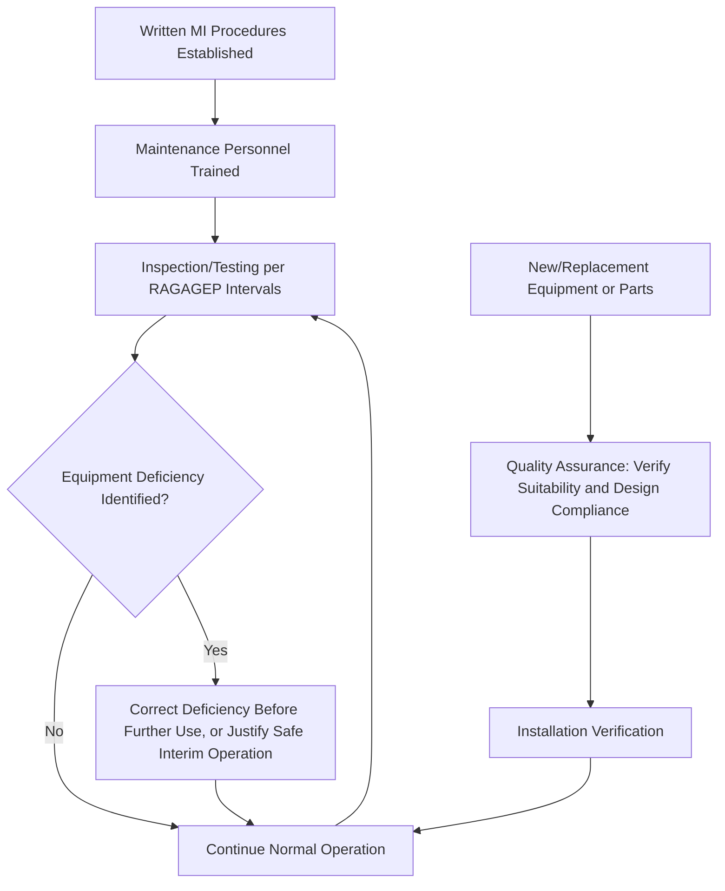

## Mechanical Integrity Requirements

### Overview

Mechanical Integrity (MI), codified at 1910.119(j), is the eighth PSM element and addresses the ongoing physical condition of safety-critical process equipment over its operating lifetime. Where PSI documents the equipment's design basis and PHA identifies hazards, MI ensures that equipment continues to perform its intended safety function as it ages, corrodes, fatigues, and is exposed to process conditions — directly addressing the root cause pattern seen at Flixborough (an undetected crack that precipitated a hazardous modification) and reinforced by numerous subsequent incidents where equipment degradation went undetected or unaddressed until failure occurred.

---

### Covered Equipment (1910.119(j)(1))

The Mechanical Integrity element applies to the following equipment types:

| Equipment Category | Examples |
| --- | --- |
| Pressure vessels and storage tanks | Reactors, distillation columns, storage tanks |
| Piping systems (including piping components such as valves) | Process piping, block valves, check valves |
| Relief and vent systems and devices | Pressure relief valves, rupture disks, flare systems |
| Emergency shutdown systems | Automated shutdown interlocks and associated instrumentation |
| Controls (including monitoring devices and sensors, alarms, and interlocks) | Pressure/temperature/level transmitters, alarm systems |
| Pumps | Process pumps handling highly hazardous chemicals |

**Key Points**

- MI's scope is defined by equipment **function** within a covered process, not by equipment type in isolation — the same category of pump or valve might be MI-covered in one application and not another, depending on whether it is part of a covered process as defined under the standard's applicability provisions.
- The explicit inclusion of relief and vent systems as MI-covered equipment directly addresses a documented historical gap: Seveso's uncontrolled atmospheric venting occurred partly because the relief system's design and ongoing condition were not subject to the kind of systematic verification MI now requires.
- Emergency shutdown systems and associated instrumentation are explicitly covered, recognizing that a safety system is only as reliable as its ongoing mechanical and functional condition — a poorly maintained interlock provides a false sense of protection.

---

### The Five Core MI Program Components

1910.119(j)(2)–(j)(6) establish five interconnected program requirements:

#### 1. Written Procedures (1910.119(j)(2))

Employers must establish and implement written procedures to maintain the ongoing integrity of covered process equipment.

#### 2. Training for Process Maintenance Activities (1910.119(j)(3))

Employees involved in maintaining the ongoing integrity of covered equipment must be trained in an overview of the process and its hazards, and trained in the procedures applicable to their job tasks to ensure they can perform their duties safely.

#### 3. Inspection and Testing (1910.119(j)(4))

- Inspections and tests must be performed on covered process equipment.
- Inspection and testing procedures must follow **recognized and generally accepted good engineering practices (RAGAGEP)**.
- The frequency of inspections and tests must be consistent with applicable manufacturers' recommendations and good engineering practices, and more frequently if determined necessary by prior operating experience.
- The employer must document each inspection and test, including the date, the name of the person performing the test/inspection, the serial number or other identifier of the equipment, a description of the inspection/test performed, and the results.

#### 4. Equipment Deficiency Correction (1910.119(j)(5))

Where equipment is found not to be in a condition consistent with its design basis or otherwise deficient, the employer must correct the deficiency before further use, or in a safe and timely manner when necessary means are taken to assure safe operation.

#### 5. Quality Assurance (1910.119(j)(6))

- The employer must assure that equipment as fabricated is suitable for the process application for which it will be used.
- Appropriate checks and inspections must be performed to assure that equipment is installed properly and consistent with design specifications and manufacturer's instructions.
- The employer must assure that maintenance materials, spare parts, and equipment are suitable for the process application for which they will be used.

**Key Points**

- The RAGAGEP linkage in inspection/testing requirements creates the same interpretive dependency on external industry standards (API 510, 570, 653; ASME codes) discussed under Process Safety Information — OSHA's PSM standard does not itself specify inspection intervals, deferring to these consensus documents.
- Quality assurance requirements extend backward into the **supply chain** for spare parts and maintenance materials — using an incorrect or substandard replacement part, even one that appears physically compatible, can constitute an MI program failure if it does not meet the original design specification.
- "Correct the deficiency before further use, or in a safe and timely manner" provides limited operational flexibility for continued operation while a repair is arranged, but requires that any interim continued operation be genuinely justified as safe, not simply a default response to production pressure.

---

### Diagram: Mechanical Integrity Program Cycle

---

### Key RAGAGEP Standards Governing MI Implementation

| Equipment Type | Governing Standard(s) | Publishing Body |
| --- | --- | --- |
| Pressure vessels | API 510 (In-Service Inspection Code) | API |
| Piping systems | API 570 (Piping Inspection Code) | API |
| Atmospheric storage tanks | API 653 (Tank Inspection, Repair, Alteration, and Reconstruction) | API |
| Pressure relief devices | API RP 520, API RP 521, API 576 | API |
| Safety Instrumented Systems | ANSI/ISA-84.00.01 (IEC 61511) | ISA |
| Boiler and pressure vessel design | ASME BPVC (Boiler and Pressure Vessel Code) | ASME |

**Example**

A facility's Mechanical Integrity program for a set of pressure vessels handling anhydrous ammonia would typically apply API 510 to establish inspection scope, methodology (e.g., ultrasonic thickness testing, internal visual inspection), and interval determination based on corrosion rate calculations and prior inspection history. If an inspection reveals wall thickness approaching the calculated minimum required thickness, the MI program requires either repair/replacement before further pressurized use, or a documented, engineering-justified basis (such as a fitness-for-service assessment per API 579) for continued safe operation with an appropriately shortened re-inspection interval.

---

### Common Compliance Deficiencies

| Deficiency | Concern |
| --- | --- |
| Inspection intervals not based on documented RAGAGEP or operating experience | Intervals set arbitrarily or based solely on historical practice without engineering justification |
| Incomplete inspection/test documentation | Missing required elements (date, inspector, equipment identifier, description, results) undermines auditability and trend analysis |
| Deficiencies identified but not tracked to resolution | Backlog of known equipment deficiencies without documented timeline or safety justification for continued operation |
| Inadequate maintenance personnel training | Maintenance staff performing safety-critical inspection/repair tasks without documented process-specific hazard and procedure training |
| Quality assurance gaps in spare parts sourcing | Replacement parts installed without verification against original design specifications, sometimes termed "will-fit" parts substitution |
| MI program scope excluding covered equipment categories | Facility MI program fails to comprehensively address all six covered equipment categories (e.g., overlooking control system instrumentation as MI-covered) |

---

### Relationship to Other PSM Elements

| Related Element | Interconnection with Mechanical Integrity |
| --- | --- |
| Process Safety Information | MI inspection scope and interval determination rely on PSI's materials of construction and design basis documentation |
| Management of Change | Equipment repairs or replacements involving specification changes must be evaluated under MOC before implementation |
| Pre-Startup Safety Review | Equipment installation/commissioning verification during PSSR overlaps with MI quality assurance requirements |
| Contractors | Specialty inspection and testing contractors frequently perform MI-required activities, subject to Contractors element obligations |
| Incident Investigation | Equipment failure incidents commonly trigger review of MI program adequacy, inspection history, and deficiency resolution timeliness |
| Process Hazard Analysis | PHA teams rely on MI program data (inspection history, known degradation mechanisms) to assess equipment failure likelihood scenarios |

---

### Enduring Lessons and Modern Relevance

- Mechanical Integrity's foundational purpose traces directly to Flixborough, where an undetected crack in Reactor 5 — a mechanical integrity failure in the most literal sense — set in motion the sequence of events culminating in the catastrophic bypass pipe failure; a rigorous, RAGAGEP-based inspection program of the kind now mandated might plausibly have identified and addressed that crack before it necessitated an emergency modification.
- The quality assurance requirement extending to spare parts and maintenance materials reflects lessons from numerous industry incidents involving "will-fit" or non-specification replacement parts that appeared adequate but did not meet the original design basis, an area of continued industry attention within Mechanical Integrity program audits.
- Modern MI programs increasingly employ risk-based inspection (RBI) methodologies — prioritizing inspection frequency and rigor based on quantified likelihood and consequence of failure for specific equipment items — as a refinement beyond simple fixed-interval, manufacturer-recommendation-based scheduling, representing an evolution in how RAGAGEP is applied in practice. [Inference: the adoption rate and specific implementation of RBI methodology varies considerably across industries and facility maturity levels, and should not be assumed universal.]

---

**Related Topics**

- API 510, 570, 653 — detailed inspection code requirements and interval methodology
- Risk-Based Inspection (RBI) methodology and prioritization frameworks
- Fitness-for-service assessment (API 579) for equipment with identified degradation
- Safety Instrumented Systems and ANSI/ISA-84.00.01 (IEC 61511) integrity verification
- Management of Change — triggering MOC review for equipment specification changes
- Quality assurance and "will-fit" spare parts substitution risks
- Corrosion mechanisms and inspection methodology selection (UT, RT, visual)
- Contractors performing Mechanical Integrity inspection and testing activities
- Equipment deficiency tracking and resolution timeline documentation
- Flixborough disaster — Mechanical Integrity failure as root cause origin