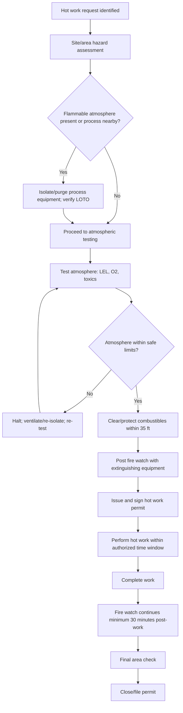
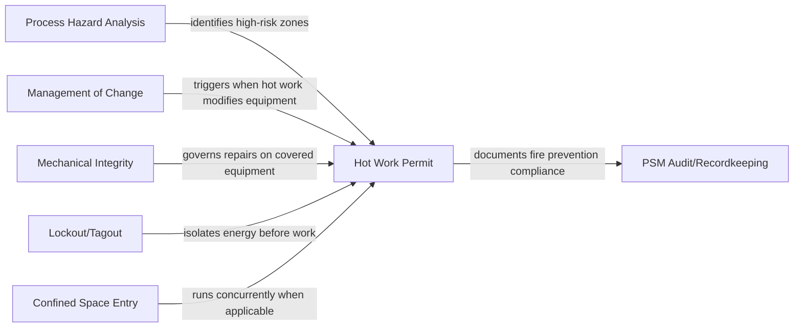

## Hot Work Permit Requirement

### Overview

The Hot Work Permit is a mandatory administrative control required under OSHA's Process Safety Management (PSM) standard, codified at 29 CFR 1910.119(k). It governs any operation involving open flames, welding, cutting, brazing, grinding, or other spark- or heat-producing activity conducted on or near a covered process. The requirement exists to prevent hot work — an activity with an ignition source — from becoming the initiating event of a catastrophic release, fire, or explosion involving highly hazardous chemicals (HHCs).

**Key Points**

- Codified at 29 CFR 1910.119(k), titled "Hot work permit"
- Applies to hot work performed on or near a covered process
- The permit is a physical or electronic authorization document, not merely a verbal approval
- Distinct from, but overlapping with, the general industry hot work standard at 29 CFR 1910.252(a)
- Functions as one of several PSM elements that collectively form the facility's safety management system, alongside Management of Change (MOC), Mechanical Integrity (MI), and Pre-Startup Safety Review (PSSR)

### Regulatory Text and Scope

29 CFR 1910.119(k) states two core obligations:

1. **1910.119(k)(1)**: The employer shall issue a hot work permit for hot work operations conducted on or near a covered process.
2. **1910.119(k)(2)**: The permit shall document that the fire prevention and protection requirements in 29 CFR 1910.252(a) have been implemented prior to beginning the hot work operations; it shall indicate the date(s) authorized for hot work; and it shall identify the object on which hot work is to be performed. The permit shall be kept on file until completion of the hot work operations.

**[Unverified]** The regulatory text does not itself define "hot work" — that definition is inherited from 1910.252(a), which addresses welding, cutting, and brazing generally. In practice, most facility programs extend the definition to cover any spark-, flame-, or heat-producing task, since PSM's underlying intent is prevention of an ignition source near flammable or combustible process materials, not just welding-specific hazards.

### What Counts as Hot Work

Typical activities classified as hot work under a PSM-covered facility's program include:

- Arc welding and cutting
- Oxy-fuel (gas) welding, cutting, and brazing
- Grinding and other spark-producing abrasive work
- Soldering and brazing with open flame
- Use of powder-actuated tools in some programs
- Any temporary operation introducing an open flame, electric arc, or spark-generating friction into an area

**[Inference]** Facilities often also include non-spark heat sources — such as heat guns or open-flame torches used for shrink-wrapping or thawing — under the hot work permit umbrella, since the underlying risk (an ignition source near flammable atmospheres) is the same, even though this extension is a matter of company policy rather than explicit regulatory text.

### Relationship to 29 CFR 1910.252(a)

Section 1910.119(k)(2) directly cross-references 1910.252(a), which sets out the fire prevention and protection requirements applicable to welding, cutting, and brazing. Key elements incorporated by reference include:

- **Fire watch requirements**: A dedicated fire watch must be posted when hot work is performed near combustible materials, when combustibles are more than 35 feet away but easily ignited by sparks, when wall/floor openings could expose combustibles in adjacent areas, or when combustible materials are adjacent to the opposite side of metal walls/ceilings/floors likely to be ignited by conduction.
- **Fire watch duration**: The fire watch must remain for at least 30 minutes after the hot work is completed, to detect and extinguish smoldering fires.
- **Area clearance**: Movable fire hazards must be relocated at least 35 feet away, or protected with fire-resistant covers/guards if relocation is impractical.
- **Fire extinguishing equipment**: Suitable extinguishing equipment must be present and ready at the work location.
- **Combustible atmosphere testing**: Before hot work begins, the area must be checked for flammable/combustible vapor concentrations, particularly relevant in PSM-covered facilities handling HHCs.

### Permit Content Requirements

A compliant hot work permit must document, at minimum:

| Required Element | Regulatory Basis | Purpose |
| --- | --- | --- |
| Confirmation that 1910.252(a) fire prevention requirements are implemented | 1910.119(k)(2) | Ensures fire watch, clearance, and extinguishing equipment are in place before work starts |
| Authorized date(s) for hot work | 1910.119(k)(2) | Prevents indefinite or stale authorizations; ties permit validity to a specific time window |
| Identification of the object/equipment on which hot work is performed | 1910.119(k)2) | Ensures the permit is specific to a location/asset, not a blanket authorization |
| Retention until work completion | 1910.119(k)(2) | Provides an auditable record for the duration of the task |

**[Inference]** Beyond these regulatory minimums, most industry-standard permit forms (following API RP 2009 and NFPA 51B practices) also capture: atmospheric gas testing results (LEL%, O2%, toxic gas readings), isolation/lockout status of nearby equipment, fire watch personnel names, permit issuer and receiver signatures, and permit expiration time (often shift-based, e.g., 8–12 hours) — these are common industry practice rather than explicit OSHA PSM text.

### Typical Hot Work Permit Workflow

### Fire Watch Requirements (Detail)

The fire watch is a named individual whose sole duty during the hot work operation is to monitor for fire hazards. Requirements typically include:

- Trained in the use of available fire extinguishing equipment
- Familiar with facility alarm/notification procedures
- Positioned to observe the work area and any adjacent spaces where sparks or heat conduction could ignite combustibles
- Equipped with a charged extinguisher or hose appropriate to the hazard class
- Remaining on station for a minimum of 30 minutes after hot work concludes, per 1910.252(a)(2)(iii)

**[Inference]** Many PSM facilities extend this monitoring period further (commonly 60 minutes) for hot work performed inside or immediately adjacent to process units handling flammable HHCs, as an added margin beyond the regulatory minimum — this extension reflects internal risk management practice, not an OSHA mandate.

### Interaction with Other PSM Elements

The hot work permit does not operate in isolation. It typically interlocks with:

- **Process Hazard Analysis (PHA)**: Identifies process areas/equipment where hot work poses elevated risk, informing permit-required zones.
- **Mechanical Integrity (MI)**: Hot work on pressure vessels, piping, or tanks (e.g., for repairs) often triggers MI inspection and NDT (non-destructive testing) requirements before/after the work.
- **Management of Change (MOC)**: If hot work is part of a modification to process equipment, an MOC review is generally required in addition to the hot work permit.
- **Lockout/Tagout (1910.147)**: Isolation of energy sources on equipment being hot-worked is frequently a prerequisite step captured on or referenced by the permit.
- **Confined Space Entry (1910.146)**: When hot work occurs inside a permit-required confined space, both permits are typically required concurrently, with atmospheric testing coordinated between programs.

### Example: Permit Scenario

**Example**

A maintenance crew needs to weld a support bracket onto a pipe rack approximately 20 feet from a flammable liquid storage tank within a PSM-covered unit.

Steps the permit process would require:

1. Area assessment confirms the tank is within 35 feet, triggering fire watch requirements under 1910.252(a).
2. Atmospheric testing is conducted near the weld location and near the tank vent, confirming LEL readings below the facility's action threshold (commonly 10% LEL as an industry practice threshold).
3. Combustible materials (rags, wood pallets) within 35 feet are relocated or covered with fire-resistant blankets.
4. A fire watch is posted with a portable extinguisher rated for the expected hazard class.
5. The permit is completed, specifying: the pipe rack as the object of work, the authorized date and time window, confirmation of fire prevention measures, and signatures of the permit issuer and hot work performer.
6. Welding is performed within the authorized window.
7. After work completion, the fire watch remains for at least 30 minutes, then conducts a final visual check.
8. The permit is closed and filed per the facility's PSM recordkeeping requirements.

### Common Compliance Deficiencies

Based on general OSHA enforcement patterns in PSM-covered facilities **[Unverified — specific citation frequencies vary by year and should be confirmed against current OSHA enforcement data]**:

- Permits issued without documented atmospheric testing results
- Fire watch not maintained for the full 30-minute post-work period
- Permit lacking a specific authorized date/time window (open-ended permits)
- Hot work performed outside the permit's authorized time window without re-issuance
- Failure to identify the specific object/equipment on the permit as required by 1910.119(k)(2)
- Permits not retained on file until completion of the hot work operation

### Recordkeeping

The standard requires the permit be **kept on file until completion of the hot work operations**. **[Inference]** In practice, most PSM programs retain hot work permits for a longer period (often 1–5 years, consistent with general PSM recordkeeping practices for related elements like PHA and MI records) to support incident investigation and audit trails, even though the literal regulatory text only specifies retention through job completion.

### Sample Hot Work Permit Structure (svg_diagram)

<svg xmlns="http://www.w3.org/2000/svg" viewBox="0 0 720 480">
<rect x="10" y="10" width="700" height="460" fill="none" stroke="#333" stroke-width="2" />
<text x="360" y="35" text-anchor="middle" font-size="18" font-weight="bold" font-family="sans-serif">Hot Work Permit Structure (svg_diagram)</text>
<line x1="10" y1="50" x2="710" y2="50" stroke="#333" stroke-width="1" />

<text x="30" y="75" font-size="14" font-weight="bold" font-family="sans-serif">1. Identification</text>

<text x="40" y="95" font-size="12" font-family="sans-serif">- Permit number, date issued, expiration time</text>

<text x="40" y="113" font-size="12" font-family="sans-serif">- Object/equipment on which hot work is performed</text>

<text x="40" y="131" font-size="12" font-family="sans-serif">- Exact location / unit / process area</text>

<line x1="10" y1="145" x2="710" y2="145" stroke="#ccc" stroke-width="1" />

<text x="30" y="168" font-size="14" font-weight="bold" font-family="sans-serif">2. Hazard Assessment</text>

<text x="40" y="188" font-size="12" font-family="sans-serif">- Atmospheric test results (LEL %, O2 %, toxic gas ppm)</text>

<text x="40" y="206" font-size="12" font-family="sans-serif">- Nearby process equipment / isolation status</text>

<text x="40" y="224" font-size="12" font-family="sans-serif">- Combustibles within 35 ft: relocated / covered (Y/N)</text>

<line x1="10" y1="238" x2="710" y2="238" stroke="#ccc" stroke-width="1" />

<text x="30" y="261" font-size="14" font-weight="bold" font-family="sans-serif">3. Fire Prevention Measures (1910.252(a))</text>

<text x="40" y="281" font-size="12" font-family="sans-serif">- Fire watch assigned: Name ______________</text>

<text x="40" y="299" font-size="12" font-family="sans-serif">- Extinguishing equipment present and staged (Y/N)</text>

<text x="40" y="317" font-size="12" font-family="sans-serif">- Fire watch duration post-work: minimum 30 minutes</text>

<line x1="10" y1="331" x2="710" y2="331" stroke="#ccc" stroke-width="1" />

<text x="30" y="354" font-size="14" font-weight="bold" font-family="sans-serif">4. Authorization</text>

<text x="40" y="374" font-size="12" font-family="sans-serif">- Authorized date(s) and time window</text>

<text x="40" y="392" font-size="12" font-family="sans-serif">- Issuer signature / Permit receiver signature</text>

<line x1="10" y1="406" x2="710" y2="406" stroke="#ccc" stroke-width="1" />

<text x="30" y="429" font-size="14" font-weight="bold" font-family="sans-serif">5. Closure</text>

<text x="40" y="449" font-size="12" font-family="sans-serif">- Work completion time, final area check, permit filed</text>

</svg>

### Conclusion

The Hot Work Permit requirement under 29 CFR 1910.119(k) is a narrowly worded but operationally significant PSM element. Its regulatory text is brief — essentially three documentation requirements layered onto the pre-existing 1910.252(a) fire prevention framework — but its practical implementation touches nearly every other PSM element, from PHA-identified hazard zones to MOC-triggered repairs to MI-governed equipment integrity. Because ignition-source introduction is one of the most direct pathways to a catastrophic release in a facility handling highly hazardous chemicals, enforcement and audit scrutiny of hot work permitting tends to be strict, and permit quality (completeness of atmospheric testing, fire watch documentation, and time-bound authorization) is a frequent focus of PSM compliance audits.

**Related Topics**

- Fire Watch Duties and Qualifications (29 CFR 1910.252(a))
- Confined Space Entry Permit Interactions with Hot Work
- Lockout/Tagout Coordination with Hot Work Permits
- Mechanical Integrity Requirements for Equipment Undergoing Repair
- Management of Change Triggers for Hot Work-Related Modifications
- Atmospheric Monitoring Instrumentation and LEL Threshold Setting
- Pre-Startup Safety Review Following Hot Work-Related Modifications
- OSHA Enforcement Trends and Citation History for 1910.119(k)