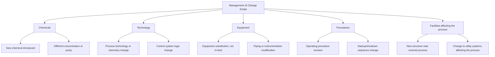
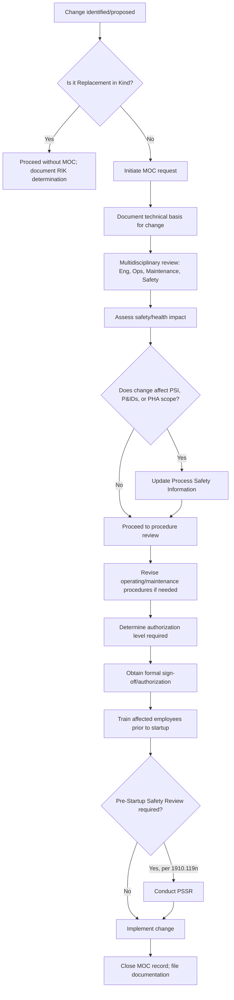
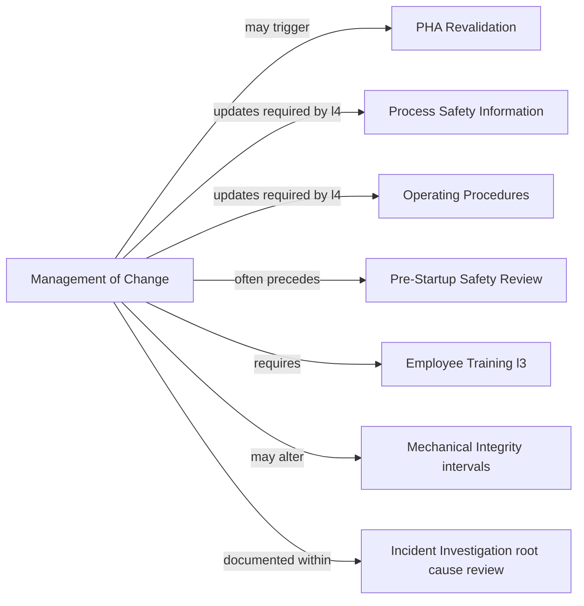

## Management of Change Requirement

### Overview

Management of Change (MOC) is the PSM element codified at 29 CFR 1910.119(l). It requires employers to establish and implement written procedures to manage changes to process chemicals, technology, equipment, and procedures, and changes to facilities that affect a covered process — other than "replacement in kind." MOC exists because uncontrolled or unreviewed changes are a leading root cause of process safety incidents: a substitution, modification, or procedural tweak that seems minor in isolation can remove a safeguard, introduce an incompatible material, or invalidate a design assumption that the original Process Hazard Analysis (PHA) relied upon.

**Key Points**

- Codified at 29 CFR 1910.119(l), titled "Management of change"
- Applies to changes in: chemicals, technology, equipment, procedures, and facilities affecting a covered process
- "Replacement in kind" (RIK) is explicitly excluded from the MOC requirement
- MOC review must precede the change, not follow it
- Employees who operate/maintain the affected process must be informed of and, where necessary, trained on the change before startup
- Considered one of the most frequently cited PSM elements in OSHA enforcement history **[Unverified — specific citation ranking should be confirmed against current OSHA National Emphasis Program data]**

### Regulatory Text

29 CFR 1910.119(l) contains four subparagraphs:

1. **1910.119(l)(1)**: The employer shall establish and implement written procedures to manage changes (except for "replacement in kind") to process chemicals, technology, equipment, and procedures; and, changes to facilities that affect a covered process.
2. **1910.119(l)(2)**: The procedures shall assure that the following considerations are addressed prior to any change: (i) the technical basis for the proposed change; (ii) impact of the change on safety and health; (iii) modifications to operating procedures; (iv) necessary time period for the change; and (v) authorization requirements for the proposed change.
3. **1910.119(l)(3)**: Employees involved in operating a process and maintenance and contract employees whose job tasks will be affected by a change shall be informed of, and trained in, the change prior to start-up of the process or affected part of the process.
4. **1910.119(l)(4)**: If a change covered by this paragraph results in a change in the process safety information required by paragraph (d) of this section, such information shall be updated accordingly. Similarly, if a change covered by this paragraph results in a change in the operating procedures or practices required by paragraph (f) of this section, such procedures or practices shall be updated accordingly.

### Defining "Replacement in Kind"

The RIK exclusion is central to scoping MOC correctly, and is also one of its most misapplied provisions in practice.

**[Inference]** OSHA's general interpretation (consistent across compliance directives and enforcement guidance) treats a replacement as "in kind" only when it is identical in specification — same material, dimensions, materials of construction, rated capacity, and performance characteristics — as the item being replaced. Any deviation from the original specification, even one that appears to be an "upgrade," is treated as a change requiring MOC review, because the deviation was not evaluated against the process's original design basis or hazard analysis.

Common RIK misapplication examples:

- Replacing a valve with one of a different material rating, even if "better" — not RIK
- Replacing a gasket with a different elastomer compound — not RIK
- Upgrading a control system's firmware version that alters logic behavior — not RIK
- Substituting a raw material supplier where the chemical composition differs even slightly — not RIK
- Replacing a failed pump with the exact same make, model, and specification — RIK

### Categories of Change Covered

**[Inference]** "Technology" changes are broader than equipment changes — they include changes to the chemistry, reaction pathway, or process control philosophy itself, not just physical hardware. This distinction matters because a technology change often demands a more rigorous PHA revalidation than a like-category equipment swap.

### The Five Required MOC Considerations

Per 1910.119(l)(2), every MOC review must document consideration of:

| # | Consideration | Practical Meaning |
| --- | --- | --- |
| 1 | Technical basis for the change | Engineering justification: why the change is needed and what it's expected to accomplish |
| 2 | Impact on safety and health | Hazard evaluation of the change itself — does it introduce new risks, remove a safeguard, or alter a previously analyzed scenario? |
| 3 | Modifications to operating procedures | Whether existing SOPs need revision to reflect the change |
| 4 | Necessary time period for the change | Whether the change is permanent or temporary, and the duration for which any temporary change is authorized |
| 5 | Authorization requirements | Who must review and approve the change before implementation (typically a multidisciplinary review, e.g., process engineering, operations, maintenance, and safety) |

**[Inference]** Many facilities implement the "impact on safety and health" consideration using a structured risk assessment tool (e.g., a simplified what-if analysis, checklist, or risk matrix) scaled to the complexity of the change, since the regulation itself does not mandate a specific methodology — only that the impact be addressed.

### Temporary vs. Permanent Changes

MOC programs typically distinguish between:

- **Permanent changes**: Intended to remain in place indefinitely; process safety information (PSI), P&IDs, and operating procedures are updated to reflect the new baseline.
- **Temporary changes**: Intended for a defined, limited duration (e.g., a temporary bypass during a turnaround, or a jumper installed during troubleshooting).

**[Inference]** Temporary MOCs commonly carry an explicit expiration date and require the item to be restored to its original configuration, or converted to a permanent MOC, before that date. A frequent audit finding **[Unverified]** is temporary changes that quietly become permanent without ever being re-reviewed or formally converted — sometimes called "temporary-permanent" changes — which represents a significant compliance gap because the original review's stated time boundary is violated.

### MOC Workflow

### Interaction with Other PSM Elements

MOC sits at the intersection of nearly every other PSM element, functioning as the control gate through which changes must pass:

- **Process Hazard Analysis (PHA)**: A change may require a focused PHA revalidation, or may need to wait for the facility's next scheduled PHA (required at least every 5 years under 1910.119(e)(6)) depending on risk significance.
- **Process Safety Information (PSI)**: Per 1910.119(l)(4), any change altering PSI (P&IDs, material safety data, equipment specifications) requires that information to be updated.
- **Operating Procedures**: Per 1910.119(l)(4), procedures affected by the change must be revised to remain accurate.
- **Pre-Startup Safety Review (PSSR)**: Under 1910.119(i), a PSSR is required for modified facilities when the modification is significant enough to require an MOC — confirming construction matches design, procedures are in place, and training has occurred before introducing hazardous chemicals.
- **Training**: Employees whose tasks are affected must be trained prior to startup, per 1910.119(l)(3).
- **Mechanical Integrity (MI)**: Equipment changes may alter inspection/testing intervals or acceptance criteria under the facility's MI program.

### Example: MOC in Practice

**Example**

A facility wants to replace a carbon steel pipe segment carrying a corrosive process stream with a stainless steel segment of the same diameter, believing this to be an improvement.

Applying the MOC process:

1. **RIK determination**: Because the material of construction differs from the original design basis, this is NOT a replacement in kind, even though it appears to be an upgrade.
2. **Technical basis**: Documented rationale — corrosion monitoring data showed accelerated wall-thickness loss in the original carbon steel segment.
3. **Safety/health impact**: Engineering evaluates whether stainless steel is chemically compatible with the process stream (avoiding, for example, chloride-induced stress corrosion cracking in certain stainless grades), and whether the change affects flange ratings, weld procedures, or the pipe's stress analysis at connection points.
4. **PSI update**: P&IDs and the piping specification are updated to reflect the new material of construction.
5. **Procedure impact**: Operating procedures are checked for material-specific references (e.g., cleaning agents used during maintenance that are compatible with carbon steel but not certain stainless grades).
6. **Authorization**: A qualified engineer and process safety representative sign off, per the facility's authorization matrix for piping changes.
7. **Training**: Maintenance personnel are briefed on the new material's inspection requirements (e.g., different NDT techniques for stainless vs. carbon steel).
8. **PSSR**: Because the change is significant enough to affect operating conditions, a PSSR confirms the installation matches the updated design before the segment is placed back into hazardous service.
9. **MI update**: The mechanical integrity inspection plan is revised to reflect stainless steel's different corrosion mechanisms and inspection intervals.

### Common Compliance Deficiencies

**[Unverified — general enforcement pattern, not tied to a specific citation dataset]**

- Changes implemented without any MOC documentation ("undocumented change")
- MOC reviews that document approval but omit one or more of the five required considerations under (l)(2)
- Process Safety Information not updated to reflect an approved change, violating (l)(4)
- Employees not trained on the change prior to startup, violating (l)(3)
- Temporary changes exceeding their authorized duration without re-review
- Inconsistent or informal RIK determinations made by personnel without engineering authority to do so
- MOC scope excluding organizational/staffing changes that affect a covered process — a frequently debated gray area, since OSHA has historically taken the position that staffing level changes affecting a covered process can fall within MOC's intent, even though the regulatory text focuses on chemicals, technology, equipment, and procedures

### Organizational/Staffing Changes as a Special Case

**[Speculation]** Whether organizational and staffing changes (e.g., reduced shift staffing, elimination of a position responsible for a safety-critical task) must be run through MOC has been a recurring point of interpretation and litigation in PSM enforcement history. Some interpretations extend MOC's intent to cover situations where a staffing change effectively alters how a covered process is safely operated or monitored, even though "chemicals, technology, equipment, and procedures" does not explicitly name staffing. Facilities vary considerably in whether and how they incorporate organizational change review into their MOC program; this is an area where consulting current OSHA interpretation letters and the applicable compliance directive is recommended rather than relying on a fixed rule.

### Sample MOC Form Structure (svg_diagram)

<svg xmlns="http://www.w3.org/2000/svg" viewBox="0 0 720 500">
<rect x="10" y="10" width="700" height="480" fill="none" stroke="#333" stroke-width="2" />
<text x="360" y="35" text-anchor="middle" font-size="18" font-weight="bold" font-family="sans-serif">MOC Request Form Structure (svg_diagram)</text>
<line x1="10" y1="50" x2="710" y2="50" stroke="#333" stroke-width="1" />

<text x="30" y="75" font-size="14" font-weight="bold" font-family="sans-serif">1. Change Identification</text>

<text x="40" y="95" font-size="12" font-family="sans-serif">- MOC number, date submitted, requester</text>

<text x="40" y="113" font-size="12" font-family="sans-serif">- Process/unit affected; equipment tag numbers</text>

<text x="40" y="131" font-size="12" font-family="sans-serif">- Change category: chemical / technology / equipment / procedure / facility</text>

<text x="40" y="149" font-size="12" font-family="sans-serif">- RIK determination: Yes/No, with justification</text>

<line x1="10" y1="163" x2="710" y2="163" stroke="#ccc" stroke-width="1" />

<text x="30" y="186" font-size="14" font-weight="bold" font-family="sans-serif">2. Technical Basis (l2i)</text>

<text x="40" y="206" font-size="12" font-family="sans-serif">- Reason for change / engineering justification</text>

<line x1="10" y1="220" x2="710" y2="220" stroke="#ccc" stroke-width="1" />

<text x="30" y="243" font-size="14" font-weight="bold" font-family="sans-serif">3. Safety and Health Impact (l2ii)</text>

<text x="40" y="263" font-size="12" font-family="sans-serif">- Hazard evaluation / risk assessment results</text>

<text x="40" y="281" font-size="12" font-family="sans-serif">- PHA revalidation needed: Yes/No</text>

<line x1="10" y1="295" x2="710" y2="295" stroke="#ccc" stroke-width="1" />

<text x="30" y="318" font-size="14" font-weight="bold" font-family="sans-serif">4. Procedure Impact (l2iii)</text>

<text x="40" y="338" font-size="12" font-family="sans-serif">- Operating/maintenance procedures requiring revision</text>

<line x1="10" y1="352" x2="710" y2="352" stroke="#ccc" stroke-width="1" />

<text x="30" y="375" font-size="14" font-weight="bold" font-family="sans-serif">5. Duration (l2iv)</text>

<text x="40" y="395" font-size="12" font-family="sans-serif">- Permanent or Temporary (expiration date if temporary)</text>

<line x1="10" y1="409" x2="710" y2="409" stroke="#ccc" stroke-width="1" />

<text x="30" y="432" font-size="14" font-weight="bold" font-family="sans-serif">6. Authorization (l2v)</text>

<text x="40" y="452" font-size="12" font-family="sans-serif">- Required reviewers/approvers; signatures and dates</text>

<text x="40" y="470" font-size="12" font-family="sans-serif">- PSSR required: Yes/No; Training completed: Yes/No</text>

</svg>

### Conclusion

Management of Change is arguably the connective tissue of the PSM standard: it is the mechanism that keeps process safety information, operating procedures, and hazard analyses synchronized with the physical and organizational reality of the plant over time. Its regulatory text is compact — a single paragraph with four subparts — but its scope is deliberately broad, covering chemicals, technology, equipment, procedures, and facility changes, while carving out only true replacement-in-kind. Because MOC failures (an unreviewed substitution, an undocumented bypass, an unrevised procedure) are frequently identified as root or contributing causes in major process safety incidents, this element receives sustained regulatory and industry scrutiny, and rigorous RIK determination discipline is widely regarded as one of the highest-leverage practices for MOC program integrity.

**Related Topics**

- Replacement in Kind (RIK) Determination Criteria and Documentation
- Pre-Startup Safety Review (PSSR) Requirements (29 CFR 1910.119(i))
- Process Hazard Analysis Revalidation Triggers
- Process Safety Information Update Obligations (29 CFR 1910.119(d))
- Temporary Change Tracking and Expiration Controls
- Organizational and Staffing Change Interpretation under PSM
- Incident Investigation Root Cause Analysis and MOC Failures
- Mechanical Integrity Program Interaction with Equipment Changes