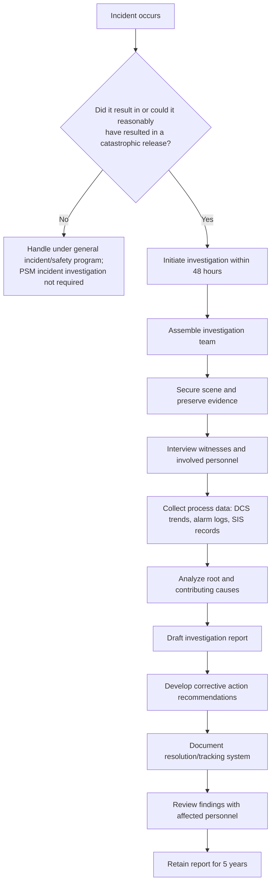
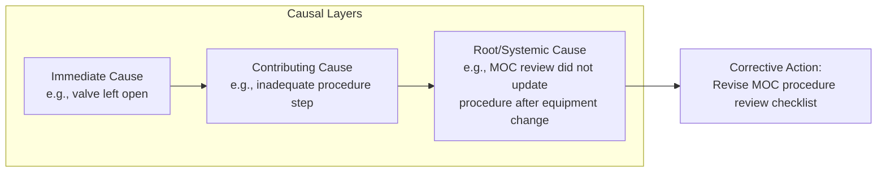
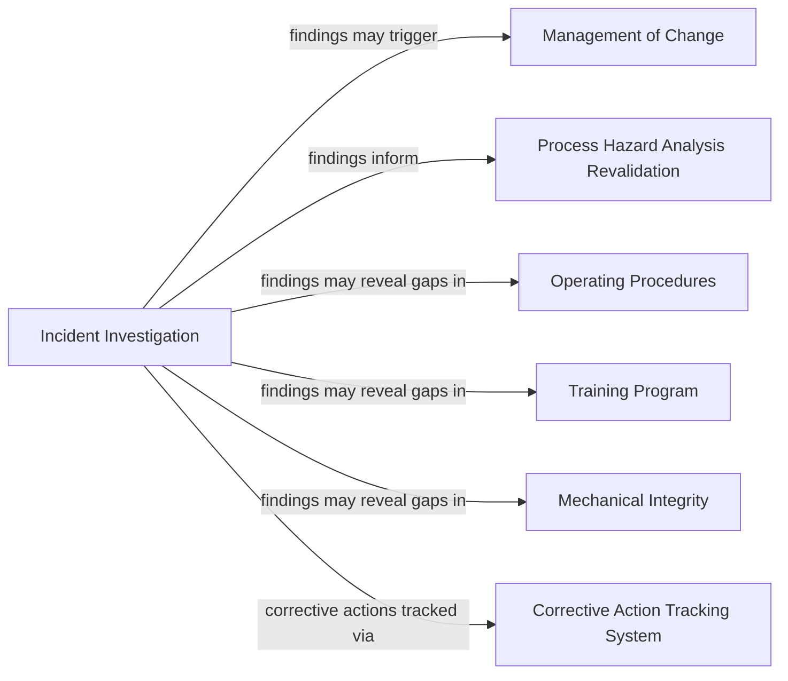

## Incident Investigation Requirement

### Overview

Incident Investigation is the PSM element codified at 29 CFR 1910.119(m). It requires employers to investigate incidents that resulted in, or could reasonably have resulted in, a catastrophic release of a highly hazardous chemical (HHC) in a covered process. Unlike reactive incident reporting systems that only capture events with actual injury or loss, this element explicitly extends to **near misses** — incidents that could reasonably have resulted in a catastrophic release even if no release, injury, or damage actually occurred. This near-miss inclusion is one of the most operationally significant aspects of the requirement, since it obligates employers to investigate close calls, not just realized losses.

**Key Points**

- Codified at 29 CFR 1910.119(m), titled "Incident investigation"
- Scope includes actual catastrophic releases AND near-miss events that could reasonably have resulted in a catastrophic release
- Investigation must be initiated within 48 hours of the incident
- A specific set of minimum content elements is required in the investigation report
- Findings must be reviewed with affected employees, and reports retained for five years

### Regulatory Text and Scope

29 CFR 1910.119(m) contains seven subsections:

1. **1910.119(m)(1)**: The employer shall investigate each incident which resulted in, or could reasonably have resulted in, a catastrophic release of highly hazardous chemical in the workplace.
2. **1910.119(m)(2)**: An incident investigation shall be initiated as promptly as possible, but not later than 48 hours following the incident.
3. **1910.119(m)(3)**: An incident investigation team shall be established and consist of at least one person knowledgeable in the process involved, including a contract employee if the incident involved work of the contractor, and other persons with appropriate knowledge and experience to thoroughly investigate and analyze the incident.
4. **1910.119(m)(4)**: A report shall be prepared at the conclusion of the investigation which includes at a minimum: (i) date of incident; (ii) date investigation began; (iii) a description of the incident; (iv) the factors that contributed to the incident; and (v) any recommendations resulting from the investigation.
5. **1910.119(m)(5)**: The employer shall establish a system to promptly address and resolve the incident report findings and recommendations. Resolutions and corrective actions shall be documented.
6. **1910.119(m)(6)**: The report shall be reviewed with all affected personnel whose job tasks are relevant to the incident findings, including contract employees where applicable.
7. **1910.119(m)(7)**: Incident investigation reports shall be retained for five years.

### The "Could Reasonably Have Resulted" Threshold

**[Inference]** The near-miss trigger — "could reasonably have resulted in a catastrophic release" — is not defined with a bright-line test in the regulatory text, so facility programs typically operationalize it through internal criteria such as: activation of a safety instrumented function that prevented an overpressure event, a relief valve lift, a loss of containment below reportable-quantity thresholds, or a documented deviation from safe operating limits that was caught and corrected before escalation. This operational threshold-setting is standard PSM program practice rather than an OSHA-specified test, and different facilities may draw the line differently depending on their risk tolerance and PHA-documented consequence scenarios.

Illustrative examples of qualifying incidents:

| Event Type | Investigation Required? | Rationale |
| --- | --- | --- |
| Actual toxic gas release exceeding reportable quantity | Yes | Realized catastrophic release |
| Relief valve lift during an upset, vapor vented to atmosphere without injury | Yes (near miss) | Reasonably could have resulted in catastrophic release absent the relief system functioning |
| Safety instrumented function trips a reactor on high pressure, preventing vessel overpressure | **[Inference]** Typically yes, treated as a near miss | The interlock functioning as designed does not eliminate the fact that failure of that single layer of protection could have resulted in catastrophic consequences |
| Minor first-aid injury unrelated to a covered process (e.g., slip on stairs) | No | Not related to catastrophic release of an HHC |
| Small spill fully contained by secondary containment with no atmospheric release | **[Inference]** Facility-dependent; often investigated as good practice even if the containment worked as intended | Judgment call based on whether containment failure was plausible |

### 48-Hour Initiation Requirement

The investigation must be **initiated** — not necessarily completed — within 48 hours of the incident. **[Inference]** In practice, "initiated" is generally interpreted to mean the investigation team is assembled and evidence-preservation/fact-finding activities have begun (securing the scene, interviewing witnesses, collecting data logs), rather than requiring the full report to be finished within that window; the standard does not specify a completion deadline, only an initiation deadline.

### Investigation Team Composition

1910.119(m)(3) requires the team to include **at least one person knowledgeable in the process involved**, and — if the incident involved contractor work — a contract employee. Beyond that minimum, the team should include personnel with appropriate knowledge and experience to thoroughly investigate and analyze the incident.

**[Inference]** Typical multidisciplinary team composition in industry practice includes: a process/unit engineer, an operations representative (often a shift supervisor or senior operator), a maintenance representative if equipment failure is implicated, an EHS/PSM coordinator, and — depending on incident severity — a corporate or third-party root cause analysis specialist. This composition reflects common practice rather than an explicit OSHA staffing formula.

### Root Cause Analysis Methodologies

While OSHA's text does not mandate a specific investigation methodology, PSM programs typically apply structured root cause analysis (RCA) techniques to satisfy the 1910.119(m)(4)(iv) requirement to identify "factors that contributed to the incident." Commonly used methods include:

- **5 Whys**: Iterative questioning to trace an immediate cause back to underlying systemic factors.
- **Fault Tree Analysis (FTA)**: Deductive, top-down logic diagram tracing how combinations of failures lead to the top event.
- **Fishbone/Ishikawa Diagram**: Categorizes contributing factors (equipment, procedures, people, environment, materials, management systems).
- **TapRooT, Kepner-Tregoe, or proprietary RCA frameworks**: Structured commercial methodologies widely used in process industries.
- **Barrier/Layer of Protection Analysis**: Examines which safeguards (per the facility's LOPA) were breached, degraded, or absent during the event.

**[Inference]** Distinguishing between **immediate causes** (the direct mechanical/human action that triggered the event), **contributing causes** (conditions that enabled the immediate cause), and **root/systemic causes** (underlying management system failures, such as inadequate MOC review or training gaps) is standard RCA practice; the regulatory text uses only the general term "factors that contributed," leaving methodology selection to the employer.

### Minimum Report Content (1910.119(m)(4))

| Required Element | Description |
| --- | --- |
| Date of incident | The date the event occurred |
| Date investigation began | Must be within 48 hours of the incident date |
| Description of the incident | Factual narrative of what occurred, sequence of events |
| Contributing factors | Root cause analysis findings — immediate, contributing, and systemic causes |
| Recommendations | Corrective actions proposed to prevent recurrence |

### Findings Resolution and Tracking (1910.119(m)(5))

The employer must establish a system to **promptly address and resolve** report findings and recommendations, with resolutions and corrective actions documented. **[Inference]** Most facilities implement this through a centralized action-item tracking system (often the same system used for PHA recommendation tracking) that captures: the recommendation, assigned owner, target completion date, status, and verification of completion — this integrated tracking approach is common practice, since PHA, incident investigation, and audit recommendations often draw from overlapping corrective action pools.

### Communication Requirement (1910.119(m)(6))

The report must be reviewed with **all affected personnel** whose job tasks are relevant to the findings, including contract employees where applicable. This mirrors the training/communication philosophy found elsewhere in PSM (e.g., MOC training under 1910.119(l)(3)) — findings that are not communicated to the people who do the affected work cannot meaningfully change future behavior or system performance.

### Recordkeeping (1910.119(m)(7))

Reports must be retained for **five years**. This is longer than the retention period implied for some other PSM records and reflects the safety-critical, precedent-setting nature of incident investigation findings — five-year-old investigation reports often remain relevant inputs to PHA revalidation cycles (which themselves occur on a nominal 5-year cycle under 1910.119(e)(6)).

### Interaction with Other PSM Elements

- **PHA**: Incident investigation findings are a required input when revalidating a PHA — an incident that reveals an unaddressed hazard or an ineffective safeguard should prompt reconsideration of the PHA's risk ranking or safeguard assumptions.
- **MOC**: If a corrective action involves a physical, procedural, or technological change, it must be routed through the MOC process rather than implemented informally.
- **Operating Procedures/Training**: If contributing factors include inadequate procedures or insufficient operator training, updates to 1910.119(f) procedures and 1910.119(g) training programs are common corrective actions.
- **Mechanical Integrity**: If equipment failure is a contributing factor, MI inspection frequencies, testing protocols, or preventive maintenance tasks may require revision.

### Example: Investigation Scenario

**Example**

A pressure relief valve on a distillation column lifts during a process upset, venting flammable vapor to atmosphere via a flare header. No injuries occur, and the flare successfully combusts the vented material.

1. **Trigger determination**: Classified as a near-miss incident investigation trigger — the relief event indicates a loss of the primary control layer, and had the flare system failed or been undersized, the vented material could have resulted in a catastrophic release.
2. **48-hour initiation**: Investigation team assembled within 24 hours; scene evidence (DCS trend data, alarm/event logs, relief valve set pressure records) secured immediately.
3. **Team composition**: Process engineer (process knowledge), operations shift supervisor, instrumentation/controls technician, PSM coordinator.
4. **Root cause analysis**: 5 Whys and DCS trend review reveal the immediate cause was a control valve failing to respond to a level control signal; the contributing cause was a degraded control valve actuator that had been flagged in a prior MI inspection but not yet repaired; the root cause was an MI backlog prioritization gap that deprioritized the repair.
5. **Report content**: Documents date of incident, date investigation began, description of the pressure excursion and relief event, contributing factors (control valve degradation, MI backlog prioritization), and recommendations (expedite MI backlog review criteria, add interim compensating measure).
6. **Resolution tracking**: Recommendations entered into the corrective action tracking system with assigned owners and due dates.
7. **Communication**: Findings reviewed with control room operators, maintenance technicians, and the MI planning team.
8. **Retention**: Report filed and retained for five years, cross-referenced for the unit's next PHA revalidation cycle.

### Common Compliance Deficiencies

**[Unverified — specific enforcement frequency should be confirmed against current OSHA citation data]**, frequently observed incident investigation deficiencies include:

- Near-miss events not investigated because they did not result in an actual release, injury, or property damage
- Investigations initiated after the 48-hour window without documented justification
- Reports lacking clearly identified contributing/root causes, stopping at the immediate cause only
- Corrective action recommendations without documented resolution or completion tracking
- Findings not communicated to shift personnel who were not directly involved but whose tasks are affected
- Incident investigation findings not fed back into PHA revalidation or MOC processes

### Conclusion

The Incident Investigation requirement is PSM's primary organizational learning mechanism — it converts individual failures and near misses into system-level corrective actions before those same conditions produce a catastrophic outcome. Its distinguishing features are the mandatory 48-hour initiation clock, the explicit inclusion of near misses within scope, the minimum five-element report content, and the requirement that findings be resolved, tracked, and communicated rather than simply filed. Because investigation findings frequently reveal gaps traceable to other PSM elements — MOC, PHA, MI, training — this element functions as a feedback loop that keeps the entire PSM system self-correcting over time.

**Related Topics**

- Root Cause Analysis Methodologies for Process Safety Incidents
- Near-Miss Reporting Culture and Threshold-Setting Criteria
- Corrective Action Tracking Systems Across PSM Elements
- Process Hazard Analysis Revalidation Using Incident Data
- Layer of Protection Analysis (LOPA) in Incident Root Cause Findings
- Contractor Involvement in Incident Investigation Teams
- Distinguishing Immediate, Contributing, and Root Causes
- OSHA Recordkeeping Requirements Across PSM Elements