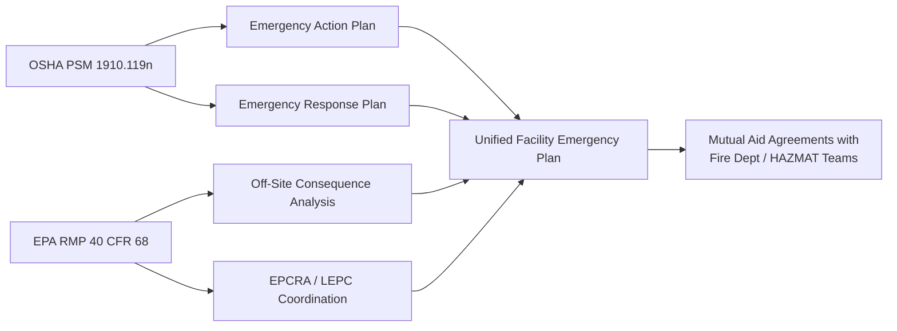

## Emergency Planning and Response Requirement

### Overview

Emergency Planning and Response is the PSM element codified at 29 CFR 1910.119(n). Rather than establishing its own detailed emergency response program requirements, this section operates primarily by **cross-reference**: it requires employers to establish and implement an emergency action plan for the entire plant in accordance with the provisions of 29 CFR 1910.38, and specifies that if the plan requires small releases to be handled, it must also comply with 29 CFR 1910.120 (Hazardous Waste Operations and Emergency Response, HAZWOPER) for emergency response. This makes 1910.119(n) unusual among PSM elements in that its compliance obligations are largely defined by two other, freestanding OSHA standards rather than by novel text within PSM itself.

**Key Points**

- Codified at 29 CFR 1910.119(n), titled "Emergency planning and response"
- Requires an emergency action plan covering the entire plant, per 29 CFR 1910.38
- Triggers 29 CFR 1910.120 (HAZWOPER) obligations if the plan involves employees responding to releases
- Distinguishes between employers who evacuate ("non-emergency responders") and those who conduct emergency response with their own personnel
- Interacts closely with community/off-site emergency planning under EPA's Risk Management Program (RMP) and local emergency planning committees (LEPCs)

### Regulatory Text

29 CFR 1910.119(n) states, in substance: the employer shall establish and implement an emergency action plan for the entire plant in accordance with the provisions of 29 CFR 1910.38. In addition, the emergency action plan shall include procedures for handling small releases. Employers covered under this provision may also be subject to hazardous waste and emergency response provisions contained in 29 CFR 1910.120(a), (p), and (q).

**[Unverified]** The precise cross-reference language ("(a), (p), and (q)") reflects HAZWOPER's own subsection structure covering scope, permit-required confined space program interactions, and emergency response, respectively — facilities should verify the current exact citation structure against the CFR text in effect, since HAZWOPER subsection lettering has been subject to periodic OSHA revision.

### Two Response Postures Under HAZWOPER (1910.120(q))

The critical compliance fork in this element is determining which of two response postures the facility adopts, because this determines training and program obligations:

1. **Evacuation-only posture ("no responders")**: Facility personnel are instructed to evacuate upon detecting a release and do not attempt to control or contain it. In this posture, the facility relies on 1910.38's basic emergency action plan requirements (alarm systems, evacuation routes, employee accounting) and typically does not trigger full HAZWOPER emergency response training obligations, since no employee is designated to respond to the incident.
2. **Emergency response posture**: The facility designates personnel (an internal emergency response team, fire brigade, or HAZMAT team) to respond to releases. This posture fully triggers 1910.120(q), requiring a written emergency response plan and tiered HAZWOPER training certifications for responders.

```mermaid
flowchart TD
    A[Facility handles HHC covered process] --> B{Will employees respond to releases,<br/>or evacuate only?}
    B -->|Evacuate only| C[Emergency Action Plan per 1910.38]
    C --> D[Alarm systems, evacuation routes,<br/>employee accounting, assembly points]
    D --> E[No HAZWOPER responder training required<br/>for facility employees]
    B -->|Employees respond to releases| F[Emergency Action Plan per 1910.38]
    F --> G[Emergency Response Plan per 1910.120(q)]
    G --> H[Tiered HAZWOPER training by responder level]
    H --> I[Written Emergency Response Program]
```

### HAZWOPER Responder Training Levels (1910.120(q)(6))

For facilities that designate emergency responders, 1910.120(q)(6) establishes five training levels, each with escalating competency requirements:

| Level | Role | Typical Training Hours | Competencies |
| --- | --- | --- | --- |
| First Responder Awareness | Recognizes a release has occurred and notifies authorities | No specific hour minimum; competency-based | Recognize hazardous substances, understand risks, notify appropriate personnel |
| First Responder Operations | Responds defensively without trying to stop the release | Minimum 8 hours | Defensive actions, basic containment (e.g., diking), personal protective equipment use |
| Hazardous Materials Technician | Responds aggressively to stop the release | Minimum 24 hours (in addition to Operations level) | Offensive control actions, chemical/physical property analysis, PPE selection |
| Hazardous Materials Specialist | Provides support to technicians, specific chemical knowledge | Minimum 24 hours (in addition to Technician level) | Advanced chemical knowledge, liaison with regulatory agencies |
| On-Scene Incident Commander | Assumes control of incident scene | Minimum 24 hours (in addition to Operations level) | Incident Command System (ICS) implementation, overall incident management |

**[Inference]** These hour minimums represent HAZWOPER's baseline training requirements; many PSM-covered facilities exceed these minimums substantially, particularly for Technician-level responders handling complex HHCs, since the regulatory minimum represents a floor rather than an indication of adequacy for a given facility's specific hazard profile.

### Emergency Action Plan Elements (Incorporated from 1910.38)

Because 1910.119(n) incorporates 1910.38 by reference, the plant-wide emergency action plan must address, at minimum:

- Procedures for reporting a fire or other emergency
- Procedures for emergency evacuation, including type of evacuation and exit route assignments
- Procedures for employees who remain to operate critical plant operations before evacuating
- Procedures to account for all employees after evacuation is completed
- Rescue and medical duties for employees performing them
- The preferred means of reporting fires and other emergencies
- Names or job titles of persons who can be contacted for further information about the plan

### Emergency Response Program Elements (Incorporated from 1910.120(q))

Where a facility designates responders, the written emergency response plan must address, at minimum:

- Pre-emergency planning and coordination with outside parties (fire department, mutual aid, hospitals)
- Personnel roles, lines of authority, training, and communication
- Emergency recognition and prevention
- Safe distances and places of refuge
- Site security and control
- Evacuation routes and procedures
- Decontamination procedures
- Emergency medical treatment and first aid
- Emergency alerting and response procedures
- Critique of response and follow-up
- PPE and emergency equipment

### Small Release Handling Provision

1910.119(n) specifically calls out that the emergency action plan must include procedures for handling **small releases**. **[Inference]** This is generally interpreted to mean minor, containable leaks or spills that fall short of a full emergency evacuation trigger but still require a defined response — for example, a minor flange leak that can be isolated and contained by trained personnel without invoking full plant evacuation. Facilities typically define quantitative or qualitative thresholds (release rate, quantity, or chemical identity/hazard class) distinguishing a "small release" handled by routine response from a release requiring full emergency response activation, though this threshold-setting is a matter of facility program design rather than an explicit numeric OSHA standard.

### Interaction with EPA Risk Management Program (RMP)

**[Inference]** Facilities covered by OSHA PSM frequently are also covered by EPA's Risk Management Program under 40 CFR Part 68, which has its own (largely parallel) emergency response program requirements. While these are separate regulatory regimes administered by different agencies, most facilities integrate their OSHA 1910.119(n) emergency response program and their EPA RMP emergency response program into a single unified plan to avoid duplicative or conflicting procedures — this integration is standard industry practice rather than an explicit cross-agency mandate, though both agencies' requirements must independently be satisfied.

Community-level coordination typically involves:

- **Local Emergency Planning Committees (LEPCs)**: Established under EPCRA (Emergency Planning and Community Right-to-Know Act), coordinating facility emergency plans with community response capabilities.
- **Off-site consequence analysis**: Required under EPA RMP, informing community notification and mutual aid planning.
- **Mutual aid agreements**: Formal arrangements with neighboring facilities, municipal fire departments, and HAZMAT teams for response support beyond internal capability.



### Training and Drills

**[Inference]** Beyond initial HAZWOPER certification, most facility emergency response programs incorporate periodic refresher training (commonly annual, consistent with 1910.120(q)(8) refresher requirements) and regular emergency drills/exercises to validate the plan's effectiveness — tabletop exercises, functional drills, and full-scale exercises are common industry practice for exercising different levels of plan complexity, though specific drill frequency requirements should be verified against the applicable HAZWOPER subsection and any state-plan equivalents.

### Example: Emergency Response Program Design Scenario

**Example**

A chemical facility processes anhydrous ammonia in a PSM-covered refrigeration system. Facility leadership must decide the response posture and build the corresponding program.

1. **Response posture decision**: Facility elects to maintain an internal HAZMAT team capable of first responder operations-level containment (e.g., isolating a leaking valve) rather than evacuate-only, given the facility's remote location and extended municipal fire department response time.
2. **Training program**: Team members complete First Responder Operations training (minimum 8 hours) plus facility-specific ammonia refrigeration system familiarization exceeding the regulatory minimum.
3. **Emergency action plan**: Documents evacuation routes, assembly points, alarm activation procedures, and accounting methodology for all personnel, per 1910.38.
4. **Emergency response plan**: Documents pre-planning coordination with the local fire department (aware the facility has an internal team but may need mutual aid for escalated events), decontamination procedures for ammonia exposure, PPE requirements (self-contained breathing apparatus, chemical-resistant suits), and incident command structure designating the on-shift supervisor as initial incident commander.
5. **Small release procedure**: A specific procedure addresses minor ammonia odor/leak detection below the facility's defined threshold, allowing trained operators to isolate the source using standard PPE without triggering full site evacuation.
6. **Community coordination**: Facility participates in the LEPC, sharing off-site consequence analysis data and conducting joint drills with the local fire department annually.
7. **Drill program**: Conducts quarterly tabletop exercises and an annual full-scale drill involving simulated ammonia release response and mutual aid activation.

### Common Compliance Deficiencies

**[Unverified — enforcement frequency should be confirmed against current OSHA citation data]**, commonly observed deficiencies include:

- Facility emergency action plans that do not address all elements required under 1910.38 (e.g., missing employee accounting procedures)
- Ambiguity regarding whether facility employees are expected to respond to releases, creating a gap between assumed evacuation-only posture and actual practice
- Responders operating at a HAZWOPER training level inconsistent with the actual tasks they are expected to perform during an incident
- Missing or outdated mutual aid agreements with local fire/HAZMAT resources
- Small release procedures not clearly distinguished from full emergency response triggers, causing confusion during actual incidents
- Lack of documented refresher training or drill records for designated responders

### Conclusion

Emergency Planning and Response under 1910.119(n) functions as PSM's final line of defense — engaged only after prevention (PHA, MOC, MI) and mitigation (safety instrumented systems, relief systems) have failed to prevent an actual or imminent release. Its regulatory structure is distinctive in relying almost entirely on cross-references to 1910.38 and 1910.120 rather than establishing standalone PSM-specific requirements, which means compliance assessment for this element requires fluency in two additional OSHA standards. The most consequential programmatic decision a facility makes under this element is whether its employees will evacuate or respond, since that decision cascades into training level requirements, written program content, and the facility's relationship with external emergency responders and the surrounding community.

**Related Topics**

- HAZWOPER Training Levels and Certification Requirements (29 CFR 1910.120)
- Emergency Action Plan Core Elements (29 CFR 1910.38)
- EPA Risk Management Program Emergency Response Coordination
- Incident Command System (ICS) Implementation in Industrial Settings
- Local Emergency Planning Committee (LEPC) Coordination
- Off-Site Consequence Analysis and Community Notification
- Mutual Aid Agreement Structuring for Industrial Facilities
- Decontamination Procedures for Chemical Release Response