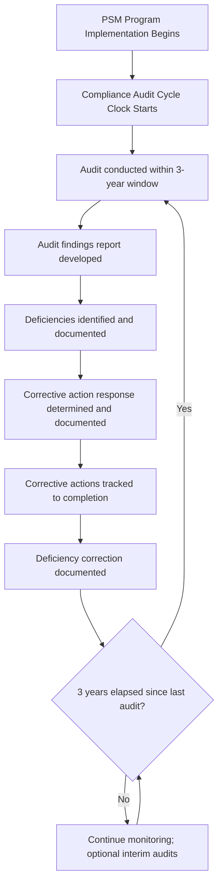
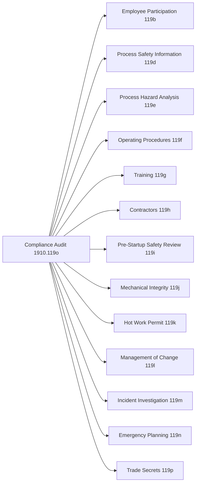
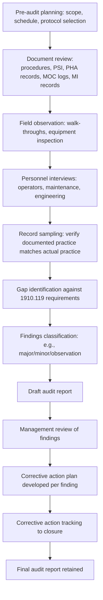

## Compliance Audit Requirement

### Overview

Compliance Audits are the PSM element codified at 29 CFR 1910.119(o). This element requires employers to certify that they have evaluated compliance with the provisions of the entire PSM standard at least every three years, in order to verify that the procedures and practices developed under the standard are adequate and being followed. Unlike most other PSM elements, which govern a specific technical activity (e.g., MOC, MI, PHA), the compliance audit is explicitly a **meta-element** — it audits the performance of all the other elements collectively, functioning as PSM's internal self-verification mechanism.

**Key Points**

- Codified at 29 CFR 1910.119(o), titled "Compliance audits"
- Required at least every three years, to certify that PSM procedures and practices are adequate and being followed
- Must be conducted by at least one person knowledgeable in the process
- A report of findings must be developed
- Deficiencies must be documented and corrective actions tracked to completion
- The two most recent compliance audit reports must be retained

### Regulatory Text

29 CFR 1910.119(o) contains five subsections:

1. **1910.119(o)(1)**: Employers shall certify that they have evaluated compliance with the provisions of this section at least every three years to verify that the procedures and practices developed under the standard are adequate and are being followed.
2. **1910.119(o)(2)**: The compliance audit shall be conducted by at least one person knowledgeable in the process.
3. **1910.119(o)(3)**: A report of the findings of the audit shall be developed.
4. **1910.119(o)(4)**: The employer shall promptly determine and document an appropriate response to each of the findings of the compliance audit, and document that deficiencies have been corrected.
5. **1910.119(o)(5)**: Employers shall retain the two (2) most recent compliance audit reports.

### The Three-Year Audit Cycle

**[Inference]** The three-year interval is a maximum permissible gap between audits rather than a fixed schedule employers must follow rigidly — a facility could audit more frequently (e.g., annually or on a rolling basis covering different elements), but the regulatory floor requires that the entirety of the PSM program be evaluated for compliance no less often than every three years. This distinguishes it from the PHA revalidation cycle (also nominally every 5 years under 1910.119(e)(6)), which follows a similar "not to exceed" structure but with a different interval.

### Auditor Qualification Requirement

1910.119(o)(2) requires the audit be conducted by **at least one person knowledgeable in the process**. This is a comparatively light staffing requirement compared to other PSM elements (e.g., PHA team composition requirements under 1910.119(e)(4)), but it establishes a floor: the audit cannot be performed entirely by personnel unfamiliar with the specific process being evaluated.

**[Inference]** In practice, most facilities use one of three general audit models, none of which is explicitly mandated by the regulatory text:

| Audit Model | Description | Typical Use Case |
| --- | --- | --- |
| Internal self-audit | Facility PSM/EHS staff conduct the audit using an internal checklist | Facilities with mature internal PSM expertise and independence between auditors and process owners |
| Corporate audit team | A centralized corporate EHS/PSM group audits multiple facilities across the company | Multi-site organizations seeking consistency and cross-site benchmarking |
| Third-party audit | An external consultant or specialized audit firm conducts the audit | Facilities seeking independent verification, or where internal resources/expertise are limited |

**[Inference]** Many facilities favor using auditors who were not directly responsible for day-to-day operation of the audited process, even when using internal staff, to preserve a degree of independence and objectivity in the audit findings — this independence principle is drawn from general audit best practice rather than being an explicit regulatory requirement beyond the "knowledgeable in the process" floor.

### Audit Scope: All Fourteen PSM Elements

Because 1910.119(o)(1) requires evaluation of compliance with "the provisions of this section" (i.e., the entire 1910.119 standard), a comprehensive compliance audit typically reviews all elements systematically:

**[Inference]** A thorough audit typically examines each element against three dimensions: (1) documentary compliance — do written procedures exist and meet the letter of the standard; (2) implementation compliance — are the documented procedures actually being followed in practice (verified through interviews, field observation, and record sampling); and (3) effectiveness — are the procedures achieving their intended risk-reduction purpose, not merely satisfying a paperwork requirement. This three-dimensional approach reflects widely recognized audit methodology (e.g., as reflected in CCPS and API guidance) rather than an explicit OSHA-mandated audit protocol.

### Typical Audit Methodology

### Findings Classification

**[Inference]** While OSHA's text does not prescribe a specific findings taxonomy, most audit protocols classify findings using a severity tiering system, commonly:

- **Major/Critical finding**: A significant gap directly affecting process safety (e.g., PHA not conducted within required interval, no documented MOC process for a category of changes).
- **Minor finding**: A gap in documentation or process rigor unlikely to directly compromise safety in the near term (e.g., incomplete signature on a procedure revision record).
- **Observation/Opportunity for improvement**: A note on practices that, while not strictly non-compliant, could be strengthened (e.g., recommending more frequent refresher training than the regulatory minimum).

This tiering is standard audit practice used to prioritize corrective action resources, not a regulatory classification scheme.

### Corrective Action Response Requirement (1910.119(o)(4))

The employer must **promptly determine and document an appropriate response** to each finding, and document that deficiencies have been corrected. This two-part obligation means:

1. A documented response (even if the response is "accepted, no action needed" with rationale) must exist for every finding — findings cannot simply be left unaddressed in the report.
2. Where a deficiency is confirmed, the correction itself must be documented once completed, closing the loop between identification and resolution.

**[Inference]** Most facilities integrate compliance audit corrective actions into the same centralized tracking system used for PHA recommendations and incident investigation corrective actions, given the substantial overlap in review purpose — this integrated tracking approach is common industry practice, improving traceability and preventing duplicate or conflicting corrective action assignments across PSM elements.

### Recordkeeping (1910.119(o)(5))

Employers must retain the **two most recent compliance audit reports**. This is narrower than some other PSM recordkeeping requirements (e.g., incident investigation reports retained for five years) — the standard focuses retention on maintaining a rolling record sufficient to demonstrate the current and immediately preceding audit cycle, rather than a full historical archive.

**[Inference]** Many facilities voluntarily retain a longer audit history than the regulatory two-report minimum, since historical audit trends (recurring findings across multiple cycles) are valuable for identifying systemic weaknesses in the PSM program — this extended retention is a matter of internal practice, not a compliance obligation beyond the two-report floor.

### Example: Compliance Audit Scenario

**Example**

A facility's PSM compliance audit is due, having last been conducted three years prior.

1. **Planning**: The facility engages a third-party PSM audit firm to ensure independence, given the prior audit was conducted internally.
2. **Auditor qualification**: The lead auditor has 15 years of process engineering experience in similar chemical processes, satisfying the "knowledgeable in the process" requirement; the audit team is supplemented by a facility engineer to provide site-specific process knowledge.
3. **Scope**: All fourteen PSM elements are reviewed over a two-week on-site audit.
4. **Document review**: PHA revalidation records, MOC logs from the past three years, MI inspection records, training records, and incident investigation reports are reviewed.
5. **Field observation**: Auditors walk down process units, observe operator rounds, and inspect selected safety-critical equipment.
6. **Interviews**: Operators, maintenance technicians, and process engineers are interviewed regarding actual practice versus documented procedure.
7. **Findings**: The audit identifies a major finding — several temporary MOCs exceeded their documented expiration dates without formal extension or closure — and several minor findings related to incomplete training documentation.
8. **Response and correction**: Facility management documents a corrective action plan: immediate review and closure/extension of all overdue temporary MOCs, plus a systemic fix (automated tracking alerts for temporary MOC expiration dates) to prevent recurrence.
9. **Documentation**: Corrective actions are tracked to completion and documented in the facility's action tracking system.
10. **Retention**: The current audit report and the prior cycle's report are retained; the report from two cycles prior is archived beyond the strict two-report retention requirement per internal policy.

### Common Compliance Deficiencies

**[Unverified — enforcement frequency should be confirmed against current OSHA citation data]**, commonly observed compliance audit-related deficiencies include:

- Audits conducted beyond the three-year maximum interval
- Audit findings lacking a documented employer response (silent or unaddressed findings)
- Deficiencies identified but correction not documented as completed
- Audits performed without any team member demonstrably "knowledgeable in the process"
- Retention gap — failure to retain the two most recent reports (e.g., discarding a report prematurely)
- Audits that are documentary-only, verifying that procedures exist on paper without confirming actual field implementation

### Distinguishing Compliance Audits from PHAs

**[Inference]** A frequent point of confusion is the distinction between the compliance audit (1910.119(o)) and Process Hazard Analysis revalidation (1910.119(e)(6)) — both operate on multi-year cycles but serve different purposes: the PHA evaluates whether the process hazards and safeguards are adequately identified and controlled from a hazard-analysis perspective, while the compliance audit evaluates whether the PSM *management system* itself (procedures, documentation, and their actual implementation) is functioning as required across all fourteen elements, including but not limited to the PHA element. A facility could have a technically sound PHA yet still receive audit findings related to weak MOC discipline, incomplete training records, or MI backlog issues — these are complementary but distinct verification mechanisms.

### Conclusion

The Compliance Audit is PSM's institutional check on itself — a periodic, systematic verification that the fourteen elements comprising the standard are not merely documented but genuinely operating as intended. Its regulatory requirements are comparatively brief (five subsections) but carry outsized programmatic weight, since audit findings frequently surface systemic weaknesses (documentation drift, procedural non-adherence, tracking gaps) that individual element-level reviews might miss in isolation. The three-year cycle, the "knowledgeable in the process" auditor requirement, and the mandatory documented response to every finding together ensure the audit functions as an active management tool rather than a passive compliance exercise.

**Related Topics**

- PSM Program Self-Assessment Methodologies (CCPS/API Guidance)
- Root Cause Trending Across Multiple Compliance Audit Cycles
- Third-Party vs. Internal PSM Audit Program Design
- Corrective Action Tracking Systems Across PSM Elements
- Distinguishing Compliance Audits from PHA Revalidation
- Audit Finding Classification and Severity Tiering
- Auditor Independence and Qualification Standards
- Integrating OSHA PSM Audits with EPA RMP Program Audits