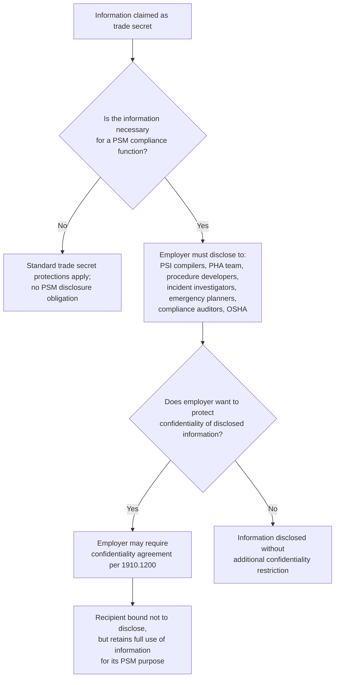
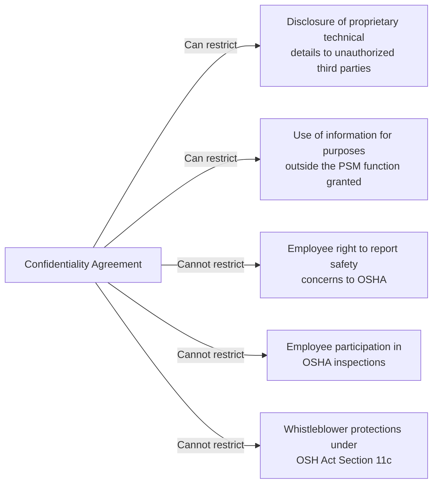

## Trade Secrets Provisions

### Overview

Trade Secrets is the PSM element codified at 29 CFR 1910.119(p). Unlike the preceding elements, which impose substantive safety-management obligations, this element functions as a **procedural safeguard** governing how confidential information intersects with the rest of the standard. It requires employers to make all information necessary to comply with the PSM standard available to those who need it — employees, employee representatives, and OSHA — without regard to trade secret status, while still permitting employers to require appropriate confidentiality agreements to protect legitimately proprietary information from unauthorized disclosure or use.

**Key Points**

- Codified at 29 CFR 1910.119(p), titled "Trade secrets"
- Prohibits withholding PSM-required information from covered parties on trade secret grounds
- Applies to employees, their designated representatives, and OSHA
- Permits employers to require confidentiality agreements as a condition of disclosure
- Explicitly preserves employees' rights under other sections despite confidentiality agreements
- Functions as an enabling provision that ensures other PSM elements (PSI, PHA, training, incident investigation) are not undermined by proprietary information claims

### Regulatory Text

29 CFR 1910.119(p) contains two subsections:

1. **1910.119(p)(1)**: Employers shall make all information necessary to comply with the section available to those persons responsible for compiling the process safety information (required by paragraph (d) of this section), those assisting in the development of the process hazard analysis (required by paragraph (e) of this section), those responsible for developing the operating procedures (required by paragraph (f) of this section), and those involved in incident investigations (required by paragraph (m) of this section), emergency planning and response (paragraph (n) of this section) and compliance audits (paragraph (o) of this section) without regard to possible trade secret status of such information.
2. **1910.119(p)(2)**: Nothing in this paragraph shall preclude the employer from requiring the persons to whom the information is made available under paragraph (p)(1) of this section to enter into confidentiality agreements not to disclose the information as set forth in 29 CFR 1910.1200.

### Purpose and Rationale

**[Inference]** This element exists because several other PSM elements — most notably Process Safety Information (1910.119(d)), which requires detailed chemical hazard data, process technology information, and equipment design basis — could plausibly involve information an employer considers proprietary (e.g., unique catalyst formulations, proprietary process technology, unpublished engineering design specifications). Without an explicit override, an employer might argue that trade secret protection exempts certain process safety information from disclosure to the personnel or bodies who need it to perform their PSM functions. Section (p) forecloses that argument by name, ensuring the safety-critical purpose of the standard is not defeated by intellectual property claims.

### Who Must Receive Trade-Secret-Protected Information

1910.119(p)(1) enumerates specific categories of recipients who must receive necessary information regardless of trade secret status:

| Recipient Category | PSM Element They Support | Regulatory Cross-Reference |
| --- | --- | --- |
| Persons compiling Process Safety Information | Process Safety Information | 1910.119(d) |
| Persons assisting in Process Hazard Analysis development | Process Hazard Analysis | 1910.119(e) |
| Persons developing Operating Procedures | Operating Procedures | 1910.119(f) |
| Persons involved in Incident Investigations | Incident Investigation | 1910.119(m) |
| Persons involved in Emergency Planning and Response | Emergency Planning and Response | 1910.119(n) |
| Persons involved in Compliance Audits | Compliance Audits | 1910.119(o) |
| OSHA (implicitly, via the standard's overall enforcement authority and general trade secret provisions) | Enforcement/inspection | General PSM enforcement |

**[Inference]** Notably, the enumerated list does not explicitly name every PSM element (for example, Mechanical Integrity personnel or Hot Work Permit issuers are not separately listed), which suggests the drafters focused the explicit override on the elements most likely to require deep access to proprietary technical or chemical information — though in practice, if trade secret information is genuinely necessary to comply with any part of the standard, the general non-withholding principle of (p)(1) is understood by most practitioners to extend to whatever function genuinely requires it, since an employer cannot use trade secret status to defeat the standard's overall safety purpose.

### Confidentiality Agreements (1910.119(p)(2)) and Cross-Reference to 1910.1200

The provision explicitly permits employers to condition disclosure on confidentiality agreements, referencing 29 CFR 1910.1200 — the Hazard Communication Standard (HCS/HazCom) — which contains its own well-developed trade secret framework for chemical identity information on Safety Data Sheets (SDS).

**[Unverified]** The precise mechanics of how 1910.1200's trade secret provisions (including its procedures for withholding specific chemical identity while still disclosing hazard information, and its provisions for emergency disclosure to health professionals and OSHA) map onto the PSM confidentiality agreement mechanism are not elaborated in the PSM text itself; practitioners generally treat the HazCom framework's confidentiality agreement structure and health-professional/emergency disclosure exceptions as the template referenced by (p)(2), but this should be confirmed against current 1910.1200 text and any relevant OSHA interpretation letters for a given facility's specific situation.

**[Inference]** A typical confidentiality agreement used under this provision would restrict the recipient from disclosing the trade secret information to unauthorized third parties or using it for purposes outside their PSM function, while explicitly preserving the recipient's ability to use the information fully for the PSM purpose for which it was disclosed (e.g., a PHA team member can use proprietary process chemistry data to identify hazards, but cannot share that data externally or use it to benefit a competing employer).

### What Confidentiality Agreements Cannot Restrict

**[Inference]** A confidentiality agreement under 1910.119(p)(2) is generally understood to restrict disclosure/use of the information itself, but cannot be used to prevent the recipient from exercising other rights preserved elsewhere in OSHA regulations — such as an employee's right to report safety concerns to OSHA, participate in an OSHA inspection, or exercise whistleblower protections under Section 11(c) of the OSH Act. A confidentiality agreement that attempted to silence an employee from reporting a safety violation to OSHA (as opposed to merely protecting specific proprietary technical details) would likely conflict with the broader statutory scheme protecting employee rights, though the specific enforceability boundary of any given confidentiality agreement would be a legal determination outside the scope of the PSM text alone.

### Interaction with OSHA's Inspection and Enforcement Authority

**[Inference]** During a PSM compliance inspection, OSHA compliance officers may need access to information an employer considers a trade secret (e.g., proprietary process chemistry underlying a PHA finding). General OSHA practice — consistent with Section 15 of the OSH Act, which addresses trade secret information obtained during inspections — allows the agency to access such information while maintaining its own confidentiality obligations regarding disclosure of trade secrets obtained in the course of an inspection; this is a broader OSH Act framework rather than language unique to 1910.119(p), but it operates alongside this element to ensure trade secret status does not become a barrier to enforcement.

### Practical Implementation

**[Inference]** Facilities implementing this provision typically incorporate the following practices, none of which are explicitly mandated by the two-subsection regulatory text but which reflect common compliance approaches:

- **Identification of trade secret information**: A process for flagging which specific process safety information (e.g., a proprietary catalyst formulation, unique reaction chemistry) is considered a trade secret, distinct from information that is simply sensitive but not legally a trade secret.
- **Standardized confidentiality agreement templates**: Pre-drafted agreements for PHA team members, incident investigators, auditors, and (where applicable) contractors, tailored to the scope of information they will access.
- **Redaction practices for broader distribution**: Where full disclosure of a trade secret is only necessary for a narrow subset of personnel (e.g., the compliance audit team), broader-distribution documents (such as general training materials for all operators) may reference hazard information without requiring disclosure of the underlying proprietary formulation itself.
- **Contractor-specific handling**: Since contractors may participate in incident investigations (per 1910.119(m)(3)) or be affected by MOC changes, confidentiality agreements are often extended to contractor personnel who require access to trade-secret-protected process safety information.

### Example: Trade Secrets Scenario

**Example**

A specialty chemical manufacturer uses a proprietary catalyst formulation in an exothermic reaction process covered by PSM. The catalyst composition is a closely guarded trade secret critical to the company's competitive position.

1. **PHA team access**: When conducting the required Process Hazard Analysis, the PHA team needs to understand the catalyst's reactive properties, including runaway reaction potential, to properly identify hazards and safeguards. The employer cannot withhold the catalyst's chemical identity and reactive hazard data from the PHA team on trade secret grounds.
2. **Confidentiality agreement**: Before receiving the detailed catalyst formulation, PHA team members (including any external PHA facilitator) sign a confidentiality agreement restricting disclosure of the specific formulation to parties outside the PHA process.
3. **Incident investigation**: A reactor upset requires an incident investigation. Investigators need access to the same proprietary reaction chemistry data to determine whether an unexpected side reaction contributed to the event. This information is disclosed under a similar confidentiality agreement.
4. **Broader training materials**: Operating procedures and general operator training materials describe the hazard (e.g., "exothermic runaway risk if reactor temperature exceeds X°C") and the required safeguards, without necessarily disclosing the specific proprietary catalyst formulation details that are not needed for safe day-to-day operation.
5. **OSHA inspection**: During a PSM inspection, the compliance officer requests the catalyst reactivity data as part of evaluating the adequacy of the PHA. The employer must provide this information; OSHA's own confidentiality obligations under the OSH Act govern how the agency handles trade secret information obtained during the inspection.
6. **Contractor investigator**: Because a contractor employee was involved in the incident, that contractor's investigation team member also receives the necessary catalyst reactivity data under a parallel confidentiality agreement, consistent with the requirement that contract employees be included on the investigation team per 1910.119(m)(3).

### Common Compliance Deficiencies

**[Unverified — enforcement frequency should be confirmed against current OSHA citation data]**, potential compliance issues related to this element include:

- Withholding process safety information from a PHA team, incident investigation team, or compliance auditor on the basis of trade secret status
- Absence of any confidentiality agreement mechanism, which — while not itself a violation, since disclosure without an agreement is permitted — may create legitimate business concern that leads employers to under-disclose informally
- Confidentiality agreements drafted broadly enough to potentially chill an employee's willingness to report safety concerns to OSHA or participate in inspections
- Failure to extend necessary trade-secret-protected information to contract employees who are required participants in incident investigations under 1910.119(m)(3)

### Conclusion

The Trade Secrets provision is a short but structurally important element that prevents intellectual property protections from becoming a loophole in the PSM standard's core safety functions. By explicitly naming the categories of personnel who must receive necessary information — PSI compilers, PHA participants, procedure developers, incident investigators, emergency planners, and compliance auditors — regardless of trade secret status, while simultaneously preserving the employer's ability to protect that information through confidentiality agreements, this element balances two legitimate interests: the safety-critical need for accurate, complete information flow within the PSM system, and the employer's legitimate proprietary interest in protecting genuinely confidential technical and chemical information from broader disclosure or competitive misuse.

**Related Topics**

- Hazard Communication Standard Trade Secret Framework (29 CFR 1910.1200)
- Confidentiality Agreement Drafting for PSM-Related Disclosures
- OSHA's Trade Secret Handling During Compliance Inspections (OSH Act Section 15)
- Contractor Access to Proprietary Process Safety Information
- Employee Whistleblower Protections Under OSH Act Section 11(c)
- Redaction Practices for Process Safety Information Distribution
- Process Safety Information Compilation Requirements (29 CFR 1910.119(d))
- Balancing Intellectual Property Protection with Regulatory Compliance