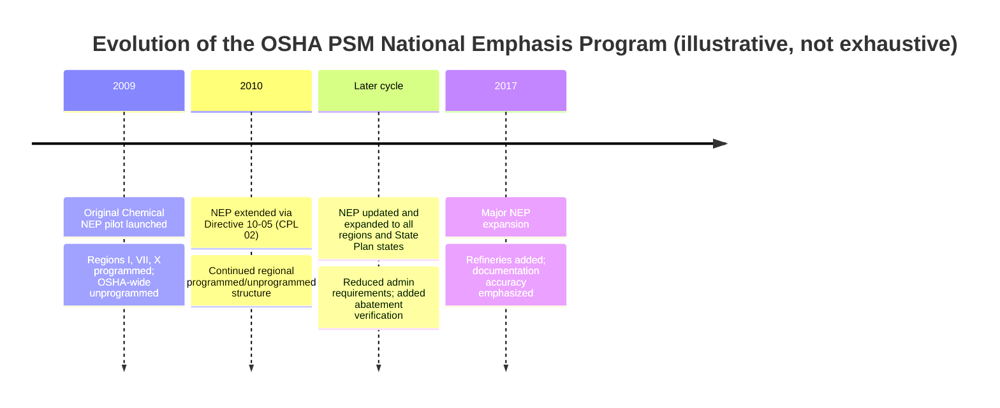
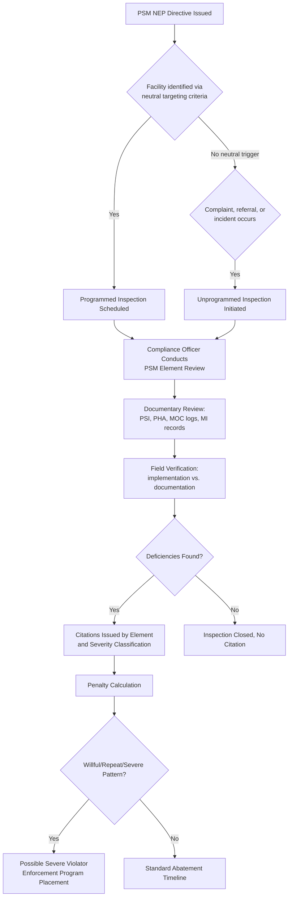
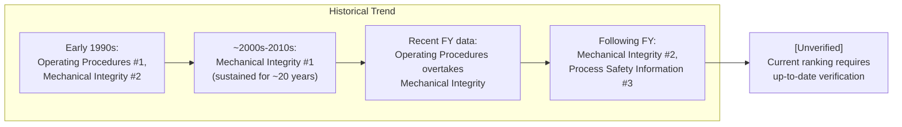
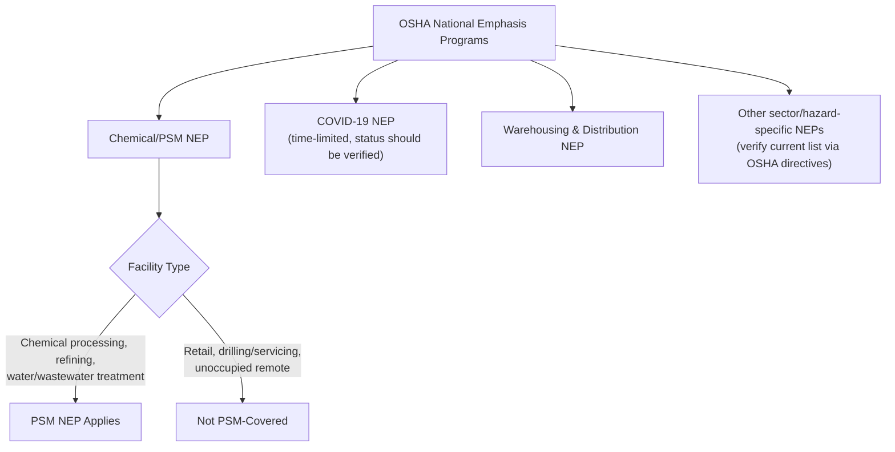

## OSHA National Emphasis Program and Enforcement Trends

### Overview

OSHA's Process Safety Management National Emphasis Program (PSM NEP) is a targeted enforcement initiative distinct from the PSM standard itself (29 CFR 1910.119). Where the standard sets substantive obligations, the NEP is OSHA's internal enforcement directive governing how, where, and with what priority the agency conducts PSM-related inspections. Understanding the NEP and associated enforcement trend data is essential for practitioners because it reveals which PSM elements OSHA compliance officers scrutinize most heavily in practice, informing where facilities should focus internal audit and corrective action resources.

**Key Points**

- The PSM NEP is an enforcement directive, not a standalone regulatory requirement — it does not create new employer obligations beyond 1910.119 itself
- The NEP has been revised and reissued multiple times since its original 2009 pilot, expanding scope and refining targeting criteria
- Historically, Mechanical Integrity and Operating Procedures have alternated as the most frequently cited PSM elements
- NEP inspections can be programmed (scheduled via neutral targeting criteria) or unprogrammed (triggered by complaints, referrals, or incidents)
- **[Unverified]** Given the fast-moving nature of enforcement policy, the current status, scope, and specific provisions of the PSM NEP should be verified against OSHA's current directive library before relying on any date-specific detail in facility compliance planning

### History and Evolution of the PSM NEP

OSHA developed a national emphasis program (NEP) establishing policies and procedures for inspecting workplaces covered by the PSM standard, in response to catastrophic incidents caused by failure to comply with PSM requirements. The original NEP became effective July 27, 2009, describing itself as a new approach for inspecting PSM-covered facilities that allows for a greater number of inspections through better allocation of OSHA's resources. [ohsonline](https://ohsonline.com/articles/2009/07/30/osha-national-emphasis-program-targets-release-of-hazardous-chemicals.aspx)[oshalawblog](https://www.oshalawblog.com/2009/08/articles/osha-targeting-chemical-facilities-in-new-national-emphasis-program/)

The 2009 program was a one-year pilot outlining a new inspection approach, with compliance officers asking detailed questions to gather facts related to PSM requirements and verifying consistency between employers' written and implemented PSM programs. Under the pilot, chemical facilities in the Northeast (Region 1), the Plains States (Region VII), and the Northwest and Alaska (Region X) were subject to programmed inspections, while unprogrammed inspections applied OSHA-wide for PSM-covered processes. OSHA's instructions to compliance officers emphasized implementation of the PSM standard over documentation alone. [OSHA National Emphasis Program Targets Release of Hazardous Chemicals +2](https://ohsonline.com/articles/2009/07/30/osha-national-emphasis-program-targets-release-of-hazardous-chemicals.aspx)

The program was subsequently extended via Directive 10-05 (CPL 02), continuing the National Emphasis Program for process safety management — that is, control of highly hazardous chemicals at or above the threshold quantities in the PSM standard. This extension specified programmed inspections in three regions and unprogrammed inspections in the remaining seven, focusing mainly on chemical processing facilities, refineries, and water/wastewater treatment facilities. [eponline](https://eponline.com/articles/2010/07/14/osha-extends-psm-national-emphasis-program.aspx)[eponline](https://eponline.com/articles/2010/07/14/osha-extends-psm-national-emphasis-program.aspx)

OSHA later issued an updated National Emphasis Program for chemical facilities, replacing the earlier pilot program and applying to all OSHA regions and State Plan states. Changes between the programs included a reduction in program requirements and in the number of facility categories and programmed inspections, and OSHA also began verifying that inspected companies had abated any previous PSM violations. [safetyandhealthmagazine](https://www.safetyandhealthmagazine.com/?p=35219)[safetyandhealthmagazine](https://www.safetyandhealthmagazine.com/?p=35219)

A further significant expansion followed years later: a new national emphasis inspection program was issued, with the compliance directive noting that any violation of the PSM standard is a condition likely to cause death or serious physical harm, and warning that even typographical errors in documents like piping and instrumentation diagrams or operating procedures could result in serious violations with penalties reaching into the tens of thousands of dollars per violation. This iteration expanded the prior program's scope, notably including refineries within the program for the first time. [ogletree](https://ogletree.com/?p=8730)[ogletree](https://ogletree.com/?p=8730)

### Programmed vs. Unprogrammed Inspections

A programmed inspection is one that is scheduled based on "objective or neutral" criteria, while unprogrammed inspections are made in response to alleged hazardous working conditions identified at a specific worksite, according to OSHA's field operations manual. [eponline](https://eponline.com/articles/2010/07/14/osha-extends-psm-national-emphasis-program.aspx)

| Inspection Type | Trigger | Selection Basis |
| --- | --- | --- |
| Programmed | Neutral, criteria-based selection (e.g., facility registered as PSM-covered in a targeted industry sector) | Objective targeting, not tied to a specific complaint or event |
| Unprogrammed | Complaint, referral, accident, or catastrophe at a specific site | Site-Specific Targeting for high injury/illness industries, or direct incident response |

**[Inference]** Unprogrammed inspections are generally understood to carry a higher likelihood of significant citations, since they are triggered by an actual incident or specific complaint rather than a neutral sampling criterion — an inspection prompted by a release, fire, or employee complaint is inherently more likely to uncover a genuine compliance gap than a randomly scheduled programmed inspection, though this is an inference from the inspection triggers themselves rather than a published OSHA statistic.

### Facility Scope: Covered Chemicals and Industries

The program targets chemical processing facilities, refineries, and water and/or wastewater treatment facilities. The PSM standard's Appendix A lists 136 chemicals — including formaldehyde, hydrogen sulfide, and methyl isocyanate — with threshold quantities at or above which a process involving them is covered by the standard; the standard also applies to a process involving more than 10,000 pounds of a flammable liquid or gas on site in one location, except for hydrocarbon fuels used for workplace consumption as fuel. Retail facilities, oil or gas well drilling or servicing operations, and normally unoccupied remote facilities are not covered. [OSHA Extends PSM National Emphasis Program +2](https://eponline.com/articles/2010/07/14/osha-extends-psm-national-emphasis-program.aspx)

Historical citation data by industry sector illustrates where programmed inspections have concentrated. In one representative year, the top five cited industry classifications were Animal Slaughtering and Processing, Other Basic Inorganic Chemical Manufacturing, Other Basic Organic Chemical Manufacturing, Petroleum Refineries, and Refrigerated Warehousing and Storage, together accounting for a substantial share of total citations and penalties that year. **[Unverified]** Industry-sector citation concentration shifts from year to year based on OSHA's targeting priorities and should be checked against the most recent available fiscal-year data rather than assumed static. [safteng](https://safteng.net/osha-s-2018-psm-citations-by-naics/)

### Historical Citation Patterns by PSM Element

Long-running data tracking shows a consistent pattern of which PSM elements draw the most citations, though the specific ranking has shifted over time:

Early OSHA enforcement data compiled from May 1992 through February 1995 found that Mechanical Integrity was a major weakness in facilities' PSM programs — of the fourteen elements, only Operating Procedures resulted in more citations than Mechanical Integrity. A closer examination showed citations were issued not primarily because process equipment itself was deficient, but because methods of verifying and documenting mechanical integrity were insufficient — of the six sections within the Mechanical Integrity element, 41% of citations were for Written Procedures and 30% were for Inspection and Testing. [inspectioneering](https://inspectioneering.com/journal/1995-05-01/60/osha-psm-citations-for-mechani)[inspectioneering](https://inspectioneering.com/journal/1995-05-01/60/osha-psm-citations-for-mechani)

This Mechanical Integrity dominance persisted for an extended period: Mechanical Integrity had reportedly been the most cited element every year for roughly the preceding two decades, holding that position convincingly. However, a shift occurred in more recent data: in one fiscal year, Operating Procedures (SOPs) overtook Mechanical Integrity as the leading cited element, and in the following fiscal year, Process Safety Information ranked as the third most-cited element while Mechanical Integrity ranked second. [safteng](https://safteng.net/page/191/?nozc=1)[safteng](https://safteng.net/page/191/?nozc=1)

**[Unverified]** This progression (Mechanical Integrity → Operating Procedures → shifting rankings among MI, PSI, and other elements) reflects the years for which data was located in this search; current-year rankings should be verified against the most recent available OSHA enforcement statistics, since citation patterns can shift with each fiscal year's inspection focus and any updated NEP targeting criteria.

### Representative Citation Themes from NEP Inspections

Detailed case-level data illustrates the specific deficiency types that recur across NEP-driven inspections:

One notable inspection under the chemical manufacturer-focused national emphasis program found deficiencies spanning equipment process safety information, process hazard analysis, written operating procedures, contractor safety, equipment inspection and testing, and management of process changes. Specific findings from that inspection included: intervening valves before/after relief valves not secured in the open position per ASME Section VIII requirements; a nitrogen-system contractor and a sprinkler/deluge-system contractor not being treated as PSM contractors; outdated P&IDs; vessels lacking maximum-allowable-working-pressure data needed to establish fitness for service; a blast radius study that had not been incorporated into the PHA's facility siting analysis; a startup-after-emergency-shutdown procedure that incorrectly assumed process equipment was empty; flame arrestors and bonding/grounding stations excluded from the mechanical integrity inspection and testing program; relief valves not bench-tested to establish a change-out schedule, and an established schedule not being followed; non-destructive testing performed by unqualified personnel without supervision by certified personnel; and no management-of-change reviews conducted when closing out PHA or audit action items. [safteng](https://safteng.net/?p=6313)[safteng](https://safteng.net/?p=6313)

Other representative NEP inspection outcomes include: a Louisiana chemical facility inspection under the PSM NEP that resulted in ten serious and one other-than-serious violation, including failing to provide accurate process safety information for P&IDs, failing to use appropriate detection methodologies in the process hazard analysis, improperly completed emergency shutdown procedures, failure to repair or maintain pressure-relieving devices, and failure to conduct management of change while maintaining process equipment. [safteng](https://safteng.net/?p=3473)

**[Unverified]** These case examples are illustrative of recurring deficiency patterns identified in past inspections and should not be read as an exhaustive or currently representative sample; facilities should consult current OSHA enforcement case data for up-to-date trend analysis.

### Severe Violator Enforcement Program (SVEP) Interaction

PSM violations arising from NEP inspections can escalate beyond standard citation and penalty processes when violations are characterized as willful, repeat, or reflective of a broader pattern of indifference to employee safety. In one case, a company was cited for 47 health and safety violations — including four willful violations — following an unexpected release of hazardous materials, with the company also placed in OSHA's Severe Violator Enforcement Program and proposed fines totaling $545,000. [dol](https://www.dol.gov/newsroom/releases/osha/osha20121128)

**[Inference]** Placement in the Severe Violator Enforcement Program typically triggers enhanced, prolonged, and potentially company-wide follow-up inspection scrutiny beyond the single facility where the initiating incident occurred — this is a general SVEP mechanism rather than a PSM-NEP-specific feature, but it commonly intersects with major PSM-related incidents given their severity classification.

### Related, Non-PSM-Specific Emphasis Programs Worth Distinguishing

OSHA maintains multiple concurrent National Emphasis Programs, not all of which are PSM-specific; understanding which NEP applies to a given facility situation matters for compliance planning:

- **Chemical/PSM NEP**: Targets PSM-covered processes as described above.
- A COVID-19-focused NEP was launched to focus enforcement on companies putting the largest number of workers at serious risk of contracting COVID-19, also prioritizing employers that retaliate against workers raising safety complaints, remaining in effect for up to one year with flexibility for OSHA to amend or cancel as conditions changed. **[Unverified]** This program's current status should be confirmed, as public health-driven emphasis programs of this kind are commonly time-limited and subject to sunset or replacement. [jjkellercompliancenetwork](https://jjkellercompliancenetwork.com/news/osha-launches-national-emphasis-program-to-protect-high-risk-workers-from-covid-19-hazards)
- A National Emphasis Program on Warehousing and Distribution Center Operations was relaunched, citing elevated injury and illness rates in that sector. **[Unverified]** This program is not PSM-specific but may overlap with PSM-covered facilities that also operate warehousing/distribution functions, warranting a check of applicability where relevant. [jjkellercompliancenetwork](https://jjkellercompliancenetwork.com/news/ehs-monthly-round-up-august-2026)

### Practical Implications for Facility Compliance Programs

**[Inference]** Given the historical citation patterns described above, facilities preparing for potential NEP-driven inspection commonly prioritize internal audit attention on:

- **Mechanical Integrity documentation completeness**: Verifying written procedures and inspection/testing records are both accurate and demonstrably implemented, not just documented, given this element's historically high citation rate tied specifically to documentation gaps rather than physical equipment failure.
- **Operating Procedure accuracy and currency**: Ensuring procedures reflect the actual as-built and as-operated process, including accurate handling of edge cases like startup-after-emergency-shutdown sequences.
- **P&ID and Process Safety Information accuracy**: Confirming diagrams and safety information are current, given repeated citation themes involving outdated or inaccurate P&IDs.
- **MOC discipline at PHA/audit closeout**: Ensuring that closing out PHA or compliance audit action items that involve equipment or procedural changes are routed through a documented MOC review rather than implemented informally.
- **Contractor PSM classification**: Verifying that contractors performing safety-critical work (e.g., on nitrogen blanketing systems, fire suppression/deluge systems) are correctly identified and managed as PSM contractors under 1910.119(h), not treated as general contractors outside PSM scope.

### Conclusion

The OSHA PSM National Emphasis Program is the enforcement lens through which the substantive requirements of 29 CFR 1910.119 are actually tested in the field. Its history shows a program that began as a narrow regional pilot and progressively expanded in scope — eventually reaching all OSHA regions, State Plan states, and additional facility categories such as refineries — while enforcement data reveals a persistent pattern in which documentation and implementation gaps in Mechanical Integrity and Operating Procedures, rather than novel or exotic hazards, account for the largest share of citations. Because enforcement priorities, targeted industries, and even which PSM element draws the most citations shift over time, and because this response synthesizes historical search results rather than a single authoritative current-year OSHA source, any facility using this content for compliance planning should verify the current PSM NEP directive and the most recent fiscal-year citation data directly against OSHA's published enforcement statistics and directive library before finalizing audit priorities.

**Related Topics**

- Mechanical Integrity Documentation and Inspection Program Design
- PSM Contractor Classification Criteria (29 CFR 1910.119(h))
- Severe Violator Enforcement Program (SVEP) Mechanics and Consequences
- Facility Siting Analysis Integration into Process Hazard Analysis
- Relief Valve Bench Testing and Change-Out Schedule Programs
- P&ID Accuracy Verification and Update Processes
- Distinguishing Programmed and Unprogrammed OSHA Inspections
- Cross-NEP Applicability for Multi-Function Industrial Facilities