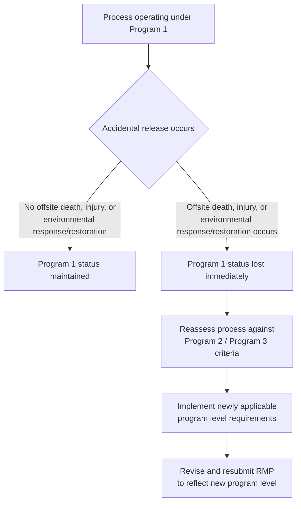
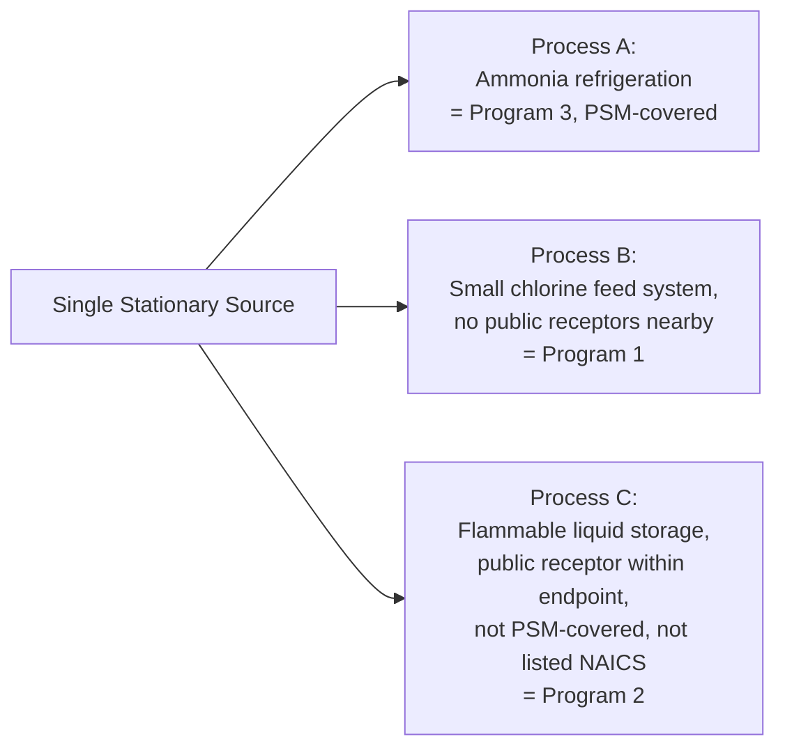

## RMP Program Levels 1, 2, and 3


### Overview

EPA's Risk Management Program, codified at 40 CFR Part 68, classifies every covered process into one of three program levels — Program 1, Program 2, or Program 3 — each carrying progressively more rigorous prevention program requirements. The program level determines what an owner or operator must document, implement, and submit in the facility's Risk Management Plan (RMP). Program classification is not optional or purely a matter of employer preference: it is determined by specific regulatory criteria tied to offsite consequence potential, accident history, applicability of other regulatory programs (notably OSHA PSM), and — for Program 3 — membership in a defined set of high-hazard industry classifications. Misclassification is a significant compliance risk in both directions: under-classifying a process risks citations for missing required prevention program elements, while over-classifying wastes resources building program elements that do not legally apply.

**Key Points**

- Codified at 40 CFR Part 68, Subpart A (applicability provisions), primarily 40 CFR 68.10
- Program 1: lowest burden, available only when offsite risk is minimal
- Program 2: mid-tier, streamlined prevention program requirements
- Program 3: most rigorous, applies to processes subject to OSHA PSM or in specifically listed high-hazard NAICS codes
- A single facility can have processes at different program levels simultaneously if it operates multiple covered processes
- Program level classification can change over time (e.g., loss of Program 1 eligibility following an accident) and must be reassessed accordingly

### Program 1: Minimal Risk, Minimal Requirements

Program 1 applies to processes with a very low level of risk and, thus, carries a minimal set of requirements. A covered process is eligible for Program 1 status only if it satisfies all criteria under 40 CFR 68.10(b)/(g):

1. **No qualifying accident history**: For the past five years prior to RMP submission, the process has not had an accidental release resulting in offsite death, injury, or response or restoration activities for an exposure of an environmental receptor (40 CFR 68.10(g)(1)).
2. **No nearby public receptors within the endpoint distance**: The nearest public receptor must be beyond the distance to the toxic or flammable endpoint, as defined under 40 CFR 68.22(a), for the worst-case release scenario (40 CFR 68.10(g)(2)).
3. **Emergency response coordination**: Emergency response procedures must have been coordinated between the stationary source and the local emergency planning and response organization (40 CFR 68.10(g)(3)).

**[Inference]** A newly constructed process with no accident history can qualify for Program 1 provided it independently satisfies all three criteria — the absence of an accident history alone is necessary but not sufficient; the public receptor distance and emergency coordination criteria must also be independently met.

Program 1 requirements are correspondingly minimal:

- One worst-case release scenario analysis per process (40 CFR 68.25)
- Five-year accident history documentation
- Emergency response coordination with local planning/response organizations
- A specific certification statement in the RMP, per 40 CFR 68.12(b), stating that the distance to the specified endpoint for the worst-case scenario is less than the distance to the nearest public receptor, that no offsite-impact accidents have occurred in the prior five years, and that no additional measures are necessary to prevent offsite impacts
- Risk Management Plan submission to EPA

### Loss of Program 1 Status

**[Confirmed]** If a previously Program 1-eligible process experiences an accident resulting in serious offsite consequences, the process loses its Program 1 status immediately, and the owner or operator must comply with the requirements of whatever new program level then applies to the process, per 40 CFR 68.10(e). This is a significant compliance trigger: the loss of eligibility is not something the facility elects or negotiates — it is an automatic regulatory consequence of the accident itself, requiring immediate transition to Program 2 or Program 3 requirements as applicable, along with a corresponding RMP revision.



### Program 3: Highest Rigor

Program 3 represents the most stringent tier and applies to a covered process under either of two independent triggers:

1. **OSHA PSM applicability**: The process is subject to OSHA's Process Safety Management standard (29 CFR 1910.119).
2. **Listed high-hazard NAICS code**: The process falls within one of the North American Industry Classification System (NAICS) codes that 40 CFR 68.10(d) designates as automatically Program 3, **regardless of whether OSHA PSM applies**. EPA determined these industries warrant the most rigorous prevention program based on historical accident data.

**[Inference]** This dual-trigger structure means a process can be Program 3 even without PSM applicability, if it falls within one of the listed NAICS codes — meaning EPA's RMP program level determination is not simply a mirror of OSHA PSM coverage, but has an independent industry-based trigger layered on top.

The specifically listed Program 3 NAICS codes include (non-exhaustive based on available data):

| NAICS Code | Industry |
| --- | --- |
| 32211 | Pulp Mills |
| 32411 | Petroleum Refineries |
| 32511 | Petrochemical Manufacturing |
| 325181 | Alkalies and Chlorine Manufacturing |
| 325188 | All Other Basic Inorganic Chemical Manufacturing |
| 325192 | Cyclic Crude, Intermediate, and Gum and Wood Chemical Manufacturing |
| 325199 | All Other Basic Organic Chemical Manufacturing |

**[Unverified]** The full list under 40 CFR 68.10(d) reportedly contains ten NAICS codes; only seven were identified in available source material for this response. Facilities should verify the complete current list directly against 40 CFR 68.10(d) or the current eCFR text, since NAICS code lists in environmental regulations are occasionally updated and the full list should not be assumed complete from this synthesis.

Program 3 requirements are the most extensive of the three tiers, generally including:

- All Program 2 requirements (see below)
- A Process Hazard Analysis (PHA) — using a methodology substantially equivalent in rigor to OSHA PSM's PHA requirement
- Comprehensive Process Safety Information
- Operating procedures meeting a rigor comparable to OSHA PSM's operating procedures element
- Training requirements
- Mechanical Integrity program
- Management of Change procedures
- Pre-Startup Safety Review
- Compliance audits — conducted at least every three years, with the two most recent reports retained (mirroring OSHA PSM's 1910.119(o) structure)
- Incident investigation program

**[Inference]** The close structural parallel between Program 3 RMP requirements and OSHA PSM's fourteen elements is intentional — Program 3 was designed so that facilities already complying with OSHA PSM largely satisfy the corresponding EPA Program 3 prevention program elements through the same underlying management system, avoiding a fully duplicative compliance burden, though the two regulatory regimes remain independently enforceable by their respective agencies (OSHA and EPA).

### Program 2: The Streamlined Middle Tier

Program 2 is a streamlined set of requirements for processes that are not eligible for Program 1 and not required to be Program 3. Program 2 functions largely as the **default classification**: if a process fails the Program 1 eligibility criteria (due to nearby public receptors, disqualifying accident history, or uncoordinated emergency response procedures) and does not trigger Program 3 (because OSHA PSM does not apply and the process is not within a Program 3 NAICS code), the process defaults to Program 2.

Program 2 requirements build on Program 1's baseline and include, at minimum:

- All Program 1 requirements (worst-case scenario, accident history, emergency coordination)
- An emergency response program developed and implemented in accordance with 40 CFR 68.95, generally within three years of the date the owner/operator determined the emergency response program requirements applied
- Emergency response exercise plans developed in accordance with 40 CFR 68.96
- Public meeting requirements following an RMP-reportable accident with known offsite impacts, per 40 CFR 68.210(b), within 90 days of the accident
- Streamlined (rather than full PSM-equivalent) prevention program elements — a simplified hazard review, safety information compilation, and operating procedures, generally less exhaustive than the Program 3/PSM-aligned equivalents

```mermaid
flowchart TD
    A[Covered process identified<br/>under 40 CFR Part 68] --> B{Subject to OSHA PSM<br/>29 CFR 1910.119?}
    B -->|Yes| P3[Program 3]
    B -->|No| C{In a listed Program 3<br/>NAICS code per 68.10(d)?}
    C -->|Yes| P3
    C -->|No| D{Meets ALL Program 1 criteria:<br/>no disqualifying accident history,<br/>no public receptor within endpoint distance,<br/>emergency response coordinated?}
    D -->|Yes| P1[Program 1]
    D -->|No| P2[Program 2]
```

### Comparative Requirements Summary

| Requirement | Program 1 | Program 2 | Program 3 |
| --- | --- | --- | --- |
| Worst-case release scenario | Required (one per process) | Required | Required |
| 5-year accident history | Required | Required | Required |
| Emergency response coordination | Required (basic) | Required (formal program per 68.95/68.96) | Required (formal program) |
| Process Hazard Analysis | Not required | Streamlined hazard review | Full PHA (PSM-equivalent rigor) |
| Operating procedures | Not required | Streamlined | Full (PSM-equivalent rigor) |
| Mechanical Integrity | Not required | Not required as a distinct formal element | Required |
| Management of Change | Not required | Not required as a distinct formal element | Required |
| Compliance audits | Not required | Not required | Required, every 3 years |
| Training | Not required | Basic | Full |
| RMP submission | Required | Required | Required |

### Multi-Process Facilities and Mixed Program Levels

**[Inference]** A single stationary source (facility) can operate multiple covered processes, and each process is independently classified — meaning it is entirely possible for one facility to have some processes at Program 1, others at Program 2, and others at Program 3, depending on each process's individual risk profile, accident history, and applicable NAICS classification. This process-by-process (rather than facility-wide) classification approach requires facilities with multiple covered processes to conduct a distinct eligibility assessment for each one rather than assuming a single facility-wide program level applies uniformly.



### Example: Program Level Determination Scenario

**Example**

A facility operates two covered processes: (1) a propane storage and vaporization system, and (2) an ammonia refrigeration system used in food processing.

**Process 1 — Propane system**:

1. Threshold quantity determination confirms propane storage exceeds the RMP threshold, triggering Part 68 applicability.
2. Accident history review confirms no offsite death, injury, or environmental response/restoration event in the past five years.
3. Worst-case scenario modeling shows the toxic/flammable endpoint distance does not reach any public receptor.
4. Emergency response procedures have been formally coordinated with the local fire department and LEPC.
5. Result: qualifies for **Program 1** — minimal prevention program requirements, worst-case scenario documentation, and RMP submission.

**Process 2 — Ammonia refrigeration system**:

1. The process is also covered by OSHA PSM (29 CFR 1910.119), since anhydrous ammonia is listed on PSM's Appendix A above the threshold quantity.
2. Because OSHA PSM applies, the process automatically triggers **Program 3** under EPA RMP, regardless of the outcome of any Program 1 eligibility analysis.
3. Result: full Program 3 prevention program required — PHA, PSI, operating procedures, MI, MOC, training, compliance audits, and incident investigation, largely leveraging the same management system already built to satisfy OSHA PSM.

The facility's single RMP submission would reflect Program 1 requirements for the propane process and Program 3 requirements for the ammonia process — illustrating the process-by-process classification principle.

### Common Classification Errors

**[Inference]** Based on the structure of the eligibility criteria, common classification mistakes include:

- Assuming Program 1 eligibility based solely on accident history, without independently verifying the public receptor distance and emergency coordination criteria
- Failing to reassess and downgrade Program 1 status immediately after a disqualifying accident, continuing to operate (and report) under outdated Program 1 requirements
- Overlooking those NAICS codes that trigger Program 3 status independent of OSHA PSM applicability — a facility might correctly determine PSM does not apply, and incorrectly conclude Program 3 therefore does not apply, without checking the NAICS-based trigger
- Applying a single facility-wide program level assumption rather than conducting process-by-process classification for facilities with multiple covered processes

### Conclusion

The three-tier RMP program level structure reflects EPA's effort to calibrate prevention program rigor to actual offsite risk: Program 1 for processes posing minimal risk to public receptors with clean accident histories, Program 2 as a streamlined middle tier for processes that don't qualify for Program 1 but aren't independently flagged as high-hazard, and Program 3 for the highest-risk processes — triggered either by OSHA PSM coverage or by membership in a specifically enumerated set of high-hazard NAICS industries. The classification is process-specific rather than facility-wide, can shift automatically in response to an accident (immediate loss of Program 1 status), and for Program 3 processes, closely parallels OSHA PSM's fourteen-element structure by design, allowing facilities already PSM-compliant to leverage much of the same management system to satisfy EPA's parallel requirements.

**Related Topics**

- Worst-Case Release Scenario Modeling (40 CFR 68.25)
- OSHA PSM and EPA RMP Program Overlap and Integration Strategies
- Emergency Response Program Requirements Under 40 CFR 68.95/68.96
- Public Meeting Requirements Following RMP-Reportable Accidents
- Program 3 NAICS Code List and Industry-Specific Triggers
- Five-Year Accident History Documentation Standards
- Risk Management Plan (RMP) Submission and Update Requirements
- Alternative Release Scenario Analysis Across Program Levels