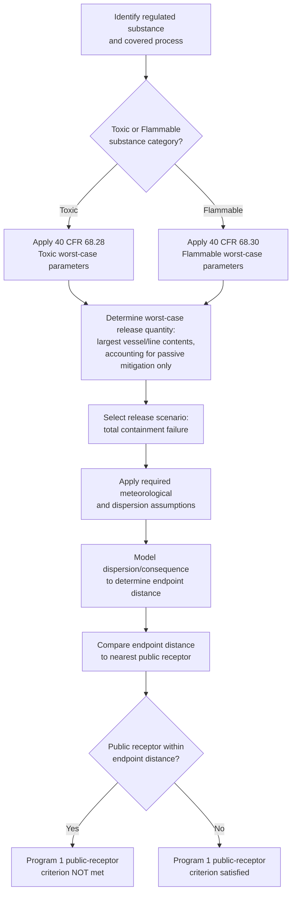
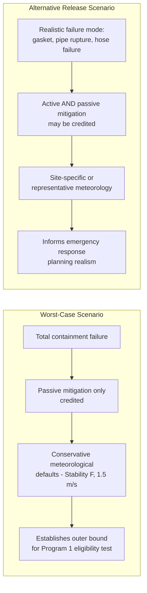
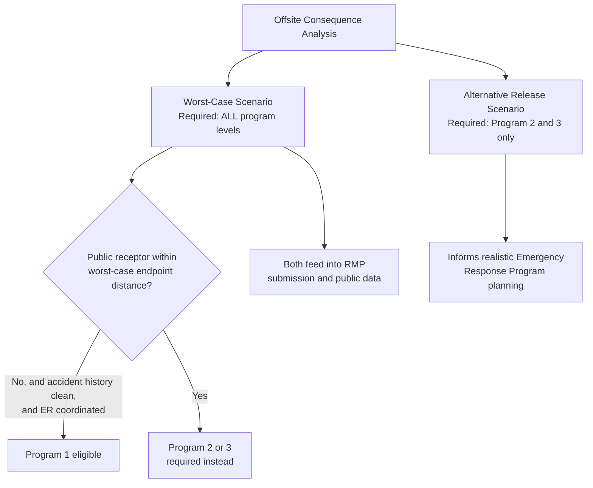

## Offsite Consequence Analysis and Worst-Case Release Scenarios

### Overview

Offsite Consequence Analysis (OCA) is the modeling and documentation framework required under EPA's Risk Management Program (40 CFR Part 68, Subpart B) that estimates the potential impact of a chemical release beyond a facility's boundary. OCA has two required components for RMP-covered processes: the **worst-case release scenario** (required for all program levels) and, for Program 2 and Program 3 processes, **alternative release scenarios** representing more likely, less catastrophic events. Together, these analyses drive several downstream regulatory and community-planning functions: determining RMP program level eligibility (particularly Program 1's public-receptor-distance criterion), informing facility siting decisions, supporting local emergency planning, and — since 1999 — feeding a nationally aggregated dataset EPA uses for community right-to-know purposes.

**Key Points**

- Codified at 40 CFR Part 68, Subpart B (Offsite Consequence Analysis), specifically 40 CFR 68.20–68.42
- Worst-case scenario is mandatory for every RMP-covered process, regardless of program level
- Alternative release scenarios are required for Program 2 and Program 3 processes, but not Program 1
- Toxic and flammable substances use different modeling methodologies and endpoint definitions
- Results directly determine whether a Program 1 process qualifies under the public-receptor-distance criterion (40 CFR 68.10(g)(2))
- OCA data has historically been subject to significant public-access and security-sensitivity debate given its potential dual-use as both a community-right-to-know tool and a target-identification risk

### Regulatory Structure: Subpart B Overview

40 CFR Part 68 Subpart B establishes the analytical requirements distinct from the prevention program elements found in Subparts C (Program 2) and D (Program 3). Key subsections include:

| Section | Subject |
| --- | --- |
| 68.20 | Applicability of Offsite Consequence Analysis requirements |
| 68.22 | Worst-case release scenario analysis requirements |
| 68.25 | Worst-case release scenario: general requirements |
| 68.28 | Worst-case release scenario: parameters for regulated toxic substances |
| 68.30 | Worst-case release scenario: parameters for regulated flammable substances |
| 68.36 | Alternative release scenario: parameters for regulated toxic substances |
| 68.38 | Alternative release scenario: parameters for regulated flammable substances |
| 68.39 | Alternative release scenario: general considerations |
| 68.42 | Defining offsite impacts: population and environmental receptors |

### Worst-Case Release Scenario: Core Concept

The worst-case release scenario is defined as the release of the largest quantity of a regulated substance from a vessel or process line failure, including administrative controls and passive mitigation that limit the quantity, that results in the greatest distance to a specified toxic or flammable endpoint. This is a deliberately conservative, bounding analysis — it is not meant to represent the most *likely* accident, but the most severe *plausible* one, used to establish an outer boundary for offsite consequence planning.

**[Inference]** The rationale for using a conservative bounding scenario rather than a probabilistic "most likely worst case" is that offsite consequence analysis serves multiple downstream planning functions (emergency response coordination, public receptor distance determination, community right-to-know), each of which benefits from a defined, reproducible worst-case benchmark rather than a probability-weighted estimate that could vary significantly between analysts or modeling assumptions.

### Worst-Case Scenario Parameters for Toxic Substances (40 CFR 68.28)

For regulated toxic substances, the worst-case release scenario generally assumes:

- Release of the entire quantity of the regulated substance in a process (or the maximum quantity in the largest vessel, if the process is not interconnected) within a specified duration (commonly modeled as a 10-minute release for gases, per standard EPA methodology)
- For liquids, evaporation from a pool formed by the release, using specified assumptions about pool depth, temperature, and ambient conditions
- Passive mitigation systems (e.g., dikes, containment berms) may be credited if they exist independent of human, mechanical, or other active intervention; active mitigation systems (e.g., automatic shutoff valves requiring power, water spray systems requiring activation) generally may not be credited in the worst-case scenario
- Specific default meteorological conditions: EPA's methodology generally requires assuming atmospheric stability class F (a stable, poor-dispersion condition) and a wind speed of 1.5 meters per second, unless the facility can demonstrate that the site's actual data show a different, technically justified combination is more appropriate

**[Unverified]** The specific default stability class and wind speed values reflect EPA's standard RMP*Comp and offsite consequence analysis guidance methodology as generally documented; facilities should verify current default parameters against the applicable EPA RMP guidance documents in effect, since implementation guidance is periodically refined.

### Worst-Case Scenario Parameters for Flammable Substances (40 CFR 68.30)

For regulated flammable substances, the worst-case release scenario generally assumes:

- Release of the total quantity of the flammable substance in the vessel or process line, assumed to vaporize as a vapor cloud
- The vapor cloud is assumed to explode, with a specified yield factor applied representing the percentage of the cloud's energy that contributes to blast effects
- The endpoint for flammable substances is typically defined as a specific overpressure level (e.g., an overpressure sufficient to cause structural damage or injury at the endpoint boundary) rather than a toxic concentration threshold

### Endpoint Definitions

The "specified endpoint" referenced throughout Subpart B differs by hazard category:

| Substance Category | Endpoint Type | General Basis |
| --- | --- | --- |
| Toxic gases/liquids | Concentration-based (e.g., ERPG-2 or equivalent toxicity threshold) | Concentration at which the general population could experience irreversible or serious health effects |
| Flammable gases/liquids (vapor cloud explosion) | Overpressure-based | A specified psi overpressure level associated with property damage/injury potential |
| Flammable substances (fireball/thermal radiation, for some alternative scenarios) | Thermal radiation-based | A specified radiant heat flux level |

**[Unverified]** Exact endpoint values (specific ERPG-2 concentrations per substance, specific overpressure psi thresholds) are substance-specific and tabulated in EPA's regulatory text and technical guidance (e.g., the RMP*Comp tool's built-in substance library); this response provides the conceptual framework rather than substance-specific numeric endpoints, which should be verified against 40 CFR Part 68 Appendix A and current EPA guidance for any specific chemical.

### Alternative Release Scenarios (Program 2 and 3 Only)

Unlike the worst-case scenario, alternative release scenarios are intended to represent a release that is **more likely to occur** than the worst-case scenario, while still having the potential to reach an offsite receptor. Per 40 CFR 68.39, at least one alternative release scenario must be analyzed for each regulated toxic substance held in a Program 2 or Program 3 process, and at least one for the overall process for regulated flammable substances.

Key distinctions from the worst-case scenario:

- Alternative scenarios may credit both passive **and active** mitigation systems, reflecting realistic response capability rather than the conservative "everything fails" assumption of the worst case
- Alternative scenarios should be based on a realistic failure mode — such as a gasket failure, a pipe rupture at a specific point, a relief valve discharge, or a transfer hose failure — rather than total vessel content release
- Facilities may consider actual administrative controls, operating procedures, and mitigation systems already in place when selecting and modeling the alternative scenario

**[Inference]** Because the worst-case scenario deliberately excludes active mitigation credit, alternative release scenarios are often the more operationally realistic tool for emergency planning purposes, since they better reflect what a facility's actual safeguards and response capability would achieve during a plausible incident — while the worst-case scenario primarily serves as the conservative benchmark for the Program 1 public-receptor eligibility test and broader hazard awareness.

### Defining Offsite Impact: Population and Environmental Receptors (40 CFR 68.42)

The regulation requires facilities to identify the types of public and environmental receptors that could be affected within the endpoint distance determined by the OCA modeling. Public receptors generally include:

- Off-site residences, institutions (schools, hospitals, prisons), and industrial, commercial, or office buildings
- Parks or recreational areas
- Any other public receptor identified in the facility's analysis

Environmental receptors generally include:

- National or state parks, forests, or monuments
- Officially designated wildlife sanctuaries, preserves, or refuges
- Federal wilderness areas

**[Inference]** The presence or absence of these receptors within the calculated endpoint distance is not merely descriptive — it is directly load-bearing for the Program 1 eligibility test under 40 CFR 68.10(g)(2), which requires that the nearest public receptor be beyond the toxic or flammable endpoint distance. A facility's OCA modeling results and its RMP program level classification are therefore mechanically linked: a wider modeled endpoint distance (from a larger regulated inventory, a more hazardous substance, or conservative modeling assumptions) makes it more likely a public receptor falls within that distance, disqualifying the process from Program 1 regardless of its actual accident history.

### Interaction with RMP Program Levels

### Public Disclosure and Security Considerations

**[Unverified]** OCA data — particularly worst-case scenario data revealing the potential offsite impact radius of a release — has historically been the subject of significant public-access policy debate, balancing community right-to-know interests against concerns that detailed offsite consequence data could be misused to identify high-consequence targets. Various access mechanisms (such as reading rooms, restricted electronic access, and aggregated/de-identified public reporting formats) have been used at different points in the program's history to balance these interests. Given the sensitivity and evolution of this policy area, the current public access framework for OCA/worst-case scenario data should be verified against EPA's current RMP rule and any applicable security-related access restrictions rather than assumed from general historical practice.

### Example: OCA Scenario for a Chlorine Storage Process

**Example**

A water treatment facility stores chlorine gas in one-ton cylinders for disinfection, in a quantity exceeding the RMP threshold.

**Worst-case scenario modeling**:

1. The worst-case release quantity is set at the total contents of the largest connected cylinder or interconnected group of cylinders (subject to Part 68's provisions on process interconnection).
2. Modeling assumes complete, instantaneous release of the gas (no active mitigation credit, since chlorine detection/shutoff systems are active systems).
3. Default conservative meteorological conditions (stability class F, 1.5 m/s wind speed) are applied.
4. Dispersion modeling determines the distance to the toxic endpoint concentration for chlorine.
5. This distance is compared against the location of the nearest public receptor — in this example, a residential neighborhood 0.4 miles from the facility.
6. If the modeled endpoint distance exceeds 0.4 miles, the process fails the Program 1 public-receptor criterion and must be classified as Program 2 (assuming OSHA PSM does not independently apply and the facility is not in a Program 3 NAICS code).

**Alternative release scenario modeling** (now required, since the process is Program 2):

1. A more probable failure mode is selected — for example, a cylinder valve or connection leak rather than total cylinder failure.
2. Active mitigation is credited: the facility's chlorine gas detection and automatic scrubber/neutralization system is included in the modeling.
3. The resulting, smaller endpoint distance is used to inform realistic emergency response planning and public communication about likely, rather than worst-case, impact zones.

### Common Analytical and Compliance Issues

**[Inference]** Based on the structure of the requirements, common issues in OCA implementation include:

- Incorrectly crediting active mitigation systems (automatic shutoffs, scrubbers, water curtains) in the worst-case scenario, when only passive mitigation is permitted for that scenario
- Failing to reassess OCA results and program level classification after a facility expansion, inventory increase, or nearby land-use change that introduces a new public receptor within the previously modeled endpoint distance
- Selecting an alternative release scenario that is not meaningfully more probable or realistic than the worst-case scenario, undermining its intended planning value
- Using outdated or non-default meteorological assumptions without adequate site-specific technical justification
- Failing to properly document environmental receptor identification alongside public/population receptor identification

### Conclusion

Offsite Consequence Analysis is the analytical backbone connecting a facility's chemical inventory and process design to the regulatory and community-planning consequences that flow from EPA's Risk Management Program. The worst-case release scenario — a deliberately conservative, passive-mitigation-only bounding analysis — directly determines Program 1 eligibility through its endpoint-distance-to-public-receptor comparison, while alternative release scenarios (required for Program 2 and 3 processes) provide a more operationally realistic picture that better informs actual emergency response planning. Because these analyses mechanically link modeling assumptions to program-level classification and community disclosure obligations, accurate, well-documented, and appropriately conservative (for worst-case) versus appropriately realistic (for alternative) scenario development is foundational to correct RMP compliance across all three program levels.

**Related Topics**

- RMP Program Levels 1, 2, and 3 Classification Criteria
- Passive vs. Active Mitigation Credit in Regulatory Consequence Modeling
- Dispersion Modeling Methodologies for Toxic Gas Releases
- Vapor Cloud Explosion Overpressure Endpoint Determination
- Local Emergency Planning Committee Use of OCA Data
- Facility Siting Analysis Integration with Offsite Consequence Data
- Public Receptor Identification and Land-Use Change Monitoring
- EPA RMP*Comp Tool Methodology and Application