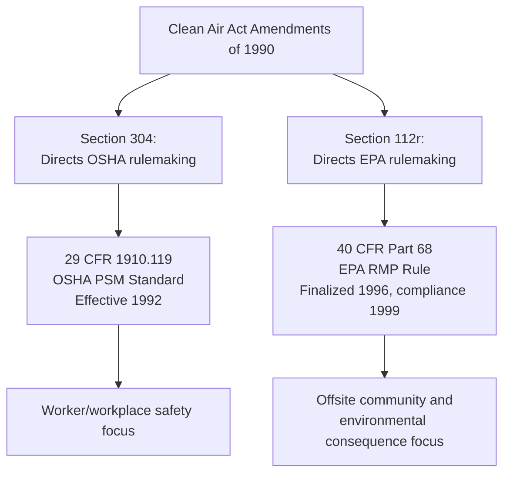
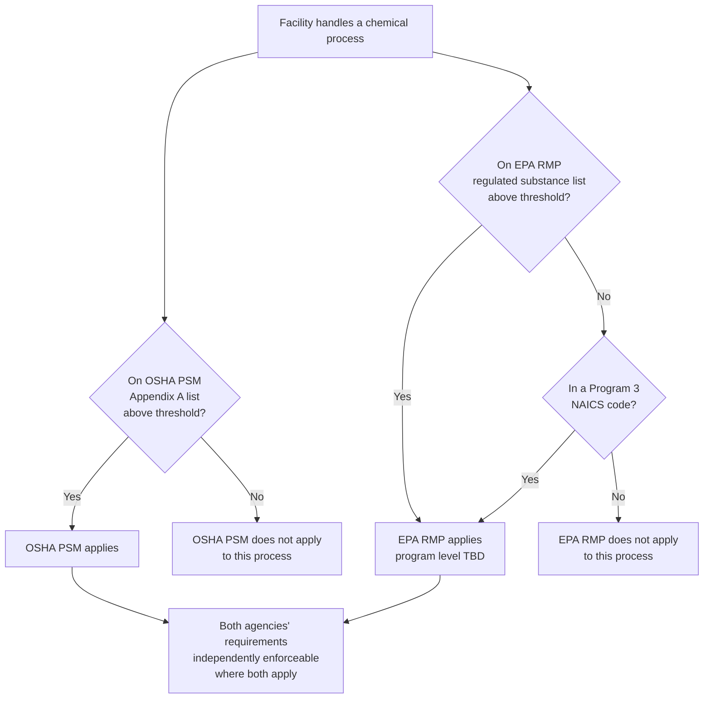
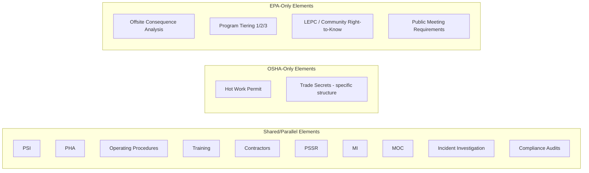

## Relationship Between OSHA PSM and EPA RMP

### Overview

OSHA's Process Safety Management standard (29 CFR 1910.119) and EPA's Risk Management Program (40 CFR Part 68) are two separate, independently enforceable federal regulatory regimes that emerged from the same underlying legislative mandate and share substantial structural overlap. Both were developed pursuant to the Clean Air Act Amendments of 1990, which directed OSHA to issue a workplace process safety standard and directed EPA to issue a parallel program addressing offsite/community risk from the same class of hazardous chemical processes. Understanding how these two regimes relate — where they overlap, where they diverge, and how compliance with one interacts with compliance with the other — is essential for any facility subject to both, since a single covered process at such a facility must simultaneously satisfy two agencies' requirements, each with its own enforcement authority, inspection regime, and penalty structure.

**Key Points**

- Both standards trace their origin to the Clean Air Act Amendments of 1990, Section 304 (OSHA PSM directive) and Section 112(r) (EPA RMP directive)
- OSHA PSM focuses on worker safety; EPA RMP focuses on offsite/community and environmental consequences
- Program 3 under EPA RMP is structurally designed to closely mirror OSHA PSM's fourteen elements
- A facility can be covered by one standard without being covered by the other, due to differing chemical lists and threshold quantities
- Compliance with one standard does not automatically satisfy the other, despite substantial structural overlap
- Both are enforced independently — OSHA enforces PSM under the OSH Act; EPA enforces RMP under the Clean Air Act

### Common Legislative Origin

**[Confirmed]** Both regulatory programs originate from the Clean Air Act Amendments of 1990. Section 304 of that legislation directed OSHA to promulgate a standard addressing process safety management of highly hazardous chemicals, resulting in 29 CFR 1910.119, effective 1992. Section 112(r) of the same legislation directed EPA to develop regulations addressing the prevention of accidental releases with offsite consequences, resulting in the Risk Management Program at 40 CFR Part 68, with the first RMP rule finalized in 1996 (compliance deadline 1999).

**[Inference]** This shared legislative origin explains much of the structural similarity between the two programs' Program 3 prevention program elements — both were responding to the same set of catastrophic industrial chemical accidents (domestically and internationally, including incidents that motivated the Clean Air Act Amendments) and were developed with awareness of each other's parallel rulemaking process, which is why Program 3's prevention program requirements so closely track OSHA PSM's fourteen elements rather than representing an independently derived framework.

### Divergent Purposes: Worker Safety vs. Offsite Consequence

While structurally similar in Program 3, the two regimes serve fundamentally different protective purposes:

| Dimension | OSHA PSM (1910.119) | EPA RMP (40 CFR Part 68) |
| --- | --- | --- |
| Primary protected population | Employees and on-site personnel | Off-site public, emergency responders, environment |
| Enforcing agency | Occupational Safety and Health Administration (Department of Labor) | Environmental Protection Agency |
| Authorizing statute | Occupational Safety and Health Act | Clean Air Act |
| Core analytical tool | Process Hazard Analysis (PHA) | Offsite Consequence Analysis (worst-case and alternative release scenarios) |
| Public disclosure orientation | Primarily internal to the regulated facility and its workers | Explicit community right-to-know function (public receptor identification, LEPC coordination) |
| Program tiering | Single uniform standard (all covered processes subject to same fourteen elements) | Three-tiered (Program 1, 2, 3) based on offsite risk profile |

**[Inference]** This purpose divergence explains why EPA RMP, unlike OSHA PSM, includes offsite consequence analysis and a tiered program structure keyed to public receptor proximity — EPA's regulatory concern is calibrated to the population that could be affected beyond the facility fence line, whereas OSHA's concern is calibrated to the workforce within the facility regardless of offsite receptor proximity. A facility with no nearby public receptors at all could still be fully subject to OSHA PSM's uniform requirements, while that same facility might qualify for EPA RMP Program 1's minimal requirements precisely because of that receptor absence.

### Differing Chemical Lists and Coverage Triggers

**[Unverified]** OSHA PSM and EPA RMP each maintain their own regulated substance lists and threshold quantities — OSHA's Appendix A to 1910.119 and EPA's regulated substance lists under 40 CFR Part 68 (Subpart F, and the flammable/toxic substance appendices) are not identical. While there is substantial overlap (many of the same highly hazardous chemicals appear on both lists, often at similar or identical threshold quantities, reflecting their shared legislative origin and coordinated rulemaking), the lists are not perfectly congruent, and threshold quantities can differ for specific substances. Facilities should independently verify coverage against both the current OSHA Appendix A and the current EPA 40 CFR Part 68 substance lists rather than assuming that determining coverage under one standard automatically determines coverage under the other.

**[Inference]** This means a facility could, in principle:

- Be covered by OSHA PSM but not EPA RMP, if it handles a substance/quantity above the OSHA threshold but below (or absent from) the EPA threshold/list
- Be covered by EPA RMP but not OSHA PSM, if it handles a substance/quantity above the EPA threshold but below the OSHA threshold, or if it falls within one of EPA's Program 3 NAICS-code triggers despite the specific substance/process not meeting OSHA PSM's coverage criteria
- Be covered by both, which is the most common scenario for large chemical processing, petrochemical, and refining facilities handling substances on both lists above both sets of thresholds

### Program 3 Structural Parallel to OSHA PSM

The clearest point of intentional convergence between the two regimes is EPA RMP's Program 3, whose prevention program elements are structured to closely mirror OSHA PSM's fourteen elements:

| OSHA PSM Element (1910.119) | EPA RMP Program 3 Equivalent (40 CFR 68, Subpart D) |
| --- | --- |
| Employee Participation (b) | Employee participation |
| Process Safety Information (d) | Process safety information |
| Process Hazard Analysis (e) | Process hazard analysis |
| Operating Procedures (f) | Operating procedures |
| Training (g) | Training |
| Contractors (h) | Contractors |
| Pre-Startup Safety Review (i) | Pre-startup review |
| Mechanical Integrity (j) | Mechanical integrity |
| Hot Work Permit (k) | Hot work permit |
| Management of Change (l) | Management of change |
| Incident Investigation (m) | Incident investigation |
| Emergency Planning and Response (n) | (Addressed separately via RMP's own emergency response program requirements under Subpart E, plus offsite consequence analysis under Subpart B) |
| Compliance Audits (o) | Compliance audits |
| Trade Secrets (p) | (Addressed under EPA's own confidentiality/trade secret provisions) |

**[Inference]** For a facility subject to both OSHA PSM and EPA RMP Program 3 on the same process, this structural parallel means much of the same underlying documentation (PHA reports, operating procedures, MOC records, MI inspection records, training records, incident investigation reports, compliance audit reports) can substantively serve both regulatory purposes simultaneously — a facility does not need to build two entirely separate management systems, but rather one integrated PSM/RMP management system that satisfies both sets of requirements. However, the two agencies retain independent inspection and enforcement authority, meaning a single management system failure could generate citations or violations from both OSHA and EPA independently, under their respective statutes and penalty structures.

### Key Areas of Non-Overlap

Despite Program 3's structural parallel, several elements exist in one regime but not the other, or are addressed with meaningfully different scope:

- **Offsite Consequence Analysis**: EPA RMP's worst-case and alternative release scenario requirements (Subpart B) have no direct OSHA PSM analog — OSHA PSM's PHA addresses process hazards generally but does not require the specific offsite dispersion/consequence modeling EPA requires.
- **Program tiering (1, 2, 3)**: OSHA PSM applies uniformly to all covered processes with no risk-based tiering; EPA RMP's three-tier structure has no OSHA PSM equivalent.
- **Public receptor and community right-to-know functions**: EPA RMP's LEPC coordination, public meeting requirements after reportable accidents, and community disclosure functions have no direct OSHA PSM parallel, reflecting OSHA's workplace-focused (rather than community-facing) statutory mandate.
- **Hot Work Permit and Trade Secrets as standalone elements**: These OSHA PSM elements do not have precisely matching standalone EPA RMP provisions, though analogous protections and practices are often incorporated into a facility's RMP program through its broader hazard and confidentiality-handling practices.

### Independent Enforcement and Compliance Verification

**[Confirmed]** Compliance with one standard does not automatically constitute compliance with the other, even where substantial documentation overlap exists — OSHA and EPA are separate agencies operating under separate statutory authority (the OSH Act and the Clean Air Act, respectively), with separate inspection programs, separate citation/violation processes, and separate penalty structures. An OSHA PSM inspection evaluates compliance against 1910.119; an EPA RMP inspection (or audit) evaluates compliance against 40 CFR Part 68 — a facility could pass one agency's review while having deficiencies identified by the other, particularly regarding elements unique to each regime (e.g., an OSHA inspector would not typically evaluate offsite consequence analysis quality, while an EPA inspector's Program 3 review would).

**[Inference]** In practice, many facilities coordinate their OSHA PSM and EPA RMP compliance functions under a single internal EHS/process safety management structure, given the substantial element-level overlap in Program 3 — but this internal coordination is a matter of practical efficiency, not a regulatory merger of the two programs' independent enforceability.

### Example: Coordinated Compliance Scenario

**Example**

A specialty chemical facility operates a reactive process using a Program 3 NAICS-classified chemical process that also exceeds OSHA PSM's Appendix A threshold for one of the process chemicals.

1. **Dual coverage determination**: The facility confirms the process is covered by both OSHA PSM (Appendix A threshold exceeded) and EPA RMP Program 3 (both due to PSM applicability and independently due to its NAICS classification).
2. **Integrated PHA**: A single Process Hazard Analysis is conducted, structured to satisfy both OSHA's 1910.119(e) requirements and EPA's 40 CFR 68 Subpart D PHA requirements, since both regimes accept substantially similar PHA methodologies (e.g., HAZOP, What-If) and content requirements.
3. **Offsite Consequence Analysis (EPA-specific)**: In addition to the shared PHA, the facility separately conducts worst-case and alternative release scenario modeling under EPA RMP Subpart B — this analysis is not required by OSHA PSM and is performed as an EPA-specific supplemental requirement.
4. **Shared MOC/MI/Training records**: The facility's Management of Change, Mechanical Integrity, and training programs are documented once, in a unified system, satisfying both OSHA 1910.119(l)/(j)/(g) and EPA RMP's corresponding Program 3 provisions.
5. **Separate compliance audits (potentially combined in practice)**: The facility conducts its compliance audit addressing both OSHA PSM's fourteen elements and EPA RMP Program 3's parallel elements in a single audit engagement, while recognizing that OSHA's 1910.119(o) audit requirement and EPA's Part 68 audit requirement remain technically separate regulatory obligations even when combined operationally.
6. **Independent inspections**: OSHA conducts a PSM-focused inspection under its National Emphasis Program, evaluating the fourteen PSM elements; separately, EPA (or a delegated state agency) conducts an RMP inspection or audit, evaluating both the Program 3 prevention program elements and the EPA-specific offsite consequence analysis and public disclosure requirements. Findings from one agency do not bind or substitute for the other's independent review.
7. **RMP submission**: The facility submits its Risk Management Plan to EPA, including the offsite consequence analysis, program level certification, and prevention program summary — a submission obligation with no direct OSHA PSM parallel.

### Common Points of Confusion

**[Inference]** Based on the structural relationship described above, common areas of confusion for facilities managing dual compliance include:

- Assuming that satisfying OSHA PSM automatically satisfies EPA RMP Program 3, without independently verifying EPA-specific requirements (particularly offsite consequence analysis, which has no OSHA equivalent)
- Assuming a facility's OSHA PSM coverage determination automatically extends to EPA RMP coverage, without checking EPA's independently maintained substance list, threshold quantities, and NAICS-based Program 3 triggers
- Treating an OSHA compliance audit finding (or lack thereof) as evidence of EPA RMP compliance, or vice versa, when the two audits evaluate against different regulatory texts
- Overlooking EPA-specific community disclosure obligations (public meetings after reportable accidents, LEPC coordination) that have no OSHA PSM equivalent driving similar action

### Conclusion

OSHA PSM and EPA RMP function as complementary but legally distinct regulatory regimes, born from the same 1990 Clean Air Act Amendments mandate but serving different protected populations — workers under OSHA's authority, and the offsite public and environment under EPA's authority. Their most significant point of convergence, EPA RMP's Program 3 prevention program, was deliberately designed to parallel OSHA PSM's fourteen elements closely enough that a single integrated management system can substantively satisfy both, but this convergence is a practical efficiency, not a legal merger: differing chemical lists, differing threshold quantities, EPA's unique offsite consequence analysis and program-tiering requirements, and each agency's independent enforcement authority mean that a facility subject to both regimes must maintain genuine, verifiable compliance with each on its own terms, rather than assuming compliance with one regulatory system automatically discharges its obligations under the other.

**Related Topics**

- Clean Air Act Section 112(r) Legislative History and Rulemaking
- RMP Program Levels 1, 2, and 3 Classification Criteria
- Offsite Consequence Analysis and Worst-Case Release Scenarios
- Comparing OSHA Appendix A and EPA Part 68 Regulated Substance Lists
- Integrated PSM/RMP Management System Design
- State Delegation of EPA RMP Enforcement Authority
- Local Emergency Planning Committee (LEPC) Coordination Requirements
- Dual-Agency Inspection Coordination and Facility Preparedness