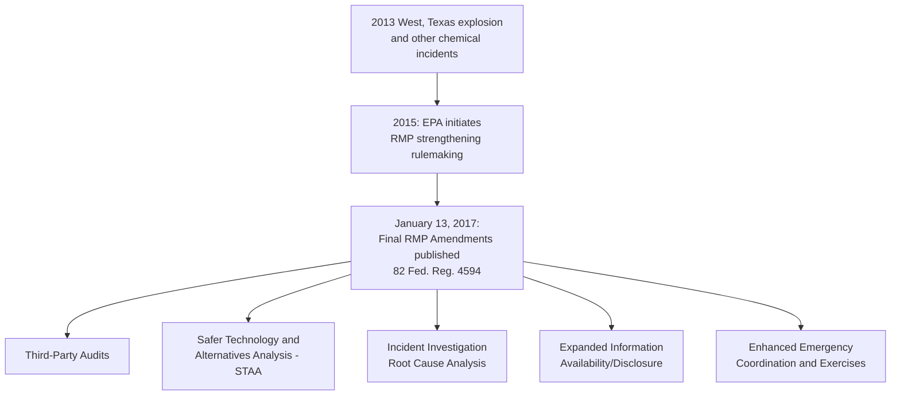
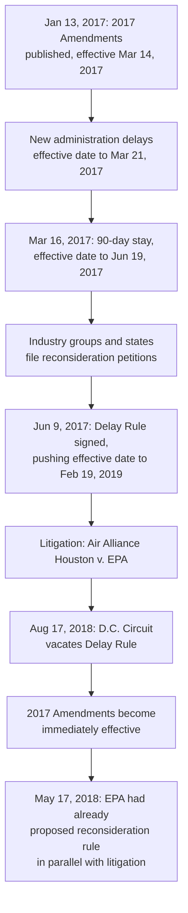
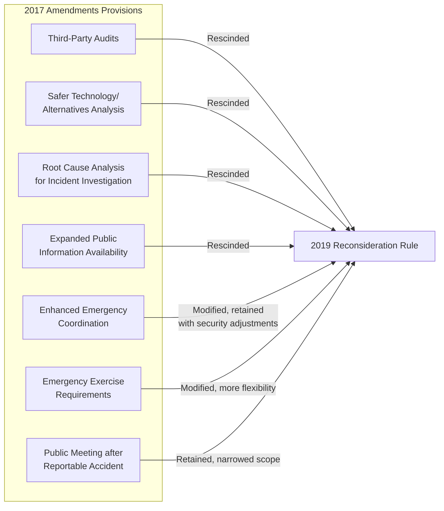
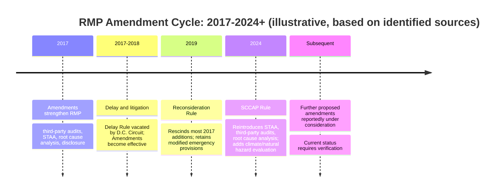

## 2017 RMP Amendments and 2019 Reconsideration Rule

### Overview

The 2017 RMP Amendments and the 2019 Reconsideration Rule represent one cycle in a longer, politically contested history of revisions to EPA's Risk Management Program (40 CFR Part 68). The 2017 Amendments, finalized in the final days of the Obama administration, significantly strengthened RMP requirements in response to catastrophic incidents including the 2013 West, Texas fertilizer explosion. The subsequent Trump administration EPA moved to delay, and then substantially reverse, most of those strengthened provisions, culminating in the 2019 Reconsideration Rule. This regulatory back-and-forth is a useful case study in how RMP requirements can shift substantially between administrations, and — as later developments show — the story did not end in 2019: a further significant amendment (the 2024 Safer Communities by Chemical Accident Prevention Rule) reintroduced many of the provisions the 2019 rule had rescinded, illustrating the cyclical nature of this regulatory area.

**Key Points**

- The 2017 RMP Amendments (82 Fed. Reg. 4594, January 13, 2017) added third-party audits, safer technology/alternatives analysis, incident investigation root cause analysis, and expanded information availability requirements
- The 2017 Amendments' effective date was delayed multiple times and became the subject of significant litigation
- The 2019 Reconsideration Rule (effective December 19, 2019) rescinded most of the 2017 Amendments' major prevention program additions
- **[Unverified — current as of this response's research, but this is an active regulatory area]** A subsequent 2024 rule (the Safer Communities by Chemical Accident Prevention Rule) reintroduced several of the 2017-era provisions the 2019 rule had rescinded, and further proposed amendments to that 2024 rule have reportedly been under consideration — facilities should verify the current, currently-effective RMP text before relying on any specific provision described here as active

### The 2017 RMP Amendments: Content and Motivation

On January 13, 2017, EPA published the final RMP Amendments (82 Fed. Reg. 4594) during the final days of the Obama administration. This rulemaking had been initiated in 2015, motivated substantially by the 2013 West, Texas ammonium nitrate explosion and other chemical incidents that raised concerns about the adequacy of existing RMP requirements. The amendments changed a number of RMP program elements, including compliance audits, the process hazard analysis process, emergency response drills and preparedness activities, and information sharing with the public and local emergency responders.

Major substantive additions in the 2017 Amendments included:

- **Third-party audits**: Requiring an independent, external audit (rather than solely an internal or facility-selected auditor) following certain accidents
- **Safer technology and alternatives analysis (STAA)**: Requiring facilities in specified high-hazard sectors to formally evaluate safer process technologies and chemical alternatives as part of their process hazard analysis
- **Incident investigation root cause analysis**: Strengthening the incident investigation requirement to explicitly require root cause analysis, beyond the general "contributing factors" language of the prior rule
- **Enhanced information availability/public disclosure**: Expanding what chemical hazard and accident information facilities must make available to the public and local communities
- **Enhanced emergency coordination and exercise requirements**: Strengthening coordination provisions with local emergency responders and formalizing tabletop and field exercise expectations

### Delay, Litigation, and Vacatur (2017-2018)

The 2017 Amendments became the subject of immediate and sustained regulatory contestation:

1. Seven days after the Obama EPA issued the amendments, the incoming Trump administration delayed the original March 14, 2017 effective date to March 21, 2017.
2. On March 16, 2017, EPA issued a 90-day stay, pushing the effective date to June 19, 2017.
3. Petitions for reconsideration were filed by two industry groups and a coalition of states, and both houses of Congress filed resolutions seeking to repeal the amendments under the Congressional Review Act (though these congressional repeal efforts did not ultimately succeed).
4. On June 9, 2017, EPA's Administrator signed a final rule (the "Delay Rule") further delaying the effective date by 20 months, to February 19, 2019, explaining that the delay would allow the agency to evaluate the issues raised in the reconsideration petitions.
5. On August 17, 2018, the D.C. Circuit Court of Appeals rejected and vacated the Delay Rule in *Air Alliance Houston v. EPA* (906 F.3d 1049, D.C. Cir. 2018), which had the effect of making the January 2017 RMP Amendments immediately effective, notwithstanding EPA's attempt to delay them.

### The Path to Reconsideration (2018)

In parallel with the litigation over the Delay Rule, EPA pursued a substantive reconsideration of the 2017 Amendments themselves:

- On May 17, 2018, EPA's Administrator signed a proposed rule requesting public comment on rescinding several of the 2017 Amendments' key provisions, specifically targeting: safer technology and alternatives analyses, third-party audits, incident investigations (root cause analysis), information availability, and several other minor regulatory changes.
- A public hearing on the proposed reconsideration rule was held in Washington, D.C., on June 14, 2018.

The stated rationale for reconsideration, as later documented in the final Reconsideration Rule materials, centered on several objections raised in three formal petitions submitted under Clean Air Act Section 307(d)(7)(B):

- **Potential security risks**: Concerns that the 2017 Amendments' expanded information disclosure requirements could create security risks by making sensitive chemical hazard information more broadly available
- **Reassessment of the West, Texas incident's cause**: The Bureau of Alcohol, Tobacco, Firearms and Explosives' finding that the West, Texas fire and explosion — a key incident that had motivated the original 2017 Amendments — was caused by a criminal act (arson) rather than being the result of an accidental process safety failure, which EPA cited as undermining part of the original rulemaking's justification
- **Cost concerns**: Objections regarding the compliance costs the 2017 Amendments imposed on regulated facilities
- **Coordination with OSHA**: Concerns that EPA had not adequately coordinated its 2017 rulemaking with OSHA, resulting in RMP requirements diverging from OSHA PSM in ways inconsistent with the two programs' historical alignment

### The 2019 Reconsideration Rule: Content

On November 20, 2019 (with the rule officially signed on that date and becoming effective December 19, 2019), EPA Administrator Andrew Wheeler signed the Risk Management Program Reconsideration Rule, finalizing changes to the 2017 Amendments. The Reconsideration Rule:

- **Rescinded** all major accident prevention program provisions added by the 2017 Amendments, specifically: third-party audits, safer technology and alternatives analyses, and incident investigation root cause analysis, along with most other minor prevention-program changes
- **Rescinded** the public information availability provisions added by the 2017 Amendments
- **Modified** (rather than fully rescinded) the emergency coordination provisions, to address the security concerns raised in the reconsideration petitions, while still aiming to ensure first responders retained access to necessary safety information
- **Modified** the emergency exercise provisions to provide greater flexibility to regulated facilities and local emergency responders in meeting exercise requirements
- **Retained**, with modification, the requirement to hold a public meeting within 90 days after an accident, though the Reconsideration Rule narrowed the circumstances triggering this requirement
- **Modified compliance dates** to provide additional time for facilities to adjust to whichever provisions remained

### Stated Rationale for the 2019 Rule

EPA's stated justification for the Reconsideration Rule, per its own fact sheet materials, was that the final rule would:

- More reasonably consider the costs of the 2017 Amendments
- Maintain consistency of RMP prevention requirements with the OSHA PSM standard (addressing the coordination concern)
- Better address potential security risks associated with the 2017 Amendments' information disclosure requirements
- Promote better emergency planning and public information about accidents
- Maintain requirements EPA associated with a trend of fewer significant accidents involving RMP-regulated chemicals

EPA estimated the changes would save regulated facilities approximately $88 million per year compared to compliance with the full 2017 Amendments.

**[Unverified]** This EPA cost-savings estimate reflects the agency's own regulatory impact analysis at the time and should not be treated as an independently verified figure; interested parties should consult the Reconsideration Rule's Regulatory Impact Analysis document directly for the underlying methodology.

### Anticipated and Actual Litigation Over the 2019 Rule

**[Unverified]** Contemporary reporting at the time indicated the 2019 Reconsideration Rule was expected to be challenged by a coalition of states and environmental groups, consistent with the pattern of litigation that had already characterized the 2017 Amendments' own effective-date delay. The specific outcome, procedural history, and disposition of any such litigation challenging the 2019 Reconsideration Rule was not confirmed in the sources reviewed for this response and should be independently verified if relevant to a specific compliance timeline analysis.

### Subsequent Development: The 2024 Safer Communities by Chemical Accident Prevention (SCCAP) Rule

**[Unverified — this reflects the most recent development identified in research for this response and may not represent the fully current regulatory state]** The 2017-2019 cycle was not the final word on this subject. EPA later finalized further amendments to the RMP, known as the Safer Communities by Chemical Accident Prevention (SCCAP) Rule, signed by the EPA Administrator on February 27, 2024, published in the Federal Register on March 11, 2024, and effective May 10, 2024, with certain requirements phased in through 2026-2028.

The SCCAP Rule notably **reintroduced several provisions the 2019 Reconsideration Rule had rescinded**, including:

- Requiring a Safer Technologies and Alternatives Analysis (STAA) within Process Hazard Analyses, and in some cases requiring implementation of reliable safeguard measures, for facilities in industry sectors with high accident rates
- Requiring third-party compliance audits for facilities that have had a prior RMP-reportable accident
- Requiring root cause analysis incident investigations, again specifically for facilities with a prior RMP accident
- Emphasizing evaluation of natural hazard and climate change risks (including associated power loss scenarios) within Process Hazard Analyses
- Enhancing facility planning and preparedness by ensuring timely chemical release information sharing with local responders and establishing community notification systems
- Increasing public transparency through expanded access to RMP facility information for nearby communities
- Advancing employee participation, training, and employee decision-making opportunities in accident prevention

**[Unverified]** Further proposed amendments to the 2024 SCCAP Rule itself have reportedly been under EPA consideration in a subsequent rulemaking cycle, addressing provisions relating to safer technology and alternatives analyses, information availability, third-party audits, employee participation, and community-related provisions. Given this apparent ongoing rulemaking activity, the current, legally effective state of these specific RMP provisions should be verified directly against EPA's current RMP rule text and Federal Register publications before being relied upon for compliance planning, rather than assumed static from this historical summary.

### Pattern and Lessons: Regulatory Volatility in RMP Prevention Program Scope

**[Inference]** This history illustrates a recurring pattern in RMP rulemaking: core baseline requirements (worst-case scenario analysis, basic prevention program elements, program-level tiering) have remained relatively stable across administrations, while more resource-intensive or disclosure-oriented provisions — third-party audits, safer technology and alternatives analysis, root cause incident investigation, and expanded public information availability — have been added, then substantially rescinded, then reintroduced across successive rulemakings tied to changes in administration priorities. Facilities operating RMP-covered processes over a multi-year or multi-decade horizon should anticipate that these specific "enhanced" provisions are the most likely candidates for future regulatory change, and should structure internal compliance tracking processes to monitor Federal Register activity on this rule rather than assuming static long-term stability in these particular requirements.

### Example: Compliance Planning Implication

**Example**

A chemical facility subject to EPA RMP Program 3, in a NAICS sector identified by EPA as having a high accident rate, would need to track this rulemaking history carefully:

1. Under the original 2017 Amendments (briefly effective in 2018 following the Delay Rule's vacatur), the facility would have needed to begin planning for third-party audits and a safer technology and alternatives analysis.
2. Following the December 2019 effective date of the Reconsideration Rule, those specific obligations would have been rescinded, and the facility's compliance obligations would have reverted closer to the pre-2017 baseline (with modified emergency coordination and exercise provisions retained).
3. Following the May 2024 effective date of the SCCAP Rule, the facility — if in a high-accident-rate sector — would once again need to plan for safer technology and alternatives analysis and, if it has a prior RMP-reportable accident, third-party audits and root cause analysis incident investigation, phased in through the 2026-2028 compliance schedule referenced in contemporaneous reporting.
4. Given reported further proposed amendments to the 2024 rule, this same facility should continue monitoring EPA's Federal Register activity rather than treating the 2024 rule's provisions as permanently fixed.

### Conclusion

The 2017 RMP Amendments and 2019 Reconsideration Rule together illustrate how a change in political administration can substantially alter the scope of EPA's chemical accident prevention requirements within a span of just a few years — from significant strengthening under the outgoing Obama administration, through delay and litigation, to substantial rollback under the incoming Trump administration's EPA. This was not, however, the end of the story: the 2024 Safer Communities by Chemical Accident Prevention Rule subsequently reintroduced many of the provisions the 2019 rule had rescinded, and further amendments to that 2024 rule reportedly remain under consideration. For compliance purposes, this history underscores that provisions like third-party audits, safer technology and alternatives analysis, and root cause incident investigation requirements have proven to be the most volatile elements of the RMP program across administrations, and facilities should treat the currently effective RMP text — verified against EPA's current rule and Federal Register publications — as the only reliable basis for compliance planning, rather than any single historical snapshot of the rule.

**Related Topics**

- Safer Technology and Alternatives Analysis (STAA) Requirements and Methodology
- Third-Party Compliance Audit Requirements Following RMP-Reportable Accidents
- Root Cause Analysis Methodologies for Incident Investigation
- 2024 Safer Communities by Chemical Accident Prevention (SCCAP) Rule Details
- Natural Hazard and Climate Change Risk Evaluation in Process Hazard Analysis
- Community Notification System Requirements Under Current RMP Rule
- Congressional Review Act Mechanics and Historical Application to EPA Rules
- Environmental Justice Considerations in Chemical Facility Regulation