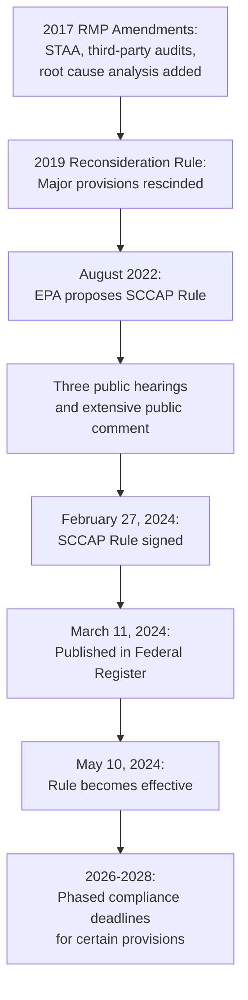
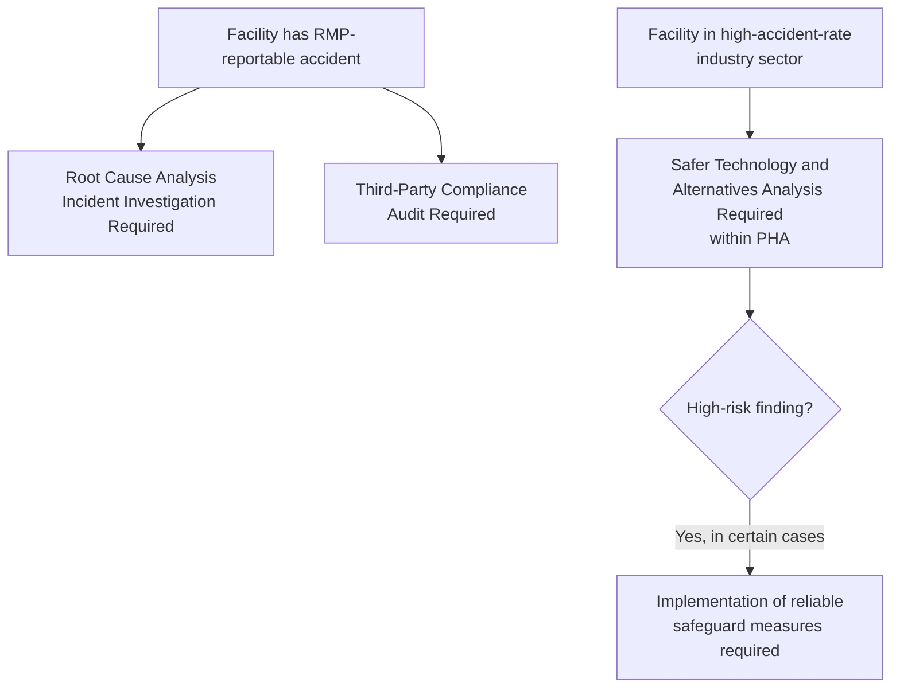
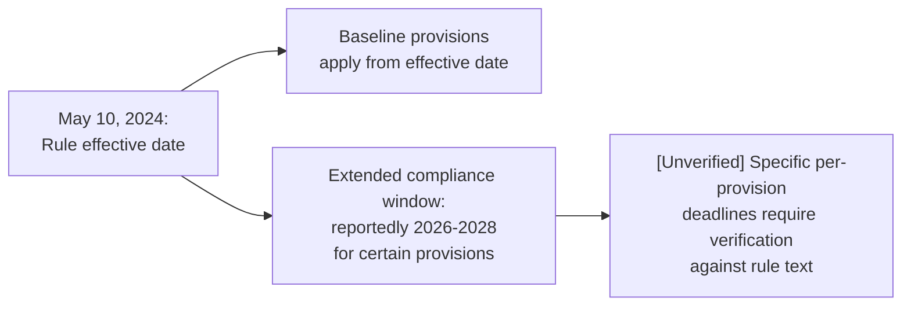

## 2024 Safer Communities by Chemical Accident Prevention Rule

### Overview

The Safer Communities by Chemical Accident Prevention Rule (SCCAP Rule) is EPA's most recent comprehensive amendment to the Risk Management Program (40 CFR Part 68), signed by the EPA Administrator on February 27, 2024, published in the Federal Register on March 11, 2024, and effective May 10, 2024. The rule represents the culmination of a rulemaking process that began with a proposed rule in August 2022, following three public hearings and extensive public comment. Significantly, the SCCAP Rule reintroduces several major prevention program provisions that had been added by the 2017 RMP Amendments and subsequently rescinded by the 2019 RMP Reconsideration Rule — making it the latest chapter in an ongoing regulatory cycle rather than a wholly novel framework. **[Unverified]** Given that further proposed amendments to this very rule have reportedly been under EPA consideration in a subsequent rulemaking cycle, facilities should verify the currently effective RMP text before treating any specific provision described here as presently in force without confirmation.

**Key Points**

- Signed February 27, 2024; published in the Federal Register March 11, 2024; effective May 10, 2024
- Applies to all RMP-regulated facilities nationwide, with more stringent requirements for a subgroup of facilities in high-accident-rate industry sectors
- Reintroduces third-party audits, safer technology/alternatives analysis, and root cause analysis incident investigation — provisions the 2019 Reconsideration Rule had rescinded
- Adds new requirements not present in either the 2017 or pre-2017 rules, including natural hazard/climate change risk evaluation and expanded community notification systems
- Several requirements are phased in on an extended compliance schedule reportedly extending through 2026-2028
- Framed by EPA explicitly as an environmental justice initiative, targeting protection of communities near high-risk facilities

### Regulatory History and Motivation

The SCCAP Rule traces its origin to a proposed rule EPA issued in August 2022, reflecting "the culmination of three public hearings, many comments on EPA's proposed rule... and the efforts of many spanning administrations going back to President Obama." This framing situates the rule as a continuation of the same underlying policy trajectory that produced the original 2017 RMP Amendments, after that trajectory had been substantially interrupted by the 2019 Reconsideration Rule.

EPA's stated rationale for the rule centers on protecting vulnerable and overburdened communities: "Many communities that are vulnerable to chemical accidents are in overburdened and underserved areas of the country," and the rule is characterized as "a critical piece of the Biden-Harris Administration's commitment to advancing environmental justice by putting in place stronger safety requirements for industrial facilities and new measures to protect communities from harm." EPA's own preamble language states that "as major and other serious and concerning RMP accidents continue to occur, the record shows and EPA believes that this final rule will help further protect human health and the environment from chemical hazards through advancement of process safety based on lessons learned."

### Scope of Coverage

The final rule covers all RMP-regulated facilities nationwide — reported at 11,740 regulated RMP facilities across the country at the time of the rule's finalization — but contains more rigorous requirements for a subgroup of facilities identified as more accident-prone and posing the greatest risk to communities. This tiered-stringency approach means not every RMP-covered facility faces the rule's most demanding new provisions; the enhanced requirements are specifically targeted at facilities in industry sectors EPA has identified as having elevated historical accident rates.

**[Inference]** This targeted-stringency design mirrors the broader RMP program-level tiering logic (Program 1/2/3) and EPA's existing NAICS-code-based Program 3 triggers — rather than creating an entirely new classification system, the SCCAP Rule appears to layer additional requirements onto the existing framework specifically for facilities already identified as higher-risk through sector-based criteria, though the precise mechanism (whether tied to existing Program 3 NAICS codes, accident history, or a new SCCAP-specific criterion) should be verified against the rule's specific regulatory text for any facility assessing its own applicability.

### Key Provision 1: Safer Technology and Alternatives Analysis (STAA)

The rule requires facilities to perform a Safer Technologies and Alternatives Analysis within their Process Hazard Analyses, and in some cases requires implementation of reliable safeguard measures, specifically for certain facilities in industry sectors with high accident rates.

**[Inference]** This provision closely parallels the STAA requirement originally introduced in the 2017 RMP Amendments before being rescinded in 2019 — its reintroduction in substantially similar form suggests EPA's underlying technical rationale for requiring alternatives analysis (encouraging inherently safer design and technology substitution as a hazard-reduction strategy, rather than relying solely on procedural and administrative controls) remained a priority across the intervening rulemaking cycles, even though the specific implementation requirement (mandatory safeguard implementation "in certain cases," rather than analysis alone) may represent a strengthened version compared to the 2017 provision.

### Key Provision 2: Third-Party Compliance Audits

The rule requires third-party compliance audits for facilities that have had a prior RMP-reportable accident. This targets the audit requirement specifically at facilities with a demonstrated accident history, rather than applying a universal third-party audit mandate to all RMP-covered facilities regardless of accident record.

**[Inference]** This accident-history-triggered structure differs somewhat from a blanket third-party audit requirement — it functions similarly to a corrective, escalated compliance verification specifically for facilities that have already demonstrated a prevention program gap through an actual reportable accident, rather than a universal independent-audit mandate applied prospectively to all covered facilities regardless of track record.

### Key Provision 3: Root Cause Analysis Incident Investigation

The rule requires more thorough incident investigations, specifically requiring root cause analysis incident investigations for facilities that have had an RMP accident. As with the third-party audit provision, this requirement is explicitly triggered by having had a prior RMP accident, reinforcing the pattern of escalated obligations for facilities with a demonstrated accident history.

### Key Provision 4: Natural Hazard and Climate Change Risk Evaluation

The rule emphasizes the requirement to evaluate risks of natural hazards and climate change within Process Hazard Analyses, including any associated losses of power. This is a substantively new area of emphasis not present in either the pre-2017 rule or the 2017 Amendments in this specific framing.

**[Inference]** This provision reflects a broader regulatory trend of incorporating climate-related physical risk (extreme weather events, flooding, extended power outages) into industrial safety frameworks — for RMP-covered processes, a loss-of-power event during a natural hazard scenario is a plausible initiating event for a loss of containment (e.g., failure of active cooling, agitation, or containment systems dependent on electrical power), making this a logical extension of traditional PHA scope into a category of initiating events that may have been under-addressed in facility hazard reviews historically.

### Key Provision 5: Enhanced Emergency Planning, Preparedness, and Community Notification

The rule enhances facility planning and preparedness efforts to strengthen emergency response, specifically by:

- Ensuring chemical release information is shared with local responders in a timely manner
- Establishing a community notification system to warn nearby communities of an impending or occurring release

**[Inference]** The community notification system requirement appears to extend beyond the pre-existing RMP emergency response coordination and post-accident public meeting requirements (carried over from earlier rule iterations) toward a more proactive, real-time public warning capability — this represents a meaningful expansion of the community-facing dimension of the rule beyond historical after-the-fact disclosure and periodic coordination obligations.

### Key Provision 6: Increased Public Transparency and Information Access

The rule increases transparency by providing access to RMP facility information for nearby communities, and EPA committed to publishing the rule alongside a public-facing tool giving communities access to RMP information for facilities in their vicinity.

**[Unverified]** The specific scope, format, and any security-related limitations on this public information access tool were not detailed in the search results reviewed for this response; given the historical sensitivity around RMP information disclosure (which was a central point of contention in both the 2017 Amendments and the 2019 Reconsideration Rule, driven by security-risk concerns), the specific mechanics of this transparency provision should be verified directly against EPA's implementing materials and any associated security safeguards before being characterized in detail.

### Key Provision 7: Employee Participation Enhancements

The rule advances employee participation, training, and opportunities for employee decision-making in facility accident prevention. It also reiterates the allowance of a partial or complete process shutdown by employees in the event of a potential catastrophic release.

**[Inference]** The explicit reiteration of employee authority to initiate a partial or complete process shutdown in a potential catastrophic release scenario appears to reinforce and clarify employee "stop-work"-type authority in the specific RMP context — a protection that parallels similar stop-work concepts found in general industrial safety culture and in OSHA's own employee-participation-related expectations, though the precise legal mechanics of this shutdown authority provision within the RMP rule specifically should be reviewed in the rule's actual regulatory text for implementation purposes.

### Compliance Timeline

The rule became effective May 10, 2024 (60 days after Federal Register publication, consistent with standard EPA rule effective-date practice), with several specific requirements phased in on an extended schedule reportedly running through 2026-2028.

**[Unverified]** The specific compliance dates for individual provisions (which requirement applies by which specific date within the 2026-2028 window) were not itemized in detail in the sources reviewed for this response; facilities subject to the rule should consult the rule's specific compliance schedule provisions (typically found in the rule's applicability and implementation sections) to determine exact deadlines applicable to their specific facility classification and triggered provisions.

### Interaction with OSHA PSM

**[Inference]** Given that several SCCAP Rule provisions (safer technology and alternatives analysis, third-party audits, root cause incident investigation) closely parallel or extend beyond corresponding OSHA PSM concepts, facilities subject to both regimes should reassess their integrated PSM/RMP management systems following this rule's implementation — a facility's existing OSHA PSM-driven incident investigation process, for example, may need supplementation with a formal root cause analysis methodology to satisfy the EPA-specific trigger tied to having had a prior RMP-reportable accident, even if the facility's existing OSHA-driven investigation process was already adequate for PSM purposes alone. The two regimes remain independently enforceable, as with all prior RMP/PSM comparisons, so satisfying the new EPA-specific provisions requires independent verification rather than an assumption that existing PSM compliance automatically extends to cover them.

### Reported Subsequent Regulatory Activity

**[Unverified]** Beyond the scope of confirmed detail in the sources reviewed for this response, there are indications that EPA has proposed further amendments to the SCCAP Rule itself in a subsequent rulemaking, reportedly addressing provisions relating to safer technology and alternatives analyses, information availability, third-party audits, employee participation, and community-related provisions. This suggests the SCCAP Rule, like its 2017 and 2019 predecessors, may itself be subject to further revision. Facilities should treat this note as a signal to actively monitor EPA's Federal Register activity and current RMP guidance rather than treating the SCCAP Rule as a final, static endpoint in this regulatory area.

### Example: Facility Compliance Scenario

**Example**

A petrochemical facility classified under one of the high-accident-rate NAICS sectors and covered under EPA RMP Program 3 (also OSHA PSM-covered) evaluates its obligations following the SCCAP Rule's effective date.

1. **STAA determination**: Because the facility's sector is identified as high-accident-rate, the facility must incorporate a Safer Technologies and Alternatives Analysis into its next Process Hazard Analysis cycle, evaluating whether inherently safer technology or chemical substitution options exist for its highest-risk processes.
2. **Accident history check**: The facility reviews whether it has had any RMP-reportable accidents in the relevant lookback period. If so, it must arrange for a third-party (rather than solely internal) compliance audit and ensure its incident investigation program incorporates formal root cause analysis methodology for that accident and any future ones.
3. **Climate/natural hazard review**: The facility's next PHA cycle incorporates an assessment of natural hazard exposure (e.g., hurricane, flood, or extreme heat risk relevant to its geographic location) and the consequences of an associated loss of grid power on its safety-critical systems.
4. **Community notification system**: The facility evaluates its existing emergency notification infrastructure against the new community notification system requirement, potentially implementing new public alerting technology (e.g., reverse-911 integration, sirens, or a mobile alert system) to satisfy the enhanced preparedness provisions.
5. **Public information posture**: The facility prepares for its RMP information to become more readily accessible to nearby community members through EPA's associated public information tool, and reviews internally what security-sensitive information, if any, warrants continued protection consistent with historical security concerns raised in earlier rulemaking cycles.
6. **Employee participation review**: The facility reviews and reinforces its documented employee shutdown authority procedures to ensure alignment with the rule's reiterated emphasis on this protection.
7. **Compliance scheduling**: The facility maps each triggered requirement against the rule's phased compliance schedule (through 2026-2028 for certain provisions) to build an internal implementation timeline.

### Conclusion

The 2024 Safer Communities by Chemical Accident Prevention Rule represents the most substantial strengthening of EPA's Risk Management Program since the short-lived 2017 Amendments, reintroducing safer technology and alternatives analysis, third-party audits, and root cause incident investigation requirements that had been rescinded in 2019, while adding genuinely new elements — natural hazard and climate change risk evaluation, expanded community notification systems, and enhanced public transparency tools — that extend beyond any prior iteration of the rule. Framed explicitly around environmental justice and protection of vulnerable communities near high-accident-rate facilities, the rule applies its most demanding provisions selectively, targeting facilities with elevated accident risk or an actual accident history rather than imposing uniform new burdens across all RMP-covered processes. Given the demonstrated volatility of these specific provisions across the 2017-2019-2024 regulatory cycle, and reported further proposed amendments to this very rule, facilities should treat the SCCAP Rule as the current but not necessarily final word on RMP prevention program scope, and should maintain active monitoring of EPA's ongoing rulemaking activity in this area.

**Related Topics**

- 2017 RMP Amendments and 2019 Reconsideration Rule (Historical Cycle)
- Safer Technology and Alternatives Analysis (STAA) Methodology and Implementation
- Natural Hazard and Climate Change Risk Integration into Process Hazard Analysis
- Third-Party Compliance Audit Selection and Independence Standards
- Community Notification System Design for Chemical Release Events
- Employee Stop-Work and Process Shutdown Authority Provisions
- RMP Public Information Access Tools and Security Balancing
- Environmental Justice Considerations in Chemical Facility Regulation