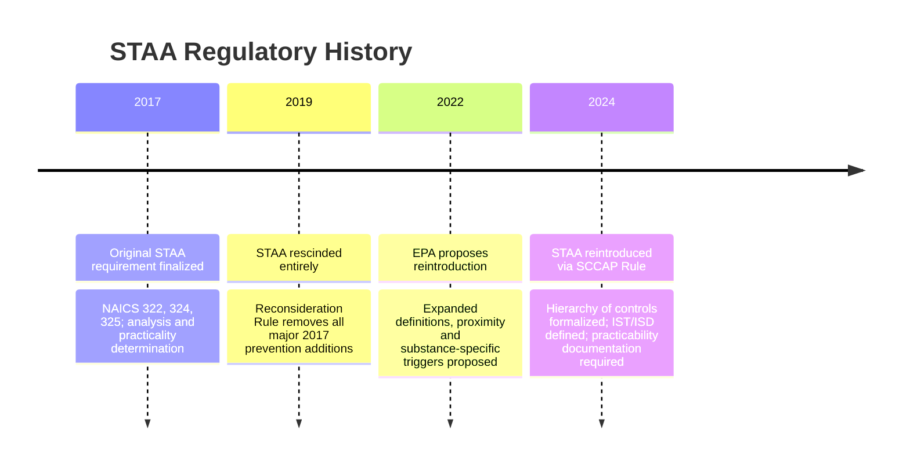
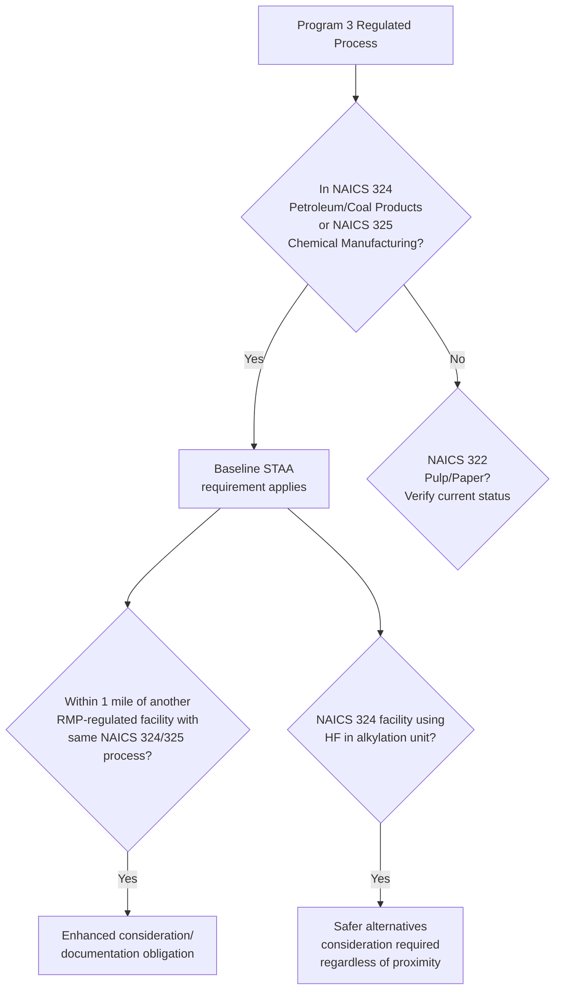
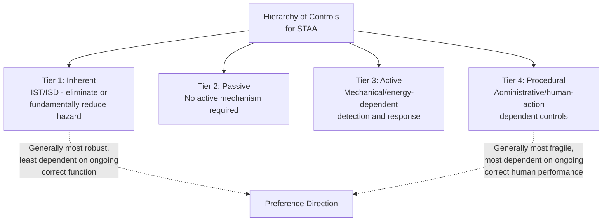
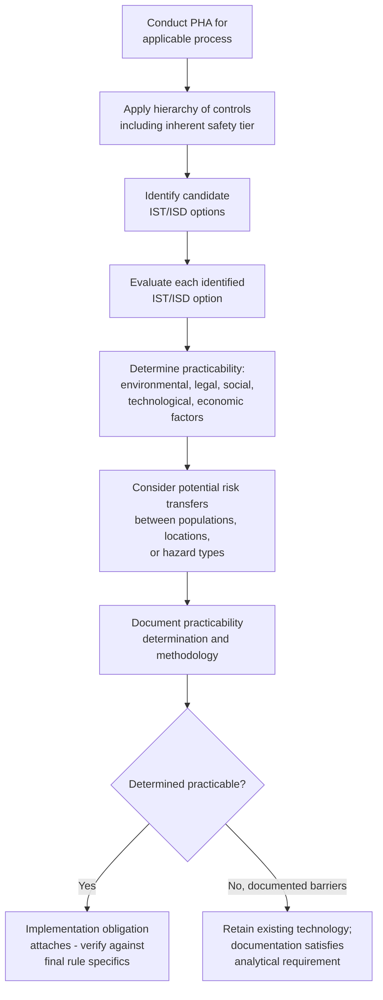

## Safer Technology and Alternatives Analysis Requirements

### Overview

Safer Technology and Alternatives Analysis (STAA) is a Process Hazard Analysis requirement under EPA's Risk Management Program (40 CFR Part 68) that mandates certain Program 3 facilities formally evaluate inherently safer technology and design options — not merely engineering and administrative controls — as part of their PHA. STAA's defining feature is that it forces explicit consideration of the first, and generally most effective, tier of the hierarchy of controls: eliminating or reducing hazards at the source, rather than relying solely on layered engineering and procedural safeguards to manage a hazard that remains present. The requirement has a genealogy spanning the 2017 RMP Amendments, its rescission in the 2019 Reconsideration Rule, and its reintroduction — in expanded and more specifically defined form — in the 2024 Safer Communities by Chemical Accident Prevention (SCCAP) Rule.

**Key Points**

- STAA adds a specific analytical element to the Process Hazard Analysis requirement for applicable Program 3 processes
- Applies specifically to facilities in defined NAICS sectors, primarily petroleum and coal products manufacturing (NAICS 324) and chemical manufacturing (NAICS 325), with pulp/paper manufacturing (NAICS 322) also historically included
- Requires evaluation using a hierarchy of controls: inherent, passive, active, and procedural measures
- Requires determination and documentation of the practicability of any identified inherently safer technologies or designs
- Does not mandate implementation of every identified inherently safer alternative — practicability, not mere identification, governs the implementation obligation
- The 2024 SCCAP Rule added specific proximity-based and substance-specific triggers (e.g., facilities near other RMP-regulated facilities in the same sector, and hydrofluoric acid alkylation units) beyond the original NAICS-based applicability

### Regulatory History

The STAA concept was first introduced as part of the 2017 RMP Amendments, described at the time as one of five major changes in that rulemaking (alongside root cause analysis for near misses, third-party audits, emergency response enhancements, and expanded information availability). The original 2017 formulation was described as a modest addition: "perform an analysis and determine the practicality for any identified inherently safer technologies or designs," mandatory for industries in three NAICS codes — 322 (Pulp and Paper), 324 (Petroleum Refining), and 325 (Petrochemical).

The 2019 RMP Reconsideration Rule rescinded this requirement entirely, along with the other major prevention-program additions from 2017.

EPA subsequently proposed reintroducing STAA as part of its broader RMP modernization effort, ultimately finalized in the 2024 SCCAP Rule with meaningfully more developed technical definitions and expanded applicability triggers compared to the original 2017 version.

### Applicability: Which Facilities Must Conduct STAA

Under the reintroduced (2024) requirement, STAA applies to owners or operators of facilities with Program 3 regulated processes in specific NAICS codes: 324 (petroleum and coal products manufacturing) and 325 (chemical manufacturing), based on EPA's data showing these sectors have a disproportionate share of RMP-reportable releases. **[Unverified]** Whether NAICS 322 (pulp and paper manufacturing) remains included in the final 2024 rule's applicability list, as it was in the original 2017 version, was not fully confirmed across the sources reviewed for this response; facilities in that sector should verify current applicability directly against the final 2024 rule text.

The 2024 rulemaking process (reflected in EPA's proposed rule materials) also considered additional, more granular applicability triggers beyond the baseline NAICS classification:

- **Proximity-based trigger**: Facilities with NAICS 324 or 325 Program 3 regulated processes located within one mile of another RMP-regulated facility with the same processes would be required to consider and document STAA feasibility — a trigger apparently intended to address cumulative or compounding risk in geographically clustered chemical industry areas.
- **Substance-specific trigger**: Facilities in NAICS 324 using hydrofluoric acid (HF) in an alkylation unit would be required to consider safer alternatives, regardless of proximity to another NAICS 324- or 325-regulated facility — reflecting HF alkylation's history as a subject of particular process safety concern in petroleum refining due to the severe toxic hazard HF presents in the event of a release.

**[Unverified]** Whether these specific proposed triggers (the one-mile proximity criterion and the HF alkylation-specific requirement) were retained without modification in the final 2024 SCCAP Rule, or altered during the rulemaking process, was not independently confirmed in the sources reviewed for this response; facilities potentially subject to these specific triggers should verify against the final rule text.

### The Hierarchy of Controls Framework

STAA requires evaluation using a hierarchy of process risk management strategies, commonly referred to as the hierarchy of controls, consisting of four tiers:

1. **Inherent (Inherently Safer Technology/Design)**: Measures that eliminate or fundamentally reduce a hazard by changing the process itself, rather than adding safeguards around an unchanged hazard.
2. **Passive**: Measures that reduce risk without requiring an active mechanism, human action, or energy input to function (e.g., a containment dike that functions purely through its physical geometry).
3. **Active**: Measures that rely on mechanical or other energy input to detect and respond to process deviations (e.g., an automatic shutdown system, an interlock, a relief valve requiring a pressure differential to actuate).
4. **Procedural**: Administrative and human-action-based controls (e.g., operating procedures, training, permit systems) that depend on correct human performance to be effective.

**[Confirmed]** Current (pre-STAA) PHA requirements under the RMP rule already include some aspects of hierarchy-of-controls analysis — Program 3 processes are required to address process hazards using engineering and administrative controls (covering the passive, active, and procedural tiers). The specific gap STAA fills is that there was no explicit requirement for owners and operators to address inherent safety, the first and often most effective tier of the hierarchy, which the current PHA requirements did not previously mandate.

### Key Definitions Under the 2024 Rule

The 2024 amended rule provides specific regulatory definitions for key STAA terms:

- **Inherently safer technology or design (IST/ISD)**: Risk management measures that minimize the use of regulated substances, substitute less hazardous substances, moderate the use of regulated substances, or simplify covered processes, in order to make accidental releases less likely or the impacts of such releases less severe.
- **Active measures**: Risk management measures or engineering controls that rely on mechanical or other energy input to detect and respond to process deviations.
- **Practicability**: The capability of being successfully accomplished within a reasonable time, accounting for environmental, legal, social, technological, and economic factors. EPA's definition specifically notes that environmental factors include consideration of potential transferred risks associated with a new risk reduction measure.

**[Inference]** The four commonly cited IST/ISD strategies — minimize, substitute, moderate, simplify — map to a widely recognized inherent-safety taxonomy used in process safety practice more broadly (sometimes summarized with an additional "attenuate" category in some non-regulatory frameworks); EPA's specific four-part definition in the rule text should be treated as the controlling regulatory language for compliance purposes, distinct from any broader academic or industry taxonomy that may include additional or differently labeled categories.

### The Practicability Determination

A central and consequential feature of STAA is that it does **not** mandate implementation of every identified inherently safer technology or design. Instead, the rule requires the owner or operator to determine and document the practicability of the inherently safer technologies and designs considered, including any methods used to determine that practicability.

EPA's stated rationale for this practicability-based (rather than mandatory-implementation) approach is that it allows the owner or operator to weigh the potential for risk reduction against risk transfers and tradeoffs when determining whether it is practicable to implement a given IST or ISD option — recognizing that a change intended to reduce one hazard could, in some cases, introduce or increase a different hazard elsewhere in the process, a phenomenon sometimes termed "risk transfer" or "risk shifting" between populations, locations, or hazard types.

**[Inference]** This practicability-based framework distinguishes STAA from a hard substitution mandate — a facility that thoroughly evaluates an inherently safer alternative, documents legitimate economic, technological, legal, social, or environmental barriers to its implementation, and retains its existing (less inherently safe) technology would generally be understood to satisfy the STAA requirement, provided the practicability analysis itself is genuine and well-documented, rather than a pretextual justification for inaction. EPA's own framing — that the practicability assessment provides the public and local emergency managers with important context regarding a facility's consideration of safer technologies — suggests transparency and genuine analytical rigor in the practicability documentation, rather than the specific outcome reached, is the compliance-critical element.

### Distinguishing STAA from a Mandatory Substitution Program

**[Inference]** A common point of confusion is treating STAA as equivalent to a mandatory inherently-safer-technology substitution program (sometimes called "technology-forcing" regulation in broader chemical policy debates). Based on the practicability-centered structure described in EPA's own rule materials, STAA functions primarily as an **analytical and documentation requirement** — compelling facilities to seriously examine inherent safety options and transparently document their reasoning — rather than a direct substitution mandate applicable regardless of practicability considerations. This is a meaningfully different regulatory design than an outright ban or forced-substitution approach for specific high-hazard chemicals or technologies, though the 2024 rule's reference to "implementation of reliable safeguard measures... in certain cases" (per broader SCCAP Rule summaries) suggests there may be specific circumstances where implementation becomes obligatory rather than purely subject to a practicability defense — the precise boundary of when documentation-only versus mandatory-implementation obligations attach should be verified against the specific final rule text for any facility conducting a compliance-critical STAA.

### Example: STAA Application Scenario

**Example**

A petroleum refinery (NAICS 324) operates a hydrofluoric acid (HF) alkylation unit, a process specifically flagged in EPA's rulemaking materials for particular STAA scrutiny given HF's severe toxic release hazard.

1. **Applicability determination**: The facility confirms it is subject to STAA both due to its general NAICS 324 classification and due to the HF alkylation-specific trigger, regardless of its proximity to other RMP-regulated facilities.
2. **Hierarchy of controls analysis within the PHA**: The PHA team evaluates the alkylation unit's hazards across all four tiers — inherent (e.g., could a different, less hazardous catalyst or alkylation technology replace HF entirely, such as sulfuric acid alkylation or solid acid catalyst technology), passive (e.g., containment and mitigation systems requiring no active intervention), active (e.g., existing HF detection and automatic mitigation/water-curtain systems), and procedural (e.g., existing operating procedures and training).
3. **IST/ISD identification**: The team identifies switching to an alternative alkylation technology (e.g., ionic liquid or solid acid catalyst alkylation, or sulfuric acid alkylation) as a candidate inherently safer technology, since it would eliminate the specific severe toxic hazard associated with HF release.
4. **Practicability determination**: The facility evaluates the practicability of converting to the alternative technology, considering capital cost and technological maturity (economic/technological factors), process yield and product quality implications (economic factors), permitting and regulatory transition requirements (legal factors), community and workforce impacts of a major unit conversion (social factors), and any new environmental or safety hazards the alternative technology might introduce, such as different waste streams or handling requirements for the substitute catalyst (environmental/risk-transfer factors).
5. **Documentation**: The facility documents its practicability methodology and conclusion — for example, determining that full technology conversion is not currently practicable given capital and technological constraints, while identifying and committing to specific enhanced passive and active mitigation measures for the existing HF unit as an interim risk-reduction step.
6. **Transparency function served**: This documentation becomes available to inform the public and local emergency managers about the facility's consideration of safer alternatives, consistent with EPA's stated rationale for the practicability documentation requirement.

### Common Implementation Challenges

**[Inference]** Based on the structure of the requirement, facilities conducting STAA for the first time commonly encounter:

- **PHA team composition gaps**: Traditional PHA teams (assembled for HAZOP or What-If studies focused on operability and engineering safeguard adequacy) may lack members with the process design and technology-substitution expertise needed to meaningfully evaluate inherent safety alternatives, requiring supplementation with process design engineers or inherent-safety specialists.
- **Practicability documentation rigor**: A cursory practicability determination that does not genuinely engage with the specific economic, technological, legal, social, and environmental factors EPA's definition specifies risks being viewed as inadequate documentation rather than a good-faith practicability analysis.
- **Risk transfer analysis complexity**: Properly evaluating whether an inherently safer alternative shifts risk to a different population, location, or hazard category requires broader analytical scope than a traditional single-process PHA, potentially requiring coordination with other facility risk assessments.
- **Applicability boundary determination**: Facilities near the edge of NAICS classification boundaries, or near (but not certain about) the one-mile proximity trigger to another RMP-regulated facility, may need careful analysis to determine whether STAA applies to a specific process.

### Conclusion

Safer Technology and Alternatives Analysis represents a deliberate regulatory effort to close a specific gap in traditional Process Hazard Analysis practice: the historical tendency for PHA studies to focus on adding safeguards around existing hazards (engineering and administrative controls) rather than systematically examining whether the underlying hazard could be reduced or eliminated at the source through inherent safety principles. Its structure — a hierarchy-of-controls-based analytical requirement coupled with a practicability-based (rather than mandatory-substitution) implementation obligation — reflects EPA's attempt to compel serious engagement with inherent safety options while preserving flexibility for facilities to document legitimate barriers to implementation, including the risk that a proposed inherently safer alternative could transfer risk elsewhere rather than genuinely reducing it. Having been introduced in 2017, rescinded in 2019, and reintroduced with more developed technical definitions in 2024, STAA exemplifies the broader pattern of regulatory volatility affecting EPA RMP's more resource-intensive prevention program provisions, and facilities in the applicable NAICS sectors should verify the current, final rule text — including any specific proximity or substance-based triggers — before finalizing their STAA compliance approach.

**Related Topics**

- Inherently Safer Technology and Design Principles in Process Engineering
- Hierarchy of Controls Application in Process Hazard Analysis Methodology
- Risk Transfer Analysis Between Populations, Locations, and Hazard Types
- Hydrofluoric Acid Alkylation Alternatives in Petroleum Refining
- 2024 Safer Communities by Chemical Accident Prevention Rule (Full Scope)
- 2017 RMP Amendments and 2019 Reconsideration Rule (Historical Cycle)
- Practicability Documentation Standards for Regulatory Compliance
- Process Hazard Analysis Team Composition and Expertise Requirements