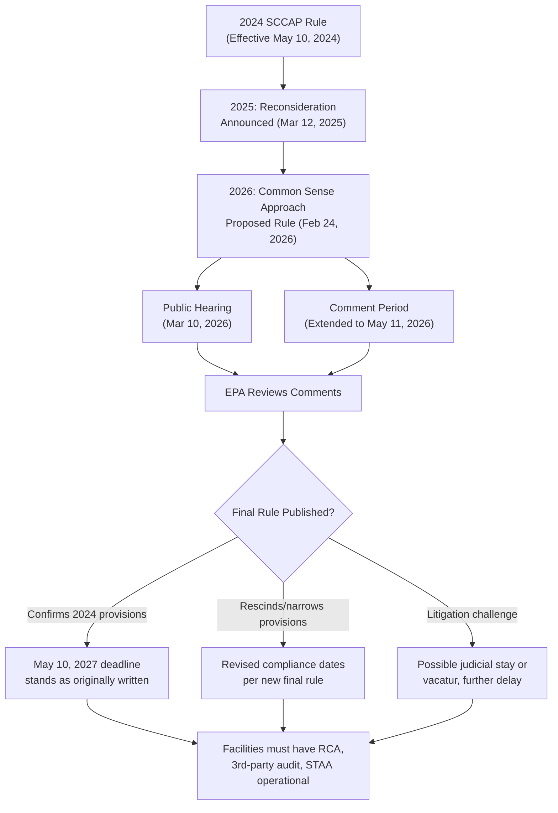

## RMP Compliance Timelines and Ongoing Rulemaking

### Regulatory History Timeline

The RMP rule under 40 CFR Part 68 has undergone repeated revision cycles driven by shifting administration priorities, making compliance date tracking a standing operational requirement rather than a one-time exercise.

| Year | Action | Effect |
| --- | --- | --- |
| 1996 | Original RMP Rule | Baseline 40 CFR Part 68 established under CAA Section 112(r) |
| 2017 | RMP Amendments (Obama-era) | Added STAA, third-party audits, expanded incident investigation, information availability provisions |
| 2019 | RMP Reconsideration Rule (first Trump EPA) | Rolled back several 2017 additions including STAA for many sectors |
| 2024 | Safer Communities by Chemical Accident Prevention (SCCAP) Rule (Biden EPA) | Reinstated and expanded many 2017 provisions; finalized; published March 11, 2024, effective May 10, 2024 |
| 2025 | Reconsideration announced (second Trump EPA) | EPA reassessment of STAA, third-party audit, and incident investigation provisions announced via D.C. Circuit filing, part of 31 planned deregulatory actions under Administrator Lee Zeldin's March 12 announcement |
| 2026 | Common Sense Approach to Chemical Accident Prevention (Proposed Rule) | Published February 24, 2026, proposing revisions to reduce regulatory burden; comment period extended to May 11, 2026 |

**Key Points**

- This is described by industry observers as the fourth major RMP revision cycle in roughly a decade: for the fourth time in the last ten years, EPA has proposed to modify its Risk Management Program regulations [hunton](https://www.hunton.com/the-nickel-report/epa-proposes-to-revise-rmp-regulations-again-what-it-means-for-regulated-facilities)
- [Inference] The recurring pattern (expand under Democratic administrations, contract under Republican administrations) suggests continued volatility is a structural feature of this rule rather than a one-off event, though this is an observed pattern rather than a guaranteed future trajectory
- Facilities operating covered processes must track the *currently legally effective* rule text separately from *proposed* rule text, since these frequently diverge

### 2024 SCCAP Rule Compliance Dates (Baseline Currently in Effect)

The 2024 SCCAP rule established a tiered compliance schedule rather than a single effective date for all provisions:

**Immediate (May 10, 2024 — rule effective date)**

- Provisions EPA characterized as "clarifications" codifying existing industry practice: several aspects of the SCCAP Rule that EPA characterized as clarifications that codified existing industry practice required compliance as of the rule's May 10, 2024 effective date [bracewell](https://www.bracewell.com/resources/compliance-few-epas-new-rmp-program-changes-required-starting-may-2024/)
- New and revised definitions under 40 CFR 68.3

**Three years post-effective-date (May 10, 2027)**

- New STAA, root cause analysis, third-party compliance audit, employee participation, emergency response public notification and exercise evaluation reports, and information availability provisions, unless a specific provision states otherwise [spencerfane](https://www.spencerfane.com/insight/epa-finalizes-major-changes-to-rmp-rule/)
- This includes the marquee provision: the requirement to hire an independent third-party to conduct the triennial RMP compliance audit in certain circumstances does not become applicable until May 10, 2027 [bracewell](https://www.bracewell.com/resources/compliance-few-epas-new-rmp-program-changes-required-starting-may-2024/)
- Standby/backup power for air monitoring and control equipment: three years after the May 10, 2024, effective date [spencerfane](https://www.spencerfane.com/insight/epa-finalizes-major-changes-to-rmp-rule/)

**March 15, 2027 (separate fixed date)**

- Revised emergency response field exercise frequency provision, or within 10 years of the date of an emergency response field exercise conducted between March 15, 2017, and August 31, 2022 [primatech](https://www.primatech.com/technical/pt-notes/344-epa-rmp-rule-2024-amendments-compliance-dates)

**Four years post-effective-date (May 10, 2028)**

- Regulated sources are allowed one additional year (four years after the effective date) to update and resubmit risk management plans to reflect new and revised data elements [primatech](https://www.primatech.com/technical/pt-notes/344-epa-rmp-rule-2024-amendments-compliance-dates)

**STAA/PHA interaction accommodation**

- EPA recognizes that while PHA updates are normally done at five-year intervals, some sources may be far enough along with their PHAs that they cannot schedule STAA as part of the PHA; such sources may perform STAA within 3 years of the effective date instead [primatech](https://www.primatech.com/technical/pt-notes/344-epa-rmp-rule-2024-amendments-compliance-dates)

### Compliance Timeline Diagram (svg_diagram)

<svg xmlns="http://www.w3.org/2000/svg" viewBox="0 0 950 380">
<text x="475" y="30" font-size="20" font-weight="bold" text-anchor="middle" fill="#1a1a1a">SCCAP Rule Compliance Timeline (svg_diagram)</text>
<line x1="80" y1="200" x2="880" y2="200" stroke="#374151" stroke-width="3" />
<polygon points="880,200 868,193 868,207" fill="#374151" />
<circle cx="120" cy="200" r="8" fill="#1e40af" />
<text x="120" y="175" font-size="12" text-anchor="middle" font-weight="bold" fill="#1e3a8a">Mar 11, 2024</text>
<text x="120" y="160" font-size="11" text-anchor="middle" fill="#1e3a8a">Final Rule Published</text>
<text x="120" y="225" font-size="11" text-anchor="middle" fill="#1e3a8a">Federal Register</text>
<circle cx="260" cy="200" r="8" fill="#15803d" />
<text x="260" y="175" font-size="12" text-anchor="middle" font-weight="bold" fill="#14532b">May 10, 2024</text>
<text x="260" y="160" font-size="11" text-anchor="middle" fill="#14532b">Effective Date</text>
<text x="260" y="225" font-size="11" text-anchor="middle" fill="#14532b">"Clarification" items due now</text>
<circle cx="430" cy="200" r="8" fill="#b45309" />
<text x="430" y="175" font-size="12" text-anchor="middle" font-weight="bold" fill="#78350f">Feb 24, 2026</text>
<text x="430" y="160" font-size="11" text-anchor="middle" fill="#78350f">Common Sense Proposed Rule</text>
<text x="430" y="225" font-size="11" text-anchor="middle" fill="#78350f">Comments through May 11, 2026</text>
<circle cx="600" cy="200" r="8" fill="#b91c1c" />
<text x="600" y="175" font-size="12" text-anchor="middle" font-weight="bold" fill="#7f1d1d">Mar 15, 2027</text>
<text x="600" y="160" font-size="11" text-anchor="middle" fill="#7f1d1d">ER Field Exercise Freq.</text>
<text x="600" y="225" font-size="11" text-anchor="middle" fill="#7f1d1d">Fixed date provision</text>
<circle cx="740" cy="200" r="9" fill="#7c3aed" />
<text x="740" y="175" font-size="12" text-anchor="middle" font-weight="bold" fill="#4c1d95">May 10, 2027</text>
<text x="740" y="160" font-size="11" text-anchor="middle" fill="#4c1d95">MAJOR: 3-yr compliance</text>
<text x="740" y="225" font-size="11" text-anchor="middle" fill="#4c1d95">RCA, 3rd-party audit, STAA</text>
<circle cx="850" cy="200" r="8" fill="#0e7490" />
<text x="850" y="175" font-size="12" text-anchor="middle" font-weight="bold" fill="#164e63">May 10, 2028</text>
<text x="850" y="160" font-size="11" text-anchor="middle" fill="#164e63">RMP Resubmission</text>
<text x="850" y="225" font-size="11" text-anchor="middle" fill="#164e63">4-yr data element update</text>
<rect x="80" y="270" width="800" height="80" rx="8" fill="#fef2f2" stroke="#b91c1c" stroke-width="1.5" stroke-dasharray="4,3" />
<text x="475" y="295" font-size="13" text-anchor="middle" font-weight="bold" fill="#7f1d1d">Regulatory Uncertainty Window</text>
<text x="475" y="315" font-size="11" text-anchor="middle" fill="#7f1d1d">2024 rule remains legally effective throughout; proposed rescissions/</text>
<text x="475" y="332" font-size="11" text-anchor="middle" fill="#7f1d1d">revisions may alter or eliminate obligations before the May 2027 deadline arrives</text>
</svg>

### The 2026 "Common Sense Approach" Proposed Rule

**Background and Scope**

Following the March 2025 reconsideration announcement, EPA published a formal proposed rule: on February 24, 2026, EPA published proposed updates to the RMP Rule following notice that the rule was under reconsideration on March 12, 2025, based on Biden-era EPA updates increasing compliance requirements. [pcic](https://pcic.org/epa-proposes-update-to-risk-management-program-rmp-rule/)

**Provisions Targeted for Revision**

The 2026 proposal touches a broad set of SCCAP elements, not limited to RCA/audit provisions: the proposal would change provisions covering safer technologies and alternatives analyses, third-party compliance audits, employee participation, public information, stationary source siting, natural hazards, power loss, documentation of declined recommendations, emergency response exercises, and recognized and generally accepted good engineering practices (RAGAGEP), among other requirements. [ehsleaders](https://ehsleaders.org/2026/08/rmp-reconsideration-could-reshape-chemical-accident-prevention-requirements/)

Specific proposed changes include:

- **Hazard reviews/PHA**: EPA is proposing removing the regulatory wording for natural hazards and power loss to be considered during hazard review and PHAs, while indicating this does not change the long-standing understanding that external hazards, including natural hazards and power loss, need to be evaluated in these studies [pcic](https://pcic.org/epa-proposes-update-to-risk-management-program-rmp-rule/)
- **Natural hazards, power loss, and siting**: EPA proposes rescinding several provisions added in 2024 related to natural hazards, power loss, and stationary source siting; the SCCAP rule had amplified requirements to consider those risks in hazard reviews and PHAs [ehsleaders](https://ehsleaders.org/2026/08/rmp-reconsideration-could-reshape-chemical-accident-prevention-requirements/)
- **STAA applicability**: EPA proposes to replace certain STAA provisions with a new requirement that an initial STAA evaluation be conducted for all new Program 3 processes, regardless of facility NAICS code, with "new" processes including those designed and added to both existing RMP facilities and newly operating facilities [hunton](https://www.hunton.com/the-nickel-report/epa-proposes-to-revise-rmp-regulations-again-what-it-means-for-regulated-facilities)
- **Emergency response coordination**: covered facilities would continue to have emergency planning and coordination obligations even if other SCCAP provisions are pared back [ehsleaders](https://ehsleaders.org/2026/08/rmp-reconsideration-could-reshape-chemical-accident-prevention-requirements/)

**Comment Period and Procedural Timeline**

- Original comment period set, then extended: EPA extended the comment period to May 11, 2026, as published in the Federal Register on April 2, 2026 [certify](https://certify.consulting/blog/epa-extends-comment-period-rmp-common-sense-chemical-accident-prevention/)
- Public hearing held: EPA held a public hearing on the proposed modifications on March 10, 2026 [hunton](https://www.hunton.com/the-nickel-report/epa-proposes-to-revise-rmp-regulations-again-what-it-means-for-regulated-facilities)
- Targeted finalization: EPA expects to publish a final rule in late 2026, though other sources indicate finalization targeted by May 2027 — sources diverge somewhat on the precise finalization target, and [Unverified] the exact date should be confirmed against the current Federal Register docket at time of use [mondaq](https://www.mondaq.com/unitedstates/environmental-law/1736576/rmp-rulemaking-redux-update)[pcic](https://pcic.org/epa-proposes-update-to-risk-management-program-rmp-rule/)

**Industry Response**

Trade associations have generally supported the deregulatory direction: the American Chemistry Council stated it "welcomes EPA's draft rule aimed at restoring a data-driven, performance-focused approach to RMP," commending EPA leadership for "pursuing a framework that prioritizes proven approaches to risk reduction". [ehsleaders](https://ehsleaders.org/2026/08/rmp-reconsideration-could-reshape-chemical-accident-prevention-requirements/)

### The Compliance Planning Dilemma

The core operational challenge for regulated facilities is that the legally binding rule and the anticipated future rule are not the same document, and the gap between them creates a resource-allocation problem:

> The 2024 rule remains in effect unless and until EPA finalizes changes, but several major compliance deadlines don't arrive until May 10, 2027. Facilities therefore must decide how much time and money to commit to requirements the EPA may later rescind or revise. [ehsleaders](https://ehsleaders.org/2026/08/rmp-reconsideration-could-reshape-chemical-accident-prevention-requirements/)

This creates three practical risk postures a facility might adopt, none of which is risk-free:

| Posture | Description | Risk if Rule Changes | Risk if Rule Does Not Change |
| --- | --- | --- | --- |
| **Full compliance now** | Build third-party audit program, RCA procedures, STAA processes to 2024 SCCAP standard immediately | Sunk cost if provisions are rescinded/narrowed before May 2027 | None — facility is ahead of schedule |
| **Wait-and-see** | Delay major investment until final 2026/2027 rulemaking outcome is known | Risk of compressed compliance window if final rule confirms May 10, 2027 deadline with little change | Facility avoids wasted spend on since-rescinded requirements |
| **Phased/modular build** | Build core capabilities (e.g., RCA methodology, auditor qualification criteria) that are likely durable regardless of outcome, defer narrowly-contested elements (e.g., specific NAICS-based STAA triggers) | Moderate — some rework possible on contested elements | Moderate — some catch-up needed on contested elements if they survive |

**Key Points**

- [Inference] A phased/modular approach is likely the most defensible compliance strategy for most facilities, since core RCA and audit competency-building has value independent of the exact regulatory trigger threshold, but this is a strategic judgment rather than a documented EPA recommendation
- Facilities with Program 3 processes in NAICS sectors central to the debate (e.g., petroleum refining) should monitor docket activity most closely, since sector-specific applicability is a recurring point of contention across rulemaking cycles
- State Implementing Agencies with delegated RMP authority may set independent timelines that do not automatically track federal reconsideration, creating potential multi-jurisdictional compliance divergence

### Ongoing Rulemaking Process Flow

### Practical Compliance Tracking Recommendations

- Maintain a regulatory tracking log tied to the specific docket number (2026 proposal referenced under Docket No. 2026-06444 in Federal Register publication) rather than relying on secondary summaries alone
- Distinguish, in internal compliance documentation, between (a) requirements currently legally binding, (b) requirements with a future but currently-binding compliance date (e.g., May 10, 2027), and (c) requirements only proposed for change and not yet finalized
- Build in a compliance buffer before the May 10, 2027 date for any element not explicitly targeted by the 2026 proposal, since those provisions carry the highest likelihood of surviving into final form unchanged
- Coordinate with legal/regulatory affairs counsel on litigation risk, since past RMP rule changes (e.g., the 2017 delay) have been reversed via court challenge (*Air Alliance Houston v. EPA*), meaning administrative reconsideration is not always the final word

### Related Topics

- Safer Technologies and Alternatives Analysis (STAA) Requirements and Applicability Criteria
- Federal Rulemaking Process: Notice-and-Comment Procedures Under the Administrative Procedure Act (APA)
- Litigation History of RMP Rule Challenges (*Air Alliance Houston v. EPA* and successors)
- State Implementing Agency Authority and RMP Program Delegation
- RAGAGEP (Recognized and Generally Accepted Good Engineering Practices) in Regulatory Context
- Emergency Response Exercise Evaluation and Field Exercise Frequency Requirements
- Comparative Analysis: OSHA PSM Rulemaking Status vs. EPA RMP Rulemaking Status