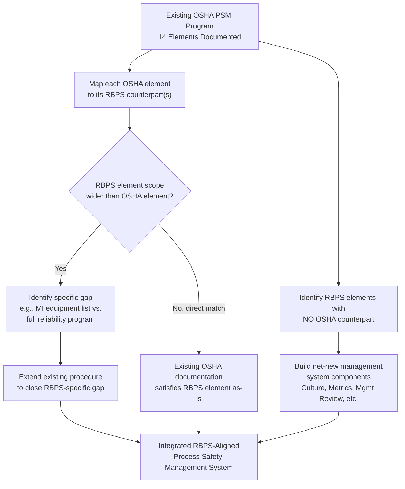

## Mapping RBPS to the OSHA Fourteen Elements

### Purpose of the Mapping Exercise

Facilities subject to OSHA's Process Safety Management standard (29 CFR 1910.119) are legally obligated to satisfy fourteen prescribed elements, while an increasing number of organizations layer the CCPS Risk Based Process Safety (RBPS) framework's twenty elements on top of that compliance baseline for management-system maturity purposes. Because these two frameworks were developed for different purposes — OSHA's for regulatory enforceability, CCPS's for scalable risk-proportional management — no clean one-to-one mapping exists. The practical value of mapping lies in preventing duplicate documentation systems, identifying where RBPS asks for more than OSHA requires, and identifying where RBPS elements exist for which OSHA has no corresponding regulatory element at all.

### The OSHA Fourteen Elements (Baseline Reference)

| # | OSHA PSM Element | 29 CFR 1910.119 Citation |
| --- | --- | --- |
| 1 | Employee Participation | (c) |
| 2 | Process Safety Information (PSI) | (d) |
| 3 | Process Hazard Analysis (PHA) | (e) |
| 4 | Operating Procedures | (f) |
| 5 | Training | (g) |
| 6 | Contractors | (h) |
| 7 | Pre-Startup Safety Review (PSSR) | (i) |
| 8 | Mechanical Integrity | (j) |
| 9 | Hot Work Permit | (k) |
| 10 | Management of Change (MOC) | (l) |
| 11 | Incident Investigation | (m) |
| 12 | Emergency Planning and Response | (n) |
| 13 | Compliance Audits | (o) |
| 14 | Trade Secrets | (p) |

### Full Element-to-Element Mapping Table

| RBPS Pillar | RBPS Element | Corresponding OSHA PSM Element(s) | Mapping Fidelity |
| --- | --- | --- | --- |
| I | Process Safety Culture | *No direct equivalent* | No OSHA counterpart |
| I | Compliance with Standards | Distributed across all fourteen (implicit) | Diffuse/no single counterpart |
| I | Process Safety Competency | Training (partial) | Partial — OSHA's Training is narrower, task-specific |
| I | Workforce Involvement | Employee Participation | Close — near direct match |
| I | Stakeholder Outreach | *No direct equivalent* (adjacent to EPA RMP public information provisions) | No OSHA counterpart |
| II | Process Knowledge Management | Process Safety Information | Close — near direct match |
| II | Hazard Identification and Risk Analysis | Process Hazard Analysis | Close, but RBPS scope is broader (includes qualitative screening tiers PHA alone does not mandate) |
| III | Operating Procedures | Operating Procedures | Direct match |
| III | Safe Work Practices | Hot Work Permit (subset only) | Partial — OSHA's Hot Work Permit is one safe work practice among many RBPS envisions (also covers LOTO, confined space, line-breaking) |
| III | Asset Integrity and Reliability | Mechanical Integrity | Close, but RBPS extends beyond OSHA's covered equipment list to reliability-centered maintenance philosophy |
| III | Contractor Management | Contractors | Direct match |
| III | Training and Performance Assurance | Training | Close, but RBPS adds ongoing performance verification, not just initial/refresher training |
| III | Management of Change | Management of Change | Direct match |
| III | Operational Readiness | Pre-Startup Safety Review | Close — near direct match |
| III | Conduct of Operations | *No direct equivalent* | No OSHA counterpart |
| III | Emergency Management | Emergency Planning and Response | Close — near direct match |
| IV | Incident Investigation | Incident Investigation | Direct match |
| IV | Measurement and Metrics | *No direct equivalent* | No OSHA counterpart |
| IV | Auditing | Compliance Audits | Close — near direct match |
| IV | Management Review and Continuous Improvement | *No direct equivalent* | No OSHA counterpart |

**Key Points**

- Of the twenty RBPS elements, four have no OSHA PSM counterpart at all: Process Safety Culture, Stakeholder Outreach, Conduct of Operations, and Management Review and Continuous Improvement
- Two additional elements (Compliance with Standards, Measurement and Metrics) also lack a direct counterpart, meaning six of twenty RBPS elements sit entirely outside OSHA's prescriptive scope
- OSHA's Trade Secrets element (element 14) has no RBPS counterpart in the reverse direction, since RBPS treats information-sharing constraints as an operational detail within Process Knowledge Management rather than a standalone element
- [Inference] The elements lacking OSHA counterparts are disproportionately "soft" management-system elements (culture, review, metrics) rather than technical/engineering elements, which is consistent with OSHA PSM's origin as an enforceable technical standard versus RBPS's origin as a holistic management-system framework

### Mapping Visualization (svg_diagram)

<svg xmlns="http://www.w3.org/2000/svg" viewBox="0 0 950 700">
<text x="475" y="30" font-size="19" font-weight="bold" text-anchor="middle" fill="#1a1a1a">RBPS to OSHA PSM Element Mapping (svg_diagram)</text>

<text x="220" y="60" font-size="14" font-weight="bold" text-anchor="middle" fill="`#1e3a8a`">RBPS (20 Elements)</text>

<text x="730" y="60" font-size="14" font-weight="bold" text-anchor="middle" fill="`#78350f`">OSHA PSM (14 Elements)</text>


<g font-size="10.5">
<rect x="60" y="80" width="320" height="24" rx="3" fill="#fee2e2" stroke="#b91c1c" />
<text x="220" y="96" text-anchor="middle" fill="#7f1d1d">Process Safety Culture</text>



```
<rect x="60" y="108" width="320" height="24" rx="3" fill="#fee2e2" stroke="#b91c1c" />
<text x="220" y="124" text-anchor="middle" fill="#7f1d1d">Compliance with Standards</text>

<rect x="60" y="136" width="320" height="24" rx="3" fill="#dbeafe" stroke="#1e40af" />
<text x="220" y="152" text-anchor="middle" fill="#1e3a8a">Process Safety Competency</text>

<rect x="60" y="164" width="320" height="24" rx="3" fill="#dcfce7" stroke="#15803d" />
<text x="220" y="180" text-anchor="middle" fill="#14532b">Workforce Involvement</text>

<rect x="60" y="192" width="320" height="24" rx="3" fill="#fee2e2" stroke="#b91c1c" />
<text x="220" y="208" text-anchor="middle" fill="#7f1d1d">Stakeholder Outreach</text>

<rect x="60" y="220" width="320" height="24" rx="3" fill="#dcfce7" stroke="#15803d" />
<text x="220" y="236" text-anchor="middle" fill="#14532b">Process Knowledge Mgmt</text>

<rect x="60" y="248" width="320" height="24" rx="3" fill="#dcfce7" stroke="#15803d" />
<text x="220" y="264" text-anchor="middle" fill="#14532b">Hazard ID &amp; Risk Analysis</text>

<rect x="60" y="276" width="320" height="24" rx="3" fill="#dcfce7" stroke="#15803d" />
<text x="220" y="292" text-anchor="middle" fill="#14532b">Operating Procedures</text>

<rect x="60" y="304" width="320" height="24" rx="3" fill="#dbeafe" stroke="#1e40af" />
<text x="220" y="320" text-anchor="middle" fill="#1e3a8a">Safe Work Practices</text>

<rect x="60" y="332" width="320" height="24" rx="3" fill="#dbeafe" stroke="#1e40af" />
<text x="220" y="348" text-anchor="middle" fill="#1e3a8a">Asset Integrity &amp; Reliability</text>

<rect x="60" y="360" width="320" height="24" rx="3" fill="#dcfce7" stroke="#15803d" />
<text x="220" y="376" text-anchor="middle" fill="#14532b">Contractor Management</text>

<rect x="60" y="388" width="320" height="24" rx="3" fill="#dbeafe" stroke="#1e40af" />
<text x="220" y="404" text-anchor="middle" fill="#1e3a8a">Training &amp; Perf. Assurance</text>

<rect x="60" y="416" width="320" height="24" rx="3" fill="#dcfce7" stroke="#15803d" />
<text x="220" y="432" text-anchor="middle" fill="#14532b">Management of Change</text>

<rect x="60" y="444" width="320" height="24" rx="3" fill="#dbeafe" stroke="#1e40af" />
<text x="220" y="460" text-anchor="middle" fill="#1e3a8a">Operational Readiness</text>

<rect x="60" y="472" width="320" height="24" rx="3" fill="#fee2e2" stroke="#b91c1c" />
<text x="220" y="488" text-anchor="middle" fill="#7f1d1d">Conduct of Operations</text>

<rect x="60" y="500" width="320" height="24" rx="3" fill="#dbeafe" stroke="#1e40af" />
<text x="220" y="516" text-anchor="middle" fill="#1e3a8a">Emergency Management</text>

<rect x="60" y="528" width="320" height="24" rx="3" fill="#dcfce7" stroke="#15803d" />
<text x="220" y="544" text-anchor="middle" fill="#14532b">Incident Investigation</text>

<rect x="60" y="556" width="320" height="24" rx="3" fill="#fee2e2" stroke="#b91c1c" />
<text x="220" y="572" text-anchor="middle" fill="#7f1d1d">Measurement &amp; Metrics</text>

<rect x="60" y="584" width="320" height="24" rx="3" fill="#dbeafe" stroke="#1e40af" />
<text x="220" y="600" text-anchor="middle" fill="#1e3a8a">Auditing</text>

<rect x="60" y="612" width="320" height="24" rx="3" fill="#fee2e2" stroke="#b91c1c" />
<text x="220" y="628" text-anchor="middle" fill="#7f1d1d">Mgmt Review &amp; Cont. Improvement</text>
```

</g>

<g font-size="10.5">
<rect x="570" y="164" width="320" height="24" rx="3" fill="#fef3c7" stroke="#b45309" />
<text x="730" y="180" text-anchor="middle" fill="#78350f">Employee Participation</text>



```
<rect x="570" y="220" width="320" height="24" rx="3" fill="#fef3c7" stroke="#b45309" />
<text x="730" y="236" text-anchor="middle" fill="#78350f">Process Safety Information</text>

<rect x="570" y="248" width="320" height="24" rx="3" fill="#fef3c7" stroke="#b45309" />
<text x="730" y="264" text-anchor="middle" fill="#78350f">Process Hazard Analysis</text>

<rect x="570" y="276" width="320" height="24" rx="3" fill="#fef3c7" stroke="#b45309" />
<text x="730" y="292" text-anchor="middle" fill="#78350f">Operating Procedures</text>

<rect x="570" y="304" width="320" height="24" rx="3" fill="#fef3c7" stroke="#b45309" />
<text x="730" y="320" text-anchor="middle" fill="#78350f">Hot Work Permit</text>

<rect x="570" y="332" width="320" height="24" rx="3" fill="#fef3c7" stroke="#b45309" />
<text x="730" y="348" text-anchor="middle" fill="#78350f">Mechanical Integrity</text>

<rect x="570" y="360" width="320" height="24" rx="3" fill="#fef3c7" stroke="#b45309" />
<text x="730" y="376" text-anchor="middle" fill="#78350f">Contractors</text>

<rect x="570" y="388" width="320" height="24" rx="3" fill="#fef3c7" stroke="#b45309" />
<text x="730" y="404" text-anchor="middle" fill="#78350f">Training</text>

<rect x="570" y="416" width="320" height="24" rx="3" fill="#fef3c7" stroke="#b45309" />
<text x="730" y="432" text-anchor="middle" fill="#78350f">Management of Change</text>

<rect x="570" y="444" width="320" height="24" rx="3" fill="#fef3c7" stroke="#b45309" />
<text x="730" y="460" text-anchor="middle" fill="#78350f">Pre-Startup Safety Review</text>

<rect x="570" y="500" width="320" height="24" rx="3" fill="#fef3c7" stroke="#b45309" />
<text x="730" y="516" text-anchor="middle" fill="#78350f">Emergency Planning &amp; Response</text>

<rect x="570" y="528" width="320" height="24" rx="3" fill="#fef3c7" stroke="#b45309" />
<text x="730" y="544" text-anchor="middle" fill="#78350f">Incident Investigation</text>

<rect x="570" y="584" width="320" height="24" rx="3" fill="#fef3c7" stroke="#b45309" />
<text x="730" y="600" text-anchor="middle" fill="#78350f">Compliance Audits</text>

<rect x="570" y="650" width="320" height="24" rx="3" fill="#f3f4f6" stroke="#6b7280" />
<text x="730" y="666" text-anchor="middle" fill="#374151">Trade Secrets (no RBPS counterpart)</text>
```

</g>

<rect x="60" y="650" width="16" height="16" fill="#dcfce7" stroke="#15803d" />
<text x="82" y="663" font-size="10" fill="#14532b">Direct Match</text>
<rect x="180" y="650" width="16" height="16" fill="#dbeafe" stroke="#1e40af" />
<text x="202" y="663" font-size="10" fill="#1e3a8a">Close/Partial</text>
<rect x="320" y="650" width="16" height="16" fill="#fee2e2" stroke="#b91c1c" />
<text x="342" y="663" font-size="10" fill="#7f1d1d">No Match</text>

<line x1="380" y1="176" x2="570" y2="176" stroke="#15803d" stroke-width="1.5" stroke-dasharray="3,2" />
<line x1="380" y1="232" x2="570" y2="232" stroke="#15803d" stroke-width="1.5" stroke-dasharray="3,2" />
<line x1="380" y1="288" x2="570" y2="288" stroke="#15803d" stroke-width="1.5" stroke-dasharray="3,2" />
<line x1="380" y1="372" x2="570" y2="372" stroke="#15803d" stroke-width="1.5" stroke-dasharray="3,2" />
<line x1="380" y1="428" x2="570" y2="428" stroke="#15803d" stroke-width="1.5" stroke-dasharray="3,2" />
<line x1="380" y1="540" x2="570" y2="540" stroke="#15803d" stroke-width="1.5" stroke-dasharray="3,2" />
</svg>

### Category Analysis: Types of Mapping Relationships

The twenty RBPS elements fall into four distinct relationship categories when mapped against OSHA's fourteen:

**1. Direct Matches (structurally near-identical scope)**

- Operating Procedures, Contractor Management, Management of Change, Incident Investigation
- **Example**: An organization's existing OSHA-compliant MOC procedure typically requires no structural rework to also satisfy the RBPS Management of Change element — the same procedure, forms, and approval workflow serve both frameworks simultaneously

**2. Close but Broader in RBPS (OSHA element is a subset)**

- Process Knowledge Management (broader than PSI), Hazard Identification and Risk Analysis (broader than PHA), Asset Integrity and Reliability (broader than Mechanical Integrity), Operational Readiness (broader than PSSR), Auditing (broader than Compliance Audits), Emergency Management (broader than Emergency Planning and Response)
- **Example**: OSHA's Mechanical Integrity element specifies a defined list of covered equipment (pressure vessels, piping, relief devices, emergency shutdown systems, controls, pumps). RBPS's Asset Integrity and Reliability element extends the underlying philosophy to reliability-centered maintenance concepts and equipment not on OSHA's specific list, since the RBPS driver is risk-based coverage rather than a fixed equipment inventory

**3. Narrower OSHA Subset of a Broader RBPS Element**

- Safe Work Practices (RBPS) vs. Hot Work Permit (OSHA) — OSHA only mandates permits for hot work specifically, while RBPS's Safe Work Practices element covers the full universe of non-routine work controls (lockout/tagout, confined space entry, line-breaking, excavation, critical lifts)
- Process Safety Competency (RBPS) vs. Training (OSHA) — OSHA's Training element is satisfied by documented initial and refresher training; RBPS additionally expects competency verification and knowledge/skill assurance over time, not merely training completion records

**4. No OSHA Counterpart (RBPS-only elements)**

- Process Safety Culture, Compliance with Standards, Stakeholder Outreach, Conduct of Operations, Measurement and Metrics, Management Review and Continuous Improvement
- These represent the portion of RBPS that extends beyond what a facility must do to avoid an OSHA citation, into what CCPS considers necessary for a genuinely effective, self-improving management system

### Practical Application: Gap Analysis Workflow



**Example**

A refinery's OSHA-compliant Compliance Audit program (element 13) conducts a triennial audit against the fourteen OSHA elements using an internal checklist. To satisfy the corresponding RBPS Auditing element, the organization would typically extend the audit scope to also evaluate the six RBPS-only elements (culture, metrics, stakeholder outreach, etc.) that fall outside OSHA's audit checklist, and would formally link audit findings into a Management Review and Continuous Improvement process — an element OSHA does not require but which RBPS treats as the mechanism that closes the loop on audit findings.

### Common Pitfalls in Mapping Exercises

- **Treating "close" as "identical"**: Assuming an OSHA-compliant procedure fully satisfies the broader RBPS element (e.g., assuming PSSR checklist compliance equals RBPS Operational Readiness) can leave meaningful gaps, particularly around organizational readiness factors RBPS considers (staffing adequacy, competency verification) that OSHA's PSSR provision does not explicitly require
- **Ignoring the six RBPS-only elements**: Organizations sometimes complete a mapping exercise, conclude "we're basically covered," and never build out Process Safety Culture, Conduct of Operations, Measurement and Metrics, or Management Review as genuine standalone program components, defeating much of RBPS's intended value
- **Double-documentation without integration**: Building a parallel RBPS-labeled documentation set that duplicates rather than extends existing OSHA-compliant documents increases administrative burden without improving actual risk management; [Inference] a single integrated document set cross-referenced to both frameworks is generally the more resource-efficient approach, though the optimal integration architecture depends on organization-specific document control systems

### Related Topics

- OSHA PSM 29 CFR 1910.119 Detailed Element Requirements
- CCPS Guidelines for Risk Based Process Safety — Element Implementation Guidance
- Process Safety Culture Assessment and Maturity Model Tools
- Reliability-Centered Maintenance (RCM) as an Asset Integrity Extension Beyond OSHA MI
- Conduct of Operations: Formality of Operations and Shift Turnover Practices
- Integrated Management System Design: Avoiding Duplicate Documentation Across Frameworks
- EPA RMP Program Levels Compared to RBPS Risk-Tiering Philosophy