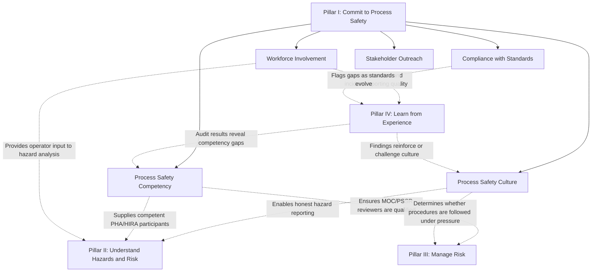

## Commit to Process Safety Pillar

### Position Within the RBPS Framework

Commit to Process Safety is the first of the four pillars in the CCPS Risk Based Process Safety (RBPS) framework, established in *Guidelines for Risk Based Process Safety* (CCPS, 2007). It functions as the organizational foundation upon which the remaining three pillars (Understand Hazards and Risk, Manage Risk, Learn from Experience) depend — without genuine organizational commitment, the technical and procedural elements in the other pillars tend to degrade into paperwork compliance rather than functioning risk management. This pillar contains five of the framework's twenty total elements and is unique among the four pillars in addressing organizational and cultural factors rather than primarily technical or procedural ones.

### The Five Elements

| # | Element | Core Focus |
| --- | --- | --- |
| 1 | Process Safety Culture | Shared organizational values, beliefs, and norms that shape how process safety is prioritized in everyday decisions |
| 2 | Compliance with Standards | Systematic identification, tracking, and conformance to applicable regulations, codes, and internal/industry standards |
| 3 | Process Safety Competency | Ensuring individuals and the organization collectively possess and maintain the knowledge and skill needed to manage process risk |
| 4 | Workforce Involvement | Structured, meaningful participation of the workforce — not only management — in process safety activities and decision-making |
| 5 | Stakeholder Outreach | Engagement with external parties (community, contractors, suppliers, regulators, emergency responders) on process safety matters |

### Element 1: Process Safety Culture

Process safety culture is defined by CCPS as the combination of group values and behaviors that determine the manner in which process safety is managed. It is distinguished from process safety *management systems* (the documented procedures) in that culture concerns how people actually behave when no one is watching, or when procedures and production pressure come into conflict.

**Key Points**

- CCPS identifies a set of core culture attributes commonly cited across its guidance, including: maintaining a sense of vulnerability (avoiding complacency that "it can't happen here"), ensuring open and effective communication, fostering mutual trust, providing strong leadership commitment visible at all organizational levels, and establishing a questioning/learning environment
- Culture is typically assessed through a combination of methods: employee perception surveys, behavioral observation, review of how the organization has historically responded to near-misses and audit findings, and examination of resource allocation decisions during budget-constrained periods
- [Inference] Because culture is inherently difficult to measure directly, most practical culture assessment relies on proxy indicators (survey results, historical decision patterns) rather than a single definitive metric, which is a widely acknowledged limitation in process safety culture literature generally

**Example**

A plant manager under production-schedule pressure is asked to approve a temporary bypass of an interlock to keep a unit running until the next scheduled turnaround. In a strong process safety culture, the manager escalates the decision through a formal Management of Change risk assessment even though it delays the workaround, and the decision documentation is visible to the workforce — reinforcing that safety judgment is not overridden by schedule pressure. In a weak culture, the bypass is approved informally and undocumented, signaling to the workforce that written procedures are negotiable under pressure.

### Element 2: Compliance with Standards

This element addresses the systematic organizational process by which a facility identifies which codes, regulations, consensus standards (e.g., API, NFPA, ASME), and internal corporate standards apply to its operations, and maintains ongoing conformance as those standards evolve.

**Key Points**

- This is distinct from OSHA's or EPA's specific regulatory compliance audit requirements; RBPS's Compliance with Standards element is broader, covering voluntary consensus standards and internal corporate requirements that may exceed regulatory minimums
- A functioning system under this element typically includes: a maintained inventory of applicable standards, a process for monitoring standard revisions, a gap-analysis mechanism when standards change, and a mechanism for incorporating new standards into existing procedures and design bases
- Facilities operating internationally must additionally reconcile potentially conflicting jurisdictional requirements, which this element is intended to systematically manage rather than resolve ad hoc on a per-incident basis

### Element 3: Process Safety Competency

Process Safety Competency addresses the organization's capability — at both the individual and institutional level — to identify and manage process hazards, sustained over time despite staff turnover, retirements, and organizational change.

**Key Points**

- CCPS distinguishes competency from simple training completion: competency implies demonstrated capability to apply knowledge, not merely attendance at a training session
- Institutional (organizational) competency is a distinct sub-concept from individual competency: an organization can lose critical process safety knowledge through attrition even if individual employees were, at the time, competent, if that knowledge was never systematically captured or transferred
- Common practical mechanisms include: competency assessment frameworks tied to specific job roles, succession planning for process safety-critical positions, knowledge management systems capturing tacit expertise (particularly from long-tenured operators and engineers), and periodic competency reassessment rather than one-time certification

**Example**

A facility with a single subject-matter expert who has managed its relief system design basis for twenty-five years faces an institutional competency risk if that expertise is not documented or transferred before retirement. A mature Process Safety Competency program would have identified this single point of failure years in advance and implemented structured knowledge transfer (mentoring, documentation of design basis rationale, cross-training) well before the retirement date.

### Element 4: Workforce Involvement

Workforce Involvement is the RBPS element most directly comparable to OSHA PSM's Employee Participation requirement (29 CFR 1910.119(c)), though RBPS treats it as a broader cultural and structural commitment rather than a narrow procedural requirement.

**Key Points**

- OSHA's Employee Participation element requires, at minimum, a written plan of action and employee consultation on PHAs and access to PHA/PSM information; RBPS's Workforce Involvement element extends this to active workforce participation in hazard identification, procedure development, incident investigation, and even culture assessment itself
- Effective workforce involvement mechanisms commonly include: operator participation in PHA teams (not just consultation after the fact), near-miss reporting systems with genuine non-punitive follow-through, operator input into MOC risk assessments for changes affecting their work area, and floor-level representation in process safety governance committees
- [Inference] A common indicator that this element is underperforming, though not one prescribed formally by CCPS, is a persistent gap between management's stated commitment to workforce involvement and the frequency with which frontline personnel report having actually influenced a safety-related decision

### Element 5: Stakeholder Outreach

Stakeholder Outreach addresses engagement with parties outside the immediate operating organization who have a legitimate interest in, or influence over, the facility's process safety performance.

**Key Points**

- Relevant stakeholders typically include: the surrounding community, local emergency planning committees (LEPCs), contractors and suppliers, regulatory agencies, corporate parent organizations, and in some cases industry peer groups
- This element overlaps conceptually with EPA RMP's public information availability provisions and emergency response coordination requirements, but RBPS frames it as a proactive relationship-management activity rather than a reactive disclosure obligation
- Effective practice generally includes: routine (not only incident-triggered) communication with local emergency responders about facility hazards, transparent community engagement regarding process safety performance, and contractor pre-qualification processes that assess contractor safety culture, not just their safety statistics

### Interdependency With Other Pillars

**Key Points**

- Process Safety Culture and Workforce Involvement are frequently described in CCPS guidance as the elements with the broadest cross-pillar influence: weak culture undermines the effectiveness of technically sound PHAs, procedures, and audits regardless of how well those other elements are documented on paper
- Compliance with Standards functions as a linking element between Pillar I and Pillar IV, since evolving standards are typically identified through the same channels (audits, management review) that drive continuous improvement

### Diagram: Pillar I Element Structure (svg_diagram)

<svg xmlns="http://www.w3.org/2000/svg" viewBox="0 0 800 420">
<text x="400" y="30" font-size="19" font-weight="bold" text-anchor="middle" fill="#1a1a1a">Commit to Process Safety — Pillar I (svg_diagram)</text>
<rect x="280" y="55" width="240" height="50" rx="8" fill="#1e40af" />
<text x="400" y="86" font-size="15" font-weight="bold" text-anchor="middle" fill="#ffffff">Pillar I</text>
<circle cx="150" cy="200" r="75" fill="#dbeafe" stroke="#1e40af" stroke-width="2" />
<text x="150" y="195" font-size="12" font-weight="bold" text-anchor="middle" fill="#1e3a8a">Process Safety</text>
<text x="150" y="211" font-size="12" font-weight="bold" text-anchor="middle" fill="#1e3a8a">Culture</text>
<circle cx="320" cy="200" r="75" fill="#dbeafe" stroke="#1e40af" stroke-width="2" />
<text x="320" y="195" font-size="11.5" font-weight="bold" text-anchor="middle" fill="#1e3a8a">Compliance with</text>
<text x="320" y="211" font-size="11.5" font-weight="bold" text-anchor="middle" fill="#1e3a8a">Standards</text>
<circle cx="490" cy="200" r="75" fill="#dbeafe" stroke="#1e40af" stroke-width="2" />
<text x="490" y="195" font-size="11.5" font-weight="bold" text-anchor="middle" fill="#1e3a8a">Process Safety</text>
<text x="490" y="211" font-size="11.5" font-weight="bold" text-anchor="middle" fill="#1e3a8a">Competency</text>
<circle cx="660" cy="200" r="75" fill="#dbeafe" stroke="#1e40af" stroke-width="2" />
<text x="660" y="195" font-size="11.5" font-weight="bold" text-anchor="middle" fill="#1e3a8a">Workforce</text>
<text x="660" y="211" font-size="11.5" font-weight="bold" text-anchor="middle" fill="#1e3a8a">Involvement</text>
<circle cx="400" cy="340" r="75" fill="#c7d2fe" stroke="#1e40af" stroke-width="2" />
<text x="400" y="335" font-size="11.5" font-weight="bold" text-anchor="middle" fill="#1e3a8a">Stakeholder</text>
<text x="400" y="351" font-size="11.5" font-weight="bold" text-anchor="middle" fill="#1e3a8a">Outreach</text>
<line x1="400" y1="105" x2="150" y2="128" stroke="#374151" stroke-width="1.5" />
<line x1="400" y1="105" x2="320" y2="126" stroke="#374151" stroke-width="1.5" />
<line x1="400" y1="105" x2="490" y2="126" stroke="#374151" stroke-width="1.5" />
<line x1="400" y1="105" x2="660" y2="128" stroke="#374151" stroke-width="1.5" />
<line x1="400" y1="105" x2="400" y2="266" stroke="#374151" stroke-width="1.5" />
</svg>

### Practical Implementation and Assessment

**Key Points**

- CCPS's culture-assessment guidance and related practitioner tools (e.g., process safety culture surveys, culture maturity models) are commonly used to operationalize this pillar, since culture and competency are not directly auditable in the same binary pass/fail sense as, for instance, whether a permit was signed
- A typical corporate implementation ties Pillar I elements to specific accountable roles: site leadership for culture, a compliance/standards function for Compliance with Standards, training/HR/engineering jointly for Competency, employee/union representatives and site safety committees for Workforce Involvement, and community relations/EHS management for Stakeholder Outreach
- [Inference] Because Pillar I elements are qualitative and organizational rather than purely procedural, they are often the hardest for facilities to demonstrate objectively during third-party RBPS gap assessments, compared to the more document-verifiable elements in Pillars II and III

### Related Topics

- CCPS Process Safety Culture Assessment Tools and Survey Instruments
- Institutional Knowledge Management and Succession Planning for Process Safety-Critical Roles
- OSHA Employee Participation (29 CFR 1910.119(c)) Compared to RBPS Workforce Involvement
- Local Emergency Planning Committee (LEPC) Coordination Requirements
- Leadership Commitment and Visible Felt Leadership in Process Safety
- Near-Miss Reporting System Design and Non-Punitive Reporting Culture
- Contractor Pre-Qualification and Safety Culture Screening