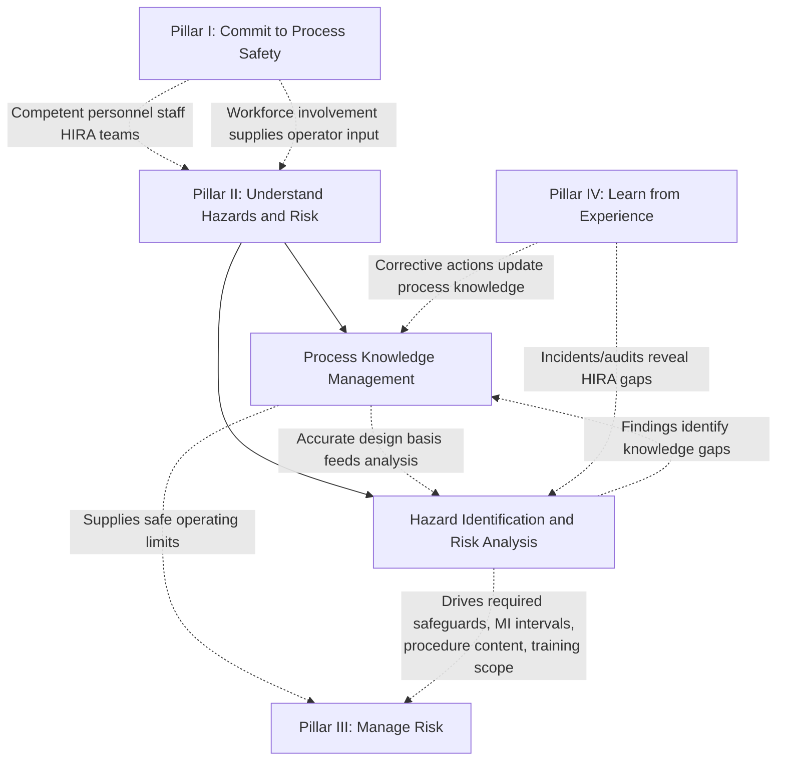

## Understand Hazards and Risk Pillar

### Position Within the RBPS Framework

Understand Hazards and Risk is the second of the four pillars in the CCPS Risk Based Process Safety (RBPS) framework, established in *Guidelines for Risk Based Process Safety* (CCPS, 2007). It is the smallest pillar by element count, containing only two of the framework's twenty elements, yet it functions as the technical knowledge foundation that determines the accuracy and adequacy of everything the other three pillars do. If a facility's hazard and risk understanding is incomplete or outdated, no amount of rigor in Pillar III (Manage Risk) or Pillar IV (Learn from Experience) can compensate, since those pillars operate on the hazard picture this pillar establishes.

### The Two Elements

| # | Element | Core Focus |
| --- | --- | --- |
| 6 | Process Knowledge Management | Establishing and maintaining accurate, accessible, current process safety information |
| 7 | Hazard Identification and Risk Analysis (HIRA) | Systematically identifying hazards and analyzing/ranking the risks they pose |

**Key Points**

- Despite containing only two elements, this pillar is foundational because both Process Knowledge Management and HIRA are *inputs* consumed by nearly every element in Pillars III and IV — operating procedures, MOC reviews, training content, and mechanical integrity inspection intervals all depend on accurate process knowledge and a current hazard analysis
- CCPS treats these two elements as tightly coupled rather than independent: Process Knowledge Management supplies the data (chemistry, equipment design basis, process limits) that HIRA methodologies require as raw material for analysis

### Element 6: Process Knowledge Management

Process Knowledge Management addresses the systematic development, organization, and maintenance of the technical information needed to understand a process and its hazards. This is the RBPS element most directly comparable to OSHA PSM's Process Safety Information requirement (29 CFR 1910.119(d)), though RBPS frames it as an active, ongoing knowledge-management discipline rather than a static document repository.

**Key Points**

- Core categories of process knowledge typically include: hazards of the chemicals involved (toxicity, reactivity, flammability, corrosivity), technology of the process (block flow diagrams, process chemistry, safe operating limits, consequences of deviation), and equipment design basis (P&IDs, relief system design basis, electrical classification, materials of construction)
- CCPS emphasizes that this information must remain a "living" resource — updated concurrently with Management of Change activity — rather than a static as-built package that gradually diverges from actual plant configuration over time
- A common practical failure mode is document drift: P&IDs and safe operating limits documentation are not updated promptly following approved changes, causing subsequent hazard analyses and training materials to rely on outdated information
- [Inference] Because process knowledge underpins essentially every downstream RBPS element, gaps discovered in this element during an audit are often treated as higher-priority findings than similar gaps in more isolated elements, since the consequence of a knowledge gap propagates forward into HIRA quality, procedure accuracy, and training content

**Example**

A facility performs a Management of Change review to increase the operating pressure of a reactor by 15%. If the relief system design basis documentation was not updated after a prior change to the reactor's cooling configuration, the MOC team may unknowingly evaluate the pressure increase against an inaccurate relief capacity calculation, understating the actual hazard. Robust Process Knowledge Management would have flagged the documentation gap before the MOC review proceeded.

### Element 7: Hazard Identification and Risk Analysis (HIRA)

HIRA is the RBPS element most directly comparable to OSHA PSM's Process Hazard Analysis requirement (29 CFR 1910.119(e)), but RBPS explicitly broadens the concept beyond a single required methodology into a risk-tiered family of techniques applied proportionally to hazard magnitude.

**Key Points**

- RBPS does not mandate a single HIRA methodology; instead, it presents a spectrum of techniques of varying rigor, intended to be matched to the risk level of the process or decision being evaluated
- Common HIRA methodologies referenced across the spectrum include: What-If Analysis, Checklist Analysis, What-If/Checklist hybrid, Hazard and Operability Study (HAZOP), Failure Mode and Effects Analysis (FMEA), Fault Tree Analysis (FTA), Layer of Protection Analysis (LOPA), and Quantitative Risk Analysis (QRA)
- The risk-tiering principle means a low-hazard utility process might be adequately screened with a Checklist Analysis, while a high-hazard reactive chemistry process would warrant a full HAZOP potentially followed by LOPA on identified high-consequence scenarios
- HIRA under RBPS is explicitly a recurring, lifecycle activity — required not only at initial design but revalidated periodically (commonly on a multi-year cycle) and triggered by Management of Change actions, incidents, or new hazard information

**HIRA Methodology Selection by Risk Tier**

| Risk/Complexity Level | Representative Methodology | Typical Output |
| --- | --- | --- |
| Low (simple utility/support systems) | Checklist Analysis | Pass/fail conformance against a standard list |
| Low-to-moderate | What-If Analysis | Qualitative list of scenarios and safeguards |
| Moderate-to-high (complex process units) | HAZOP | Structured deviation-by-deviation causes, consequences, safeguards, recommendations |
| High (safety-critical protection layers) | LOPA | Semi-quantitative independent protection layer credit and risk gap identification |
| Very high (catastrophic consequence potential) | Quantitative Risk Analysis (QRA) | Numerical risk estimates (frequency × consequence) for comparison against risk tolerance criteria |

**Example**

A HAZOP study on a distillation column identifies a "more flow" deviation on the reboiler steam line with a potential consequence of column overpressure. The HAZOP team determines that existing safeguards (a pressure relief valve and a high-pressure alarm with operator response) may not provide sufficient risk reduction given the potential consequence severity. Rather than resolve this qualitatively, the team recommends escalating the specific scenario to a LOPA study, which quantifies the required risk reduction and determines whether an additional independent protection layer (e.g., a high-integrity pressure protection system) is warranted — illustrating the risk-tiered escalation RBPS anticipates rather than treating all HAZOP findings with uniform follow-up rigor.

### HIRA Methodology Selection Logic (svg_diagram)

<svg xmlns="http://www.w3.org/2000/svg" viewBox="0 0 850 460">
<text x="425" y="30" font-size="19" font-weight="bold" text-anchor="middle" fill="#1a1a1a">Risk-Tiered HIRA Methodology Selection (svg_diagram)</text>
<rect x="340" y="55" width="170" height="45" rx="6" fill="#1e40af" />
<text x="425" y="83" font-size="13" font-weight="bold" text-anchor="middle" fill="#ffffff">Process/Change Scope</text>
<polygon points="425,120 500,160 425,200 350,160" fill="#dbeafe" stroke="#1e40af" stroke-width="2" />
<text x="425" y="155" font-size="10.5" text-anchor="middle" fill="#1e3a8a">Simple utility</text>
<text x="425" y="168" font-size="10.5" text-anchor="middle" fill="#1e3a8a">or support?</text>
<rect x="60" y="230" width="180" height="50" rx="6" fill="#dcfce7" stroke="#15803d" stroke-width="2" />
<text x="150" y="250" font-size="12" font-weight="bold" text-anchor="middle" fill="#14532b">Checklist Analysis</text>
<text x="150" y="266" font-size="10" text-anchor="middle" fill="#14532b">Low complexity</text>
<polygon points="425,220 520,265 425,310 330,265" fill="#dbeafe" stroke="#1e40af" stroke-width="2" />
<text x="425" y="260" font-size="10.5" text-anchor="middle" fill="#1e3a8a">Complex/</text>
<text x="425" y="273" font-size="10.5" text-anchor="middle" fill="#1e3a8a">novel process?</text>
<rect x="600" y="230" width="180" height="50" rx="6" fill="#dcfce7" stroke="#15803d" stroke-width="2" />
<text x="690" y="250" font-size="12" font-weight="bold" text-anchor="middle" fill="#14532b">What-If Analysis</text>
<text x="690" y="266" font-size="10" text-anchor="middle" fill="#14532b">Moderate complexity</text>
<rect x="335" y="345" width="180" height="50" rx="6" fill="#fef3c7" stroke="#b45309" stroke-width="2" />
<text x="425" y="365" font-size="12" font-weight="bold" text-anchor="middle" fill="#78350f">HAZOP</text>
<text x="425" y="381" font-size="10" text-anchor="middle" fill="#78350f">Structured deviation analysis</text>
<rect x="335" y="415" width="180" height="40" rx="6" fill="#fee2e2" stroke="#b91c1c" stroke-width="2" />
<text x="425" y="432" font-size="12" font-weight="bold" text-anchor="middle" fill="#7f1d1d">LOPA / QRA</text>
<text x="425" y="448" font-size="10" text-anchor="middle" fill="#7f1d1d">High-consequence scenarios</text>
<line x1="425" y1="100" x2="425" y2="118" stroke="#374151" stroke-width="2" />
<line x1="350" y1="160" x2="150" y2="225" stroke="#374151" stroke-width="2" />
<text x="240" y="185" font-size="10" fill="#374151">Yes</text>
<line x1="425" y1="200" x2="425" y2="218" stroke="#374151" stroke-width="2" />
<text x="440" y="212" font-size="10" fill="#374151">No</text>
<line x1="520" y1="265" x2="600" y2="255" stroke="#374151" stroke-width="2" />
<text x="555" y="248" font-size="10" fill="#374151">No</text>
<line x1="425" y1="310" x2="425" y2="343" stroke="#374151" stroke-width="2" />
<text x="440" y="330" font-size="10" fill="#374151">Yes</text>
<line x1="425" y1="395" x2="425" y2="413" stroke="#374151" stroke-width="2" />
<text x="440" y="408" font-size="10" fill="#374151">If high-consequence finding</text>
</svg>

### Interdependency With Other Pillars

**Key Points**

- Process Knowledge Management and HIRA form a bidirectional feedback loop: knowledge quality determines analysis quality, while analysis findings frequently expose knowledge gaps that must be closed before the analysis can be considered complete
- This pillar's output directly parameterizes Pillar III: the safeguards, safe operating limits, and consequence severities identified here become the design basis for operating procedures, mechanical integrity inspection strategies, and emergency response planning

### Distinguishing RBPS's Framing from a Pure Regulatory Checklist

**Key Points**

- OSHA's PHA requirement mandates revalidation at least every five years for covered processes; RBPS treats the revalidation interval itself as a risk-based decision, potentially warranting more frequent revalidation for higher-hazard processes and, in principle, allowing longer intervals for genuinely low-risk processes, subject to any applicable regulatory floor
- [Inference] In practice, most facilities subject to OSHA PSM retain the five-year revalidation cycle as a compliance floor regardless of RBPS's risk-based flexibility, since deviating below the regulatory minimum interval would create compliance exposure even if RBPS philosophy might otherwise permit it
- RBPS's inclusion of Process Knowledge Management as a standalone element (rather than treating it as merely an input to HIRA) reflects CCPS's view that knowledge management has value independent of any specific hazard analysis — for example, in supporting training content development, emergency response planning, and Management of Change reviews directly

### Related Topics

- HAZOP Study Methodology and Guide Word Application
- Layer of Protection Analysis (LOPA) Scenario Development and IPL Credit Rules
- Quantitative Risk Analysis (QRA) and Individual/Societal Risk Criteria
- Process Safety Information Requirements Under OSHA PSM 29 CFR 1910.119(d)
- Safe Operating Limits Documentation and Deviation Response
- PHA Revalidation Methodologies: Redo, Revalidate, and Update-in-Place Approaches
- Relief System Design Basis and Overpressure Scenario Analysis
- Management of Change Triggers for Hazard Reanalysis