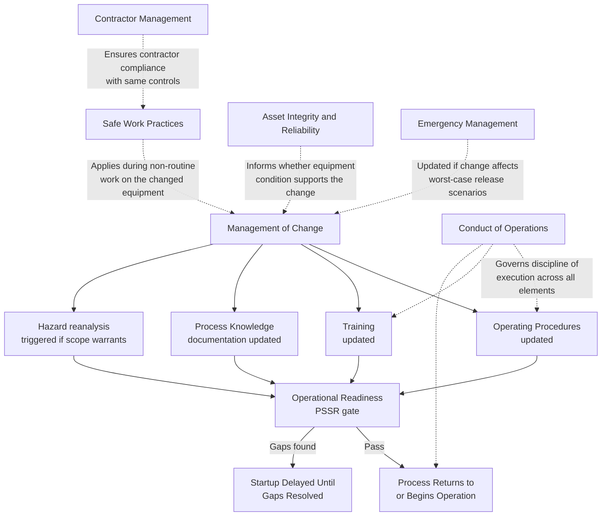

## Manage Risk Pillar

### Position Within the RBPS Framework

Manage Risk is the third and largest pillar in the CCPS Risk Based Process Safety (RBPS) framework, established in *Guidelines for Risk Based Process Safety* (CCPS, 2007). It contains nine of the framework's twenty elements — nearly half the total — reflecting the fact that this pillar covers the day-to-day operational and engineering activities that actually keep identified risks within acceptable limits. Where Pillar II (Understand Hazards and Risk) establishes what the hazards are, Pillar III is where that understanding is translated into sustained operational control.

### The Nine Elements

| # | Element | Core Focus |
| --- | --- | --- |
| 8 | Operating Procedures | Documented, current procedures for safe operation across all operating modes |
| 9 | Safe Work Practices | Permit systems and controls governing non-routine work |
| 10 | Asset Integrity and Reliability | Ensuring equipment remains fit for service throughout its lifecycle |
| 11 | Contractor Management | Selection, oversight, and safety performance management of contractors |
| 12 | Training and Performance Assurance | Ensuring personnel are trained and verified competent for their duties |
| 13 | Management of Change (MOC) | Systematic review and authorization of changes before implementation |
| 14 | Operational Readiness | Verification that a process is safe to start up or resume operation |
| 15 | Conduct of Operations | Deliberate, disciplined task performance according to established standards |
| 16 | Emergency Management | Planning, preparedness, and response capability for process safety emergencies |

**Key Points**

- This pillar is deliberately the largest because it represents the sustained, continuous work of risk management — unlike Pillar II's periodic hazard studies, most Pillar III elements operate on a daily or per-task basis
- Several elements in this pillar (MOC, Operational Readiness, Conduct of Operations) function as cross-cutting controls that interact with nearly every other element rather than operating in isolation

### Element 8: Operating Procedures

Operating Procedures addresses the development, maintenance, and use of written procedures covering all operating phases: initial startup, normal operations, temporary operations, emergency shutdown, emergency operations, normal shutdown, and startup following a turnaround or emergency shutdown.

**Key Points**

- CCPS emphasizes procedure quality attributes beyond mere existence: technical accuracy, clarity, appropriate level of detail for the intended user, and currency with actual plant configuration
- Procedures must be reviewed and validated as part of Management of Change whenever a change affects the steps, sequence, or safe operating limits they describe
- A common maturity indicator is whether procedures are written collaboratively with the operators who use them, versus drafted solely by engineering staff without frontline input

### Element 9: Safe Work Practices

Safe Work Practices governs the controls applied to non-routine work activities that introduce hazards not present during normal operation — this is the RBPS element broader than OSHA's narrower Hot Work Permit requirement.

**Key Points**

- Common safe work practice categories include: hot work permits, confined space entry, lockout/tagout (energy isolation), line-breaking/opening procedures, excavation permits, and critical lift procedures
- A permit-to-work system is the typical administrative mechanism, requiring hazard assessment, control verification, and authorization before work begins
- [Inference] Because safe work practices apply to contractors as frequently as to facility employees, this element has a strong functional dependency on the Contractor Management element to ensure contractor personnel understand and comply with the same permit requirements as facility staff

### Element 10: Asset Integrity and Reliability

Asset Integrity and Reliability extends beyond OSHA's Mechanical Integrity element's fixed equipment list into a broader reliability-centered philosophy covering the full lifecycle of process equipment.

**Key Points**

- Core activities include: equipment inspection and testing programs, preventive/predictive maintenance, quality assurance for new equipment and spare parts, and deficiency correction tracking
- RBPS frames this element around the concept of designing and maintaining equipment to remain fit for service, which extends the OSHA MI equipment list (pressure vessels, piping, relief devices, emergency shutdown systems, controls, pumps) toward a broader reliability engineering discipline
- Inspection intervals under a mature program are risk-based (informed by damage mechanism understanding, criticality ranking, and historical inspection data) rather than fixed calendar intervals applied uniformly across all equipment

### Element 11: Contractor Management

Contractor Management addresses the systematic selection, orientation, oversight, and performance evaluation of contractors performing work that could affect process safety.

**Key Points**

- Effective programs include: pre-qualification screening of contractor safety performance and safety management systems (not only price and technical capability), site-specific safety orientation before contractors begin work, and ongoing oversight during the work itself
- A frequently cited pitfall is evaluating contractors solely on lagging safety statistics (e.g., recordable incident rate) without assessing their underlying safety management system or culture, since strong historical statistics do not guarantee equivalent performance on a new, unfamiliar site

### Element 12: Training and Performance Assurance

Training and Performance Assurance extends beyond OSHA's Training element's focus on training completion into ongoing verification that personnel remain competent to perform their process safety-related duties.

**Key Points**

- Components typically include: initial task-specific training, refresher training at defined intervals, and performance assurance mechanisms (skills demonstrations, knowledge assessments, simulator-based evaluation) that verify retained competency rather than assuming training attendance equals capability
- This element is closely linked to Pillar I's Process Safety Competency element, though Training and Performance Assurance operates at the individual task-execution level while Process Safety Competency addresses broader organizational capability

### Element 13: Management of Change (MOC)

Management of Change addresses the systematic review, risk assessment, and authorization of changes to process technology, equipment, procedures, personnel, or organizational structure before those changes are implemented.

**Key Points**

- MOC scope under RBPS explicitly includes organizational changes (e.g., staffing reductions, reorganization of technical support functions) in addition to the technical/physical changes OSHA's MOC provision addresses, reflecting recognition that organizational changes can degrade process safety performance even without any physical modification
- A functioning MOC system requires a clear definition of what constitutes a change requiring review (distinguished from "replacement in kind," which does not) since ambiguity here is a common source of unreviewed changes entering a facility
- MOC is one of the most cross-cutting elements in the entire RBPS framework: it interacts with Process Knowledge Management (documentation updates), HIRA (re-analysis of affected scenarios), Operating Procedures (procedure revision), Training (retraining on the change), and Operational Readiness (PSSR before startup)

**Example**

A facility proposes to change the packing material in a distillation column to improve separation efficiency. A properly scoped MOC review would trigger: updated process knowledge documentation (new packing specifications, revised pressure drop calculations), a hazard reanalysis of the affected column section (since pressure drop and flooding characteristics change), updated operating procedures reflecting new startup ramp rates, operator training on the change, and a Pre-Startup Safety Review before the column returns to service. Skipping any of these linked reviews (for instance, updating the procedure but not retraining operators) represents an incomplete MOC closure.

### Element 14: Operational Readiness

Operational Readiness is the RBPS element most closely comparable to OSHA's Pre-Startup Safety Review (PSSR) requirement, but extends the concept to cover readiness verification more broadly, including readiness following extended shutdowns, turnarounds, and changes in operating status short of a full restart.

**Key Points**

- Beyond OSHA's PSSR checklist elements (construction/equipment conformance to design, procedures in place, PHA recommendations resolved, training completed), RBPS's Operational Readiness element considers broader organizational readiness factors such as adequate staffing levels and management-of-change closure verification
- This element functions as the final control gate before a process (or a changed portion of a process) returns to or begins operation, meaning gaps in upstream elements (incomplete MOC actions, untrained personnel) are intended to surface and block startup here if not caught earlier

### Element 15: Conduct of Operations

Conduct of Operations has no direct OSHA PSM counterpart. It addresses the deliberate, disciplined execution of tasks according to established standards of performance, regardless of who is performing the task or under what circumstances — the goal being consistency and rigor independent of individual variation or situational pressure.

**Key Points**

- Core sub-concepts commonly associated with this element include: formality of operations (following procedures precisely rather than from memory or habit), a questioning attitude toward anomalies rather than normalization of deviance, effective shift turnover communication, and disciplined use of operating logs and status boards
- [Inference] This element is often cited in incident investigations as a contributing factor even when it was not the sole root cause, since a lapse in operational discipline (e.g., an unlogged manual bypass, an incomplete shift handover) frequently sits alongside a technical failure in the causal chain of a major incident

**Example**

During a shift turnover, an outgoing operator verbally mentions that a level transmitter has been reading erratically but does not log this in the shift handover record or flag it in the control system. The incoming operator, unaware, does not monitor the affected vessel with heightened attention. Strong Conduct of Operations practice would require this observation to be formally logged and explicitly verified as understood by the incoming operator before shift handover is considered complete.

### Element 16: Emergency Management

Emergency Management extends beyond OSHA's Emergency Planning and Response element into a broader lifecycle view encompassing prevention-oriented emergency planning, preparedness, response execution, and post-emergency recovery.

**Key Points**

- Core components include: emergency response planning tailored to credible worst-case and alternative release scenarios, coordination with external responders (fire departments, mutual aid organizations, LEPCs), regular drills and exercises, and post-event recovery and business continuity planning
- This element has a direct functional dependency on Pillar I's Stakeholder Outreach element, since effective emergency response coordination requires the ongoing external relationships that Stakeholder Outreach is intended to establish and maintain

### Cross-Cutting Element Interactions Within the Pillar

### Pillar III Element Map (svg_diagram)

<svg xmlns="http://www.w3.org/2000/svg" viewBox="0 0 900 520">
<text x="450" y="30" font-size="19" font-weight="bold" text-anchor="middle" fill="#1a1a1a">Manage Risk — Pillar III Element Map (svg_diagram)</text>
<circle cx="450" cy="260" r="80" fill="#15803d" />
<text x="450" y="252" font-size="13" font-weight="bold" text-anchor="middle" fill="#ffffff">Management</text>
<text x="450" y="270" font-size="13" font-weight="bold" text-anchor="middle" fill="#ffffff">of Change</text>
<text x="450" y="286" font-size="10" text-anchor="middle" fill="#dcfce7">(central linking element)</text>
<rect x="60" y="70" width="170" height="50" rx="6" fill="#dcfce7" stroke="#15803d" stroke-width="2" />
<text x="145" y="100" font-size="11.5" font-weight="bold" text-anchor="middle" fill="#14532b">Operating Procedures</text>
<rect x="260" y="55" width="170" height="50" rx="6" fill="#dcfce7" stroke="#15803d" stroke-width="2" />
<text x="345" y="85" font-size="11.5" font-weight="bold" text-anchor="middle" fill="#14532b">Safe Work Practices</text>
<rect x="470" y="55" width="170" height="50" rx="6" fill="#dcfce7" stroke="#15803d" stroke-width="2" />
<text x="555" y="85" font-size="11.5" font-weight="bold" text-anchor="middle" fill="#14532b">Asset Integrity &amp;</text>
<text x="555" y="99" font-size="11.5" font-weight="bold" text-anchor="middle" fill="#14532b">Reliability</text>
<rect x="670" y="70" width="170" height="50" rx="6" fill="#dcfce7" stroke="#15803d" stroke-width="2" />
<text x="755" y="100" font-size="11.5" font-weight="bold" text-anchor="middle" fill="#14532b">Contractor Mgmt</text>
<rect x="30" y="280" width="170" height="50" rx="6" fill="#dcfce7" stroke="#15803d" stroke-width="2" />
<text x="115" y="305" font-size="11.5" font-weight="bold" text-anchor="middle" fill="#14532b">Training &amp; Perf.</text>
<text x="115" y="319" font-size="11.5" font-weight="bold" text-anchor="middle" fill="#14532b">Assurance</text>
<rect x="700" y="280" width="170" height="50" rx="6" fill="#dcfce7" stroke="#15803d" stroke-width="2" />
<text x="785" y="305" font-size="11.5" font-weight="bold" text-anchor="middle" fill="#14532b">Operational</text>
<text x="785" y="319" font-size="11.5" font-weight="bold" text-anchor="middle" fill="#14532b">Readiness</text>
<rect x="260" y="420" width="170" height="50" rx="6" fill="#dcfce7" stroke="#15803d" stroke-width="2" />
<text x="345" y="445" font-size="11.5" font-weight="bold" text-anchor="middle" fill="#14532b">Conduct of</text>
<text x="345" y="459" font-size="11.5" font-weight="bold" text-anchor="middle" fill="#14532b">Operations</text>
<rect x="470" y="420" width="170" height="50" rx="6" fill="#dcfce7" stroke="#15803d" stroke-width="2" />
<text x="555" y="445" font-size="11.5" font-weight="bold" text-anchor="middle" fill="#14532b">Emergency</text>
<text x="555" y="459" font-size="11.5" font-weight="bold" text-anchor="middle" fill="#14532b">Management</text>
<line x1="230" y1="95" x2="380" y2="220" stroke="#6b7280" stroke-width="1.5" />
<line x1="345" y1="105" x2="410" y2="200" stroke="#6b7280" stroke-width="1.5" />
<line x1="555" y1="105" x2="490" y2="200" stroke="#6b7280" stroke-width="1.5" />
<line x1="670" y1="100" x2="520" y2="220" stroke="#6b7280" stroke-width="1.5" />
<line x1="200" y1="300" x2="375" y2="280" stroke="#6b7280" stroke-width="1.5" />
<line x1="700" y1="300" x2="525" y2="280" stroke="#6b7280" stroke-width="1.5" />
<line x1="345" y1="420" x2="410" y2="325" stroke="#6b7280" stroke-width="1.5" />
<line x1="555" y1="420" x2="490" y2="325" stroke="#6b7280" stroke-width="1.5" />
</svg>

### Related Topics

- Pre-Startup Safety Review (PSSR) Checklist Design and Common Failure Modes
- Permit-to-Work System Design for Multi-Contractor Sites
- Reliability-Centered Maintenance (RCM) as an Asset Integrity Methodology
- Shift Handover Communication Protocols and Formality of Operations
- MOC Scope Definition: Distinguishing "Replacement in Kind" from Reviewable Change
- Contractor Pre-Qualification Criteria Beyond Lagging Safety Statistics
- Emergency Response Drill Design and Post-Exercise Evaluation
- Organizational Change Management as an MOC Sub-Category