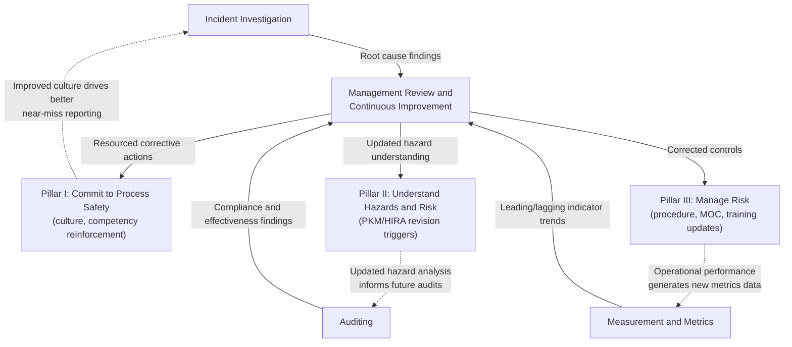

## Learn from Experience Pillar

### Position Within the RBPS Framework

Learn from Experience is the fourth and final pillar in the CCPS Risk Based Process Safety (RBPS) framework, established in *Guidelines for Risk Based Process Safety* (CCPS, 2007). It contains four of the framework's twenty elements and functions as the feedback mechanism that closes the loop across the entire framework: findings generated here flow back into Pillar I (reinforcing or challenging culture and competency), Pillar II (updating hazard understanding), and Pillar III (correcting operational and engineering controls). Without a functioning Pillar IV, an organization's process safety management system tends toward static, unexamined operation rather than genuine continuous improvement.

### The Four Elements

| # | Element | Core Focus |
| --- | --- | --- |
| 17 | Incident Investigation | Systematic investigation of incidents and near-misses to identify root causes |
| 18 | Measurement and Metrics | Leading and lagging indicators monitoring management system health |
| 19 | Auditing | Periodic, systematic evaluation of whether the management system functions as designed |
| 20 | Management Review and Continuous Improvement | Senior leadership review driving deliberate system improvement |

**Key Points**

- These four elements form a natural sequence: incidents and metrics generate data, audits independently verify system function, and management review synthesizes all three inputs into deliberate corrective action
- This pillar is the one most explicitly designed around the concept of organizational learning — converting operational experience (both failures and near-failures) into system improvement rather than simply documenting events after the fact

### Element 17: Incident Investigation

Incident Investigation addresses the systematic investigation of process safety incidents, and importantly, near-misses, to identify underlying root causes rather than stopping at immediate or proximate causes.

**Key Points**

- CCPS's RBPS framing of this element aligns closely with the broader regulatory trend (reflected in EPA's RMP amendments) toward requiring root cause determination — identifying systemic, often management-system-level failures — rather than accepting a proximate technical cause (e.g., "valve failed") as a sufficient investigation conclusion
- Near-miss investigation is treated as equally important to actual-loss incident investigation, since near-misses represent the same underlying causal pathways without the consequence, and typically occur far more frequently, providing more learning opportunities per unit of actual harm experienced
- A functioning program requires: a low-threshold reporting mechanism (encouraging reporting of near-misses without fear of blame), a defined investigation methodology proportional to severity, corrective action tracking through to verified completion, and a mechanism for sharing lessons learned across the organization, not only within the investigating site
- [Inference] Common root cause analysis methodologies used within this element (5 Whys, Fault Tree Analysis, TapRooT, Ishikawa/Fishbone diagrams) are not prescribed by CCPS as mandatory, consistent with RBPS's general pattern of specifying required outcomes rather than mandating specific technical methods

**Example**

A near-miss occurs when an operator notices a pressure gauge reading outside its normal range just before a scheduled batch transfer and halts the operation. Even though no release occurred, a mature Incident Investigation program treats this as a full investigation trigger: it may reveal that the gauge's calibration interval was too long for its service conditions, or that a recent MOC-approved change altered process conditions in a way not reflected in the safe operating limits documentation. Without near-miss investigation, this systemic gap might only surface after an actual release.

### Element 18: Measurement and Metrics

Measurement and Metrics addresses the selection, tracking, and use of leading and lagging indicators to monitor whether the process safety management system is functioning effectively, independent of whether an incident has occurred.

**Key Points**

- Lagging indicators measure outcomes that have already occurred (e.g., number of Tier 1/Tier 2 process safety events per CCPS's process safety event classification, recordable incident rate); leading indicators measure the health of system inputs believed to predict future performance (e.g., percentage of overdue PHA action items, percentage of MOC reviews completed on time, mechanical integrity inspection completion rate)
- CCPS's companion guidance, *Process Safety Leading and Lagging Metrics* (developed jointly with API RP 754 for the refining/petrochemical sector), provides a widely referenced tiered classification system for process safety events
- A common maturity indicator is the balance between leading and lagging indicators tracked: an organization relying solely on lagging indicators (incident counts) has no early warning capability, since by definition lagging indicators only reveal problems after harm or near-harm has already occurred
- [Inference] Because leading indicators are proxies for underlying system health rather than direct outcome measures, selecting leading indicators that genuinely predict future performance (rather than merely being easy to measure) is widely regarded as one of the more difficult aspects of implementing this element well

**Example: Illustrative Leading/Lagging Indicator Set**

| Indicator Type | Example Metric | What It Signals |
| --- | --- | --- |
| Lagging | Tier 1 Process Safety Events per year | Actual loss-of-containment events have occurred |
| Lagging | Recordable injury rate | Occupational safety outcomes (broader than process safety specifically) |
| Leading | Percentage of PHA action items closed on schedule | Whether hazard analysis findings are being acted upon |
| Leading | Percentage of overdue mechanical integrity inspections | Whether asset integrity commitments are being met |
| Leading | Near-miss reports per operator per year | Whether reporting culture is functioning (a low count may indicate underreporting rather than genuine safety) |

### Element 19: Auditing

Auditing addresses the periodic, systematic, and objective evaluation of whether the process safety management system — across all twenty RBPS elements — is functioning as designed, independent of the day-to-day operation of any single element.

**Key Points**

- RBPS's Auditing element is broader in scope than OSHA's Compliance Audits requirement (29 CFR 1910.119(o)), since it evaluates conformance against the full twenty-element RBPS structure, including the elements (culture, metrics, stakeholder outreach) that have no OSHA counterpart
- Effective audit programs combine document/record review with direct observation and personnel interviews, since document review alone can miss gaps between what procedures state and what actually happens on the floor
- A distinction commonly drawn is between compliance auditing (verifying conformance to regulatory and internal requirements) and effectiveness auditing (verifying that conforming activities actually achieve their intended risk-reduction purpose) — a program can pass a compliance audit while still containing latent effectiveness gaps
- [Inference] The independence considerations that apply to third-party audits under EPA's RMP amendments (auditor independence from the audited process, absence of conflicting financial interest) represent a more formalized, regulatorily mandated version of an independence principle CCPS's Auditing element treats as a general best practice rather than a strict requirement

### Element 20: Management Review and Continuous Improvement

Management Review and Continuous Improvement is the capstone element of the entire RBPS framework: it is the mechanism by which senior leadership formally reviews the aggregate output of the other nineteen elements and drives deliberate action to close identified gaps.

**Key Points**

- This element has no direct OSHA PSM counterpart, reflecting RBPS's broader ambition toward a self-correcting management system rather than a static compliance structure
- A functioning management review process typically includes: periodic (e.g., annual) senior leadership review of aggregated metrics, audit findings, and incident investigation trends; explicit assignment of accountability and resources for identified improvement actions; and follow-up verification that improvement actions were completed and effective
- [Inference] Because this element sits at the top of the feedback hierarchy, its effectiveness is difficult to assess independently of the quality of the inputs it receives (metrics, audit findings, investigation reports) from the other three Pillar IV elements — a management review process can only be as good as the information reaching it

### Pillar IV Feedback Architecture

### Pillar IV Element Relationship Diagram (svg_diagram)

<svg xmlns="http://www.w3.org/2000/svg" viewBox="0 0 850 480">
<text x="425" y="30" font-size="19" font-weight="bold" text-anchor="middle" fill="#1a1a1a">Learn from Experience — Pillar IV (svg_diagram)</text>
<rect x="60" y="70" width="180" height="60" rx="8" fill="#fef3c7" stroke="#b45309" stroke-width="2" />
<text x="150" y="95" font-size="12.5" font-weight="bold" text-anchor="middle" fill="#78350f">Incident</text>
<text x="150" y="112" font-size="12.5" font-weight="bold" text-anchor="middle" fill="#78350f">Investigation</text>
<rect x="330" y="70" width="180" height="60" rx="8" fill="#fef3c7" stroke="#b45309" stroke-width="2" />
<text x="420" y="95" font-size="12.5" font-weight="bold" text-anchor="middle" fill="#78350f">Measurement</text>
<text x="420" y="112" font-size="12.5" font-weight="bold" text-anchor="middle" fill="#78350f">and Metrics</text>
<rect x="600" y="70" width="180" height="60" rx="8" fill="#fef3c7" stroke="#b45309" stroke-width="2" />
<text x="690" y="95" font-size="12.5" font-weight="bold" text-anchor="middle" fill="#78350f">Auditing</text>
<rect x="290" y="220" width="260" height="80" rx="8" fill="#b45309" />
<text x="420" y="250" font-size="14" font-weight="bold" text-anchor="middle" fill="#ffffff">Management Review</text>
<text x="420" y="268" font-size="14" font-weight="bold" text-anchor="middle" fill="#ffffff">and Continuous</text>
<text x="420" y="286" font-size="14" font-weight="bold" text-anchor="middle" fill="#ffffff">Improvement</text>
<rect x="40" y="380" width="220" height="60" rx="8" fill="#dbeafe" stroke="#1e40af" stroke-width="2" />
<text x="150" y="405" font-size="11.5" font-weight="bold" text-anchor="middle" fill="#1e3a8a">Pillar I:</text>
<text x="150" y="421" font-size="11.5" font-weight="bold" text-anchor="middle" fill="#1e3a8a">Commit to Process Safety</text>
<rect x="315" y="380" width="220" height="60" rx="8" fill="#e0f2fe" stroke="#0369a1" stroke-width="2" />
<text x="425" y="405" font-size="11.5" font-weight="bold" text-anchor="middle" fill="#075985">Pillar II:</text>
<text x="425" y="421" font-size="11.5" font-weight="bold" text-anchor="middle" fill="#075985">Understand Hazards &amp; Risk</text>
<rect x="590" y="380" width="220" height="60" rx="8" fill="#dcfce7" stroke="#15803d" stroke-width="2" />
<text x="700" y="405" font-size="11.5" font-weight="bold" text-anchor="middle" fill="#14532b">Pillar III:</text>
<text x="700" y="421" font-size="11.5" font-weight="bold" text-anchor="middle" fill="#14532b">Manage Risk</text>
<line x1="150" y1="130" x2="360" y2="225" stroke="#374151" stroke-width="2" />
<line x1="420" y1="130" x2="420" y2="215" stroke="#374151" stroke-width="2" />
<line x1="690" y1="130" x2="480" y2="225" stroke="#374151" stroke-width="2" />
<line x1="360" y1="300" x2="180" y2="375" stroke="#374151" stroke-width="2" />
<line x1="420" y1="300" x2="425" y2="375" stroke="#374151" stroke-width="2" />
<line x1="480" y1="300" x2="670" y2="375" stroke="#374151" stroke-width="2" />
</svg>

### Distinguishing Feature: Closing the Loop

**Key Points**

- What distinguishes RBPS's Pillar IV from a simple regulatory reporting requirement is the explicit expectation that findings flow *back into* the earlier pillars, not merely into a filed report: this is the mechanistic definition of continuous improvement within the framework
- [Inference] Organizations that treat Pillar IV elements as terminal reporting obligations (an incident report is written and filed, an audit report is issued and archived) rather than as inputs to a genuine feedback loop are, in effect, implementing the documentation of Pillar IV without implementing its intended function
- The four elements are sequenced deliberately: investigation and metrics generate raw signal, auditing provides an independent cross-check not dependent on self-reported data, and management review is the single point where all three streams are synthesized into resourced action — meaning a gap in any one of the first three elements degrades the quality of the fourth

### Related Topics

- CCPS Process Safety Leading and Lagging Metrics Guidance and API RP 754 Tiered Event Classification
- Root Cause Analysis Methodologies (5 Whys, Fault Tree Analysis, TapRooT, Ishikawa Diagrams)
- Near-Miss Reporting Culture and Non-Punitive Reporting System Design
- Compliance Auditing versus Effectiveness Auditing: Scope and Methodology Differences
- Third-Party Audit Independence Criteria Under EPA RMP Compared to CCPS Best Practice
- Corrective Action Tracking Systems and Verification of Effectiveness
- Senior Leadership Accountability Structures for Process Safety Performance
- Organizational Learning Theory Applied to Process Safety Management Systems