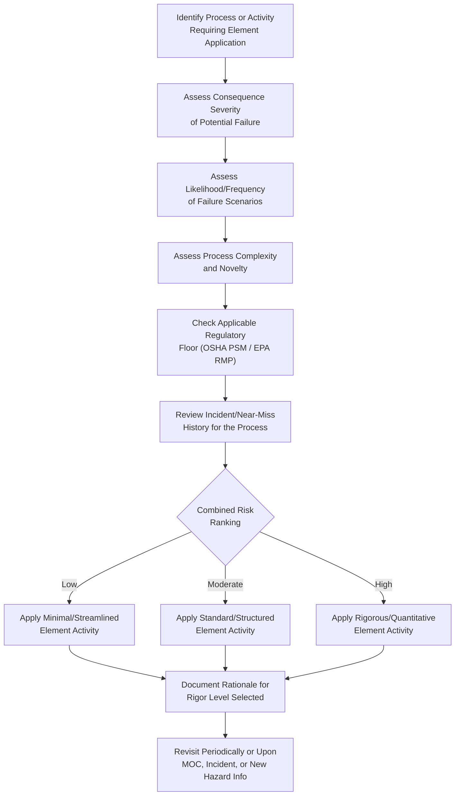

## Selecting the Level of Rigor for Each Element

### The Core Risk-Based Principle

The defining conceptual innovation of the CCPS Risk Based Process Safety (RBPS) framework, relative to a uniform compliance checklist, is that the intensity, formality, and resource investment applied to each of the twenty elements should scale with the magnitude and complexity of the risk being managed, rather than being applied identically across every process regardless of hazard level. This principle is what allows a single management system architecture to serve a diversified organization operating everything from low-hazard utility systems to high-consequence reactive chemistry processes without either under-protecting high-risk operations or wastefully over-engineering low-risk ones.

**Key Points**

- CCPS explicitly rejects a "one size fits all" implementation of any element; each of the twenty elements is described in *Guidelines for Risk Based Process Safety* across a spectrum of possible activity intensity, from minimal to highly rigorous
- This principle applies both *across* different processes at a single site (a boiler feedwater system versus a high-pressure reactor) and *across* different organizations of different scale and hazard profile (a small specialty batch producer versus a large-scale continuous petrochemical complex)
- Selecting rigor level is not a one-time decision; it should be revisited as risk understanding evolves (following HIRA studies, incidents, or process changes) since a process's risk profile is not static over its lifecycle

### Determinants of Rigor Level

Several factors interact to determine the appropriate level of rigor for a given element applied to a given process:

| Factor | Effect on Required Rigor |
| --- | --- |
| Consequence severity of a potential loss of containment | Higher potential consequence (toxic release, large flammable inventory) drives higher rigor |
| Likelihood/frequency of hazard scenarios | More frequent or complex failure pathways drive higher rigor |
| Process complexity | More interacting variables and control loops increase the value of more rigorous analysis |
| Regulatory status | OSHA PSM/EPA RMP-covered processes carry a regulatory floor beneath which rigor cannot fall regardless of RBPS's risk-based flexibility |
| Organizational scale and resources | Larger organizations can typically sustain higher rigor across more elements simultaneously; resource-constrained organizations must prioritize |
| Incident/near-miss history | A process with a history of related incidents warrants elevated rigor even if theoretical risk ranking alone might suggest otherwise |
| Novelty of the technology or process | Newer, less-understood technology generally warrants higher initial rigor until operating experience accumulates |

**Key Points**

- [Inference] Regulatory status functions as a floor rather than a ceiling: a facility may choose to apply RBPS-recommended rigor exceeding OSHA PSM or EPA RMP minimums for genuinely high-risk processes, but cannot use RBPS's risk-based philosophy to justify falling below an applicable regulatory minimum
- Incident and near-miss history is a distinct input from theoretical risk ranking because it represents realized rather than predicted risk; CCPS guidance generally treats actual experience as a strong signal warranting rigor adjustment even absent a formal reanalysis

### Rigor Spectrum Illustrated Through the HIRA Element

The Hazard Identification and Risk Analysis element (Pillar II) provides the clearest illustration of RBPS's rigor-selection philosophy, since it explicitly presents a spectrum of methodologies of increasing analytical intensity:

$$\text{Required Rigor} \propto f(\text{Consequence Severity}, \text{Likelihood}, \text{Complexity})$$

| Rigor Level | Representative HIRA Method | Appropriate Process Type |
| --- | --- | --- |
| Minimal | Checklist Analysis | Low-hazard utility/support systems (e.g., plant air compressors) |
| Low-Moderate | What-If Analysis | Simple processes with well-understood, limited hazard scenarios |
| Moderate-High | Hazard and Operability Study (HAZOP) | Complex process units with multiple interacting hazards |
| High | Layer of Protection Analysis (LOPA) | Scenarios requiring quantified independent protection layer credit |
| Very High | Quantitative Risk Analysis (QRA) | Catastrophic consequence potential requiring numerical risk criteria comparison |

**Example**

A specialty chemical manufacturer operates both a nitrogen purge utility system and a high-pressure exothermic reaction process on the same site. Applying uniform rigor (e.g., full HAZOP for both) would over-invest analytical resources in the nitrogen system, which poses limited hazard potential, while a uniform minimal approach (e.g., checklist-only for both) would dangerously under-analyze the reactive chemistry process. RBPS's risk-based principle directs the organization toward Checklist Analysis for the nitrogen system and full HAZOP — potentially escalated to LOPA on specific high-consequence deviations — for the reactor, allocating scarce hazard-analysis resources proportional to actual risk.

### Rigor-Selection Decision Framework

### Rigor Selection Across Multiple Elements (svg_diagram)

<svg xmlns="http://www.w3.org/2000/svg" viewBox="0 0 900 460">
<text x="450" y="30" font-size="19" font-weight="bold" text-anchor="middle" fill="#1a1a1a">Rigor Scaling Across Process Risk Levels (svg_diagram)</text>

<text x="450" y="60" font-size="12" text-anchor="middle" fill="`#374151`" font-style="italic">Illustrative comparison: Low-hazard utility system vs. high-hazard reactive process</text>

<line x1="80" y1="90" x2="80" y2="400" stroke="#374151" stroke-width="2" />
<line x1="80" y1="400" x2="850" y2="400" stroke="#374151" stroke-width="2" />
<text x="45" y="245" font-size="12" text-anchor="middle" fill="#374151" transform="rotate(-90,45,245)">Rigor Level</text>

<text x="200" y="420" font-size="11" text-anchor="middle" fill="`#374151`">HIRA</text>

<text x="380" y="420" font-size="11" text-anchor="middle" fill="`#374151`">Asset Integrity</text>

<text x="560" y="420" font-size="11" text-anchor="middle" fill="`#374151`">MOC Review</text>

<text x="730" y="420" font-size="11" text-anchor="middle" fill="`#374151`">Auditing</text>

<rect x="165" y="360" width="35" height="40" fill="#93c5fd" stroke="#1e40af" />
<rect x="345" y="350" width="35" height="50" fill="#93c5fd" stroke="#1e40af" />
<rect x="525" y="340" width="35" height="60" fill="#93c5fd" stroke="#1e40af" />
<rect x="695" y="355" width="35" height="45" fill="#93c5fd" stroke="#1e40af" />

<rect x="205" y="110" width="35" height="290" fill="#1e40af" />
<rect x="385" y="140" width="35" height="260" fill="#1e40af" />
<rect x="565" y="120" width="35" height="280" fill="#1e40af" />
<rect x="735" y="160" width="35" height="240" fill="#1e40af" />

<text x="182" y="355" font-size="9" text-anchor="middle" fill="`#1e3a8a`">Checklist</text>

<text x="222" y="105" font-size="9" text-anchor="middle" fill="`#1e3a8a`">HAZOP+LOPA</text>

<text x="362" y="345" font-size="9" text-anchor="middle" fill="`#1e3a8a`">Calendar-based</text>

<text x="402" y="135" font-size="9" text-anchor="middle" fill="`#1e3a8a`">Risk-based/RBI</text>

<text x="542" y="335" font-size="9" text-anchor="middle" fill="`#1e3a8a`">Streamlined</text>

<text x="582" y="115" font-size="9" text-anchor="middle" fill="`#1e3a8a`">Full multi-discipline</text>

<text x="712" y="350" font-size="9" text-anchor="middle" fill="`#1e3a8a`">Self-audit</text>

<text x="752" y="155" font-size="9" text-anchor="middle" fill="`#1e3a8a`">Independent/3rd-party</text>

<rect x="600" y="60" width="16" height="16" fill="#93c5fd" stroke="#1e40af" />
<text x="622" y="73" font-size="10" text-anchor="start" fill="#1e3a8a">Low-hazard process</text>
<rect x="600" y="80" width="16" height="16" fill="#1e40af" />
<text x="622" y="93" font-size="10" text-anchor="start" fill="#1e3a8a">High-hazard process</text>
</svg>

### Rigor Selection Applied Across Other Elements

The rigor-scaling principle is not unique to HIRA; CCPS applies the same logic to most of the twenty elements:

- **Asset Integrity and Reliability**: A low-hazard utility system might follow a simple calendar-based inspection schedule, while a high-hazard reactor system warrants risk-based inspection (RBI) methodology informed by specific damage-mechanism analysis and criticality ranking
- **Management of Change**: A minor, low-consequence change (e.g., relocating a non-critical instrument) might follow a streamlined single-approver MOC review, while a change affecting safe operating limits on a high-hazard process warrants full multi-discipline review including hazard reanalysis
- **Training and Performance Assurance**: Personnel operating low-complexity, low-consequence equipment may require basic task training with periodic refreshers, while personnel operating high-hazard, high-complexity processes may warrant simulator-based training and more frequent competency verification
- **Auditing**: Lower-risk facilities or processes might be adequately served by internal self-audit programs, while EPA RMP's third-party audit provisions (triggered by qualifying accidents or agency findings) represent a regulatorily mandated escalation of rigor for specific higher-concern circumstances
- **Incident Investigation**: A minor near-miss with limited potential consequence might warrant a brief documented review, while an actual loss-of-containment event or a near-miss with high potential severity warrants full root cause analysis using a structured methodology (Fault Tree Analysis, TapRooT)

### Documenting the Rigor-Selection Rationale

**Key Points**

- CCPS guidance emphasizes that the rationale for selected rigor level should itself be documented, not merely the resulting activity — this creates an auditable record showing that the level of effort was a deliberate risk-based decision rather than an arbitrary or resource-driven shortcut
- [Inference] Undocumented rigor-selection decisions are a common finding in RBPS gap assessments, since an auditor reviewing a streamlined MOC process, for example, cannot distinguish between an intentional, risk-justified simplification and an unintentional compliance gap without seeing the underlying rationale recorded
- A defensible rationale typically references the specific risk factors considered (consequence severity, likelihood, complexity, regulatory status, incident history) rather than simply asserting a conclusion (e.g., "this is a low-risk system") without supporting analysis

### Common Pitfalls in Rigor Selection

- **Rigor creep in the wrong direction**: Applying minimal rigor to a process because it has historically had no incidents, without recognizing that absence of incidents may reflect luck or an undetected latent hazard rather than genuinely low risk
- **Static rigor assignment**: Setting a rigor level once (e.g., at initial HAZOP) and never revisiting it despite subsequent MOC activity, incidents, or new hazard information that would justify reassessment
- **Regulatory floor confusion**: Assuming RBPS's risk-based flexibility permits reducing rigor below an applicable OSHA PSM or EPA RMP regulatory minimum; the risk-based principle governs discretionary rigor above the floor, not the floor itself
- **Resource-driven rather than risk-driven selection**: Selecting a lower rigor level primarily because of budget or staffing constraints, then retroactively constructing a risk-based justification, rather than genuinely deriving the rigor level from risk factors first

### Related Topics

- Risk-Based Inspection (RBI) Methodology for Asset Integrity Programs
- LOPA Scenario Escalation Criteria from HAZOP Findings
- Regulatory Floors: OSHA PSM and EPA RMP Minimum Requirements Versus RBPS Discretionary Rigor
- MOC Tiering Systems: Streamlined Versus Full Multi-Discipline Review Criteria
- Risk Matrix Design and Consequence/Likelihood Ranking Criteria
- Documentation Standards for Risk-Based Decision Rationale
- Third-Party Audit Triggers Under EPA RMP as a Regulatory Rigor Escalation Example