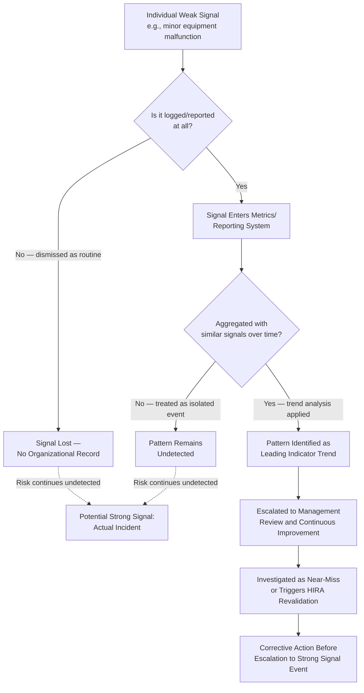

## Weak Signals Versus Strong Signals in RBPS Implementation

### Conceptual Origin

The distinction between weak signals and strong signals is a concept CCPS incorporates into the Risk Based Process Safety framework, most directly within the Measurement and Metrics and Management Review and Continuous Improvement elements of Pillar IV (Learn from Experience). The concept originates more broadly from organizational sociology and high-reliability organization (HRO) theory, and addresses a persistent failure mode observed across major industrial disasters: the precursor information indicating that a catastrophic outcome was possible was often present in the organization well before the event, but was not recognized, escalated, or acted upon with appropriate urgency.

**Key Points**

- A "signal" in this context is any piece of information — a near-miss, an anomalous metric trend, an audit finding, an operator observation — that carries information about the state of process safety risk
- The weak/strong distinction is not primarily about the objective severity of the underlying hazard, but about how clearly and unambiguously the information communicates risk to the people positioned to act on it
- [Inference] This framing is widely used in post-incident analyses of major process safety disasters (e.g., Texas City 2005, Deepwater Horizon 2010, Bhopal 1984) where investigators identified that relevant precursor signals existed in advance but were weak, diffuse, or embedded in normal operational noise rather than clearly flagged

### Defining Strong Signals

Strong signals are unambiguous indicators of significant risk that are difficult to misinterpret or dismiss, and that typically demand a clear, immediate organizational response.

**Key Points**

- Examples include: an actual loss-of-containment event, a safety instrumented system activation on true demand, a near-miss with clearly identified high-consequence potential, or a regulatory citation for a significant violation
- Strong signals generally trigger existing formal RBPS mechanisms almost automatically — an actual release triggers Incident Investigation (element 17) and, potentially under EPA RMP provisions, a mandatory root cause analysis and possible third-party audit
- Because strong signals are difficult to ignore, organizational failure related to them typically occurs not in *detecting* the signal but in the *quality and completeness* of the response (e.g., addressing only the proximate cause, failing to generalize findings to similar processes elsewhere in the organization)

### Defining Weak Signals

Weak signals are ambiguous, low-intensity, or easily-dismissed indicators that, in retrospect following a major incident, are frequently found to have presaged the event — but which did not, at the time, trigger a response proportional to the risk they actually represented.

**Key Points**

- Examples include: a gradually increasing frequency of minor equipment malfunctions dismissed individually as unrelated nuisances, a safety-critical alarm that operators have learned to routinely acknowledge without full investigation ("alarm normalization"), a leading indicator (e.g., overdue PHA action items) trending in an adverse direction but still within a nominally "acceptable" range, or an operator's informal comment about a procedure "not quite making sense" that is not formally logged or escalated
- Weak signals are dangerous precisely because each one, viewed in isolation, may appear insufficiently significant to warrant a major response — the risk typically becomes apparent only when multiple weak signals are considered in aggregate, which requires a deliberate mechanism to notice the pattern
- [Inference] The concept of "normalization of deviance," developed in accident analysis literature (notably in relation to the Space Shuttle Challenger disaster), describes a closely related mechanism: repeated exposure to a weak signal without adverse consequence leads an organization to gradually recalibrate its perception of what constitutes acceptable risk, making the signal appear progressively weaker over time even though the underlying hazard has not changed

**Example**

A refinery's relief valve on a particular vessel has, over an 18-month period, activated slightly more frequently than its historical baseline — each individual activation within the range engineers consider "normal chattering" and not investigated as a standalone event. Viewed individually, none of these activations rises to the level of a strong signal warranting formal Incident Investigation. Viewed in aggregate as a trend, however, the pattern may indicate a developing process condition (e.g., gradual fouling altering relief setpoint margin) that represents a weak signal of increasing risk — one that a metrics-driven trend review, rather than event-by-event assessment, is positioned to detect.

### Why the Distinction Matters for RBPS Element Design

**Key Points**

- Pillar IV's Measurement and Metrics element is explicitly designed to surface weak signals that individual strong-signal-triggered mechanisms (like Incident Investigation) would miss, since metrics track trends and aggregate patterns rather than discrete triggering events
- Near-miss reporting (part of Incident Investigation) functions as a bridge between weak and strong signal detection: a near-miss is often the first strong-signal-equivalent event generated by an underlying weak-signal pattern, and a low reporting threshold increases the chance that a developing pattern is caught before it escalates to an actual loss event
- Management Review and Continuous Improvement (element 20) is the element most responsible for synthesizing weak signals across data streams (metrics trends, audit findings, near-miss patterns) that no single Pillar IV element considered alone would necessarily surface as significant

### Weak Signal Escalation Pathway

### Signal Strength Comparison Diagram (svg_diagram)

<svg xmlns="http://www.w3.org/2000/svg" viewBox="0 0 900 480">
<text x="450" y="30" font-size="19" font-weight="bold" text-anchor="middle" fill="#1a1a1a">Weak Signals vs. Strong Signals (svg_diagram)</text>
<line x1="80" y1="380" x2="850" y2="380" stroke="#374151" stroke-width="2" />
<text x="465" y="410" font-size="12" text-anchor="middle" fill="#374151">Time / Accumulation of Precursor Events</text>
<line x1="80" y1="380" x2="80" y2="70" stroke="#374151" stroke-width="2" />
<text x="45" y="225" font-size="12" text-anchor="middle" fill="#374151" transform="rotate(-90,45,225)">Signal Clarity / Urgency</text>
<circle cx="150" cy="340" r="8" fill="#93c5fd" />
<circle cx="220" cy="330" r="8" fill="#93c5fd" />
<circle cx="290" cy="345" r="8" fill="#93c5fd" />
<circle cx="360" cy="320" r="8" fill="#93c5fd" />
<circle cx="430" cy="335" r="8" fill="#93c5fd" />
<circle cx="500" cy="310" r="8" fill="#93c5fd" />
<text x="330" y="290" font-size="11" text-anchor="middle" fill="#1e3a8a">Individual weak signals (each appears minor in isolation)</text>
<rect x="140" y="250" width="380" height="110" rx="8" fill="none" stroke="#7c3aed" stroke-width="2" stroke-dasharray="6,4" />
<text x="330" y="243" font-size="11" text-anchor="middle" fill="#5b21b6" font-weight="bold">Aggregated: reveals adverse trend</text>
<path d="M 150 340 L 220 330 L 290 345 L 360 320 L 430 335 L 500 310" stroke="#5b21b6" stroke-width="2" fill="none" stroke-dasharray="3,3" />
<rect x="600" y="100" width="200" height="70" rx="8" fill="#b91c1c" />
<text x="700" y="130" font-size="13" font-weight="bold" text-anchor="middle" fill="#ffffff">Strong Signal</text>
<text x="700" y="150" font-size="11" text-anchor="middle" fill="#fee2e2">Actual loss event or</text>
<text x="700" y="163" font-size="11" text-anchor="middle" fill="#fee2e2">SIS activation</text>
<line x1="500" y1="310" x2="600" y2="170" stroke="#b91c1c" stroke-width="2.5" marker-end="url(#arrowRed)" />
<text x="560" y="240" font-size="10" text-anchor="middle" fill="`#7f1d1d`" font-style="italic">If weak signal pattern</text>

<text x="560" y="253" font-size="10" text-anchor="middle" fill="`#7f1d1d`" font-style="italic">goes undetected</text>

</svg>

### Organizational Barriers to Weak Signal Detection

- **Alarm and event normalization**: Repeated exposure to a low-level anomaly without adverse consequence causes personnel to recalibrate their sense of what is "normal," reducing the perceived urgency of the signal even as its underlying frequency or severity may be increasing
- **Fragmented data ownership**: When different weak signals are captured in different systems owned by different departments (maintenance logs, operator shift logs, safety incident databases), no single role has visibility into the aggregate pattern unless a deliberate cross-functional review mechanism exists
- **Reporting culture disincentives**: If near-miss or minor-anomaly reporting is perceived as generating blame or extra administrative burden rather than being genuinely valued, the volume of weak signals entering the system in the first place is suppressed
- **Metric threshold design**: Leading indicators set with thresholds too coarse to detect gradual trends (e.g., a binary "acceptable/unacceptable" flag rather than a continuous trend line) can mask a weak signal pattern that would be visible under finer-grained trend analysis

### Practical Mechanisms for Strengthening Weak Signal Detection

**Key Points**

- Trend-based (rather than threshold-based) review of leading indicators, examined at Management Review meetings specifically for directional change even when absolute values remain within nominally acceptable ranges
- Structured near-miss reporting with a genuinely low reporting threshold and non-punitive follow-through, since the volume and quality of weak signals entering the system depends directly on whether personnel believe reporting minor anomalies is worthwhile
- Cross-functional data aggregation — combining maintenance, operations, and safety incident data into a shared view — so that patterns spanning multiple data sources become visible rather than remaining siloed
- [Inference] Periodic culture surveys and direct floor-level engagement (an element of Workforce Involvement in Pillar I) can surface weak signals that never enter formal reporting systems at all, since some organizational concerns are more likely to be voiced informally than logged in a structured system

### Related Topics

- Normalization of Deviance and Organizational Drift in High-Hazard Industries
- Alarm Management and Alarm Rationalization (ISA-18.2 / IEC 62682)
- High-Reliability Organization (HRO) Theory and Mindful Organizing
- Leading Indicator Trend Analysis Versus Threshold-Based Metric Review
- Near-Miss Reporting Culture and Non-Punitive Reporting System Design
- Post-Incident Case Studies: Texas City (2005), Deepwater Horizon (2010), and Precursor Signal Analysis
- Cross-Functional Data Integration for Process Safety Management Systems