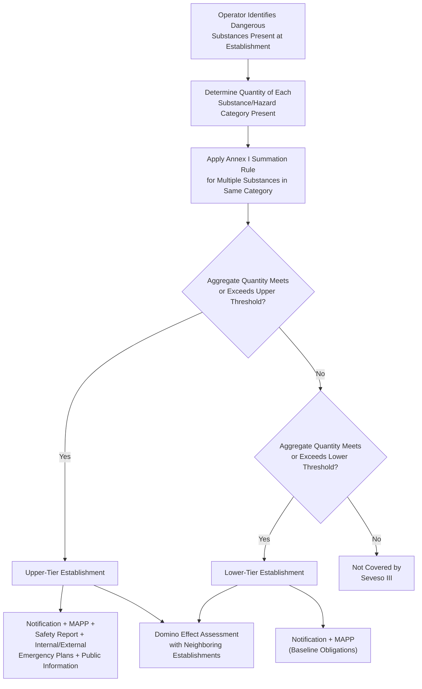

## EU Seveso III Directive and Establishment Tiering

### Regulatory Origin and Purpose

The Seveso III Directive (Directive 2012/18/EU) is the current iteration of the European Union's principal legislative instrument governing the control of major-accident hazards involving dangerous substances. It takes its name from the 1976 industrial accident at a chemical plant in Seveso, Italy, in which an uncontrolled reaction released a cloud containing dioxin (TCDD) over a populated area, prompting the EU's first major-accident prevention legislation (the original "Seveso Directive," 82/501/EEC, adopted 1982). The Directive has been substantially revised twice: Seveso II (Directive 96/82/EC, 1996) and Seveso III (Directive 2012/18/EU), which came into force on June 1, 2015, replacing Seveso II.

**Key Points**

- Seveso III's primary structural change relative to Seveso II was alignment with the EU's Classification, Labelling and Packaging (CLP) Regulation (EC No. 1272/2008), which itself implements the UN's Globally Harmonized System (GHS) for chemical classification — this required recalibrating substance classification categories used to determine establishment coverage and tier
- As an EU Directive rather than a Regulation, Seveso III is not directly applicable law; it must be transposed into the national legislation of each EU Member State, meaning specific implementing details (enforcement mechanisms, penalties, permitting procedures) vary somewhat by country even though the substantive tiering thresholds are harmonized
- [Inference] The Directive's periodic revision pattern (roughly every 15-16 years) suggests continued evolution is likely as chemical classification systems and major-accident experience continue to develop, though no specific Seveso IV timeline is established in current guidance

### The Two-Tier Establishment Classification System

Seveso III's central regulatory mechanism is a two-tier classification of "establishments" (a term covering the whole area under the control of an operator where dangerous substances are present in one or more installations) based on the quantities of specified dangerous substances present, relative to threshold quantities set out in Annex I of the Directive.

| Tier | Threshold | Common Designation | Regulatory Intensity |
| --- | --- | --- | --- |
| Lower-tier | Substance quantities meet or exceed the lower threshold but remain below the upper threshold | "Lower-tier establishment" | Baseline major-accident prevention obligations |
| Upper-tier | Substance quantities meet or exceed the upper threshold | "Upper-tier establishment" | Full major-accident prevention obligations, including offsite emergency planning and public information |

**Key Points**

- Annex I of the Directive lists both named substances (with substance-specific thresholds, e.g., ammonia, chlorine, specific explosives) and generic hazard categories aligned with CLP/GHS classification (e.g., "flammable gases, category 1," "substances hazardous to the aquatic environment, acute category 1")
- Threshold determination is not simply a matter of comparing a single substance's inventory to its threshold; the Directive includes a summation rule requiring operators to aggregate the relative proportions of multiple substances present in the same hazard category when no single substance individually reaches its threshold
- Both thresholds (lower and upper) are typically expressed as fixed mass quantities (e.g., tonnes) specific to each substance or hazard category, meaning the tiering determination is inherently substance-specific rather than based on a generic facility size or output metric

### Obligations by Tier

**Common obligations applicable to both lower-tier and upper-tier establishments:**

- Notification to the competent authority, including information on substances present, quantities, and activities
- Major Accident Prevention Policy (MAPP), a documented policy establishing the operator's overall approach and organizational arrangements for controlling major-accident hazards
- Implementation of the MAPP proportionate to the hazards presented

**Additional obligations applicable only to upper-tier establishments:**

- Safety Report: a comprehensive document demonstrating that a Safety Management System (SMS) has been implemented, that major-accident hazards have been identified and appropriate measures taken to prevent them and limit their consequences, and that adequate safety and reliability has been incorporated into design, construction, operation, and maintenance
- Internal Emergency Plan: prepared by the operator, covering measures to be taken inside the establishment in the event of a major accident
- External Emergency Plan: prepared by the competent authority (often in cooperation with the operator), covering measures to be taken outside the establishment
- Public information and consultation on major-accident hazards and the external emergency plan, including information to be supplied without request to persons liable to be affected by a major accident
- Domino effect identification: authorities must identify groups of establishments where the likelihood or consequences of a major accident may be increased due to geographic proximity and inventories of dangerous substances, requiring inter-operator information exchange

**Key Points**

- The Safety Management System required within an upper-tier establishment's Safety Report shares substantial conceptual overlap with both OSHA PSM's fourteen elements and CCPS's RBPS twenty-element framework, though Seveso III specifies its SMS requirements through Annex III of the Directive rather than adopting either US framework directly
- [Inference] Because Seveso III's SMS elements and OSHA/CCPS frameworks address substantially similar underlying risk-management concepts (hazard identification, operational control, change management, emergency planning, audit and review), multinational operators with facilities in both the EU and US commonly design a single integrated management system architecture mapped to satisfy all three frameworks' documentation requirements simultaneously, though the specific mapping requires careful cross-referencing given differing terminology and emphasis

### Establishment Tiering Decision Flow

### Establishment Tier Comparison Diagram (svg_diagram)

<svg xmlns="http://www.w3.org/2000/svg" viewBox="0 0 900 460">
<text x="450" y="30" font-size="19" font-weight="bold" text-anchor="middle" fill="#1a1a1a">Seveso III Establishment Tiers (svg_diagram)</text>
<line x1="100" y1="380" x2="800" y2="380" stroke="#374151" stroke-width="2" />
<text x="450" y="410" font-size="12" text-anchor="middle" fill="#374151">Quantity of Dangerous Substance Present</text>
<line x1="100" y1="380" x2="100" y2="80" stroke="#374151" stroke-width="2" />
<text x="60" y="230" font-size="12" text-anchor="middle" fill="#374151" transform="rotate(-90,60,230)">Regulatory Obligation Intensity</text>
<rect x="100" y="360" width="200" height="20" fill="#dcfce7" stroke="#15803d" />
<text x="200" y="374" font-size="10" text-anchor="middle" fill="#14532b">Below Lower Threshold — Not Covered</text>
<line x1="300" y1="80" x2="300" y2="380" stroke="#b45309" stroke-width="2" stroke-dasharray="5,3" />
<text x="300" y="70" font-size="11" text-anchor="middle" fill="#78350f" font-weight="bold">Lower Threshold</text>
<rect x="300" y="300" width="230" height="80" fill="#fef3c7" stroke="#b45309" stroke-width="2" />
<text x="415" y="330" font-size="13" font-weight="bold" text-anchor="middle" fill="#78350f">Lower-Tier</text>
<text x="415" y="348" font-size="13" font-weight="bold" text-anchor="middle" fill="#78350f">Establishment</text>
<text x="415" y="365" font-size="10" text-anchor="middle" fill="#78350f">Notification + MAPP</text>
<line x1="530" y1="80" x2="530" y2="380" stroke="#b91c1c" stroke-width="2" stroke-dasharray="5,3" />
<text x="530" y="70" font-size="11" text-anchor="middle" fill="#7f1d1d" font-weight="bold">Upper Threshold</text>
<rect x="530" y="100" width="270" height="280" fill="#fee2e2" stroke="#b91c1c" stroke-width="2" />
<text x="665" y="140" font-size="13" font-weight="bold" text-anchor="middle" fill="#7f1d1d">Upper-Tier Establishment</text>
<text x="665" y="165" font-size="10.5" text-anchor="middle" fill="#7f1d1d">+ Safety Report</text>
<text x="665" y="185" font-size="10.5" text-anchor="middle" fill="#7f1d1d">+ Internal Emergency Plan</text>
<text x="665" y="205" font-size="10.5" text-anchor="middle" fill="#7f1d1d">+ External Emergency Plan</text>
<text x="665" y="225" font-size="10.5" text-anchor="middle" fill="#7f1d1d">+ Public Information/</text>
<text x="665" y="242" font-size="10.5" text-anchor="middle" fill="#7f1d1d"> Consultation</text>
<text x="665" y="262" font-size="10.5" text-anchor="middle" fill="#7f1d1d">+ Domino Effect Assessment</text>
</svg>

### Example: Determining Tier Status

**Example**

A facility stores 150 tonnes of a Category 2 flammable liquid, where Annex I sets the lower threshold at 5,000 tonnes and the upper threshold at 50,000 tonnes for that hazard category — in this case, the facility would fall below even the lower threshold for that substance category alone, and would not be covered by Seveso III on the basis of that substance. However, if the same facility also stores 20 tonnes of chlorine (a named substance with a much lower threshold, e.g., a lower threshold of 10 tonnes and an upper threshold of 25 tonnes under Annex I), the chlorine inventory alone would place the facility in the upper tier for that substance-specific threshold, regardless of the flammable liquid inventory being well below its own threshold. Because Seveso tiering is evaluated per substance/category (with summation rules applied within a category), a facility can be classified as upper-tier based on a single substance even while all other substances present remain far below their individual thresholds.

### Comparative Note: Seveso III Versus EPA RMP and OSHA PSM

| Feature | Seveso III | EPA RMP (40 CFR 68) | OSHA PSM (29 CFR 1910.119) |
| --- | --- | --- | --- |
| Legal instrument type | EU Directive (requires national transposition) | US federal regulation (directly applicable) | US federal regulation (directly applicable) |
| Coverage trigger | Substance-specific threshold quantities (Annex I) | Threshold quantities for listed regulated substances (40 CFR 68.130) | Threshold quantities for listed highly hazardous chemicals (Appendix A) |
| Tiering structure | Two-tier (lower-tier / upper-tier) | Three-tier program levels (Program 1/2/3) | Single compliance tier (no internal tiering) |
| External/offsite emergency planning | Mandatory for upper-tier (External Emergency Plan) | Addressed through RMP's emergency response coordination provisions | Not directly addressed (covered separately under EPA RMP for facilities dually covered) |
| Public information requirement | Mandatory for upper-tier | Addressed through RMP's information availability provisions | Not a direct OSHA PSM requirement |
| Domino effect assessment | Explicit requirement | Not an explicit standalone requirement | Not an explicit standalone requirement |

**Key Points**

- [Inference] A multinational operator with facilities in both EU Member States and the United States is likely to encounter differing coverage outcomes for functionally similar facilities, since threshold-setting philosophy, substance lists, and tiering logic differ meaningfully across the three frameworks even though their underlying objectives (preventing and mitigating major chemical accidents) are closely aligned
- Seveso III's domino effect provision has no direct single-provision equivalent in OSHA PSM or EPA RMP, though EPA RMP's emergency response coordination and community right-to-know provisions serve a partially analogous public-safety function

### Related Topics

- Seveso III Annex I Threshold Tables and Substance-Specific Quantities
- Safety Management System Requirements Under Seveso III Annex III
- Domino Effect Analysis and Inter-Establishment Risk Coordination
- National Transposition Variance Across EU Member States
- Major Accident Prevention Policy (MAPP) Document Structure and Content
- Comparative Analysis: Seveso III, EPA RMP, and OSHA PSM Coverage Determination
- Public Information and Consultation Requirements for Upper-Tier Establishments
- CLP Regulation (EC 1272/2008) and GHS Alignment in EU Chemical Hazard Classification