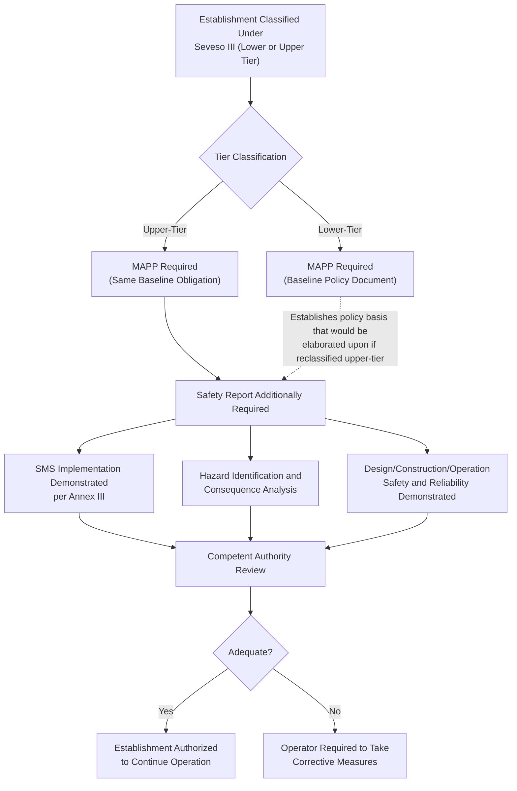

## Major Accident Prevention Policy and Safety Reports

### Position Within the Seveso III Framework

The Major Accident Prevention Policy (MAPP) and Safety Report are the two central documentary instruments through which the EU's Seveso III Directive (2012/18/EU) operationalizes its major-accident prevention objectives. They apply differently across the Directive's two-tier establishment classification: the MAPP is a baseline obligation applicable to both lower-tier and upper-tier establishments, while the Safety Report is an obligation exclusive to upper-tier establishments, reflecting the proportionally greater regulatory burden the Directive places on facilities holding the largest dangerous-substance inventories.

### The Major Accident Prevention Policy (MAPP)

**Definition and Purpose**

The MAPP is a written document, established by the operator, setting out the operator's overall aims and principles of action with respect to the control of major-accident hazards. It is intended to demonstrate a clearly articulated, top-level organizational commitment to major-accident prevention, from which more detailed operational arrangements flow.

**Key Points**

- The MAPP must be proportionate to the major-accident hazards presented by the establishment — Seveso III does not prescribe a single uniform MAPP template, consistent with the Directive's broader risk-proportionate philosophy
- The MAPP is required to address, at minimum, the operator's organization and personnel arrangements, identification and evaluation of major hazards, operational control, management of change, emergency planning, monitoring of performance, and audit and review — collectively forming the basis of the Safety Management System (SMS) that upper-tier establishments must additionally document in full within their Safety Report
- Because the MAPP applies to lower-tier establishments as well, it functions as the entry-level regulatory expectation: even a facility that does not meet upper-tier thresholds must demonstrate that major-accident prevention has been considered systematically, not left to informal or ad hoc arrangements

**MAPP Core Content Areas**

| Content Area | Purpose |
| --- | --- |
| Organization and personnel | Defines roles, responsibilities, and competency requirements for major-accident hazard control at all organizational levels |
| Identification and evaluation of major hazards | Establishes the process by which the operator identifies foreseeable major-accident scenarios |
| Operational control | Addresses procedures and instructions for safe operation, including maintenance |
| Management of change | Establishes review processes for modifications to installations, processes, or storage |
| Planning for emergencies | Establishes the process for identifying foreseeable emergencies and preparing/testing response plans |
| Monitoring performance | Establishes procedures for ongoing assessment of compliance with MAPP objectives |
| Audit and review | Establishes periodic systematic assessment of the MAPP and SMS, and mechanisms for review by senior management |

**Example**

A lower-tier chemical distribution facility storing moderate quantities of a flammable liquid develops a MAPP that designates a named site safety manager accountable for major-accident prevention, references a documented hazard identification process conducted at the time of facility design, establishes a change-control procedure requiring safety review before modifying storage configurations, and commits to an annual management review of safety performance indicators. Even though this facility falls below the upper-tier threshold and is not required to produce a full Safety Report, its MAPP still demonstrates the systematic organizational commitment the Directive requires at the baseline level.

### The Safety Report

**Definition and Purpose**

The Safety Report is a comprehensive technical and managerial document required exclusively of upper-tier establishments. Its core purpose, as articulated in the Directive, is threefold: to demonstrate that a Safety Management System has been implemented in accordance with the information set out in Annex III; to demonstrate that major-accident hazards have been identified and that the necessary measures have been taken to prevent such accidents and to limit their consequences for human health and the environment; and to demonstrate that adequate safety and reliability have been incorporated into the design, construction, operation, and maintenance of installations, storage facilities, equipment, and infrastructure connected with their operation which are linked to major-accident hazards.

**Key Points**

- The Safety Report is submitted to the competent authority and forms the primary basis on which authorities assess whether an upper-tier establishment's risk-control measures are adequate; it is also periodically reviewed and updated, and must be revised following significant modifications to the establishment
- Unlike the MAPP's relatively high-level policy content, the Safety Report requires substantive technical detail: hazard identification and consequence analysis for major-accident scenarios, a description of the installation and its environment, and demonstration of specific technical and organizational risk-reduction measures
- Because the Safety Report must demonstrate that the SMS described in Annex III has been implemented (not merely documented), competent authorities typically expect the report to reference verifiable, in-place arrangements — inspection records, training records, audit findings — rather than aspirational policy statements alone

### Safety Report Required Content Structure

| Component | Description |
| --- | --- |
| Information on the management system and organization for major-accident prevention | Detailed elaboration of the SMS per Annex III, extending the MAPP's high-level commitments into implemented arrangements |
| Presentation of the environment of the establishment | Description of the site, surrounding area, population, and environmentally sensitive receptors that could be affected by a major accident |
| Description of the installation | Technical description of activities and products, processes, and substances presenting major-accident hazard potential |
| Identification and analysis of accident hazards and prevention methods | Detailed description of foreseeable major-accident scenarios, likelihood, and the technical/organizational measures taken to prevent them |
| Measures to limit consequences | Description of equipment and arrangements installed to limit the consequences of a major accident should one occur (e.g., containment, isolation, firefighting systems) |

### Relationship Between MAPP and Safety Report

### MAPP and Safety Report Scope Comparison Diagram (svg_diagram)

<svg viewBox="0 0 880 480" xmlns="http://www.w3.org/2000/svg">
<text x="440" y="30" font-size="19" font-weight="bold" text-anchor="middle" fill="#1a1a1a">MAPP vs. Safety Report Scope (svg_diagram)</text>
<circle cx="300" cy="260" r="180" fill="#fef3c7" stroke="#b45309" stroke-width="2" opacity="0.85"/>
<text x="300" y="130" font-size="14" font-weight="bold" text-anchor="middle" fill="#78350f">MAPP</text>
<text x="300" y="150" font-size="10" text-anchor="middle" fill="#78350f">(All Covered Establishments)</text>
<circle cx="480" cy="260" r="230" fill="#fee2e2" stroke="#b91c1c" stroke-width="2" opacity="0.55"/>
<text x="640" y="100" font-size="14" font-weight="bold" text-anchor="middle" fill="#7f1d1d">Safety Report</text>
<text x="640" y="120" font-size="10" text-anchor="middle" fill="#7f1d1d">(Upper-Tier Only)</text>

<text x="260" y="220" font-size="10.5" text-anchor="middle" fill="`#78350f`">Organization &</text>

<text x="260" y="234" font-size="10.5" text-anchor="middle" fill="`#78350f`">Personnel Policy</text>

<text x="260" y="270" font-size="10.5" text-anchor="middle" fill="`#78350f`">Hazard ID Policy</text>

<text x="260" y="310" font-size="10.5" text-anchor="middle" fill="`#78350f`">Emergency Planning</text>

<text x="260" y="324" font-size="10.5" text-anchor="middle" fill="`#78350f`">Commitment</text>

<text x="600" y="220" font-size="10.5" text-anchor="middle" fill="`#7f1d1d`">Detailed Consequence</text>

<text x="600" y="234" font-size="10.5" text-anchor="middle" fill="`#7f1d1d`">Analysis</text>

<text x="600" y="280" font-size="10.5" text-anchor="middle" fill="`#7f1d1d`">Site Environment &</text>

<text x="600" y="294" font-size="10.5" text-anchor="middle" fill="`#7f1d1d`">Receptor Description</text>

<text x="600" y="340" font-size="10.5" text-anchor="middle" fill="`#7f1d1d`">Design/Construction</text>

<text x="600" y="354" font-size="10.5" text-anchor="middle" fill="`#7f1d1d`">Reliability Demonstration</text>

<text x="440" y="400" font-size="10.5" text-anchor="middle" fill="`#78350f`" font-weight="bold">Overlap: SMS per Annex III</text>

<text x="440" y="414" font-size="10.5" text-anchor="middle" fill="`#78350f`">(elaborated in full within Safety Report)</text>

</svg>

### Comparative Note: MAPP/Safety Report Versus US Frameworks

| Seveso III Instrument | Closest US/CCPS Analogue | Key Difference |
| --- | --- | --- |
| MAPP | OSHA PSM Employee Participation written plan + general PSM program commitment; CCPS RBPS Process Safety Culture and Compliance with Standards elements | MAPP is a single consolidated top-level policy document; US frameworks distribute equivalent commitments across multiple separate elements rather than one unified policy instrument |
| Safety Report | EPA RMP's Prevention Program documentation (Program 2/3) combined with OSHA PSM's full documentation package (PSI, PHA, procedures) | Safety Report is submitted as a single comprehensive document to a competent authority for review and approval; US frameworks generally require documentation to be maintained on-site and available for inspection rather than proactively submitted as a unified report |

**Key Points**

- [Inference] The Safety Report's requirement for proactive submission to and review by a competent authority represents a meaningfully different regulatory philosophy from the US EPA RMP/OSHA PSM approach, where documentation is generally maintained by the operator and reviewed reactively during inspections or audits rather than submitted upfront for authority approval
- A multinational operator often finds that the underlying technical content (hazard analysis, safeguards, emergency planning) developed to satisfy OSHA PSM/EPA RMP can substantially inform a Seveso III Safety Report, but the report's structure, submission process, and demonstration standard require dedicated reformatting and supplementation rather than direct reuse of US-format documentation

### Related Topics

- Seveso III Annex III Safety Management System Detailed Requirements
- Competent Authority Review and Approval Processes for Safety Reports
- Domino Effect Assessment and Its Integration into Safety Report Consequence Analysis
- Safety Report Revision Triggers Following Significant Modification
- Comparative Documentation Architecture: Seveso III, OSHA PSM, and EPA RMP
- External Emergency Plan Development Informed by Safety Report Consequence Analysis
- Competent Authority Inspection Regimes Under Seveso III Article 20