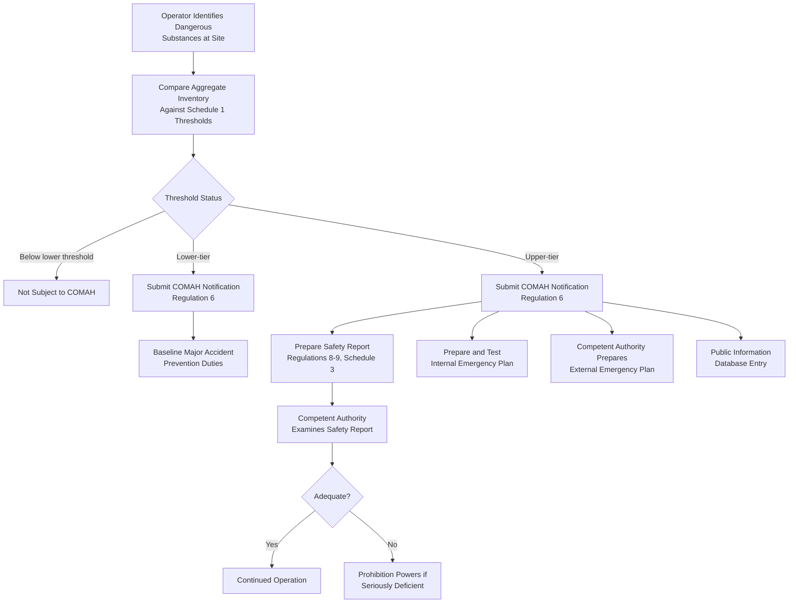

## UK COMAH Regulations

### Regulatory Origin and Relationship to Seveso III

The Control of Major Accident Hazards Regulations 2015 (COMAH15) are the United Kingdom's domestic legal instrument implementing the EU's Seveso III Directive (2012/18/EU). COMAH15 came into force on 1 June 2015, replacing the earlier Control of Major Accident Hazards Regulations 1999 (COMAH99). Distinctively, COMAH15 implements the majority of the Seveso III Directive, except for the land-use planning requirements, which are instead implemented separately through changes to UK planning legislation rather than within COMAH itself.

**Key Points**

- COMAH's legal application is described as extending to Great Britain (England, Scotland, and Wales); Northern Ireland has its own separate but substantively parallel instrument, the Control of Major Accident Hazards Regulations (Northern Ireland) 2015
- Because Seveso III is an EU Directive, COMAH15 represents the UK's national transposition of that Directive, which was already in effect before the UK's withdrawal from the EU; the regulations were subsequently amended following Brexit via the Health and Safety (Amendment) (EU Exit) Regulations 2018, and the UK has stated it will continue to share information on major accidents with the EU for lessons-learned purposes
- [Unverified] Given the search evidence found post-dates the original 2015 changes but does not indicate any further substantive post-Brexit divergence from Seveso III's substantive thresholds or obligations beyond the 2018 EU Exit amendments, the core substantive content of COMAH15 should be understood as continuing to closely mirror Seveso III, though facilities should verify current guidance (e.g., HSE's L111 guidance document) for any subsequent updates

### The Competent Authority: A Distinctive Joint Enforcement Structure

COMAH's enforcement structure is one of its most distinctive features relative to a single-regulator model: COMAH is enforced by a joint "Competent Authority" that pairs a safety regulator with an environmental regulator, with the specific pairing varying by nation within Great Britain and by whether the establishment is a nuclear site.

| Jurisdiction | Safety Regulator | Environmental Regulator |
| --- | --- | --- |
| England (non-nuclear) | HSE | Environment Agency (EA) |
| England (nuclear) | Office for Nuclear Regulation (ONR) | Environment Agency (EA) |
| Scotland (non-nuclear) | HSE | Scottish Environment Protection Agency (SEPA) |
| Scotland (nuclear) | Office for Nuclear Regulation (ONR) | Scottish Environment Protection Agency (SEPA) |
| Wales (non-nuclear) | HSE | Natural Resources Wales (NRW) |
| Wales (nuclear) | Office for Nuclear Regulation (ONR) | Natural Resources Wales (NRW) |

**Key Points**

- The Competent Authority's duties include inspecting activities subject to COMAH and prohibiting the operation of an establishment where evidence shows that measures taken for the prevention and mitigation of major accidents are seriously deficient
- The Competent Authority also examines safety reports submitted by upper-tier establishments and is required to inform operators about the conclusions of its examination within a reasonable time period
- [Inference] The dual safety/environmental regulator model reflects the recognition that major chemical accidents typically carry both direct life-safety consequences (the safety regulator's traditional focus) and environmental consequences (contamination, ecological damage), requiring coordinated rather than siloed regulatory oversight

### The 2015 Changes: Alignment with CLP/GHS Classification

The transition from COMAH99 to COMAH15 was driven primarily by the same underlying regulatory event that produced Seveso III itself: alignment with the Classification, Labelling and Packaging Regulation (CLP, Regulation (EC) No. 1272/2008), which implements the UN's Globally Harmonized System (GHS) for chemical classification.

**Key Points**

- Previous COMAH regulations referenced the CHIP regulations (Chemicals (Hazard Information and Packaging for Supply) Regulations) to determine scope; COMAH 2015 instead references CLP, meaning the classification categories determining whether a substance counts toward COMAH thresholds changed substantively
- This reclassification meant that a site's COMAH status could change purely as a result of the new classification system, independent of any actual change in the substances or quantities physically present at the site — a facility could newly enter or exit COMAH scope, or shift tier, without altering its operations at all
- COMAH15 also introduced new requirements for public information, including provision of basic information on all establishments, supported by the development of a public information database, and a new requirement for cooperation by designated Category 1 responders (as defined in the Civil Contingencies Act 2004) in tests of the external emergency plan
- Transitional protection was built into the regulations: establishments already classified as lower-tier or upper-tier COMAH establishments on 31 May 2015 under COMAH99 retained that status without requiring immediate reclassification, easing the transition for existing operators

### Two-Tier Structure (Mirroring Seveso III)

COMAH15 retains Seveso III's fundamental lower-tier/upper-tier structure, based on aggregation and summation of dangerous substance quantities against Schedule 1 thresholds (the UK regulatory equivalent of Seveso III's Annex I).

**Key Points**

- Aggregation across multiple substances in the same hazard category can bring a site into COMAH scope even when no single substance individually exceeds its own threshold — mirroring Seveso III's summation rule
- Upper-tier operators carry the heavier duty set, most notably including the requirement to prepare a safety report, whose purpose is to show that the operator has put in place arrangements for the control of major accident hazards and to limit the consequences to people and the environment of any that do occur
- The purposes and minimum content of a safety report are set out in Regulations 8 and 9 and Schedule 3 to the regulations, and upper-tier operators are additionally required to prepare and test an internal emergency plan

### COMAH Regulatory Structure Diagram (svg_diagram)

<svg xmlns="http://www.w3.org/2000/svg" viewBox="0 0 900 500">
<text x="450" y="30" font-size="19" font-weight="bold" text-anchor="middle" fill="#1a1a1a">COMAH 2015 Regulatory Structure (svg_diagram)</text>
<rect x="330" y="55" width="240" height="50" rx="8" fill="#1e40af" />
<text x="450" y="85" font-size="14" font-weight="bold" text-anchor="middle" fill="#ffffff">Seveso III Directive</text>
<line x1="450" y1="105" x2="450" y2="135" stroke="#374151" stroke-width="2" />
<text x="470" y="125" font-size="10" fill="#374151">Transposed into</text>
<rect x="330" y="140" width="240" height="50" rx="8" fill="#0369a1" />
<text x="450" y="170" font-size="14" font-weight="bold" text-anchor="middle" fill="#ffffff">COMAH 2015 (GB)</text>
<line x1="450" y1="190" x2="450" y2="220" stroke="#374151" stroke-width="2" />
<rect x="330" y="225" width="240" height="45" rx="6" fill="#dbeafe" stroke="#1e40af" stroke-width="2" />
<text x="450" y="253" font-size="12" text-anchor="middle" fill="#1e3a8a">Two-Tier Classification</text>
<line x1="380" y1="270" x2="230" y2="310" stroke="#374151" stroke-width="1.5" />
<line x1="520" y1="270" x2="670" y2="310" stroke="#374151" stroke-width="1.5" />
<rect x="100" y="315" width="260" height="60" rx="6" fill="#dcfce7" stroke="#15803d" stroke-width="2" />
<text x="230" y="340" font-size="12" font-weight="bold" text-anchor="middle" fill="#14532b">Lower-Tier Establishment</text>
<text x="230" y="358" font-size="10" text-anchor="middle" fill="#14532b">Notification + Baseline Duties</text>
<rect x="540" y="315" width="260" height="60" rx="6" fill="#fee2e2" stroke="#b91c1c" stroke-width="2" />
<text x="670" y="340" font-size="12" font-weight="bold" text-anchor="middle" fill="#7f1d1d">Upper-Tier Establishment</text>
<text x="670" y="358" font-size="10" text-anchor="middle" fill="#7f1d1d">+ Safety Report + Emergency Plans</text>
<line x1="230" y1="375" x2="230" y2="405" stroke="#374151" stroke-width="1.5" />
<line x1="670" y1="375" x2="670" y2="405" stroke="#374151" stroke-width="1.5" />
<line x1="230" y1="405" x2="450" y2="430" stroke="#374151" stroke-width="1.5" />
<line x1="670" y1="405" x2="450" y2="430" stroke="#374151" stroke-width="1.5" />
<rect x="280" y="435" width="340" height="55" rx="6" fill="#f3f4f6" stroke="#6b7280" stroke-width="2" />
<text x="450" y="458" font-size="12" font-weight="bold" text-anchor="middle" fill="#374151">Joint Competent Authority</text>
<text x="450" y="475" font-size="10" text-anchor="middle" fill="#374151">HSE/ONR + EA/SEPA/NRW (by jurisdiction)</text>
</svg>

### COMAH Notification and Ongoing Obligations Flow

### Example: Existing-Establishment Transition Handling

**Example**

A chemical storage facility was already classified as an upper-tier establishment under COMAH99 as of 31 May 2015. Under the CLP-based reclassification introduced by COMAH15, if the CLP classification of one of its stored substances changed such that its aggregate inventory would now, under the new rules, only meet the lower-tier threshold rather than the upper-tier threshold, the transitional provisions nonetheless preserved its existing upper-tier status where it was already classified as such immediately before the new regulations took effect, avoiding an abrupt reduction in regulatory obligations driven purely by a classification methodology change rather than any actual change in hazard.

### Comparative Note: COMAH Versus Seveso III and US Frameworks

| Feature | COMAH 2015 (UK) | Seveso III (EU) | EPA RMP / OSHA PSM (US) |
| --- | --- | --- | --- |
| Legal instrument | National regulations implementing an EU-origin Directive | EU Directive requiring national transposition | Directly applicable US federal regulations |
| Enforcement structure | Joint Competent Authority (safety + environmental regulator per nation) | Member State-designated competent authority (varies by country) | Single-agency enforcement (EPA for RMP, OSHA for PSM) |
| Land-use planning | Handled outside COMAH via separate planning legislation | Included within the Directive itself | Not a direct requirement of either RMP or PSM |
| Post-Brexit status | Retains substantive alignment with Seveso III via 2018 EU Exit amendments | N/A (source Directive) | N/A (separate legal system) |

**Key Points**

- [Inference] The separation of land-use planning from COMAH itself into distinct UK planning legislation is a structural choice that has no direct parallel in the US EPA RMP/OSHA PSM system, where land-use decisions near covered facilities are generally governed by local zoning authorities operating largely independently of the federal chemical safety regulations

### Related Topics

- COMAH Schedule 1 Threshold Tables and Aggregation Rules
- HSE Guidance Document L111 and Its Role in COMAM Implementation
- Safety Report Content Requirements Under COMAH Regulations 8-9 and Schedule 3
- Civil Contingencies Act 2004 Category 1 Responder Coordination for External Emergency Plans
- Northern Ireland COMAH Regulations: Parallel but Distinct Instrument
- Post-Brexit Regulatory Divergence Risk Between UK COMAH and EU Seveso III
- Comparative International Regulatory Architecture: COMAH, Seveso III, EPA RMP, and OSHA PSM